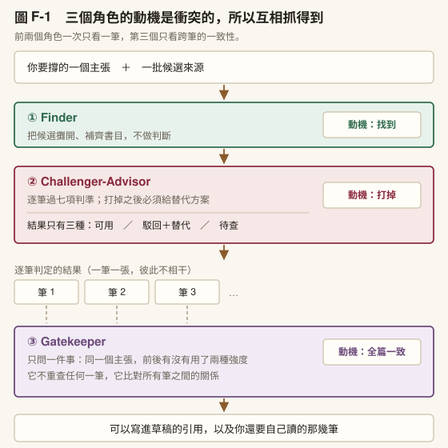
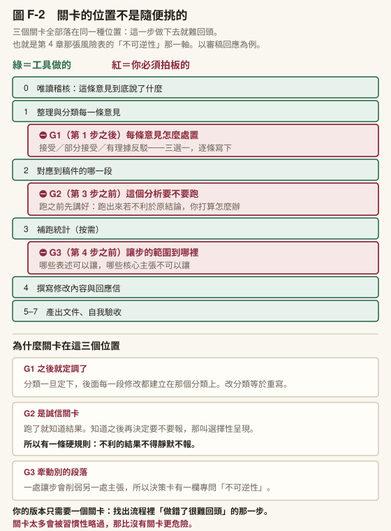
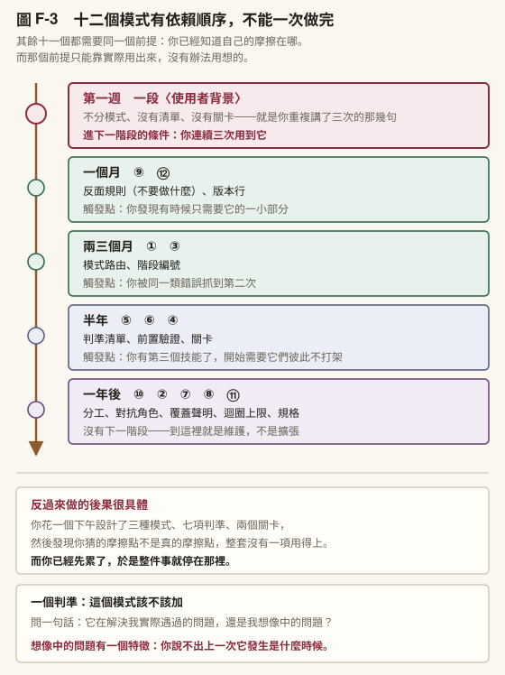

# 附錄 F　一套技能庫怎麼運作

[第 3 章](../chapters/03-skills.md)你寫了第一個技能，裡面只有〈使用者背景〉一段。[第 6 章](../chapters/06-analysis-writing.md) [6.2](../chapters/06-analysis-writing.md#62-當你遇到不會的方法) 說它會長大。

這一份附錄把「長大」講成具體的形狀。內容來自我自己在用的一套技能，它們處理引用查核、論文撰寫、審查回應、統計分析這幾件事，最舊的一個已經改過十幾輪。

**你不需要安裝任何東西才能用這一份。** 這裡給的是十二個設計模式：每一個都說明它解決什麼問題、為什麼那樣設計、以及你怎麼從零長出自己的版本。形狀可以抄，檔案不必。

## F-0　一句話先講清楚

這十二個模式，教材前面已經教過每一個的種子。

[第 3 章](../chapters/03-skills.md)教你指定 AI 的表現，成熟版是三個利害不同的角色互相制衡。[第 7 章](../chapters/07-revision-integrity.md)教你修稿三輪，成熟版是「任何迴圈都要訂上限」這個一般原則。[第 1 章](../chapters/01-setup.md)教你決策日誌要寫理由欄，成熟版是工具自己帶一份 Changelog。

所以這一份不是新知識，是把種子接到成品。你看的時候會一直有「這個我學過」的感覺，那是對的。差別只在於：**你學到的是一顆種子，這裡給的是它長成之後的樣子，以及沿哪條路長。**

---

## F-1　十二個設計模式

### ① 模式路由：一個技能不做一件事，做一類事的多個階段

我的引用查核技能有兩種模式：`quick` 只給改寫建議，`grilled` 會逐筆審查引用正當性。撰寫技能有十一種模式，開場第一件事是走一次決策樹選模式。

**為什麼這樣設計**：同一批知識，不同時機需要不同深度。不分模式的下場很具體：每次都跑最重的流程，於是你嫌它慢，於是你不用它。模式路由讓「輕用法」存在，工具才會被日常使用，而不是只在重要場合被想起來。

**你怎麼長出來**：先只寫一個模式，你最常做的那件。第二次你發現「這次我只需要其中一小段」，那個瞬間就是第二個模式的誕生時機。不要一開始就設計三種模式，你會猜錯哪一種真的有人用。

### ② 角色分工與對抗：不是一個 AI 幫你，是幾個角色互相制衡

引用查核技能裡有三個角色。Finder 負責找出可用的來源。 Challenger-Advisor 負責質疑每一筆，並在打掉之後給出替代方案。 Gatekeeper 只看全篇一致性：同一個主張有沒有前後用了兩種強度。



〔圖 F-1〕**三個角色的動機是衝突的，所以互相抓得到**。注意左邊兩個角色一次只看一筆，右邊那個只看跨筆的一致性：這個視野差別是設計的重點，不是分工的副產品。

**為什麼這樣設計**：同一個角度看第二次，看到的還是同一個東西。要抓自己的錯，得換一個利害不同的角色。這三個角色的動機是衝突的： Finder 想找到、Challenger 想打掉、Gatekeeper 只在乎全篇說法一不一致。正因為衝突，它們才互相抓得到。

**你怎麼長出來**：從兩個角色開始就有效，一個負責產出、一個負責找碴。關鍵是**不要在同一次對話裡**。同一次對話裡它會記得自己剛才寫了什麼，於是質疑會客氣。開新的一次，把產出貼進去，說「這不是你寫的，找出問題」。

### ③ 階段編號：把工作流切成有編號、各有產出的階段

撰寫技能分成八個階段：初始訪談、文獻策略、結構設計、論證建構、逐節撰寫、引用合規、撰稿自檢、格式輸出。審稿回應技能分成第零步到第七步。

**為什麼這樣設計**：編號帶來三件事。你知道現在在哪、知道下一步要什麼、以及最有價值的一件：**你可以只跑其中一段**。沒有編號的工作流只能從頭跑，而從頭跑的成本高到你會選擇不跑。

**你怎麼長出來**：把你做過一次的流程寫成編號清單，然後問自己一個問題：「哪幾步我下次會想跳過？」那幾步就該獨立成可單獨呼叫的階段。

### ④ 人的關卡：流程中途強制停下來要你拍板

審稿回應技能有三個關卡。第一個在意見分類之後，問每一條意見要接受、部分接受還是有理據反駁。第二個在補跑統計之前，問這個分析要不要跑、跑出來若不利於原結論怎麼辦。第三個在動筆之前，問哪些是可讓的表述、哪些是不可讓的核心主張。

每個關卡用固定格式呈現，包含四項：意見原文、我方可能立場（每個選項附代價）、推薦與理由、以及**不可逆性**（此處讓步會不會牽動其他段落）。

它另外寫了一條防繞過規則：補跑的統計若結果不利於原結論，不得靜默不報。



〔圖 F-2〕**關卡的位置不是隨便挑的**。左欄是工具做的（整理、對應、撰寫），中欄三個關卡全部是你的學術立場表態，一個都沒有交出去。箭頭方向就是先後：指向關卡表示那一步之後才問，指向步驟表示問過才准動那一步。

**為什麼這樣設計**：這是「不要拜託，設計關卡」的成熟形式。關卡不放在你的自制力，放在流程裡。而關卡的位置有講究，都落在兩種地方：產出離開你之前，以及決定變成不可逆之前。這正是[第 4 章](../chapters/04-research-question.md) [4.2](../chapters/04-research-question.md#42-該不該交給它) 那張風險表的兩個軸。

**你怎麼長出來**：找出你的流程裡「做錯了很難回頭」的那一步，在它前面插一個問句。一個就夠。⚠️ 關卡太多會被習慣性略過，那比沒有關卡更危險，因為你會以為自己有在把關。

### ⑤ 逐項判準清單：判斷不靠印象，靠一張每筆都要逐項回答的表

引用查核技能有七項判準，每一筆引用都要逐項回答，不可跳過：

| # | 判準 | 要問的問題 |
|---|---|---|
| 1 | 主張匹配度 | 原文真的說了你要它說的話嗎？ |
| 2 | 過度延伸 | 用法是否超出原研究的樣本、脈絡、效果量？ |
| 3 | 證據層級 | 實證？綜述？二手引用？ |
| 4 | 時效與被取代 | 是否已有更新或推翻此結論的來源？ |
| 5 | 脈絡對齊 | 樣本族群、年齡層、文化脈絡可外推嗎？ |
| 6 | 必要性 | 在撐論點還是裝飾？ |
| 7 | 來源正當性 | 有 DOI？已撤稿或有勘誤、關切聲明嗎？ |

**為什麼這樣設計**：把「我覺得這樣可以」換成「這七項我逐項回答過」。清單的價值不在提醒，在於它讓跳過變成一件看得見的事。你可以決定第 4 項不查，但你沒辦法假裝自己查了。

注意第 6 項。前五項與第七項問的是「這筆引用對不對」，第 6 項問的是「它該不該在這裡」。這一項最常被跳過，而它擋住的是論文裡最多的一種問題：正確但不必要的引用。

**你怎麼長出來**：清單從你的錯誤長出來，不是從教科書抄來。每次被抓到一個問題，就問「哪一個問句可以事先攔住它」，那句話就是新的一項。第一版有三項很正常。

### ⑥ 前置存在查核：跑主流程之前，先確認手上的東西是真的

引用查核技能在七項判準**之前**還有一道檢查，確認這筆來源確實存在、確實是這個作者、確實刊在這個地方。

**為什麼這樣設計**：主流程再嚴謹，餵進去的是假的就沒用。而順序有理由：這一道放最前面，因為它最便宜而且失敗率最高。把最容易失敗又最好查的放前面，你才不會花二十分鐘做完七項判準，最後發現這篇文獻不存在。

**你怎麼長出來**：問一個問題：「這個流程最常在哪一步白做工？」把那一步的前提檢查提到最前面。

### ⑦ 覆蓋範圍聲明：產出時附「我掃了什麼、沒掃什麼」

我的審查技能輸出固定含兩區：掃描完整性聲明，以及需要使用者自己確認的項目。

**為什麼這樣設計**：這是驗證層級的工具版。[第 4 章](../chapters/04-research-question.md) [4.5](../chapters/04-research-question.md#45-書目管理層讓機械工作歸機械) 講你要標記自己讀到什麼程度，這一條是同一個機制作用在工具上：工具聲明自己的覆蓋範圍，你才知道剩下什麼要親自看。

沒有這一區，「工具檢查過了」會被讀成「都檢查過了」。這兩句話之間的差距，就是[第 6 章](../chapters/06-analysis-writing.md) [6.3](../chapters/06-analysis-writing.md#63-寫作模式鏈) 那個材料缺口標記的不對稱判準：標記出現一定要處理，標記沒出現不代表沒問題。

**你怎麼長出來**：在你的技能輸出格式裡加一行「本次未檢查」。這一行會逼你想清楚它的邊界，而想清楚邊界通常比擴大功能有用。

### ⑧ 迴圈要有出口：評估、修訂、再評估，並明訂輪數上限

我的技能裡有幾個迴圈模式，共通點是都寫了上限：論文潤稿三輪、審稿回應兩輪、模型重配三輪。

**為什麼這樣設計**：迴圈沒有上限就會一直改，而每一輪的邊際收益遞減、風險遞增。改久了你會把原本對的地方改壞，尤其是語氣與節奏。上限逼你在該停的時候做一次判斷：還值不值得再一輪。

**你怎麼長出來**：訂一個你會遵守的小數字，二或三。達到上限時寫一行「還剩什麼沒解決」，那一行往下次再說。

### ⑨ 反面規則：寫下絕對不做什麼，而且寫理由

撰寫技能裡有兩節專門寫禁止事項。其中一條是「規劃階段的猜測不進最終稿」：不要在論文裡寫「本研究得到四型而非原本預期的三型」，因為那三型只存在於你的計畫書，讀者無從判斷。

**為什麼這樣設計**：正面指示教它做什麼，反面規則擋住它最常犯的那幾個錯。而反面規則幾乎都來自踩過的坑。所以一個技能的禁止事項那一節，就是它的事故史，也是整個檔案裡最有價值的部分。

**你怎麼長出來**：每次工具做了一件你要回頭改的事，就寫一條反面規則，並附上為什麼。沒寫理由的規則，半年後你會不知道能不能刪，於是它會永遠留著，即使早就不需要。這跟[第 1 章](../chapters/01-setup.md)決策日誌的理由欄是同一件事。

### ⑩ 技能之間寫清楚分工

我的每個技能都有一節寫「這個不歸我管，去用哪一個」。例如審稿回應技能明寫：執行前追問管開始之前的事，逐條意見的處置決策由本技能的三個關卡管，兩者都要跑。

**為什麼這樣設計**：工具會長大，長大就會重疊。不寫分工的下場是三個技能都想做同一件事，而你每次都得想「用哪個」。那個猶豫足以讓你放棄整套。

**你怎麼長出來**：滿三個技能的時候寫一張分工表。三個以下不需要。

### ⑪ 規格化交接：追問完產出一份可以帶走的規格

執行前追問那個技能，追問完會產出一份規格，同時作為對齊確認與交接文件。它可以交給下一次對話，也可以交給另一個人。

**為什麼這樣設計**：這是「對話是暫時的，檔案是永久的」在流程開頭的應用。追問的價值不只在當下對齊，在於**那份規格可以被帶走**。下次同類任務不必從零追問，改那份規格就好。

**你怎麼長出來**：把追問的答案存成檔案而不是留在對話裡。一開始只存三行也算。

### ⑫ 工具自己記演進：版本號與變更紀錄

我的引用查核技能檔開頭寫著版本 [1.8](../chapters/01-setup.md#18-常見迷思).0，檔尾有一節變更紀錄。那個小數點後的數字代表它被磨過十幾輪。

**為什麼這樣設計**：版本號讓你看得出這個工具被磨過幾次。變更紀錄讓你知道某條規則**為什麼**在。兩者合起來，未來的你才有能力判斷某條規則該不該刪。

[第 3 章](../chapters/03-skills.md) [3.2](../chapters/03-skills.md#32-那個檔案裡該寫什麼) 貼出過一個例子：我那份技能的「隱式觸發」規則，是在我又一次差點把沒查證的引用寫進草稿之後才補上去的。如果沒有那行紀錄，三個月後我會覺得這條規則太囉嗦而刪掉它。

**你怎麼長出來**：技能檔開頭寫一行版本，每次改動在檔尾追一行：改了什麼、為什麼。

---

## F-2　怎麼從零長出這一套

十二個模式不是一次設計出來的，也不該一次做。它們有依賴順序。



〔圖 F-3〕**十二個模式有依賴順序，不能一次做完**。最左邊那個紅框是全部的起點，也是唯一不能跳過的一步。

| 階段 | 做什麼 | 什麼時候進下一階段 |
|---|---|---|
| **第一週** | 一個技能、一段〈使用者背景〉。不分模式、沒有清單 | 你連續三次用到它 |
| **一個月** | 加⑨反面規則（從你回頭改過的地方長出來）＋⑫版本行 | 你發現有時候只需要它的一小部分 |
| **兩三個月** | 加①模式路由（拆出輕量版）＋③階段編號 | 你被同一類錯誤抓到第二次 |
| **半年** | 加⑤判準清單＋⑥前置驗證＋④一個關卡 | 你有第三個技能了 |
| **一年後** | 加⑩分工表＋②對抗角色＋⑦覆蓋聲明＋⑧迴圈上限＋⑪規格交接 | 沒有下一階段，這是持續的 |

**這張表最重要的是第一列。** 第一週只做一段〈使用者背景〉，不是因為那樣比較容易，是因為其餘十一個模式都需要「你已經知道自己的摩擦在哪」這個前提，而那個前提只能靠實際用出來。

反過來做的後果很具體：你花一個下午設計了三種模式、七項判準、兩個關卡，然後發現你猜的摩擦點不是真的摩擦點，整套沒有一項用得上。

### 一個判準：這個模式該不該加

問一句話：這個模式是在解決我實際遇過的問題，還是在解決我想像中的問題？

想像中的問題有一個特徵：你說不出上一次它發生是什麼時候。

---

## F-3　三份可以直接貼的起手範本

### F-3.1　模式路由骨架

放進你的技能檔開頭。只寫你真的有的模式，不要預留。

```markdown
## 模式選擇（開場第一件事）

| 模式 | 什麼時候用 | 產出 | 大約要多久 |
|------|-----------|------|-----------|
| quick | 我已經知道要什麼，只要它照規格做一次 | 產出本身 | 一次往返 |
| full  | 我不確定方向，需要它先問我 | 產出＋決策紀錄 | 三到五次往返 |

**判斷不出來就用 quick。** 選錯模式的代價是多跑一次，
選最重的模式的代價是你下次不會再用這個技能。
```

### F-3.2　決策卡格式（人的關卡用）

流程中途要你拍板的地方，用這個格式問。四個欄位都不要省。

```markdown
⛔ 關卡：[這一步要決定什麼]

【現況】[一句話講清楚目前狀態，附能查證的依據]
【可能的做法】
  A. [做法] → 代價：[具體代價，不是「比較花時間」]
  B. [做法] → 代價：...
  C. [做法] → 風險：[如果錯了會怎樣]
【推薦】[A/B/C]，理由一句
【不可逆性】這個決定會不會牽動別的地方？改回來的成本是什麼？

請確認，或告訴我你的判斷。
```

⚠️ 最後一欄是這張卡的重點。**沒有不可逆性那一欄，關卡會退化成禮貌詢問**，而禮貌詢問你會習慣性回「好，繼續」。

### F-3.3　判準清單模板

```markdown
## 判準（每一筆都要逐項回答，不可跳過）

| # | 判準 | 要問的問題 | 這一筆的答案 |
|---|------|-----------|------------|
| 0 | 存在查核 | 這個東西確實存在嗎？ | |
| 1 | [你的第一個判準] | | |
| 2 | ... | | |
| n | 必要性 | 它在撐論點還是裝飾？ | |

**本次未檢查**：[明列沒查的項目與原因]
```

三個固定位置值得照抄：**第 0 項放最便宜又最容易失敗的檢查**、 **最後一項放必要性**、以及表格下面那行「本次未檢查」。中間的判準才是你依領域自己長的。

---

## F-4　回到你的第一個技能

[第 3 章](../chapters/03-skills.md)那個只有〈使用者背景〉的檔案，現在你知道它可以往哪長。

但這一份附錄真正想說的不是十二個模式。是這件事：

每一個模式都對應一次你被自己的工具坑到的經驗。

模式路由來自「它太慢我不想用」。反面規則來自「它又做了那件事」。判準清單來自「這個問題上次也發生過」。覆蓋聲明來自「我以為它檢查過了」。關卡來自「早知道就先問我一句」。

所以你長不出跟我一樣的十二個模式，你會長出你自己的那幾個。那才是對的。抄來的十二個模式解決的是我的摩擦，不是你的。

---
