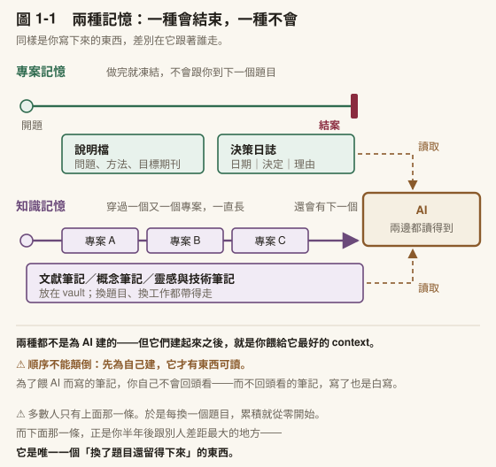
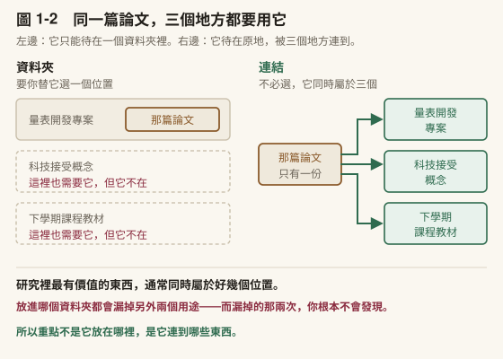
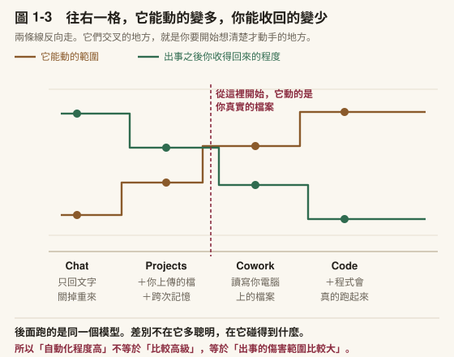
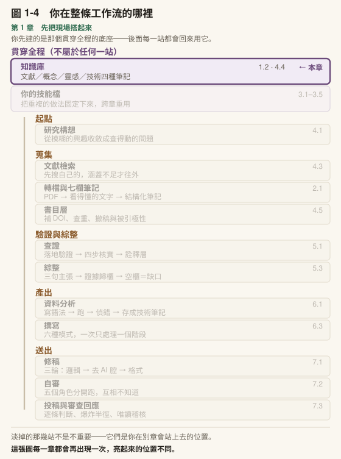

# 第 1 章　先把現場搭起來

## 本章導覽

**這一章回答四個問題**

1. 我用了 AI 半年，為什麼手上什麼都沒留下來？
2. 一個研究者的工作現場，最少要有哪幾樣東西？
3. Chat、Projects、Cowork、Code 差在哪？我該用哪一個？
4. 在我開始把它用進研究之前，有哪幾件事非知道不可？

**讀完你能夠**

- **建立**一個可用的知識庫，並在裡面存下第一份筆記
- **寫出**一份專案說明檔與第一則決策日誌
- **選擇**適合某項任務的入口，並說出理由
- **說明**三件會決定你怎麼用它的事實，以及它們各自防的是什麼

**需要多久**

自學閱讀約 45 分鐘｜課堂 3 小時（概念 60 分、實作 120 分）

**進來之前，你要能**

本章不預設任何前置能力。唯一的前置是**你手上要有一份真實的研究材料**—— 你自己的文獻、逐字稿、資料或草稿都行。沒有的話，先回前言〈這本書假設你〉決定拿什麼替代，不要空手往下走：這本書每一章的練習都要你拿自己的東西來做。

**開始前請準備**：一台你平常工作的電腦、一個可用的 Claude 帳號。本章從第一頁就要動手，看示範沒有用。

---

## 章前導言

先做一件事，再讀下去。

> **〔動手一下〕2 分鐘** 打開任何一個 AI 對話視窗，輸入這句話：「我是教育領域的研究生。請用三句話說明，為什麼我不該把重要的東西留在對話視窗裡。」看它怎麼回答。**先不要評價它答得好不好**，等一下我們會回來看這一段。

一位碩士班二年級的學生，過去半年幾乎每天都在用 AI。查概念、改句子、討論研究設計、問統計怎麼跑。他覺得很有用。

然後他要寫論文計畫的方法章，想找回三個月前那次很有幫助的討論。那次他跟 AI 來回了一個多小時，最後釐清了為什麼他的設計不能用某個分析方法。他記得結論，但記不得理由。

他翻對話紀錄。找到了，但那是一個八十多則往返的長串，關鍵那幾句夾在中間，而他已經想不起來是哪幾句。他讀了二十分鐘，放棄，決定重問一次。

重問的結果不一樣。它沒有變笨，它只是不知道當初那一個小時裡發生過什麼。

他那半年的使用，回報全部發生在當下：每一次都省了一點時間，每一次都覺得有用。 **但那些回報沒有累積。**半年之後，他手上有的東西跟半年前一樣多。

**這個人會走完整本書。** 後面六章他還會出現，每一章都因為同一個原因被絆一次：他做的事在他自己看來都合理。

這一章要處理的就是這件事。

**注意本書的順序跟你可能預期的不一樣。** 多數講 AI 的教材會先講原理—— 它是什麼、怎麼運作、為什麼會出錯。那些都重要，本書也會講，但**不在第一章**。

理由很實際：**原理需要一個附著點。** 「它會編造引用」這句話，你現在讀到只會點頭；等你自己的筆記裡冒出一筆查無此物的文獻，那句話才會真的黏住。所以本書的作法是先讓你把現場搭起來、開始產出東西，概念在它派得上用場的那一刻才展開。

但有三件事例外，它們必須在你開始之前就知道。那三件在 1.5，而且只有三段。

> **〔課堂〕開場 8 分鐘** 先讓全班做上面那個 2 分鐘的〔動手一下〕，**不要先講任何東西**。做完問一句：「有沒有人現在還找得到自己三個月前跟 AI 討論過什麼？」多數人找不到，或找得到但不想找。那個沉默就是本章的起點。 ⚠️ 不要把這件事導向「所以要好好做筆記」的道德勸說。問題出在**現在的工具讓你的努力留不下來**，跟勤不勤勞無關，而那是可以修的。

---

## 1.1 五分鐘之內，先讓它做一件真的事

### 不要從設定開始

多數工具教學的第一章是安裝與設定，讀者讀完設定就累了，還沒體驗到任何價值。

我們反過來。先做一件有結果的事，然後才處理要把結果放哪裡。

### 一個最小的循環

挑一篇你手邊的東西。一段你自己寫的文字、一篇論文的摘要、一份會議紀錄都可以。然後做三個動作：

```text
1. 把那段文字貼進對話視窗
2. 要它做一件具體的事
3. 把結果存成一個檔案
```

第 2 步值得講一下**怎麼要**。這是本書第一次教你寫提示詞，而現在你只需要兩樣東西：

| 你要給的 | 為什麼 |
|---|---|
| **這次要它做什麼**（動作，不是主題） | 「幫我看看這段」它不知道你要什麼；「找出這段裡沒有證據支撐的句子」它知道 |
| **它猜不到的背景** | 你的領域、對象是誰、這份東西要拿去做什麼 |

完整的提示詞寫法有七個元素，那是[第 3 章](../chapters/03-skills.md)的內容。**現在兩個就夠**，而且多數人連這兩個都沒給，問題從來不在元素太少。

一個實際的例子：

> 這是我寫的研究計畫方法章的一段（附上文字）。我是教育研究所碩士生，這份計畫下週要給指導教授看。請找出這一段裡**做了主張但沒有交代依據**的句子，逐句列出來，不要幫我改寫。

注意最後那半句：**不要幫我改寫**。你現在要的是診斷，不是成品。少了那半句，你會拿到一段被潤飾過的文字，而**你分不出哪裡原本有問題**。

〔教你的 Claude 建這個〕這一節的做法可以固定下來，而且現在就可以。把下面這段貼給它：「我剛才用『動作＋背景』的寫法要你做了一件事。請幫我寫成一份說明檔，讓我下次直接叫它就好。檔案裡要有三段：（一）我是誰、我在做什麼領域的研究；（二）我最常要你做的三種診斷；（三）你**不要**做的事。不要改寫、不要補我沒給的資料。只寫這三段，不要幫我加別的。」第一版寫短一點。**它會長大，但不是今天。** 完整的做法在[第 3 章](../chapters/03-skills.md)。

### 第 3 步才是這一節的重點

第 3 步是「把結果存成一個檔案」。這一步看起來最無聊，卻是整本書的地基。

你剛才那個對話，如果你什麼都不做，它三個月後對你的價值是零—— 它其實被保存下來了，但你找不到，找到了也讀不動。

所以下一節先處理這件事。

> **〔動手一下〕5 分鐘** 照上面三個動作跑一次。用你自己手邊真的東西，不要用範例。跑完之後，把它給你的結果**複製到一個純文字檔**，隨便存在桌面都可以。那個檔案我們等一下會用到，先不要關掉。

### 帶走這一節

- 先做一件有結果的事，再處理設定
- 現在的提示詞只需要兩樣：**要它做什麼**（動作）＋**它猜不到的背景**
- 要診斷時加一句「**不要幫我改寫**」，否則你分不出哪裡原本有問題
- 對話的價值不在當下，在**你日後找不找得回來**

---

## 1.2 你剛才那段對話，明天就不見了

### 它什麼都不記得

先把一件常見的誤解清掉。

你可能覺得，用久了它會慢慢認識你。不會。每一次新對話，它對你的了解都從零開始。上週你講過的研究背景、上個月你糾正過的用詞偏好，在新的對話裡完全不存在。

這件事的形狀，你在教學現場見過。**它比較像每一次都換一位代課老師。** 那位老師本身教得很好，但他不知道這個班上週教到哪、哪個孩子需要多看一眼、你上次為什麼刻意跳過某一節。他不是能力不足，是**現場的資訊不在他手上**。而你只有兩條路：每次重講一遍，或者把它寫下來留在講桌上。

這不是缺點，是它的運作方式：它只看得到眼前這一次對話裡的文字。本書之後會用一個詞指這件事。脈絡（context），意思是它這一次生成時實際看得到的所有內容。脈絡以外的東西，對它不存在。

所以那句「它應該知道我在做什麼」永遠不成立，除非你把那些東西放進它讀得到的地方。

### 於是問題變成：放在哪裡

而這個問題有一個你可能沒想到的答案：那個地方是為你自己建的，不是為 AI。

你需要一個地方放你讀過的東西、想通的事、做過的決定。這件事在 AI 出現之前就成立，只是過去很多人靠記憶硬撐。加上 AI 之後，它多了第二個用途：**它成為你餵給 AI 的材料。**

這個順序很重要，寫進來免得誤解：**先為自己建，AI 是附帶的受益者。** 反過來想（為了讓 AI 好用而建一個庫）會建出一個你自己不會去讀的東西，而你不讀的東西，很快就不會再更新。

### 兩種不同的記憶

要存的東西分兩類，它們的生命週期完全不同。



〔圖 1-1〕左邊那條撞到牆就停住，右邊那條穿過三個框繼續往前。 **會結束與不會結束，是用線畫出來的。** 兩者都不是為 AI 建的，但建起來就是最好的脈絡。

攤開來看：

| | **專案記憶** | **知識記憶** |
|---|---|---|
| 存什麼 | 這個研究的決定與理由 | 你讀過的東西、想通的概念 |
| 誰在用 | 一個專案，做完就凍結 | 跨專案、跨年度持續累積 |
| 壞掉會怎樣 | 三個月後不記得為什麼排除那批樣本 | 每次要用同一篇文獻都要重讀一次 |
| 載體 | 專案說明檔＋決策日誌 | 一個知識庫 |

**專案記憶**是你對一個研究的所有決定和它們背後的理由。你為什麼選這個分析方法、為什麼排除那批樣本、為什麼放棄原本的第三個研究問題。這些東西做完就凍結，但**在做的過程中每天都要用**。

**知識記憶**是你讀過的文獻、想通的概念、累積的方法學理解。它不屬於任何一個專案，它跟著你走。今年讀到的一個理論框架，明年可能用在完全不同的研究裡。

多數人只做了一半。有一堆論文 PDF（勉強算知識記憶），但**沒有任何專案記憶**。於是三個月後回頭看自己的分析，只看得到結果，看不到理由。

### 帶走這一節

- **它每一次都從零開始**，你講過的東西不會累積
- 脈絡＝它這一次看得到的所有文字；**脈絡以外的東西對它不存在**
- 存放的地方**先為自己建，AI 是附帶受益者**
- 兩種記憶生命週期不同：**專案記憶做完凍結，知識記憶跟著你走**

---

## 1.3 建你的現場

### 為什麼是 Obsidian

本書從這裡開始綁定一個具體的工具：**Obsidian**。

先講清楚為什麼要綁定，而不是講一套「工具中立」的原則。原則講起來安全，但你讀完不會知道下一步要點哪裡。而本書的整條工作流。文獻筆記、概念筆記、決策日誌、之後的技能檔。全部落在同一個資料夾裡，**不指定一個具體的落點，後面每一章都會變成空話**。

選 Obsidian 的理由有三個，每一個都跟研究工作有關：

1. **你的檔案是純文字，放在你自己的硬碟上。** 沒有專有格式、沒有雲端綁定。這一點對研究者特別重要：你的筆記要活得比任何一個軟體久
2. **它讓筆記互相連結**，而不是逼你把每則筆記放進一個分類
3. **AI 讀得到它。** 因為就是一堆純文字檔，任何工具都能讀

**你不必用 Obsidian。** 你用別的筆記軟體、甚至用一個放滿 `.txt` 的資料夾，本書的每一個做法都成立。只要它是**純文字**、在你自己的硬碟上、AI 讀得到。本書指定它，是為了讓步驟寫得出來。

### 為什麼資料夾不夠

這是很多人第一次聽到會反駁的一點。



〔圖 1-2〕左邊那份只在一個框裡，另外兩個框是空的——**空的那兩個也需要它。** 右邊那份沒有移動，是三條線去找它。

檔案系統要你**替每份東西選一個位置**，而研究裡最有價值的東西通常同時屬於好幾個。一篇關於「教師 AI 焦慮」的論文，同時是你的量表開發專案的材料、是「科技接受」這個概念的實例、也是你下學期課程的教材。

知識庫不要求你選：同一篇筆記可以同時被三個地方引用，你從任何一邊都找得到它。

這件事在文獻量超過三十篇之後會變得非常重要。三十篇以下，你的記憶還撐得住；超過之後，**交叉引用比分類有價值得多**。

### 誰做整理這件事

到這裡你可能有一個合理的抗拒：建知識庫聽起來就是一件很累的事。

這個抗拒是對的，而且它有歷史根據。傳統的筆記方法要你自己分類、自己下標籤、自己維護連結，而那正是多數人建到第三十則就放棄的原因。整理的成本是每天的，回報卻在三個月後。

現在這一段可以換手。分工大致是這樣：

| 誰做 | 做什麼 |
|---|---|
| **你** | 決定蒐集什麼、決定要問什麼、判斷答案對不對 |
| **它** | 摘要、歸類、補連結、維護索引 |

**但這條界線要看清楚**：交出去的是整理，不是判斷。它可以幫你把二十篇筆記照主題分堆，**不能替你決定哪一堆才是你的論點**—— 那件事[第 5 章](../chapters/05-verification.md)會處理，而且會明說它幫不上。

〔補充〕**這個分工也解釋了為什麼要用純文字。** 一份 `.md` 檔對 AI 來說是最省事的輸入：沒有專有格式要解析、沒有版面雜訊、內容進去多少就是多少。而「省事」在這裡有實際意義。同樣一批筆記，格式乾淨的那份能讓它一次讀進更多。[第 3 章](../chapters/03-skills.md)談到對話容量上限時，你會再遇到這件事。

### 收件區：東西進來先落在一個地方

還有一個很小但很管用的做法：**分兩區。**

一區是**收件區**，任何東西進來先丟在這裡。你剪下來的網頁、轉好的 PDF、開會隨手記的三行字。這一區不整理、不分類、不下標籤。

另一區是**整理過的**，也就是你的正式筆記。

為什麼要分：因為「收集」跟「整理」是兩種不同的動作，需要不同的心情。逼自己在收集的當下就分類，結果通常是兩件事都不做。

〔補充〕**網頁可以一鍵剪進來。** Obsidian 有一個瀏覽器擴充功能可以把整篇網頁存成筆記，並自動帶上標題、網址、日期。安裝步驟在[附錄 A](../appendix/A-setup.md)。這裡只要知道**有這件事**，因為它會改變你對「這個庫要裝什麼」的想像：不只是論文，任何你日後要回頭找的東西。

### 三個機制，其餘先不要碰

Obsidian 有很多功能。**第一天只需要三個**，其餘等你累積夠多筆記再說。

**一、雙向連結。** 你在筆記 A 裡連到筆記 B，B 會自動知道 A 引用了它—— 你打開 B 的時候看得到一份「誰引用了我」的清單。

這一個機制就是上一段那個問題的解法。那篇「認知負荷」的論文只有一份，而你的三個專案筆記各自連向它；**你從任何一個專案都找得到它，而它自己也知道有三個地方在用它。**

**二、標籤。** 連結講的是「這兩則有關係」，標籤講的是「這一則屬於哪一類」。兩者不衝突也不重複。同一則筆記可以有五個標籤和十個連結。

**三、每日筆記。** 每天自動開一個以日期命名的檔案。

這一個看起來最沒技術含量，卻是最容易養成習慣的入口：**你不必決定東西該放哪裡，先丟進今天那一頁就好。** 分類是之後的事，而「之後」通常會自己發生—— 你會在某一天發現同一件事出現三次，那時候它自然該獨立成一則。

**其餘功能第一天全部不要碰。** 主題、外掛、資料夾結構、關係圖—— 一個都不要研究。常見的建議落在**三十到五十則之間**，但那個數字不是重點，重點是那條判準： **你這週寫的筆記，比你這週調的設定多嗎？** 答案是否，就先停下設定。

〔補充〕**這是新手最常見的失敗方式，而且它偽裝成勤奮。** 很多人花一個週末研究最佳的資料夾結構與外掛組合，然後寫了三則筆記就停了。**系統設計給你的成就感是即時的，寫筆記給你的回報要三個月後才出現**。所以人會自然往前者滑。判準只有一句：你這週寫的筆記，比你這週調的設定多嗎？

### 找回來：不要靠資料夾，靠三樣東西

前面說了資料夾不夠。那**不夠的部分靠什麼補**？三樣，全部不需要任何外掛。

**一、反向連結（backlinks）。** 打開任何一則筆記，它會告訴你「哪些筆記連到我」。這件事資料夾做不到。一份檔案只能待在一個資料夾裡，但可以被十個地方連到。

這也是為什麼**下一條那麼重要**。

二、連結要多，而且可以先連不存在的東西。

在 Obsidian 裡，`[[某個概念]]` 就算那則筆記還沒建，也可以先寫。它會顯示成待建立的狀態。

> **凡是你之後可能會想回頭找的東西，當下就用雙括號括起來。**

這一招有兩個效果，第二個更重要：

1. 那則筆記真的建起來的那一天，**所有先前提過它的地方自動接上**
2. **那些還沒建的連結，就是你的待寫清單**——而且是你真的用到過才出現的，不是你憑空規劃的

這正好對上 §1.3 開頭那句：整理這件事，靠的是你當下多打兩個括號，不是靠日後排時間大掃除。

**三、別名（alias）。**

一則筆記可以有好幾個名字。在筆記最上方寫：

```yaml
---
aliases: [自我效能, self-efficacy, SE]
---
```

之後你打 `[[self-efficacy]]`、`[[SE]]`、`[[自我效能]]` 都會連到同一則。

**這一項對中文研究者的價值遠高於英文使用者**，理由很具體：你的同一個構念至少有中文名、英文名、縮寫三種寫法，而且你在不同場合會用不同的那一種。沒有別名，你會建出三則講同一件事的筆記，然後三個月後不知道該信哪一則。

〔動手一下〕**3 分鐘。** 挑一個你這學期最常提到的構念，開一則筆記，在最上面加上它的中文名、英文名、常用縮寫。這一步的成本三分鐘，省下的是日後的重複建檔。

### 什麼不要放進來

一個庫會失敗，最常見的原因不是太空，是**太雜**。

下面幾類東西建議放在別的地方：

| 不建議放 | 為什麼 |
|---|---|
| **待辦事項** | 待辦要的是提醒與到期日，那是行事曆與任務工具的事 |
| **會議紀錄** | 多數會議紀錄只在當週有用，而且常常需要跟別人共享 |
| **整批剪下來的網頁與 PDF** | 剪存的成本很低，所以會失控。**沒讀過的東西進了庫，只會稀釋你讀過的那些** |

判準只有一句：

> **這則筆記，是不是「我理解過的東西」？**

是 → 放進來。不是 → 它屬於別的工具。

這裡有一個很具體的失敗模式，你最好現在就知道它的名字。收件區的東西如果一直沒被處理，它們會變成**殭屍筆記**。當初收進來，之後沒人碰，既沒有連結、也沒有結論，佔著搜尋結果，卻幫不上任何忙。

防法不是更勤勞，是**降低處理的門檻**：一則收進來的東西，你只要做到「補一句話說它為什麼值得留」與「連到一則既有筆記」，就算處理完了。做不到這兩件的那一則，代表它其實不值得留。刪掉不可惜。

〔補充〕**索引頁要不要做，實務上是分歧的。** 一派主張替每個主題建一頁「地圖」，把相關筆記都列進去；另一派認為那頁的維護成本不值得，靠反向連結與搜尋就夠了。兩派的差別其實在**你的庫多大**：幾十則的時候搜尋綽綽有餘，上千則之後才會開始需要入口。所以現在不必決定。先累積，需要的時候你自己會知道。

### 一件第一天就要想的事：這個庫裡會有什麼

你正要開始把東西往裡面放。在放之前先想一次：哪些東西不該放。

研究者的知識庫很快就會混進這些：訪談逐字稿、學生作業、問卷原始檔、含姓名或學號的名單、還沒發表的資料。

三條線，第一天就畫好：

1. **原始個資不進 vault。** 逐字稿要進來，先去識別化——姓名、學號、班級、任何能反推到特定個人的細節
2. **同步之前先想一次。** 你把 vault 放進雲端硬碟同步，等於那些檔案上了雲端。 **這件事本身不一定有問題，但它必須是你的決定，不能是預設**
3. **要 AI 讀 vault 的時候，它讀得到的就是全部。** 你指一個資料夾給它，裡面每一份它都看得到。包括你忘了還在那裡的那一份

完整的做法在[第 7 章](../chapters/07-revision-integrity.md)（那時候你手上會有真的資料）。 **第一天只要做一件事：建 vault 的時候，替敏感材料另開一個資料夾，而且不要把它放在同步範圍裡。**

〔補充〕**版本歷史值得花一點心思。** 同步方案（官方服務、一般雲端硬碟、版本控制工具）差別最大的不是價錢，是**你改壞了能不能救回來**。研究筆記最痛的失誤，是在一份還在用的筆記上覆蓋掉舊內容而沒發現。選同步方案時，把「有沒有版本歷史」排在「同不同步得快」前面。

〔補充〕**純文字檔不會自己備份。** 選 Obsidian 的理由之一是「檔案在你自己的硬碟上」，但那句話有另一面： **壞了也是你自己的事。** 這個庫累積兩年之後，它的重建成本遠高於你現在想像的。你不需要複雜的方案，只需要**不只一份，而且不在同一台機器上**—— 雲端同步資料夾、外接硬碟、版本控制，挑一個，今天設定完就不用再管。這件事的成本是十分鐘，而它防的是「兩年份的理解一次消失」。

### 決策日誌：專案記憶的最小單位

專案記憶聽起來很大，但它的最小可用版本只有三欄：

| 日期 | 決定 | 理由 |
|---|---|---|
| 8/7 | 排除 65 歲以上樣本 | 量表未在該年齡層驗證過，納入會引入未知的測量誤差 |
| 8/12 | 改用某個估計法 | 資料有顯著非常態，原本的方法會讓檢定量膨脹 |
| 8/20 | 放棄第三個研究問題 | 樣本數不足以偵測該效果量，硬做只會得到不可解釋的結果 |

一行一則，三十秒寫完。

⚠️ **沒寫理由的日誌等於沒寫。** 因為未來的你要做的事是推翻過去的決定，而你推翻的不是決定本身，是理由。如果當初的理由是「樣本數不足」，而現在你補了資料，那則日誌會直接告訴你可以回頭。**只寫決定不寫理由，你就得從頭再想一次為什麼。**

〔補充〕**這一欄也是你日後回答口試問題的稿子。** 「你為什麼用這個方法？」這種問題，答得出來跟答得好，差別在於你有沒有當時的理由。事後重建的理由聽起來永遠比較整齊，而整齊往往代表你已經忘了真正的原因。

> **〔動手一下〕10 分鐘** 三件事，照順序做：一、裝好 Obsidian，建一個資料夾（它叫 vault），名字用你的名字或研究主題二、把 1.1 那個檔案丟進去，這是你的第一則筆記三、新建一個檔案叫「決策日誌」，寫下第一則想不出決定可以寫？那就寫**「決定做這個題目」**，理由欄寫你為什麼選它。那確實是你做過的第一個、也是最重要的一個決定。

〔教你的 Claude 建這個〕**讓它幫你維護決策日誌。** 貼這段：「我的決策日誌在〔路徑〕，三欄：日期、決定、理由。請幫我寫一份說明檔，規定你每次要**追加**一則時該做什麼：（一）理由欄空著或只寫『比較好』時，**追問我為什麼**，不要自己填；（二）一律 append，**不改既有的列**；（三）寫入前先把整則念給我看。」第三條是關鍵。日誌是你日後推翻決定的依據，被悄悄改過就沒有用了。

### 帶走這一節

- 本書綁定 Obsidian，理由是**純文字、在你硬碟上、AI 讀得到**——換掉它也可以，這三條要滿足
- **資料夾要你選一個位置，知識庫不用**；文獻超過三十篇之後這件事會變得很重要
- 決策日誌一行一則、三十秒寫完，**沒寫理由的日誌等於沒寫**
- 事後重建的理由聽起來比較整齊，而整齊往往代表你已經忘了真正的原因
- 第一天只用三個機制：**雙向連結、標籤、每日筆記**
- 設定的門檻不是某個數字，是那條判準：**這週寫的筆記比調的設定多嗎**
- 分工：**蒐集與判斷是你的，整理與連結可以交出去**——但交的是整理，不是判斷
- 分兩區：**收件區不整理**。逼自己在收集當下就分類，結果通常是兩件事都不做
- **第一天就替敏感材料另開一個不同步的資料夾**；選同步方案時把「有沒有版本歷史」排在「同步得快不快」前面

---

## 1.4 一個 Claude，四個入口

### 不是四個工具，是四種責任分配

你現在有一個知識庫了。下一件事是搞清楚你在哪裡跟它工作。

很多人以為 Chat、Projects、Cowork、Code 是四個不同的產品。不是。



〔圖 1-3〕兩條線反向走。**要看的是它們交叉的地方**——過了那個位置，它動的就是你真實的檔案了。

**後面跑的是同一個模型**，差別在它看得到什麼、能動什麼：

| 入口 | 它看得到什麼 | 它能動什麼 | 出事的代價 |
|---|---|---|---|
| **Chat** | 這一次對話的內容 | 只有文字回應 | 低。不滿意，關掉重來 |
| **Projects** | 你上傳的檔案＋你寫的說明＋跨次對話的記憶 | 文字回應＋可下載檔案 | 低到中 |
| **Cowork** | 你電腦上的資料夾 | 讀取、建立、修改你的檔案 | 中。它動的是你的真實檔案 |
| **Code** | 你的整個專案 | 讀寫檔案＋執行程式 | 高。它寫的程式會真的跑起來 |

⚠️ 兩條線交叉的那個位置，是本書後面所有委派判斷的起點。

### 怎麼選

不要從「哪一個比較厲害」想起，從任務本身想起：

- **只是想問一個問題** → Chat。一問一答，用完即走
- **一個持續進行的工作，不想每次重新解釋背景** → Projects。把研究設計、目標期刊、風格偏好寫進說明，之後每次開新對話它都看得到
- **需要它直接操作你電腦上的檔案** → Cowork。讀一批 PDF 建筆記、整理資料夾、轉檔
- **需要一個現在還不存在的工具** → Code。你不需要會寫程式，你需要會描述需求

**它們可以搭配。** 在 Projects 裡管長期脈絡，切到 Cowork 處理批次檔案。

你剛建好的那些東西，**要放在它讀得到的地方**，而兩種記憶的落點不一樣：

| | 放哪裡 | 它怎麼用 |
|---|---|---|
| **專案記憶**（說明檔＋決策日誌） | 放進 Projects 的說明，或放在 Cowork 讀得到的資料夾 | 每次開新對話它都看得到，你不必重講背景 |
| **知識記憶**（你的 vault） | 放在 Cowork 讀得到的路徑 | 你可以叫它整理文獻、找出跟某個概念有關的筆記 |

再說一次，因為這件事很容易滑掉：這兩種記憶**不是為 AI 建的**。你即使完全不用 AI，也需要決策日誌與知識庫。但一旦你建了，它們就成為你能餵給它的東西。

這是本章的搭建與後面六章之間的接口。[第 2 章](../chapters/02-first-note.md)的文獻流程，終點就是它。

> **〔動手一下〕5 分鐘** 拿出你手上正在做的三件研究相關的事，各自標上應該走哪個入口，寫一句理由。如果三件事標到同一個入口，想想有沒有標錯的。

### 帶走這一節

- 四個入口背後是**同一個模型**，差別在能看到什麼、能動什麼
- **自動化程度越高，出事的傷害範圍越大**，不是越高級
- 從任務需求選入口，不是從「哪個比較進階」選
- 你的知識庫要放在 Cowork 讀得到的地方

---

## 1.5 在你往下走之前：三件必須先知道的事

現場搭好了。在你把它用進真正的研究工作之前，有三件事必須先講。

**只有三件，而且每一件三句話。** 完整的說明分別在第 2、3、4 章—— 那時候你會有具體的東西可以對照，講起來才有意義。

⚠️ 但這三件不能等。理由是**它們防的都是「你自己看不出來錯了」的那種錯**。

### 第一件：它不是資料庫

它不是去某個地方查資料然後回報給你。它在做的事是**算下一個字最可能是什麼**，算完接上去，再算下一個。

答案常常是對的，因為對很多問題來說，「最常見的接法」剛好就是「正確答案」。

⚠️ **但那兩件事分開的時候，它不會通知你。**

### 第二件：它沒有「查無此物」這個出口

搜尋引擎找不到東西會回傳零筆結果，因為它有一個索引可以比對。它沒有索引，所以它不會說「這個東西不存在」。

你問一個不存在的量表、一篇不存在的論文，它照樣答得出來，而且答得很完整。

⚠️ 這一點在**引用與數字**上最危險。那兩種東西看起來就不像可以被編造的。

### 第三件：驗證責任在你，只是介面讓你感覺不在

搜尋引擎丟給你十個連結，那個介面本身就在提醒你「還沒完，接下來是你的事」。

它丟給你一段組織完整、語氣篤定的答案，那個介面在暗示「這件事處理好了」。

不可靠的程度沒有變，變的是介面把責任藏了起來。本書後面所有的工作流設計，都在做同一件事：把被藏起來的那一步驗證，重新放回流程裡。

### 這三件事現在要你做什麼

一件事：**你從它那裡拿到的任何具體事實——引用、數字、名稱、日期—— 在你把它寫進任何交出去的東西之前，自己查一次。**

現在不用學怎麼查，[第 2 章](../chapters/02-first-note.md)會教。現在你需要記得的是：**這件事是你的**。

> **〔補充〕那為什麼它有時候會說「我不確定」？** 因為它在訓練中被教過在某些情況下要表達不確定。但請注意那句話的性質：**那同樣是一種接法，不是查詢失敗回傳的訊號。** 它可能在最該說的時候沒說，也可能在完全該有把握的地方說。 **它的猶豫和它的自信，一樣不帶正確性資訊。**

> **〔補充〕還有一件事，這一章不處理，但你遲早要面對。** 剛開始的時候，先拿到一版粗糙的東西，確實比面對一片空白好—— 這一點這本書不打算否認，那種焦慮是真的。問題不在該不該用，在於**那個支撐後來有沒有被撤掉**。判準是一句話：**這個支撐，什麼時候會被撤掉？撤掉之後你還做得出來嗎？** 而分辨的方法不是問「我有沒有依賴它」——每個人都會說沒有—— 是問一個具體得多的問題：**我上一次不用它做同一件事，是什麼時候？** 答不出來，那就不是鷹架。完整的討論在書末〈帶學生的時候〉第三節——那一頁是寫給指導者的，但這個判準兩邊都適用。

### 帶走這一節

- 它**算下一個字**，不查詢。答對的路徑是「常見」，不是「知道」
- 它**沒有「查無此物」這個出口**，所以不存在的東西也會被生成得很完整
- **驗證責任一直在你身上，只是介面讓你感覺不在**
- 現在你需要做的只有一件：**具體事實在交出去之前，自己查一次**

---

## 1.6 教育研究實例

### 實例一：那位碩士生後來怎麼做的

開場那位找不回三個月前討論的碩士生，後來做了一件很小的事：他在每次跟 AI 討論完研究決定之後，花三十秒寫一則決策日誌。

三個月後他再遇到同樣的狀況。要回頭找一個決定的理由。這次他打開日誌，第一行就寫著：「改用穩健估計法：資料非常態，原方法的檢定量會膨脹。」

注意那一行的**理由欄**。日期和決定他其實記得住，忘掉的永遠是理由。而口試委員問的、未來的他要推翻的，也永遠是理由。

### 實例二：一個資料夾撐不住的時候

一位教授同時帶三個研究生的論文，主題分別是閱讀理解、數位素養、教師專業發展。

他原本用資料夾分：三個資料夾，一人一個。問題出現在第二學期—— 有一篇關於「認知負荷」的論文，三個題目都用得上。

他複製了三份。四個月後，他在其中一份上寫了新的想法，另外兩份完全不知道。

這不是他不小心，是資料夾這個結構逼他做了一個錯的選擇。換成知識庫之後，那篇筆記只有一份，三個地方都連到它。

### 實例三：入口選錯的代價

一位研究生要把十五份訪談逐字稿做初步主題標記。

她用 Chat：把逐字稿一份一份貼進對話。貼到第四份，它開始忘記前面的標記原則，標出來的東西前後不一致。她重來一次，改成一次貼三份，還是不行。

問題不在她的提示詞，在**入口選錯了**。Chat 看得到的只有這一次對話裡的文字，而十五份逐字稿塞不進去。這件事應該走 Cowork。它直接讀那個資料夾裡的十五份檔案。

[第 3 章](../chapters/03-skills.md)會講對話為什麼有這個上限。現在你只需要知道：東西多的時候，換入口，不是換講法。

---

## 1.7 動手實作

### 實作一：跑通第一個循環（30 分鐘）

用你自己手邊真的材料，跑完 1.1 的三個動作。

1. 挑一段你自己寫的文字（研究計畫、報告、任何一段）
2. 要它做一件具體的診斷（不是改寫）
3. 把結果存成檔案

**做對了會看到**：它列出的是具體的句子與位置，不是「整體來說可以再加強」這種話。如果拿到的是後者，回去看你的第 2 步。多半是動作寫得不夠具體。

### 實作二：建立你的知識庫（40 分鐘）

1. 安裝 Obsidian，建一個 vault（20 分鐘，含下載）
2. 把實作一的檔案放進去
3. 建一份「專案說明檔」：一句研究問題、預計的方法、目前進度
4. 建「決策日誌」，寫下第一則（三欄：日期、決定、理由）

**做對了會看到**：vault 裡至少有三個檔案，而且你說得出每一個是給誰用的。

**不要花時間在設定主題、外掛、資料夾結構上。** 那些東西之後有需要再說。第一天的目標只有一個：**東西存進去了，而且你找得到。**

### 實作三：入口分類卡（20 分鐘）

列出你這學期會做的五件研究相關的事，每一件標上入口與一句理由。

五件事若全部落在同一個入口，**不是你答錯，是你的任務種類還不夠多**—— 把第 6 題想出來，它多半會落在別的地方。

### 實作四：接回開場那個問題（30 分鐘）

回到章前導言你做的那個 2 分鐘練習。它當時給了你三句話。

現在你自己也有答案了。做兩件事：

1. **把它當時那三句話，跟你現在的理解比一次。** 它講對了嗎？漏了什麼？
2. **把你的版本寫成一則筆記**，存進 vault

這一項是本章的驗收，而且驗的不是它答得好不好。驗的是你現在分不分得出它答得好不好。

### 技能要點

| 關鍵動作 | 做對了長什麼樣 | 常見卡點 |
|---|---|---|
| 寫具體的動作 | 它回你**位置與句子**，不是評語 | 寫成主題（「看看這段」）而不是動作 |
| 加「不要幫我改寫」 | 你拿到診斷，原文還在 | 忘了加，拿到一段潤飾過的文字 |
| 決策日誌寫理由 | 三個月後你看得懂為什麼 | 只寫決定，理由欄空著或寫「比較好」 |
| 選入口 | 說得出「因為它需要看到 X」 | 從「哪個比較進階」選 |

**這一章最容易失守的地方是實作二的第 4 步**。多數人建完 vault 就停了，覺得決策日誌可以之後再說。**之後不會來。** 那則日誌現在寫，三十秒；三個月後想寫，你已經想不起理由了。

### 當週小task

繳交你的 vault 截圖（或檔案清單）＋第一則決策日誌＋入口分類卡。

決策日誌的**理由欄**是這次唯一會被看的地方。

---

## 1.8 常見迷思

迷思一：「應該先搞懂原理再開始用。」

*為什麼錯*：原理需要一個附著點。你現在讀「它會編造引用」只會點頭，等你自己的筆記裡冒出一筆查無此物的文獻，那句話才會真的黏住。

*正確版本*：先搭起來、開始產出，概念在它派得上用場的那一刻展開。 ⚠️ 但 1.5 那三件事例外。它們防的是你自己看不出來的錯，所以不能等。

迷思二：「筆記軟體都差不多，用哪個都行。」

*為什麼錯*：多數筆記軟體用專有格式、存在別人的伺服器上、AI 讀不到。這三件事任何一件不成立，本書後面的工作流就接不上。

*正確版本*：三條判準。純文字、在你自己的硬碟上、AI 讀得到。滿足這三條的工具都可以，不滿足的都不行。

迷思三：「這不就是另一個 Notion／筆記 App 嗎？」

*為什麼錯*：Notion 那類工具的強項是**現在的專案管理**。看板、資料庫、進度追蹤。知識庫的強項是**跨年度的累積**。兩者不是同一件事，用錯了會很挫折。

*正確版本*：**判準是時間尺度。** 你在做的事三個月後就結束 → 用專案工具；你希望三年後還找得回來 → 用知識庫。多數研究者兩個都需要，而且不該混在一起。

迷思四：「我用了半年，應該不用從第一章開始。」

*為什麼錯*：用得久跟留得下來是兩件事。開場那位碩士生用了半年，而他手上的東西跟半年前一樣多。

*正確版本*：問自己一個問題。你上一次覺得 AI 幫上大忙的討論，現在找得回來嗎？找不回來，這一章就是為你寫的。

迷思五：「決策日誌是給指導教授看的。」

*為什麼錯*：它主要是給三個月後的你看的。指導教授只會問你一次為什麼，而你自己會問十次。

*正確版本*：它是**你推翻自己過去決定時的依據**。你推翻的不是決定，是理由。

---

> ### 〈責任落點〉這一章你只建了容器，還沒開始產出研究內容，所以責任落點很單純： - 決定**什麼東西值得留下來**：你。工具只負責讓它留得住、找得回來 - 決定**一則決策日誌的理由欄要寫什麼**：你。那一欄沒有人能代寫，因為理由在你腦子裡 - 選哪個入口、給它多大的權限：你。自動化越高，你驗收的責任越大 - 1.5 那三件事已經交了一個責任給你：**具體事實在交出去之前自己查一次。** 下一章會給做法，但**責任本身從現在起就是你的**

---

## 1.9 章末整理

### 三句話帶走

1. **先搭現場，再學原理。** 概念在派得上用場的那一刻展開，才黏得住
2. **它每一次都從零開始。** 你要它知道的東西，必須放在它讀得到的地方
3. **自動化程度越高，出事的傷害範圍越大**，不是越高級

### 回到開場

那位碩士生的問題不是他不夠努力，也不是他提示詞寫得不好。

**是他的努力沒有落點。** 每一次對話都有價值，但價值隨著視窗關閉一起消失。

你現在有落點了。它現在還很空。一個 vault、三個檔案、一則日誌。但從下一章開始，**每一章都會往裡面放東西**，而且放進去的東西會互相接上。



〔圖 1-2〕亮起來的是這一章教的位置，淡掉的是你在別章會站上去的地方。你現在有了那個底座。後面每一章都會回到這張圖，亮起不同的位置。

### 拿去跟人討論

下面幾題沒有標準答案，而且一個人想不出來——它們要的是別人的處境跟你的不一樣。找一個同學、同事或指導教授，挑一題聊十分鐘。

1. 各自說一次：過去半年你們從 AI 得到的東西，現在還找得回來多少？找不回來的那些，是同一類東西嗎？
2. 你們手上的研究材料裡，各有哪一種絕對不放進知識庫？兩人的答案為什麼不一樣？
3. 如果系上要訂一條「哪些事不可以交給 AI」的規定，你們各會先寫哪一條？兩條放在一起，哪一條比較難執行？

### 下章預告

下一章做一件具體的事：把一篇 PDF 變成一份你三年後還讀得懂的筆記。

而在那個過程中，它會騙你一次。

**那是刻意安排的。** [第 2 章](../chapters/02-first-note.md)會讓你親手抓到它編造的東西—— 不是為了讓你不信任它，是為了讓你知道**它出錯的時候長什麼樣子**。那是本書所有工作流設計的起點。

---

## 延伸資源

**外部資源**

- **Obsidian 官方**：[https://obsidian.md/](https://obsidian.md/) 下載與入門文件。本書只用它最基本的功能（資料夾、檔案、連結），官方文件裡的外掛與進階設定**第一天不要碰**。
- **Claude 官方教學中心**：[https://claude.com/resources/tutorials](https://claude.com/resources/tutorials) 四個入口的操作步驟以官方為準。介面會變，本書刻意不寫步驟。
- **Obsidian 中文入門教學**（TechHanlin）：[https://www.techhanlin.tw/obsidian-tutorial-beginner-guide/](https://www.techhanlin.tw/obsidian-tutorial-beginner-guide/) 安裝、介面、五個基本操作的逐步教學。它點出的頭號地雷與 1.3 一致： **不要追求完美系統**。很多新手花時間研究最佳資料夾結構，卻只寫了幾則筆記。 **驗證層級：讀過該頁**。
- **用 Obsidian ＋ AI 當知識庫**（數位時代）：[https://www.bnext.com.tw/article/90530/llm-knowledge-base-obsidian-claude-code](https://www.bnext.com.tw/article/90530/llm-knowledge-base-obsidian-claude-code) 1.3〈誰做整理這件事〉那個分工的來源，另有「收件區 → 整理區」的具體結構。 **驗證層級：讀過該頁**；它描述的是一套個人工作流，不是研究方法上的建議。
- **研究生的文獻管理實作**（方格子）：[https://vocus.cc/article/6a6c1471fd89780001f5a04d](https://vocus.cc/article/6a6c1471fd89780001f5a04d) 純文字為什麼對 AI 友善、網頁剪藏怎麼用在文獻上。**驗證層級：讀過該頁**。
- **Obsidian 系統化學習資源**（GigaAI）：[https://gigaai.studio/learning/obsidian/index.html](https://gigaai.studio/learning/obsidian/index.html) 九個模組，含 Zettelkasten、PARA 等知識管理框架。 **本書刻意不教這些框架**。它們是完整的方法論，值得單獨學，但**第一天套框架，會讓你在還沒有筆記的時候就先設計分類**，正是 1.3 要防的事。
- **Obsidian 全面評估與同步比較**（Whoops）：[https://seo.whoops.com.tw/obsidian/](https://seo.whoops.com.tw/obsidian/) 同步方案（官方服務／一般雲端硬碟／版本控制）的取捨、與其他筆記工具的分界。驗證層級：讀過該頁；該站為行銷取向，**價格與方案資訊出版前必須重新查證**。
- **Claude 101（免費線上課程）**：[https://anthropic.skilljar.com/claude-101](https://anthropic.skilljar.com/claude-101) 如果你連對話視窗都還沒開過，先修這門再回來。

**本書其他章節**

- **[第 2 章](../chapters/02-first-note.md)**：文獻筆記流程。1.3 建的 vault 就是它的終點
- **[第 3 章](../chapters/03-skills.md)**：提示詞七元素、上下文視窗、技能檔。1.1 給的兩元素在那裡展開成七個
- **[第 4 章](../chapters/04-research-question.md)**：委派判斷與 4D 框架。1.4 那句「自動化程度越高、傷害範圍越大」在那裡變成一個判準
- **[附錄 A](../appendix/A-setup.md)**：安裝與帳號設定（介面步驟集中在那裡，因為它最容易過期）

---
