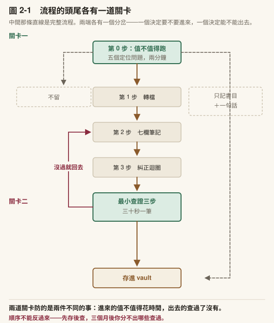
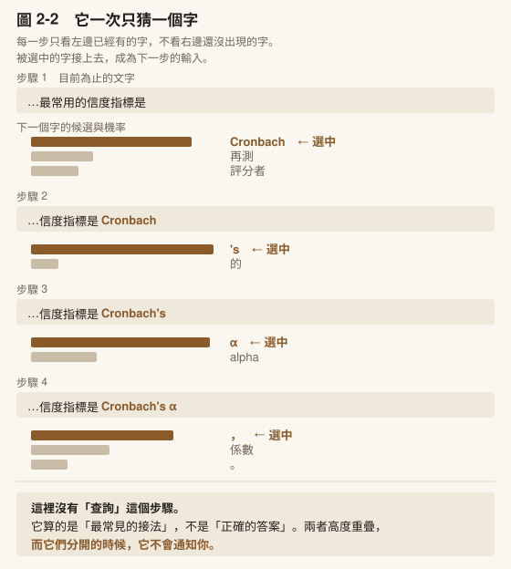
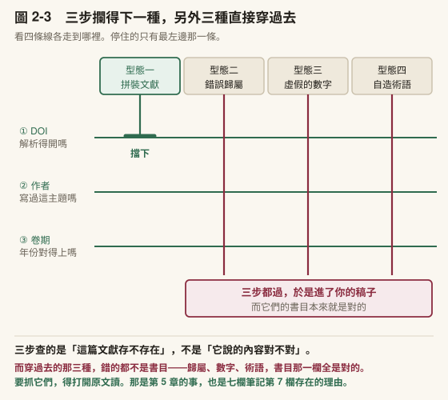
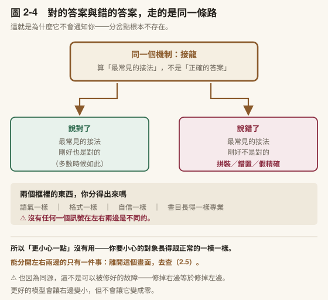
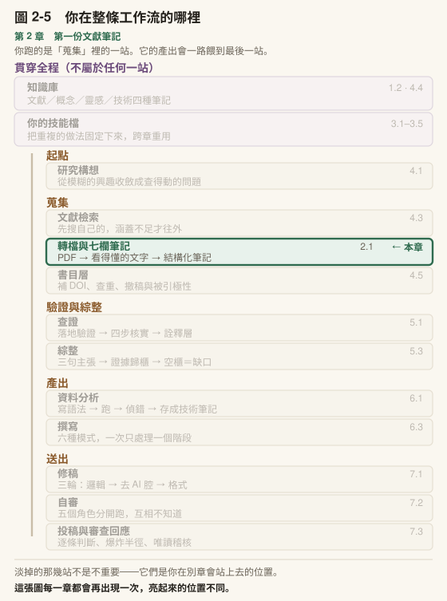

# 第 2 章　第一份文獻筆記，以及它騙了你

## 本章導覽

**這一章回答五個問題**

1. 怎麼把一篇 PDF 變成一份我三年後還讀得懂的筆記？
2. 它為什麼會編出一篇不存在的論文，而且編得那麼完整？
3. 教育研究裡最常遇到的三種編造，各長什麼樣？
4. 我怎麼在三十秒內抓到一筆假引用？
5. 為什麼「它看起來很有把握」這件事完全不能用？

**讀完你能夠**

- **操作**「PDF → 結構化筆記 → 知識庫」的完整流程，並修正它填錯的欄位
- **親手抓到**至少一筆 AI 編造的文獻
- **解釋**它為什麼會這樣，而且說明這不是故障
- **辨識**拼裝文獻、錯誤歸屬、虛假精確的數字三種型態
- **執行**最小查證三步，並說出三步都過還剩下什麼沒驗

**需要多久**

自學閱讀約 60 分鐘｜課堂 3 小時（概念 70 分、實作 110 分）

**進來之前，你要能**

- 不看書說出**專案記憶與知識記憶差在哪**，以及為什麼一個資料夾不夠（[1.2](../chapters/01-setup.md#12-你剛才那段對話明天就不見了)）
- 打開你自己的知識庫，而且裡面**已經有你放進去的東西**——不是空的（[1.3](../chapters/01-setup.md#13-建你的現場)）

第二條做不到就回去做。本章第一頁就要往裡面寫檔案。

**開始前請準備**：[第 1 章](../chapters/01-setup.md)建好的 vault；一篇你近期在讀的論文 PDF（挑你已經讀過的）。

---

## 章前導言

上一章那位碩士生，這一章換了一種方式被絆倒。

他把文獻回顧的初稿寄給指導教授，隔天收到回信，只有兩行字：

> 你引的那兩篇，我找不到。第三頁那個 2019 年的量表研究，作者是誰？

他愣了幾秒才反應過來。那兩筆引用不是他抄來的，也不是他隨手編的。他問了一個很正常的問題：「近十年有哪些研究處理過教師科技焦慮的測量？」對方回了六篇，格式工整，作者、年份、期刊、卷期一應俱全。**其中四篇他確實找得到、讀過了、也的確切題。** 他就順手把另外兩篇一起放進去了。

他做錯了什麼？

他每一步都符合常識。他沒有讓 AI 代寫，他自己讀了文獻、自己下的判斷、自己組織的段落。他唯一的失誤，是把「四篇是真的」當成「這份清單是真的」。

這個推論之所以看起來合理，是因為他心裡想像的那個東西是一個**資料庫**。資料庫要嘛查得到、要嘛查不到，不會查到一半是真的、一半是編的。

他手上那個工具不是資料庫。這件事沒有人告訴過他。

[第 1 章](../chapters/01-setup.md) [1.5](../chapters/01-setup.md#15-在你往下走之前三件必須先知道的事) 已經告訴過你了。三句話。這一章要做的是讓那三句話**真的發生在你身上**。

順序是這樣的：**先把流程跑起來、做出一份真的筆記**（2.1）， **然後讓它在你面前出錯**（2.2），接著才講為什麼（2.3、2.4），最後給你一個三十秒就跑得完的防線（2.5）。

這個順序是刻意的。「它會編造引用」這句話你已經讀過了，但你還沒相信。人要相信一件事，多半得先被它咬一次。

> **〔課堂〕開場 6 分鐘** 講完開場故事，停在「他做錯了什麼？」讓全班回答，**先不要給答案**。常見答案：他偷懶／他沒查證／他太相信 AI。把答案寫在板上先擱著。那些答案都把問題歸到**態度**。本章要證明這是**知識**問題—— 他不知道那個工具是什麼，所以他的推論在他自己看來完全合理。實驗二結束後回頭看那些答案，全班會自己發現差別。

---

## 2.1 把一篇 PDF 變成一份筆記

### 為什麼要結構化

你可以直接問「這篇在講什麼」，然後把它給你的三段話貼進 vault。三個月後你會發現那三段話對你沒用。因為你不記得它有沒有漏掉東西，也沒辦法跟另外三十篇比較。

結構化的意思是：每一篇論文都用同一套欄位處理。欄位固定，你才能橫向比較；欄位固定，你三年後才知道要去哪一格找東西。

### 第 0 步　先決定要不要跑



〔圖 2-1〕中間那條直線是完整流程，兩端各有一個分岔。 **這一節先講最上面那個**——它決定一篇論文進不進得了流程；最下面那個關卡在 2.5。

七欄流程要花你十五分鐘。**而不是每一篇都值得。**

跑之前先花兩分鐘問五個問題。它們不需要你讀完全文，讀摘要與引言末段就答得出來：

```text
1. 這篇處理的是什麼研究問題？
2. 它宣稱的貢獻是什麼？
3. 它跟這個領域既有的研究是什麼關係？
4. 它跟我手上的題目有什麼關聯？
5. 值不值得完整跑一次流程？
```

前四題是**定位**，第五題是閘門。

為什麼要有這道閘門：因為**摘要不等於理解**。你把一篇論文丟給 AI 摘要，它會給你一段通順的摘要，而你讀完會產生「我懂了」的感覺，但你不知道它在這個領域站在哪裡，也不知道它對你有沒有用。

第 1 到第 4 題問的正是那件事：這篇是從哪裡來的、它未來能怎麼被你用。

第 5 題的答案有三種，各自對應不同的處理：

| 答案 | 怎麼處理 |
|---|---|
| **值得** | 跑完整七欄流程 |
| **只需要記著它存在** | 只留書目＋一句話「它處理什麼」，不跑流程 |
| **不相關** | 不留。你不會回頭讀它，留著只會讓知識庫變吵 |

**第二種比你以為的多。** 一個研究主題裡真正需要精讀的通常是十幾篇，其餘幾十篇你只需要知道它們存在、講什麼、必要時找得到。把那幾十篇也跑完整流程，是把時間花在你不會回頭看的東西上。

**而「精讀」那一類裡面，還有更小的一撮要用完全不同的方式讀。** 跟你的研究設計最像的那三到五篇，你要從它們身上讀的不是「它發現了什麼」，是「它為什麼這樣設計」——那個東西不會出現在下面這七欄裡，因為七欄問的是它做了什麼。做法在[第 4 章](../chapters/04-research-question.md) [4.6](../chapters/04-research-question.md#46-這篇論文為什麼這樣做)，那一節也是全書唯一一節寫明**不能交給工具**的。

〔教你的 Claude 建這個〕**把這五題固定成一個分流動作。** 貼這段：「我要建一個判斷『這篇論文值不值得精讀』的說明檔。輸入是一篇論文的摘要與引言。請規定你依序回答五題：研究問題、宣稱的貢獻、與既有文獻的關係、與我研究的關聯、以及**建議精讀／只記書目／不留**。規則：（一）第四題要說**為什麼**有關聯，不能只說『相關』；（二）**不確定就選『只記書目』**，不要為了給我明確答案而說精讀。」第二條是關鍵。沒有它，你會拿到一份每篇都值得精讀的清單。

### 第 1 步　把 PDF 變成看得懂的文字

論文 PDF 是排版檔不是文字檔。兩欄排版、頁首頁尾、圖表標號都會混進內文，先轉成純文字，後面每一步才穩。

**做對了會看到**：標題階層還在、表格沒散掉、圖片被抽成獨立檔案並留下連結。

⚠️ **這一步是整條流程唯一會靜默失敗的一步，所以要單獨警戒。**

有些出版社數位化的舊期刊，頁面是**掃描圖 ＋ 一層看不見的文字**。轉檔工具對這種頁面回傳近乎空白，而程式**回報成功**。我自己的工具吃過一次：一篇 29 頁的論文，底層文字有 132,975 個字元，轉出來只剩 2,635 個。**流失 98%，而且沒有任何錯誤訊息。**

你不需要寫程式也擋得住它：**轉完先看字數。** 一篇期刊論文轉出來少於三千字，八成有問題。這是一個五秒鐘的檢查，而它擋掉的是「你以為讀了整篇、其實只讀到兩頁」。那種錯誤在下游完全看不出來。

### 第 2 步　產生七欄筆記

七個欄位，欄名照抄不要增刪：

```text
1. 核心論點——這篇在主張什麼（3 句以內）
2. 研究方法——設計、樣本、分析方法，並註明它出現在第幾節
3. 主要發現——實際找到什麼，有數字就寫數字
4. 理論貢獻——它在這個領域的位置
5. 與我研究的關聯——對我的題目有什麼用（這一欄標成「草稿」）
6. 引用格式——完整可貼
7. 原始摘錄——3 到 5 段值得引用的原文，逐字保留，各附頁碼
```

三欄值得單獨說明：

**第 2 欄要求「第幾節」。** 這是一個小技巧但很有用：**要它指出位置，等於逼它把答案錨定在文本上**，而不是接一段聽起來合理的方法學描述。答不出位置的時候，你就知道那一段是它掰的。

**第 5 欄一定要標「草稿」。** 它推的是你的問題意識，而它手上那份對你的理解是片面的。這一欄幾乎不會一次到位，而標成草稿是提醒你：這一欄是你要改的，不是它給你的結論。

**第 7 欄一律逐字，不要翻譯。** 一翻譯就不再是原始摘錄，這一欄等於白做—— 你日後要查「我的說法有沒有失真」時，手上剩的還是別人的轉述。**看到中文就退回去要一次。**

### 第 3 步　糾正迴圈

AI 填錯欄位是常態，不是意外。重點不在它會不會錯，在**你有沒有一個修正的動作**。

兩句就夠：

> 「與我研究的關聯」這一欄推的方向不對。我的研究重點是〔你的核心問題〕，請照這個重寫，並明確指出這篇的哪一個發現支持或不支持我這個切入點。 **如果它其實沒處理這個問題，就直接說沒有。**

最後那一句是關鍵。**你要給它一條說「沒有」的退路**，否則它會硬找一段來湊。

它回你「這篇沒有處理你關心的那個變項」時，那不是失敗—— 那是你剛剛得到一個研究缺口。

### 第 4 步　存進 vault

檔名用你三年後找得到的寫法，不要用 `note1`。存進[第 1 章](../chapters/01-setup.md)建的那個資料夾。

[第 1 章](../chapters/01-setup.md)的 vault 到這裡才第一次真的裝了東西。

〔補充〕**這一整條流程可以變成你自己的一份檔案。** 上面那七欄是一套規格，你現在是每次手動要求它照做；**下一章會把它固定下來**，而那時候你會發現：**這一節的七欄規格就是那個檔案的〈輸出格式〉段，你的研究背景就是〈使用者背景〉段。** 材料你已經有了。

> **〔動手一下〕15 分鐘** 用你帶來的那篇 PDF 跑完四步。**務必挑你已經讀過的論文**—— 拿沒讀過的來跑，你會失去唯一的對照組，分不出它哪裡在胡說。

### 第 5 步　你的起點通常不是一個 PDF

前面四步從一個檔案開始。你真實的處境多半不是這樣：你有一個書目管理軟體，裡面躺著幾十到幾百筆，其中一部分附了 PDF，而你記不清哪些讀過。

這一步處理那個落差。**兩條路，先講不需要串接的那一條**。它不需要你裝任何額外的東西，而且你今天就能跑。

路徑一：手動取件（預設，也是你第一次該走的）

1. 在書目軟體裡搜你要處理的那一批（關鍵字、標籤、或「最近加入」）
2. 挑**五筆以內**開始。不要一次五十筆
3. 對每一筆，先過 2.1 第 0 步那五個定位問題，決定它值不值得跑完整流程
4. 值得的，把 PDF 拉出來，跑第 1 到第 4 步
5. 只記書目的那幾筆，直接在 vault 建一則兩行的檔案：書目 ＋ 一句「為什麼先不精讀」

第 5 步不要省。⚠️ **那一句「為什麼先不精讀」是你三個月後唯一能判斷「要不要回頭讀它」的東西**，而它只花你十秒。

路徑二：串接之後（可以批次，但更容易出事）

如果你把書目軟體接上去（做法見[附錄 K](../appendix/K-connectors.md)），它就能自己列出「有 PDF 但你還沒建筆記」的清單，一次處理十幾筆。

聽起來很好。但批次會放大三種錯誤，而且三種都不會報錯：

| 陷阱 | 長什麼樣 | 怎麼防 |
|---|---|---|
| **比對誤判** | 它用「第一作者姓氏＋年份」判斷你有沒有筆記，於是把一篇沒建過的算成建過 | ⚠️ 同姓同年在任何一個上千筆的書目庫裡都是常態。**逐筆比對標題才能判定跳過** |
| **無附件被略過** | 有些條目只有書目沒有 PDF，批次時它安靜地跳過 | 要它把「跳過的」單獨列一張清單給你看 |
| **轉檔靜默失敗** | 掃描版 PDF 轉出近乎空白，而程式回報成功 | 第 1 步那條規則照用：**轉完看字數** |

⚠️ **第一種是三種裡最貴的。** 另外兩種你會發現筆記數量不對，第一種不會。那篇論文從此不在你的知識庫裡，而你以為它在。你下一次做文獻回顧的時候不會想起它，因為你根本不知道它缺席。

**驗收**

跑完之後不是看筆記數量，是隨機抽一篇，做三件事：

1. 打開它的第 7 欄，回原文找那句逐字引文——找得到嗎
2. 看第 2 欄有沒有「第幾節」——沒有的話它剛才在憑印象填
3. 問自己：三個月後只看這則筆記，我還原得出這篇在講什麼嗎

**三題都過，你的流程才算通了。** 抽一篇就好，但要真的抽。

〔動手一下〕**5 分鐘**。打開你的書目軟體，用「最近加入」列出十筆，只做一件事：把它們分成「值得跑流程」和「只記書目」兩堆。⚠️ 多數人第一次分完會發現只記書目那一堆比想像的大。那不是偷懶，那是 2.1 第 0 步在發揮作用。

---

### 帶走這一節

- **不是每一篇都值得跑流程。** 先花兩分鐘問五題，第五題是閘門
- **摘要不等於理解**——摘要讓你覺得懂了，但你不知道它在這個領域站在哪裡
- 三種處置：精讀／只記書目／不留。**「只記書目」那一類比你以為的多**
- 結構化的意思是**每一篇都用同一套欄位**，欄位固定才比較得了、找得到
- **轉檔是唯一會靜默失敗的一步**：轉完先看字數，少於三千字八成有問題
- 第 2 欄要「第幾節」，是為了**逼它把答案錨定在文本上**
- 第 7 欄一律逐字，翻譯了這一欄就白做
- 糾正迴圈要給它**說「沒有」的退路**，而它說沒有的時候，你得到的是研究缺口
- **你的起點通常是一個書目庫不是一個檔案**：先走手動路徑，五筆以內；批次會放大三種不報錯的錯誤
- ⚠️ 批次最貴的一種是**比對誤判**——那篇論文從此不在你的知識庫，而你不知道它缺席

---

## 2.2 現在，讓它騙你一次

你手上有一份筆記了。接下來這件事要親手做，讀過不算。

### 實驗：向它要五篇文獻

**步驟**

1. 選一個**冷門**主題。越冷門越容易誘發，因為訓練資料在那裡越稀疏。建議挑你自己領域裡的一個窄縫。某個特定量表在某個特定族群的應用之類的
2. 向它索取「五篇相關文獻，附完整書目資訊與 DOI」
3. 逐筆查（怎麼查看 2.5，先讀那一節再回來）
4. 記錄：幾筆是真的、幾筆是假的、幾筆**半真**

如果五筆全真，換一個更冷門的主題再來一次。這不代表工具沒問題，代表**你選的主題太主流**。那正好證明了本章要講的事：它出不出錯，取決於那個東西在訓練資料裡有多常見，跟你怎麼問無關。

### 「半真」那一類要特別注意

三類結果裡，**半真最危險**：文獻確實存在，但書目資訊有一欄是錯的。

它們最容易被放行，因為你查到一半就對上了。作者對、期刊對、年份看起來合理，於是你在那裡停手。而你停手的那個位置，正好是它藏東西的位置。

> **〔動手一下〕20 分鐘** 把上面四步跑完。**在你查完之前，不要往下讀 2.3。** 那一節解釋為什麼會這樣，而**解釋在你親眼看到之前讀，效果會少一半。**

> **〔課堂〕實驗的收尾比實驗本身重要** 統計全班的真／假／半真筆數，寫在板上。不要只講總數，**請幾位同學說他們是在第幾步抓到的**。多數人會說第 1 步（DOI 打不開），少數人是在第 3 步才發現年份不對。 **那些第 3 步才抓到的案例最有教學價值**。它們示範了「前面都通過」是什麼感覺。收尾時回到開場那些寫在板上的答案（他偷懶／他太相信 AI），問一句：「你們剛才有偷懶嗎？」

### 帶走這一節

- 越冷門的主題越容易誘發，因為它出錯取決於**那個東西在資料裡有多常見**
- 五筆全真不代表沒問題，代表**主題太主流**
- **半真最危險**：你查到一半對上了就停手，而那正是它藏東西的位置

---

## 2.3 為什麼會這樣：它在做的事是接龍

現在你有一份自己抓到的證據了。可以講原理了。

### 它一次只猜一個字

生成式 AI 實際在做的事，是**接龍**。

給定目前為止的所有文字，它計算「下一個字最可能是什麼」，選一個接上去；然後把剛接上的那個字也算進「目前為止的文字」，再算下一個。如此反覆，直到它算出「該停了」。

看一個實際的展開。假設輸入是「教育研究中最常用的信度指標是」：

| 步驟 | 目前為止的文字 | 下一個候選（機率高低） | 選中 |
|---|---|---|---|
| 1 | …信度指標是 | **Cronbach**（高）／再測（中）／評分者（中） | Cronbach |
| 2 | …是 Cronbach | **'s**（極高）／的（低） | 's |
| 3 | …是 Cronbach's | **α**（極高）／alpha（中） | α |
| 4 | …是 Cronbach's α | **，**（高）／係數（中）／。（低） | ， |



〔圖 2-2〕**它一次只猜一個字**。四步接龍，每步畫出候選字的機率長條，被選中的往下延伸成新一列。視覺重點：每一步都只看左邊，而且沒有「查詢」這個步驟。

請注意第 1 步發生了什麼。它並沒有去某個地方查詢「教育研究領域最常用的信度指標」然後回報。它是根據訓練過程中看過的大量文字，算出在這個語境下 `Cronbach` 接在後面的機率最高。

答案碰巧是對的，但答對的路徑不是「知道」，是「常見」。

### 於是你的五筆文獻是怎麼來的

回到你剛才那個實驗。當你要它給五篇文獻，它面對的不是「去資料庫撈五筆」這個任務。 **它根本沒有在做那件事。**

它面對的是：在一段長得像參考文獻清單的文字裡，這幾個位置接什麼最合理？

- 作者位置 → 那個領域常出現的名字
- 期刊位置 → 那個領域真的存在的期刊
- 年份位置 → 一個合理的年份
- 標題位置 → 那個領域會有的標題長什麼樣

每一欄都是照著「合理」生出來的，而不是照著「存在」查出來的。所以每一欄看起來都對，組合起來卻不存在。

### 它沒有「查無此物」這個出口

搜尋引擎找不到東西會回傳零筆結果，因為它有一個索引可以比對。它沒有索引，它有的是機率分布。而在機率分布裡，「不知道」不是一個特別容易被選中的接法。

> **〔動手一下〕3 分鐘** 輸入一句半截話，刻意停在一個需要知識才接得下去的位置。通用版：「臺灣的義務教育年限是」。專業版：「在項目反應理論中，區辨度參數指的是」。送出後盯著它逐字浮現的過程看。**你正在即時目睹上面那張表。** 兩句都試，然後注意一件事：專業版那句你判斷得出對不對，通用版換一個外行人也判斷得出來。 **判斷力的門檻，是隨著題目移動的。**

### 「幻覺」這個詞取得不好

這個詞暗示這是一種異常狀態，像人發燒時看到不存在的東西，退燒就好了。 ⚠️ **這個比喻會讓你等一個永遠不會來的修正版。**

比較準確的講法是：生成正確的內容與生成錯誤的內容，走的是同一條路徑。

回頭看上面那張接龍表。裡面沒有兩種模式。它不會在「有把握」時去查資料、在「沒把握」時改成編造。事實正確的句子和事實錯誤的句子，在它眼裡是同一種東西。

### 說得順與說得對，由不同的東西決定

- **流暢度**來自語言模式。訓練資料裡有海量合格的學術文句，所以它幾乎總是能產出讀起來像樣的東西
- **正確性**取決於那個語言模式是否剛好對應世界的事實

前者幾乎穩定達成，後者浮動。於是出現一個對研究者最麻煩的組合：內容可以是錯的，而形式看不出任何破綻。

這正是它與人的不同之處。一個不懂裝懂的人通常會在表達上露出破綻——語焉不詳、避重就輕、細節說不出來。我們判斷可信度的直覺，很大一部分建立在這種破綻上。它沒有這種破綻：它在不知道的時候，講得跟知道的時候一樣好。

### 一條帶著走的原則

> **它的自信程度不攜帶任何正確性資訊。**

這句話比它看起來的更強：**語氣這個維度整條廢掉。**

反過來也成立。它說「我不確定」也不算數。那同樣是一種接法，不是查詢失敗回傳的訊號；猶豫跟自信一樣不帶資訊。

### 帶走這一節

- 它在做**接龍**：算下一個字最可能是什麼，沒有「查詢」這個步驟
- 答對的路徑是**「常見」不是「知道」**；這兩件事分開的時候它不會通知你
- 你那幾筆假文獻的每一欄，都是照著「合理」生出來的，不是照著「存在」查出來的
- **生成對的與生成錯的走同一條路徑**，所以這不是故障，也不會被修好
- **語氣這個維度整條廢掉**：自信不算數，說「我不確定」也不算數

---

## 2.4 教育研究最常遇到的四種型態



〔圖 2-3〕**看四條線各走到哪裡。** 停住的只有最左邊那一條，另外三條穿過全部三道關卡——因為那三種錯的地方不是書目。

### 型態一：拼裝文獻

**最危險的一種，因為每個零件都是真的。** 真實存在的作者、真實存在的期刊、合理的年份、那個領域確實會出現的標題，組合起來卻是一篇不存在的論文。

為什麼特別難抓：你查作者，有；你查期刊，有；你看標題，像。要抓到它，你必須查那個**組合**存不存在，也就是得追到 DOI 或資料庫條目那一層。而多數人在前三步就停下來了，因為前三步都通過。

這一類問題有一個統稱：**Vibe Citing**（氛圍引用），由 AI 偵測公司 GPTZero 的機器學習主管 Alex Adams 提出，仿造自「vibe coding」。他們的定義是「把真實來源推衍或揉合成似是而非的模仿品」。乍看準確，一細查就垮（GPTZero, 2026）。

這個名字取得比「幻覺」好，它點出了問題所在：**對的是氛圍，不是內容。**

**拼裝文獻只是它的其中一型。** GPTZero 列了三型，另外兩型你也會遇到：

| 型 | 長什麼樣 |
|---|---|
| **組合／改寫** | 把多篇真來源的標題、作者、卷期揉在一起（＝拼裝文獻） |
| **整筆捏造** | 作者、標題、DOI、期刊全部生成 |
| **局部竄改** | 把名字縮寫展開、增刪一位作者、改動標題長度 |

第三型最容易被放過，因為那篇論文**真的存在**，錯的只是你手上這一筆的某一欄。這就是你剛才在實驗裡標成「半真」的那一類。

### 型態二：錯誤歸屬

把 A 理論的術語安到 B 學者頭上，或把某個概念的提出者張冠李戴。

難抓的原因跟型態一不同：這種句子在學理上讀起來是通的。要抓到它，你得對該領域的學術史夠熟。**而這恰好是研究生最缺的。你剛進入一個領域的時候，正是最沒有能力分辨誰提出了什麼的時候。**

### 型態三：虛假精確的數字

它會給你 α = .87、N = 342、r = .43。**這些數字全部是生成的。**

⚠️ 數字最危險的地方在於，**數字看起來就不像是可以被編造的東西**。我們對數字有一種預設信任，覺得它一定是從某處抄來的，總不會有人憑空生一個小數點後兩位。

**但接龍不區分文字與數字。** `.87` 對它而言只是一串在那個位置機率很高的字元。

〔補充〕**這一型跟你的七欄筆記直接相關。** 第 3 欄要求「有數字就寫數字」—— 那一欄是**最需要回原文核對的一欄**，因為它同時是最有用的和最容易被生成的。

### 型態四：自造術語

前三種的對象都是文獻——引用的書目不存在、歸屬搞錯、數字被生成。 **這一種的對象是概念本身。**

它會產出一個讀起來非常專業的術語，有定冠詞、有修飾語、你隱約覺得在哪裡讀過。但你去查，整個學術資料庫裡沒有這個詞。它是接龍出來的——不是編一筆引用，是**編一個概念**。

一個真實的例子：某份研究計畫裡，AI 產出了一個方法論術語。寫法像中文教科書裡會出現的標準譯名，跟同類術語的格式完全一致，用在那段文字裡語意通順。研究者事後回查，發現那個詞的唯一來源就是那一次對話本身——它從來不存在於任何教科書或期刊論文。

⚠️ **這一種比前三種更晚才被發現。** 拼裝文獻你查 DOI 會發現，自造術語你不會去查，因為你不覺得術語是可以被生成的東西。你會自然地以為它是哪本書上的，然後把它寫進你的稿子，再從稿子傳進你的理解裡。等到審查者問「你引的這個概念我查不到」，你才會去找——然後發現你也找不到。

**怎麼防**：遇到一個你「好像讀過但說不出在哪裡讀的」術語，花三十秒做一件事：把它丟進學術資料庫搜一次。搜得到就沒事，搜不到就是這一型。

### 帶走這一節

- **拼裝文獻**：零件真、組合假。它是 Vibe Citing 三型中的一型
- 另外兩型是**整筆捏造**與**局部竄改**；局部竄改就是你標成「半真」的那些
- **錯誤歸屬**難抓，因為它在學理上讀起來是通的，而新手最沒能力分辨
- **虛假精確的數字**難抓，因為數字看起來不像可以被編造的東西
- **自造術語**最晚被發現：你不會去查一個「看起來就是術語」的詞存不存在

---

## 2.5 最小查證三步

完整的四步核實在[第 5 章](../chapters/05-verification.md)，這裡先給簡化版。**三步足以抓出大多數假引用。**

1. **DOI 解析得開嗎？** 把 DOI 補成 `https://doi.org/` 開頭的完整網址打開。打不開、或開出來是別篇，就是假的。沒附 DOI 的直接進第 2 步
2. **這位作者真的寫過這個主題嗎？** 查作者姓名加關鍵詞。作者真實存在但從未碰過這個主題，那就是拼裝文獻
3. **卷期、年份、頁碼對得起來嗎？** 找到疑似的真篇之後逐欄比對。常見狀況是「真的有這篇，但年份或卷期被改掉了」

三十秒一筆，五筆兩分半。

圖 2-3 那三條穿過去的線，就是這件事的形狀。這個差別在[第 5 章](../chapters/05-verification.md)會展開，而它正是七欄筆記**第 7 欄（原始摘錄）**存在的理由。

### 還有一招：不要讓它有機會編

三步查證是**事後抓**。還有一招是事前不讓它發生，兩招搭配才完整。

做法是在提示詞裡放兩種佔位符：

| 標記 | 什麼時候用 | 它換來什麼 |
|---|---|---|
| `[VERIFY]` | 它寫下**任何可以被外部查證的具體事實**——數字、年份、機構名、法規條文 | 你拿到一份**已經標好哪裡要查**的稿子 |
| `[CITATION]` | 需要引用的位置 | **它根本不生成書目**，只留一個空格給你自己填 |

第二個才是關鍵，而且它比第一個強得多。

`[VERIFY]` 的邏輯還是「它產出，你檢查」。你仍然要逐筆查。 `[CITATION]` 的邏輯不同：**你不讓它產出那個東西**。沒有生成，就沒有拼裝文獻。

一段可以直接加進任何提示詞的規則：

```text
規則：
- 任何可以被外部查證的具體事實（數字、年份、機構、法規），
  在句子後面加 [VERIFY]
- 需要引用的地方一律寫 [CITATION]，**不要產生任何書目資訊**
- 你不確定的地方寫「不確定」，不要用推測填滿
```

**代價要說清楚**：你會拿到一份到處是方括號、讀起來很破碎的草稿。 **那個破碎感是功能，不是缺點**。它讓「還沒查」這件事在視覺上跑不掉。一份沒有標記的草稿看起來已經完成了，而那正是最危險的狀態。

〔補充〕**這一招跟七欄筆記的第 7 欄是同一個思路。** 第 7 欄要求逐字原文，是**不讓它改寫**；`[CITATION]` 是不讓它生成。兩者的共同形狀是： **與其驗證它產出的東西，不如先讓它不要產出那個東西。** 這個思路在[第 6 章](../chapters/06-analysis-writing.md)談寫作、[第 7 章](../chapters/07-revision-integrity.md)談修稿時還會再出現。

〔教你的 Claude 建這個〕**把這兩個標記變成你的預設。** 貼這段：「請把下面這三條加進你的預設行為，之後我不再重複交代：（一）可外部查證的具體事實後面加 `[VERIFY]`；（二）需要引用的位置一律寫 `[CITATION]`，**不產生任何書目**；（三）不確定就寫『不確定』。另外請規定你自己：產出結尾要列出這一份總共放了幾個 `[VERIFY]` 與幾個 `[CITATION]`。」最後那一句是驗收。數字對不上，代表它有些地方沒標。

### 這三步現在就要進你的流程

不是「以後記得查」，是**現在就把它接到 2.1 那條流程後面**。回頭看圖 2-1：查證三步就是最下面那道關卡，**它在 vault 之前，不在之後**。

### 帶走這一節

- 三步：**DOI 開得開／作者寫過這主題嗎／卷期年份對得上嗎**，三十秒一筆
- **三步都過只代表這篇存在**，不代表引用正確——那要打開來讀
- 查證要接在**存進 vault 之前**，否則你日後分不出哪些查過
- 三步是**事後抓**；`[VERIFY]` 與 `[CITATION]` 是**事前不讓它發生**
- `[CITATION]` 比 `[VERIFY]` 強——**沒有生成，就沒有拼裝文獻**
- 草稿讀起來破碎是功能不是缺點：**一份沒有標記的草稿看起來已經完成了**

---

## 2.6 教育研究實例

### 實例一：那位碩士生後來怎麼補救

開場那位被指導教授抓到的碩士生，回頭把整份文獻回顧的引用逐筆查了一次。六十一筆，花了兩個半小時。

結果：**五筆有問題**。兩筆是教授已經抓到的（完全不存在），另外三筆是他自己找到的—— 一筆年份錯了一年，一筆把第二作者寫成第一作者，一筆的期刊名少了一個詞。

**那三筆才是重點。** 教授抓到的那兩筆，任何人查一下就會發現；那三筆前三欄全對，如果不是他逐欄比對，會一路跟到論文出版。

### 實例二：轉檔那一步吃掉了整篇論文

一位研究生要讀一篇 1990 年代的經典方法學論文，出版社的數位化版本。她轉了檔，掃了一眼，看起來正常，就丟給 AI 產七欄筆記。

筆記回來了，七欄都填滿，讀起來也合理。

問題是**那份轉檔只轉出了 353 個字**。那篇論文有 29 頁。七欄筆記裡的內容，有六欄是它從標題與摘要**推**出來的。

她是在寫作時要引用第 3 欄的一個數字，回去翻原文才發現整份是空的。

**判準又回到那五秒鐘的檢查：轉完先看字數。**

### 實例三：數字那一欄

一位教授在準備研討會簡報時，要引用一篇他讀過的量表研究的信度係數。他懶得翻 PDF，直接問 AI：「那篇的 Cronbach's α 是多少？」

它回：`.89`。

他覺得數字很眼熟，就用了。簡報當天有人問「那個 .89 是哪一個分量表的」，他答不出來。回去查，原文是 .82，而且是整份量表的，不分量表。

它給的 `.89` 不是查來的，是**生成的**：那個位置最常出現的數字就長那樣。而「眼熟」正是這一型最狠的地方。合理的數字本來就會讓你覺得眼熟。

---

## 2.7 動手實作

### 實作一：跑完整流程（40 分鐘）

用你帶來的 PDF 跑完 2.1 的四步。

**驗收**：vault 裡有一份七欄齊全的筆記，而且第 2 欄真的指得出節次、 **第 7 欄是原文不是中文**。

跑完之後做一次糾正迴圈：針對推錯的那一欄下一句修正，看它改得對不對。 **這一步不要跳過**。真實使用中你每一篇都會做這件事。

### 實作二：誘發幻覺（35 分鐘）

跑完 2.2 的四步，逐筆走 2.5 的最小查證三步。

**繳交**：一張表，五列，每列記這一筆是真／假／半真、你在第幾步抓到的。

**如果五筆全真，換更冷門的主題重跑。** 這一項的驗收不是「你有沒有跑」，是**你有沒有親手抓到至少一筆**。

### 實作三：把三步接進流程（15 分鐘）

回到實作一那份筆記，替它的第 6 欄（引用格式）跑一次最小查證三步。

這一項多數人會覺得多餘。那篇論文明明就在你手上。 **做，而且要記錄你花了多久。** 那個時間就是你日後每一篇要付的成本，知道成本才排得進流程。

### 實作四：從你自己的書目庫跑一筆（20 分鐘）

前三項都從一份給定的 PDF 開始。這一項從你真實的處境開始。

1. 打開你的書目管理軟體，用「最近加入」列出**十筆**
2. 逐筆過 2.1 第 0 步那五個定位問題，分成「值得跑流程」與「只記書目」兩堆（5 分）
3. 從「值得」那一堆挑**一筆**，走完第 1 到第 4 步（10 分）
4. 對「只記書目」那一堆，隨便挑兩筆，各建一則兩行的檔案：書目 ＋ 一句「為什麼先不精讀」（5 分）

驗收不是看你做完幾筆，是回答一個問題：那十筆裡，「只記書目」佔了幾筆？

多數人第一次做完會發現那一堆比預期大。⚠️ **那不是你偷懶，是第 0 步在發揮作用**—— 你原本打算全部精讀，而那個打算本身就是文獻無底洞的來源之一。

〔課堂〕**這一項最容易失控的是第 1 步。** 學生會開始整理整個書目庫，二十分鐘過去還在分類。開場先講死：**只看最近加入的十筆，不要往下捲。**

### 技能要點

| 關鍵動作 | 做對了長什麼樣 | 常見卡點 |
|---|---|---|
| 轉檔後看字數 | 你說得出「這篇轉出 X 字」 | 掃一眼覺得正常就往下走 |
| 第 2 欄要節次 | 回你「見 [3.2](../chapters/03-skills.md#32-那個檔案裡該寫什麼) 節」 | 沒要求，拿到一段通用的方法學描述 |
| 第 7 欄逐字 | 那一欄是英文原文 | 被順手翻譯了，這一欄白做 |
| 糾正迴圈給退路 | 它會回你「這篇沒處理」 | 沒給退路，它硬湊一段 |
| 逐欄比對 | 你查到第 3 步才抓到的那種 | 前三欄對上就停手 |

**本章最容易失守的是實作二。** 多數人跑完發現五筆全真，就當作「還好嘛」收工。 **那不是結果，那是主題選太主流。** 換一個更窄的再跑一次—— 這一章的價值全部在你親手抓到的那一筆上。

### 當週小task

繳交：一份七欄文獻筆記（含糾正迴圈前後對照）＋實驗二的五列查證表＋三行使用聲明。

查證表的「**在第幾步抓到**」那一欄是這次唯一會被細看的地方。

---

## 2.8 常見迷思

迷思一：「提示詞寫好一點就不會有幻覺。」

*為什麼錯*：把話說清楚改善的是**它理解你要什麼**，不改善它產出的內容正不正確。那兩件事由不同的機制決定。

*正確版本*：你把要求寫得再明白，也不會讓一個它其實不知道的出處變成正確的。而那句「請確保所有引用正確」它會照辦。用它的方式照辦，也就是生成一些看起來更確定的文字。

**迷思二：「等模型更新就好了。」**

*為什麼錯*：生成對的與生成錯的走**同一條路徑**。它沒有兩種模式可以修好其中一種。

*正確版本*：接上檢索之後「完全捏造」會大幅減少，但錯誤**換了型態**—— 從「編造來源」變成「引用了真來源但讀錯它」。而讀錯是查證三步驗不出來的。

迷思三：「它說不確定的時候就是真的不確定。」

*為什麼錯*：那句話同樣是接出來的，不是查詢失敗回傳的訊號。

*正確版本*：**它的猶豫和它的自信，一樣不帶正確性資訊。** 語氣這個維度整條廢掉。

迷思四：「我讀過那篇，我看得出來它有沒有胡說。」

*為什麼錯*：你讀過的是內容，它編的是**書目**。作者、年份、卷期這幾欄，你讀十遍論文也不會記得。

*正確版本*：實例三那位教授就是這樣中的。**「眼熟」不是驗證。**

---

> ### 〈責任落點〉 - 決定**跑不跑查證**：你。流程不會自己停下來提醒你 - 判斷**它填的第 5 欄推得對不對**：你。那一欄推的是你的問題意識，它手上的版本是片面的 - 判斷**這篇論文是不是真的說了它說的那句話**：你。這一層工具完全幫不上 - 工具負責的只有一件：**在你給的脈絡範圍內，把話接下去**。它接得順不順，跟接得對不對，是兩件事

---

## 2.9 章末整理



**圖 2-4　對的答案與錯的答案，走的是同一條路。** 分岔點根本不存在—— 語氣一樣、格式一樣、自信一樣、書目長得一樣專業，沒有任何一個訊號在左右兩邊是不同的。所以「更小心一點」沒有用：你要小心的對象長得跟正常的一模一樣。也因為同源，這不是可以被修好的故障。更好的模型會讓右邊變小，但不會讓它變成零。

### 三句話帶走

1. **它在接龍，不在查詢。** 答對的路徑是「常見」，不是「知道」
2. **生成對的與生成錯的走同一條路徑**，所以這不是故障，也不會被修好
3. **語氣這個維度整條廢掉。** 自信不算數，說「我不確定」也不算數

### 回到開場

那位碩士生的問題不是態度。他沒有偷懶，也沒有過度信任—— 他做的推論（四篇是真的，所以這份清單是真的）在他的心智模型裡完全合理。

錯的是那個心智模型：他以為那是一個資料庫。

你現在不會犯那個錯了，而且你會這樣，是因為剛才親手抓到了一筆，不是因為讀到這句話。



〔圖 2-5〕亮起來的是這一章教的位置，淡掉的是你在別章會站上去的地方。你剛才跑的是「蒐集」裡的一站。它的位置很前面。它的產出會一路餵到最後一站，所以這一站的錯誤也會一路帶到最後。

### 拿去跟人討論

下面幾題沒有標準答案，而且一個人想不出來——它們要的是別人的處境跟你的不一樣。找一個同學、同事或指導教授，挑一題聊十分鐘。

1. 各自講一次你被騙得最像真的那一筆。兩個案例放在一起，共同點是什麼？
2. 你們兩人領域的文獻長得不一樣。哪一個領域的假引用比較難抓，為什麼？
3. 假設對方交來一份文獻回顧，你只有十分鐘。你會先查哪三筆？把挑選的理由說出來，讓對方判斷那個理由在他的領域成不成立。

### 下章預告

你現在跑過一次流程了。下一次呢？

下一章處理一件很實際的事：你剛才那些提示詞，下個月還要再打一次嗎？

而在那個過程中，你會第一次看到提示詞的完整寫法。**不是因為要背七個元素，是因為你要把它們寫進一個檔案裡，而那個檔案得寫清楚才會有用。**

---

## 延伸資源

**外部資源**

- **GPTZero (2026).** *GPTZero finds 100 new hallucinations in NeurIPS 2025 accepted papers.* [https://gptzero.me/news/neurips/](https://gptzero.me/news/neurips/) Vibe Citing 一詞與三型分類的出處。 **驗證層級：全文讀過該頁**。這是一家 AI 偵測公司的自家調查報告，不是同儕審查研究。它的數字可信度取決於你信不信該公司的偵測工具。
- **Claude 官方教學中心**：[https://claude.com/resources/tutorials](https://claude.com/resources/tutorials) 其中〈Why do AI models hallucinate?〉是本章 2.3 的官方版說明。本書只指向官方來源，**不推薦個別創作者的教學影片**—— 影片的正確性你無法從標題判斷，而那正是本章教的事。

- **學術筆記的定位問題**（Obsidian Academic Note-Making）：[https://obsidianacademicnotamaking.substack.com/p/4-paper](https://obsidianacademicnotamaking.substack.com/p/4-paper) 2.1 第 0 步那五個定位問題的來源，以及「摘要不等於理解」這個提法。 **驗證層級：讀過該頁**。該作者有一套完整的四色筆記法， **本書只取「定位先於摘要」這個原則與那道閘門**，未採用其分類系統—— 那與本書[第 4 章](../chapters/04-research-question.md)的四種筆記會打架。

- **AI 輔助學術寫作的進階做法**（uedu）：[https://uedu.tw/writing/a/ai-assisted-writing-adv](https://uedu.tw/writing/a/ai-assisted-writing-adv) 2.5〈不要讓它有機會編〉那兩個佔位符的來源，另有「診斷而非改寫」與階段別的角色分工。 **驗證層級：讀過該頁**；它是實務指南不是研究，其做法未經實證檢驗。

**本書其他章節**

- **[第 1 章](../chapters/01-setup.md) [1.5](../chapters/01-setup.md#15-在你往下走之前三件必須先知道的事)**：三件必須先知道的事。本章是其中兩件的完整版
- **[第 3 章](../chapters/03-skills.md)**：提示詞七元素。本章用到的那幾段提示詞，在那裡會被拆開講
- **[第 5 章](../chapters/05-verification.md)**：四步核實與存在查核。本章的三步是它的簡化版
- **[第 5 章](../chapters/05-verification.md) [5.1](../chapters/05-verification.md#51-引用幻覺與四步核實)**：規模化的證據——專家審查也擋不住捏造引用
- **[附錄 A](../appendix/A-setup.md)**：安裝與帳號設定

---
