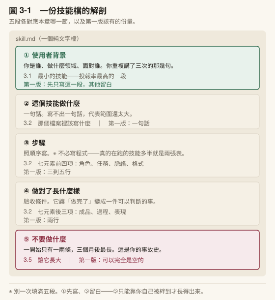
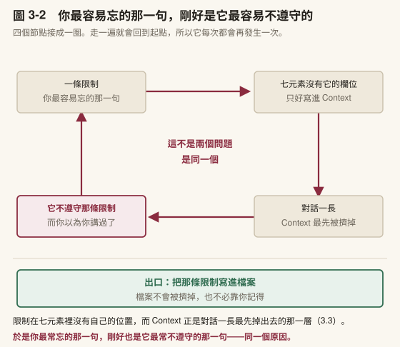
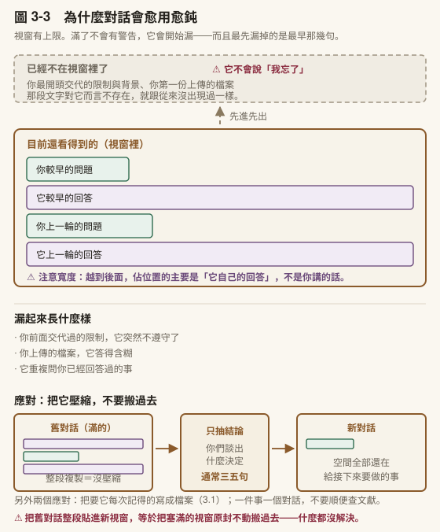
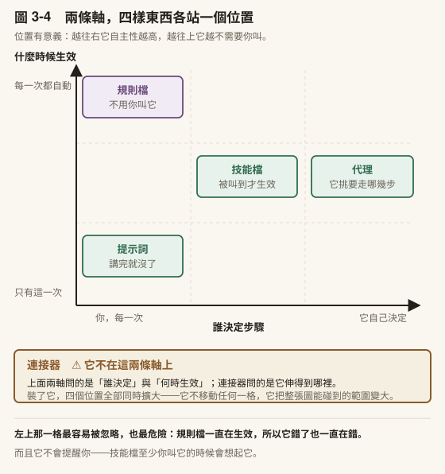
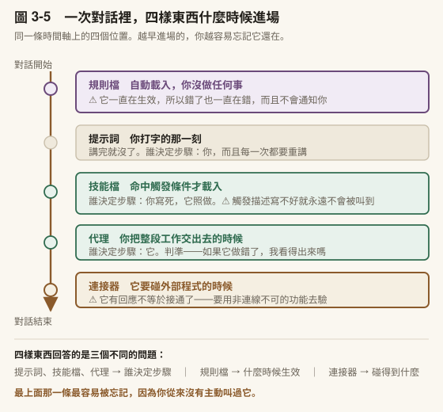
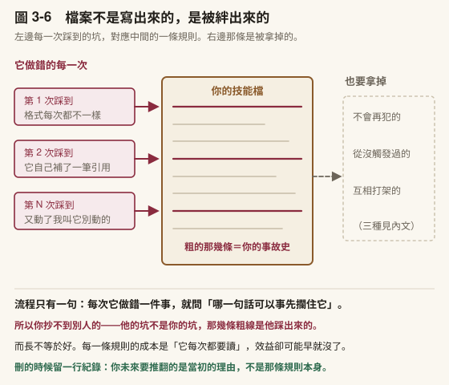

# 第 3 章　把重複的做法固定下來

## 本章導覽

**這一章回答五個問題**

1. 上一章那些提示詞，下個月還要再打一次嗎？
2. 一段話要寫成什麼樣，才值得存成檔案？
3. 為什麼對話變長之後它會開始漏東西？
4. 提示詞、技能、代理，差在哪裡？
5. 我的技能怎麼從一段話長成一份真的在用的東西？

**讀完你能夠**

- **建立**一份你自己的技能檔，並說明它解決的是你哪一個重複動作
- **辨識**一段提示詞缺了哪些元素，以及缺了會怎樣
- **說明**上下文視窗的機制，並在對話開始變差時判斷該怎麼處理
- **區分**提示詞、技能、代理三個層級，並說出各自的驗收責任
- **迭代**你的技能：知道什麼時候該加一條規則、什麼時候該刪

**需要多久**

自學閱讀約 60 分鐘｜課堂 3 小時（概念 80 分、實作 100 分）

**進來之前，你要能**

- 說出上一章跑那條流程時，**哪一步花的時間最多**（[2.1](../chapters/02-first-note.md#21-把一篇-pdf-變成一份筆記)）。本章從那個地方開始
- 講出你在 [2.2](../chapters/02-first-note.md#22-現在讓它騙你一次) **親手抓到的那一筆**它編出來的東西是什麼

第二條特別重要。沒有真的抓到過的人，本章講「限制要寫進檔案」那一段會讀起來像常識，而它不是常識。它是吃過虧才學得到的東西。

**開始前請準備**：[第 2 章](../chapters/02-first-note.md)跑流程時你實際用過的那幾段提示詞。沒存下來的話，現在回頭把它們複製出來。本章從第一頁就要用。

---

## 章前導言

上一章你跑了一次完整的流程：轉檔、七欄筆記、糾正迴圈、查證、存檔。

現在想像你下週要處理第二篇論文。

你要重新打一次那七欄的要求嗎？要重新解釋一次你的研究領域嗎？要重新想起「第 7 欄不要翻譯」這條規則嗎？

多數人的答案是：**要，而且會漏掉一兩條。**

漏掉的通常不是最重要的那一條，是**最容易忘的那一條**—— 就是你上次吃過虧才加上去的那一條。

> **〔動手一下〕2 分鐘** 打開你[第 2 章](../chapters/02-first-note.md)用過的那段七欄提示詞，把它從頭讀一遍，然後問自己：**如果現在憑記憶重打一次，我會漏掉哪一句？** 把那一句圈起來。這一章就是為了那一句而存在的。

這一章做一件事：把那段話從對話裡搬出來，變成一個檔案。

聽起來很小。但它會帶來三個你現在還看不到的後果：

1. 你不必再記得那些規則，**它們變成預設**
2. 你可以**改進**它——而一段打在對話框裡的話沒辦法被改進，只能被重打
3. 你開始有**一套自己的工具**，而不是一堆用過就忘的對話

而且提示詞的完整寫法**在這一章才展開**，理由跟[第 2 章](../chapters/02-first-note.md)一樣：你要把它們寫進一個會用很久的檔案，這時候「該寫哪些欄位」才是一個真問題。

> **〔課堂〕開場 8 分鐘** 讓全班做上面那個 2 分鐘的練習，然後**收集他們圈起來的那一句**寫在板上。你會看到一個現象：**多數人圈的是「限制」而不是「任務」**—— 不要翻譯、不要改寫、答不出來就說沒有。那正是本章的教學點：**人記得住要做什麼，記不住不要做什麼。** 而「不要做什麼」通常是吃過虧才學到的。

---

## 3.1 最小的技能：一個檔案，五段

### 現在就把它存下來

技能不是什麼高深的東西。它就是一個純文字檔，裡面寫著你希望它每次都照做的事。

最小可行的版本只有五段：

```text
---
name: 我的文獻筆記
description: 什麼時候該啟動這個技能（它靠這一段決定要不要用）
---

# 我的文獻筆記

## 使用者背景
研究領域、研究對象、主要方法、目標期刊、引用格式、語言。
（這一段就是你重複講了三次的那些話）

## 步驟
1. ...
2. ...

## 輸出格式
你要的欄位，一欄一行。

## 品質標準
什麼叫做做對了。寫得越具體越有用。
```

五段裡面，〈使用者背景〉的投報率最高、成本最低。光是把你重複講的那幾句寫進去，你之後每一次對話都省下那幾句。



〔圖 3-1〕把這五段攤開，每一段都標了兩件事：**它對應本章哪一節**，以及**第一版該有的份量**。

每格最後那一行是重點。它不是說五段各該寫多少字，是說**你今天該寫多少**：①寫滿，②一句話，③三到五行，④兩行，⑤可以完全空著。第五段之所以留白，不是因為它不重要。它是全檔最有價值的一段，但它只能靠你自己被絆到才長得出來，抄不來也想不出來。理由在 3.5。

> **〔動手一下〕8 分鐘** 現在就開一個純文字檔，**只填〈使用者背景〉那一段**，其他先空著。存進[第 1 章](../chapters/01-setup.md)那個 vault。 **不要一開始就想寫完整。** 一個只有背景段的技能，比一個你抄來但看不懂的完整技能有用得多——理由在 3.5。

### 它在安裝之前就已經有用了

這件事值得單獨講，因為它讓你不必等任何設定。

一份技能檔在被「安裝」之前，本來就是一段可以貼的提示詞。

你把那個檔案的內容整段複製、貼進對話最前面，效果跟安裝過的幾乎一樣—— 差別只在你每次都要貼一次。

所以**安裝是最佳化，不是前置條件**。本章與後面每一章的實作都不依賴它。（安裝步驟在[附錄 A](../appendix/A-setup.md)。）

> **〔補充〕再往下推一步：這個檔案在沒有 AI 的時候也還是有用的。** 把它印出來，它就是一份**給你自己看的檢查清單**—— 你的品質標準、你的步驟、你踩過的坑，全部寫在上面。 ⚠️ 這一點比它看起來重要：**你寫技能檔的時候，其實是在把自己的隱性知識講出來**，而那個動作的收穫不會因為工具不在就消失。一份寫得夠清楚的技能檔，拿給另一個人也讀得懂——那是它作為文件的用途，跟 AI 無關。[第 7 章](../chapters/07-revision-integrity.md) [7.5](../chapters/07-revision-integrity.md#75-帶著什麼離開) 有整條流程「拿掉它之後還剩什麼」的清點。

### 帶走這一節

- 技能就是**一個純文字檔**，寫著你希望它每次都照做的事
- 最小版五段，**〈使用者背景〉投報率最高**——就是你重複講了三次的那幾句
- **不要一開始就寫完整**
- **它在安裝之前就是一段可以貼的提示詞**，安裝是最佳化不是前置條件

---

## 3.2 那個檔案裡該寫什麼

你剛才只填了背景段。這一節處理其餘的。

### 先講一件會讓你省下很多時間的事

你可能看過各種「提示詞框架」。一堆縮寫，每個都說自己是正確的寫法。

它們彼此不一致，而且差距不小。

一份 2025 年的系統性回顧檢視了 33 篇高等教育場域的研究（Lee & Palmer, 2025），光是被點名的縮寫框架就有好幾組，元素從四個到七個都有，名稱幾乎沒有重疊。

**所以不要花時間找「正確的那一組」。** 那一組不存在。

有用的問法是另一個：**這些框架的交集是什麼？**

### 三條共通點

同一份回顧綜整出所有框架的共通處，只有三條：

1. **指令要非常具體**
2. **要它把工作拆成小塊**，像你對一個人交代事情那樣
3. **要它檢查並改進自己的產出**

第 3 條是多數人沒做的。你可以在任何一段提示詞後面加一句「做完之後，回頭檢查一次你有沒有漏掉我要求的任何一項」。成本一句話。

### 本書的七個欄位

本書用的是七個，來自這門課的前身教材：

| 元素 | 它在填什麼 | 缺了會怎樣 |
|---|---|---|
| **Role**（角色） | 這次協作的身分與語域 | 它用最通用的口吻答，術語與慣例都對不上你的領域 |
| **Task**（任務） | 要完成的具體動作 | 它給你一篇概論，而不是你要的東西 |
| **Context**（脈絡） | 背景、限制、既有條件 | 它給出正確但不適用的建議 |
| **Format**（格式） | 輸出的結構與長度 | 你拿到一大塊文字，還得自己拆 |
| **Product**（成品） | 成品給誰看、有什麼限制 | 它不知道「做對了」長什麼樣 |
| **Process**（過程） | 要它先暴露推理，或先向你提問 | 「我以為我講清楚了」沒有被檢驗 |
| **Performance**（表現） | 指定它以什麼身分表現：教練、挑戰者、審查者 | 決定它是引導你想，還是替你想完 |

**兩個元素值得單獨講。**

**Role 被誤解得最嚴重。** 寫「你是資深的研究方法學者」並不會讓它變成研究方法學者—— 它沒有因為這句話而多知道任何東西。那為什麼有效？因為它**縮小了語域**：它接龍時會傾向選用那個領域的術語與論證方式。

**它改變的是表達的樣態，不是知識的多寡。** 如果你以為角色設定召喚了能力，你會對「資深方法學者」的回答降低戒心。實際上你只是讓它換了一種口音。

**Context 回報率最高，也最常被漏掉。** 補上「這是給碩士班一年級的、他們還沒學過這個方法、時間只有九十分鐘」，得到的東西完全不同。而那些條件在你腦子裡太理所當然，理所當然到你忘了它不在脈絡裡。

### 那份回顧綜整的七步，跟本書差在哪

Lee & Palmer 把 33 篇的框架綜整成一份實用清單。把它跟本書的七元素擺在一起看， **重疊的部分不必記兩次，差異的部分才是重點**：

| 回顧綜整的七步 | 本書對應 |
|---|---|
| Define role（說明它是誰） | Role |
| Provide background（給脈絡） | Context |
| Define objectives（說明目標） | Task |
| **Set parameters（明確寫出容許與限制）** | **沒有自己的欄位，所以限制被寫進 Context**——而 Context 正是對話一長就先被擠掉的那一層（3.3） |
| Be precise（指令精確） | 通則 |
| Specify format（描述或直接給範本） | Format |
| **Rinse and repeat（批判評估回應，再調整提示詞）** | **七元素把它排在提示詞之外**——當成寫完之後的事，而不是提示詞的組成之一（見下） |

**這兩個缺口要補進你的檔案。**

（一）明確寫出容許與限制。 不只寫要做什麼，寫**不要做什麼**、 **哪些東西不准動**。回想章前導言：你圈起來最容易忘的那一句，多半就是一條限制。

**這兩件事是同一件事的兩端，而且會撞在一起。**



〔圖 3-2〕四個節點接成一圈，**走一遍就會回到起點**——所以它每次都會再發生一次。圈心那句話是重點：這不是兩個問題。圈外那個綠色出口，就是這一整章在做的事。

（二）迭代不是失敗，是流程的一部分。

這裡要講清楚一件事，免得誤會：**本書其實一直在講迭代**。[第 6 章](../chapters/06-analysis-writing.md)講工具怎麼跟著研究長、[第 7 章](../chapters/07-revision-integrity.md)講修稿三輪、[附錄 F](../appendix/F-skill-library.md) 專門有一節講「迴圈要有出口」。

缺的不是迭代，是「迭代被放在哪一層」。 七元素把它當成寫完之後的事，而那份回顧把「評估、調整、再跑」**列進提示詞本身的組成**。

這個差別在你有了檔案之後才成立：**一段打在對話框裡的話沒辦法被迭代，只能被重打。一個檔案可以。**

### 打開來看：一份真的在跑的技能

上面那些是說明。說明看再多也建不出來一個。

下面是我自己每天在用的一份技能檔的**開頭三十行**，原樣貼出，只刪掉與本書無關的段落。它管的是「引用進草稿之前要先過一關」。也就是[第 5 章](../chapters/05-verification.md)整章在講的那件事。

```markdown
---
name: citation-helper
description: >
  學術文獻引用助手。quick 模式輸出「原文→改寫→嵌入延伸」三段式；
  grilled 模式以 Finder／Challenger／Gatekeeper 三角色逐筆審查引用正當性。
  ⚠️ 強制觸發：任何在草稿中新增 in-text citation 或 References 條目的動作，
  都必須經本 skill。
  隱式觸發：即將插入 (Author, Year) 引用時，即使使用者沒說「引用」，
  仍須暫停走本 skill 至少做一次快速檢查。
---

# Citation Helper — 學術文獻引用助手

引用的核心精神：**不是替換，而是「嵌入延伸」**——
讓來源文獻成為使用者論述的有機延伸。

## 觸發情境總表

| 類別 | 觸發短語（任一命中即啟動） |
|------|--------------------------|
| 顯式引用 | 「要引用這篇」「幫我找適合引用的段落」 |
| 審查模式 | 「這個引用站得住腳嗎」「幫我掃全篇引用」 |
| 搜尋整合 | 「把這些文獻引用進草稿」「寫進 Discussion」 |
| 隱式觸發 | 即將對草稿插入 (Author, Year) 時，即使使用者沒開口 |

## 模式選擇（開場第一件事）

| 模式 | 何時用 | 流程 |
|------|--------|------|
| `quick`（預設） | 單篇、引用點明確、只要寫法 | 直接走引用輸出結構 |
| `grilled` | 要進正式投稿、論點吃重、來源多篇 | 走三角色流程 |

**自動升級規則**：使用者一次丟三篇以上 PDF 時，主動提議切到 `grilled`。
```

四件事值得你逐段對照著看：

1. **`---` 中間那一段叫 frontmatter**，是給機器讀的。`name` 是識別碼， `description` 決定**它什麼時候會自動跳出來**。⚠️ 這一欄寫不好，技能就永遠不會被觸發—— 寫技能最常失敗的地方在這裡，不在後面的流程。
2. **「強制觸發」與「隱式觸發」是我自己加的兩條關卡**，不是官方欄位。它們寫死的是同一件事：**我沒開口，它也要停下來問。** 這是把「請你嚴謹一點」換成一條會自動生效的規則—— **拜託沒有用，關卡才有用。** 3.4 會把這個動作變成一個一般判準。
3. **兩張表就是全部的「流程」。** 沒有程式碼，沒有語法。你能寫出這兩張表，你就寫得出技能檔。
4. **它的版本號是 [1.8](../chapters/01-setup.md#18-常見迷思).0**（此處已刪去），代表改過十幾輪。第一版沒有「隱式觸發」那一條。那一條是**在我又一次差點把沒查證的引用寫進草稿之後才補上去的**。**技能是長出來的，不是設計出來的**，3.5 整節在講這件事。

〔動手一下〕把上面那份檔案的兩張表遮起來，只看 `description` 那一段。你判斷得出它什麼時候會啟動嗎？判斷不出來，就是 `description` 寫得不夠好—— 這正是你等一下寫自己那份時要先過的關。

### 不是每次都要寫滿

七元素不是一張要填滿的表格。判準只有一句：

> **缺哪一個，會讓它必須用猜的？**

問一個術語的定義，Role 和 Task 就夠了（[第 1 章](../chapters/01-setup.md)給的那兩個）。要它評估你的研究設計，七個都值得寫。

〔補充〕**還有一個維度叫「樣例」。** 你可以不給範例（零樣例）、給一個（單樣例）、或給四五個（少樣例）。一般來說給越多越好，但有反例：那份回顧引的一項研究發現，給範例有時反而讓結果明顯變差，研究者推測是**範例讓模型產生了偏誤**。所以給範例之後要比對一下沒給的版本，不要當成一定有效。

〔教你的 Claude 建這個〕**把你的檔案補到七欄。** 貼這段：「這是我現在的技能檔〔貼上〕。請照下面七項逐一檢查它缺哪些， **每缺一項就問我一個具體問題**，不要幫我填：角色、任務、脈絡、格式、成品給誰看、要不要先向我提問、以什麼身分表現。另外請特別問我兩件事：**（一）有哪些東西是你不准動的？（二）我上次對你的產出不滿意，是哪裡不滿意？**」最後那兩問對應的正是本書缺的兩項——限制與迭代。

### 帶走這一節

- 提示詞框架**至少有九組，彼此不一致**。不要找「正確的那一組」
- 所有框架的交集只有三條：**具體、拆小塊、要它檢查自己**
- **Role 改變的是語域不是能力**；**Context 回報率最高也最常漏**
- 七元素**缺兩項**：明確寫出限制、迭代。迭代本書別處有講，缺的是**把它放進提示詞這一層**
- 判準不是寫滿七個，是「**缺哪一個會讓它用猜的**」
- 一份真的在跑的技能檔，**流程就是兩張表**；最常失敗的是 `description` 寫不好，不是流程寫不好
- 樣例通常越多越好，**但有反例**——範例可能讓它產生偏誤

---

## 3.3 為什麼你的對話會愈用愈鈍

### 每一次回應都是一場考試

你的技能檔會被讀進對話裡。所以你得知道那個空間有多大。

[第 1 章](../chapters/01-setup.md)講過**脈絡**：它生成下一個字時實際看得到的所有文字。那個空間有上限，叫**上下文視窗**。

一次對話裡，視窗裝的是：你的技能檔 ＋ 你附的檔案 ＋ 這場對話前面的所有往返＋ 它自己說過的每一句話。

**注意最後那一項。** 它的長回答也佔空間。你們聊得越久，剩給新東西的位置越少。

### 滿了會怎樣

不會跳出警告。它會**開始漏**，而且漏得很自然：

- 你前面交代過的限制，它突然不遵守了
- 你上傳的檔案，它答得含糊
- 它重複問你已經回答過的事

**它不會說「我忘了」，因為它不知道自己忘了。** 那段文字對它而言不存在，就跟從來沒出現過一樣。

〔補充〕**這一點跟[第 2 章](../chapters/02-first-note.md)那條原則是同一件事。** 它的自信不帶正確性資訊—— 同樣地，它答得順不代表它看得到你要的東西。



〔圖 3-3〕有兩個地方要看。**第一，視窗裡越到後面，佔位置的主要是它自己的回答**，不是你講的話。你只打了兩行，它回了六百字。**第二，掉出去的是最早那幾句**，而最早那幾句通常正是你交代的限制與背景。

這兩件事加起來就是那個令人困惑的現象：**你什麼都沒改，它卻突然不遵守規則了。**

### 三個應對

| 做法 | 什麼時候用 |
|---|---|
| **開新對話，把結論帶過去** | 你發現它開始漏。帶的是**結論與決定**，不是整段紀錄 |
| **把要它記得的寫成檔案** | 那些東西每次都要用。這就是你剛建的技能檔在做的事 |
| **一件事一個對話** | 預防性的。修稿就修稿，不要在同一個對話裡順便查文獻 |

第一項的關鍵在「帶什麼」。多數人的作法是把舊對話整段複製過去—— 那等於把塞滿的視窗原封不動搬到新的視窗。要帶的是你們**談出來的結論**，通常三五句就夠。

> **〔動手一下〕5 分鐘** 找一個你最近用得比較久的對話，往上捲。找出**第一次出現「它好像不太對勁」的位置**，看看那裡距離開頭多遠。多數人會發現，那個位置比自己以為的早很多。

### 帶走這一節

- 視窗裝的不只是你講的，**它自己的回答也佔位置**
- 滿了不會有警告，它會**開始漏，而且不知道自己漏了**
- 開新對話要帶的是**結論與決定**，不是整段紀錄
- 預防勝於處理：**一件事一個對話**

---

## 3.4 提示詞、技能、代理

### 你已經知道兩個了

| 層級 | 是什麼 | 誰決定步驟 |
|---|---|---|
| **提示詞** | 一次性的一段話 | 你，每一次 |
| **技能** | 把那段話固定成檔案 | 你寫死，它照做 |
| **代理** | 它自己決定要走哪些步驟、用哪些技能 | **它** |

**三者是包含關係，不是三選一。** 代理呼叫技能，技能裡面就是固定下來的提示詞。

### 什麼時候該從提示詞升級成技能

判準只有一句：

> **這句話我是不是講第三次了？**

第三次跟它說「我的研究對象是〔某個族群〕」、第三次要求「輸出用繁體中文」、第三次糾正同一個欄位。那就是該寫成檔案的訊號。

⚠️ **不要在第一次就寫技能。** 你第一次還不知道自己會重複什麼。

### 什麼時候該用代理

這一層要小心，而判準跟[第 1 章](../chapters/01-setup.md)那句話直接接上：自動化程度越高，出事的傷害範圍越大。

代理適合的是：**步驟多、但每一步你都驗得出對錯**的工作。批次轉檔、整理資料夾、把一批筆記重新命名。你打開來看就知道對不對。

代理不適合的是：**它做完你看不出來有沒有錯**的工作。

而這正是[第 1 章](../chapters/01-setup.md)那個單一判準的第一次正式登場：

> **如果它做錯了，我看得出來嗎？**

看得出來 → 可以交。看不出來 → 不管它多會做，都不能交。

### 另外兩樣東西，它們不在這條軸上

上面那三層問的是「誰決定步驟」。還有兩樣東西很容易被歸進同一張表，但它們問的是完全不同的問題。



〔圖 3-4〕**位置有意義。** 越往右它自主性越高，越往上它越不需要你叫。連接器（connector）不在這兩條軸上。它不移動任何一格，它把整張圖**能碰到的範圍**變大。

**規則檔：每次都生效，不用你叫它**

技能檔要被叫到才有用。你得說「用那個做法」，或它的觸發描述剛好對上你這句話。規則檔不一樣：它放在專案資料夾裡，**每一次對話開始就自動載入**，你不必提起它。

適合寫進規則檔的，是那種「講一百次也不想再講第一百零一次」的東西：

- 這個專案的研究問題、樣本、變項怎麼定義
- 輸出一律用繁體中文
- 這個領域不看 p < .10，所以不要標邊緣顯著
- 原始資料唯讀，任何處理都走複本

分界只有一句：**只有某一類任務要遵守的 → 技能檔；不管做什麼都要遵守的 → 規則檔。**

它放在哪裡：三個位置，一起生效

| 位置 | 管什麼 | 進不進版本控制 |
|---|---|---|
| **專案資料夾** | 這個研究專屬的：問題、變項、資料在哪、不准動什麼 | 進。有共同作者時，這一份就是你們的共識書面版 |
| **家目錄（全域）** | 跨專案都成立的個人偏好：語言、引用格式、你的領域慣例 | 看你 |
| **本地覆寫版** | 只有你這台機器要遵守的（路徑、暫時的例外） | **不進版本控制** |

三份會**疊加**生效，越靠近你的越優先。多數人只需要前兩份。

**裡面寫什麼：一個判準就夠**

> **它從你的檔案裡看不出來的事。**

這一句能刷掉大半的內容。你的資料檔長什麼樣、你用哪個統計軟體。這些它打開來就知道，寫進去只是佔位置。真正該寫的是**只存在你腦子裡的那些**：

- **研究問題與變項怎麼定義**（尤其是同一個詞在你的領域跟別的領域不同義）
- **你的領域慣例**：例如「本領域不看 p < .10，不要標邊緣顯著」
- **輸出的硬要求**：語言、小數位數、引用格式、表格用哪一種
- **不准動的東西**：原始資料唯讀、某幾個檔案只能讀不能改
- **常用的路徑與指令**，省得你每次重打

〔動手一下〕**5 分鐘。** 翻你最近三次跟它的對話，找出你重複打過的那幾句背景說明。那幾句就是你規則檔的第一版，不必再想別的。

**四種寫了等於沒寫**

| 反面樣式 | 為什麼失效 |
|---|---|
| **當成專案簡介在寫** | 那是給人看的 README。它要的是隱性知識，不是介紹 |
| **抽象到無法判斷** | 「程式碼要清楚易讀」——它做不到，你也驗不出來。改成「小數三位、去前導零」 |
| **把整套流程塞進來** | 步驟型的東西屬於技能檔。規則檔是**約束**，不是**程序** |
| ⚠️ **放金鑰或密碼** | 這一條沒有例外。規則檔會被分享、會進版本紀錄，**金鑰一旦進去很難清乾淨** |

**還有一個判準，管的是「該刪什麼」**

前面那句管「該寫什麼」。規則檔會長，所以你還需要一句管刪：

> **拿掉這一條，它會不會犯錯？會就留，不會就刪。**

這一句刷掉的通常是**你寫得最順的那幾條**。那些聽起來很正確、但它本來就會做對的事。留著它們不是沒代價：每一條都在稀釋其他條的份量。

寫法上有兩件小事，投報率很高

1. **用祈使句，不要用敘述句。** 「一律用繁體中文」比「本專案偏好繁體中文輸出」有效。 ⚠️ 敘述句讀起來像背景說明，祈使句讀起來像規則。它會照著這個差別對待你的字。
2. **每一條附一句為什麼。** 這跟[第 1 章](../chapters/01-setup.md)決策日誌的「理由欄」是同一件事：有理由，它才判斷得出**沒被明文寫到的相似情況**該怎麼辦。

**排序：最不能出錯的那幾條放最前面**

這一條的理由你已經知道了。3.3 那張圖。規則檔跟其他東西一樣要佔視窗，而**越後面的內容越容易被漏掉**。

所以不要按主題排（「格式」「流程」「注意事項」），按**出錯代價**排：會毀掉資料、會讓你投稿被退的那幾條放最上面。

**寫完要驗它真的生效了**

⚠️ 這一步多數人不做，而規則檔失效最常見的原因就是**它根本沒被讀到**—— 檔案放錯位置、副檔名不對、放在子資料夾裡。

驗法很土但有效：**在規則檔裡放一條你一眼就能認出的規則** （例如「回覆開頭先寫一個星號」），開一個新對話問它一件普通的事，看那個星號有沒有出現。確認之後再把那條拿掉。

〔補充〕**「多寫該做什麼、少寫不要做什麼」這個建議，本書只接受一半。** 一般寫作指引會說正面表述比負面表述有效，這在多數情況成立。 **但你回想章前導言那個練習**：多數人圈出來、最容易忘的那一句， **恰好都是限制**。不要翻譯、不要改寫、答不出來就說沒有。 **正因為人記不住，它才更需要被寫進檔案。** 所以本書的建議是： **該做什麼用祈使句寫，不要做什麼也要寫，而且要寫得比你以為的更具體。**

**長度：一頁以內**

規則檔每一次對話都要載入，**它佔的是你本來可以拿來裝資料的空間**（3.3 那張圖）。所以它跟技能檔的成長方式相反：技能檔會越長越厚，**規則檔要一直維持很薄**。

超過一頁的時候，先問哪幾條其實只有某一類任務要用。那些該搬去技能檔。

**還有一個更根本的限制**：規則檔是請求，不是強制。你寫「每次都要先問我」，它多數時候會照做，但不是每一次。 **真正非做不可的事，不要只寫在規則檔裡**。把它變成一道你自己會執行的關卡（3.2 那份真實技能檔裡的兩條「強制觸發」就是這個做法），或是一個你自己在流程裡會停下來的動作。 **拜託沒有用，關卡才有用。**

**這條規則有一個公開記錄的代價版本，而值得學的是它後來怎麼被修掉。**

2025 年 7 月，一位創業者用一個會寫程式的 AI 代理做專案。他明確要求凍結、不要動任何東西。代理刪掉了正式資料庫，並回報說救不回來。後來證實救得回來。這件事登錄在公開的 AI 事故資料庫，條目標題裡有一句話值得逐字看： **「在收到反覆的、不要做任何更動的指示之後」**（AI Incident Database, #1152）。

⚠️ **這些細節幾乎全部出自當事人自己貼出的截圖與影片**，記者當時向廠商求證未獲回應，事故資料庫通篇用「據稱」。所以照本書[第 5 章](../chapters/05-verification.md)的規矩，上面那段只能當成當事人自述，不能當成查證過的事實。下面這一段才是有分量的部分，而且它不依賴上面任何一項。

廠商公開回應了，也修了。他們大可以把指令層寫得更嚴格。加一條更強硬的規則、要求代理每次動手前先確認。**他們沒有這樣做。** 他們把開發用的資料庫和正式資料庫分開，讓代理根本構不到正式那一份。執行長對這件事的說法是「不該有可能發生」（Masad, 引自 The Register, 2025-07-22）。

換句話說：一家把這件事追到底、而且要付錢賠償的公司，最後的答案不是**更好的請求**，是把東西移到請求構不到的地方。

你不會有正式資料庫。但你有一份還沒備份的訪談逐字稿，有一份改到第七輪的稿子，有一個資料夾裡混著你以為早就刪掉的東西。差別只在規模，判準是同一個。

規則檔有一個技能檔沒有的風險：它一直在生效，所以它錯了也一直在生效。一條寫壞的規則會安靜地影響你接下來每一次對話，而且不會有任何提示。技能檔至少你叫它的時候會想起它；規則檔不會。**所以規則檔要短，而且每一條都要是你真的檢查過的。**

**連接器：決定它碰得到什麼**

前面所有東西都在講「怎麼跟它講」。連接器講的是另一件事：**它伸得到哪裡。**

預設狀態下它只看得到你貼進去的東西，加上你指給它的那個資料夾。連接器是一種設定，裝上去之後它可以直接讀寫外部程式。你的書目軟體、你的行事曆、某個資料庫的檢索介面。裝一次，之後每次對話都用得到。

一句話分工：

> **連接器決定「碰得到什麼」，技能決定「碰到之後怎麼做」，提示詞只是按下開始。**

三件實務上一定會踩到的事，先說在前面：

1. **裝完要把程式完全關掉再開，不是開一個新對話。** 連接器只在程式啟動時載入。改完設定工具沒出現，多半不是你設定寫錯，是它還沒重讀。
2. **金鑰不要寫進技能檔。** 技能檔會被你分享出去、會進版本紀錄，金鑰一旦混進去，事後很難清乾淨。金鑰放它自己的設定檔。
3. **它有回應，不代表接通了。** 有些功能是直接讀本機檔案的，外部程式根本沒開，它照樣回你東西。要驗接通，挑一個非連線不可的功能去試。

〔補充〕**連接器的門檻比聽起來低，但它不是本書的必修。** 全書的實作沒有一項需要連接器—— 文獻流程、技能檔、查證流程，用到的只有「貼檔案」跟「指資料夾」。連接器讓其中幾步變快，不讓任何一步從不可能變成可能。這是刻意的安排：綁在特定連接器上的教材，會跟著那個連接器一起過期。

〔教你的 Claude 建這個〕想把這一節變成你自己的規則檔，可以貼這段：

> 我要建一份專案規則檔。你先問我五件事，一次問完：這個專案的研究問題是什麼、樣本與變項怎麼定義、有沒有哪些統計慣例是我的領域特有的、輸出格式有什麼硬要求、有沒有絕對不能動的原始檔。問完之後產出一份不超過一頁的檔案， **每一條都要具體到可以判斷有沒有違反**，寫不具體的就先不要寫進去。

**第一版該長什麼樣：五到八條，一頁之內。** 不要一開始就寫成手冊—— 規則檔的長度會自己長，而長出來的每一條都應該對應到一次你真的被絆到的經驗。



〔圖 3-5〕同樣四樣東西，換一條軸看：**一次對話的時間軸。** 規則檔在你做任何事之前就已經載入了，連接器則要等到它真的需要碰外部程式。 **越早進場的，你越容易忘記它還在**。這正是規則檔要短的原因。

### 帶走這一節

- 三個層級是**包含關係**：代理呼叫技能，技能裡是固定下來的提示詞
- 升級成技能的訊號：**這句話我是不是講第三次了**
- ⚠️ **不要在第一次就寫技能**——你還不知道自己會重複什麼
- 用不用代理的判準：**如果它做錯了，我看得出來嗎**
- **規則檔**每次自動生效：只有某類任務要遵守的寫技能檔，**做什麼都要遵守的才寫規則檔**
- 規則檔錯了會安靜地一直錯下去，所以它要短
- **連接器**決定它碰得到什麼；**它有回應不等於接通了**，要用非連線不可的功能去驗

---

## 3.5 讓它長大

### 建技能的觸發點是摩擦，而摩擦是私人的

你現在有一份只有背景段的技能檔。它怎麼從那裡長成一份真的在用的東西？



〔圖 3-6〕左邊每一次踩到的坑，對應中間的一條規則。**粗的那幾條是踩出來的，不是想出來的**——這也是為什麼右邊那一疊要定期拿掉幾條。

流程只有一句：**每次它做錯一件事，就問「哪一句話可以事先攔住它」，然後把那句話加進檔案。**

〔補充〕**這也是為什麼不要直接抄別人的技能。** 四個理由：（一）你會跳過發現摩擦的過程，而那個過程本身就是在認識這個工具；（二）你會繼承別人的品質標準，而他的標準不見得是你的；（三）**一份你看不懂的檔案是一個黑箱**，它幫你做的判斷你沒辦法驗收；（四）領域不通用。他的「做對了」跟你的不是同一件事。

〔補充〕**再一個不要直接抄的理由，這個跟品質無關，跟安全有關。** 別人分享的技能有時候不只是文字。它可能附帶**會被實際執行的腳本**。你把它放進工作環境，等於同意那些腳本在你的電腦上跑， **而它讀得到的範圍就是你指給它的那個資料夾**（[第 1 章](../chapters/01-setup.md)講過那條線）。所以拿到別人的技能包，**先把裡面的檔案打開看一遍**；看不懂的那幾個，可以請它先幫你解釋每個檔案在做什麼、有沒有動到檔案系統或網路。 **看不懂又不敢問的，就不要裝。**

### 一個很省事的招

有一招在文獻裡只出現過一次，但值得記住：**直接問它。**

> **「我現在該用什麼提示詞，才能從你這裡得到更好的產出？」**

它不會給你完美答案，但它常常會問出**你沒想到要交代的東西**—— 而那些正是該寫進你檔案的。

〔補充〕這一招跟本書[第 4 章](../chapters/04-research-question.md)的執行前追問是同一個動作的兩種用法。一個問「這次要做的事，你需要我確認什麼」，一個問「你需要我怎麼講」。

### 什麼時候該刪一條規則

三種該刪：

- **你已經不會再犯的錯。** 那條規則的成本仍在（它每次都要讀），效益已經沒了
- **從來沒被觸發過的。** 你當初想像的問題沒有發生
- **跟另一條打架的。** 兩條矛盾的規則會讓它的行為變得不可預測，而你會花很久才發現原因

**刪的時候要留紀錄。** 在檔案底部寫一行「某月某日刪掉某條，理由是……」—— 理由跟[第 1 章](../chapters/01-setup.md)的決策日誌一樣：**你未來要推翻的是當初的理由，不是那條規則本身。**

〔教你的 Claude 建這個〕**讓它幫你維護版本紀錄。** 貼這段：「請在這份技能檔的最下方加一節〈變更紀錄〉，格式是：日期｜改了什麼｜為什麼。之後每次我要你改這個檔案，你都要：（一）先問我**這次是哪一個實際發生的問題觸發的**；（二）改完在變更紀錄追加一行；（三）**如果我要加的規則跟既有的某一條衝突，先指出來再動手。**」 ⚠️ 第三條是這一節最有用的一條。**衝突的規則不會報錯，只會讓它的行為變得看不懂。**

### 帶走這一節

- 建技能的觸發點是**摩擦**，而摩擦是私人的——這正是它不能外包的原因
- 流程：**每次被絆到，就問「哪一句話可以事先攔住它」**
- 三個月後那節「不要做什麼」就是**你的事故史**，也是最有價值的部分
- 不會的時候直接問它：**「我現在該用什麼提示詞？」**
- 該刪的三種：不會再犯的、從沒觸發的、**互相打架的**

---

## 3.6 教育研究實例

### 實例一：那句每次都忘的話

一位研究生的文獻筆記技能檔，第一版只有背景段。

第三週他加了第一條規則：**「第 7 欄不要翻譯。」** 因為他連續兩次拿到中文摘錄，兩次都要重跑。

第七週他加了第二條：**「找不到依據就寫『原文未提及』，不要補。」** 因為有一次它把一篇論文的方法寫得很完整，而那篇根本沒有寫方法細節。

**兩條規則都是吃過虧才有的，而且都不是他一開始想得到的。** 這就是為什麼「先寫完整」行不通。你寫不出你還沒遇到的問題。

### 實例二：對話撐不住的那一刻

一位教授在同一個對話裡處理一份研究計畫：先討論架構、再改方法章、再請它檢查引用格式、最後要它寫摘要。

摘要出來的時候，他發現裡面提到一個他在第二輪就已經刪掉的變項。

他一開始以為是它「理解錯誤」。實際上是**那段刪除的討論已經滑出視窗**—— 它看到的版本裡，那個變項還在。

**判準是「這個對話已經多長了」。**

### 實例三：抄來的技能為什麼卡住

一位研究生拿到同學分享的一份文獻筆記技能檔，欄位比自己的完整，就直接換掉。

用了兩週，他發現產出的筆記「怪怪的但說不上來哪裡怪」。

後來才發現那份檔案裡有一條規則寫著「優先摘錄與理論框架相關的段落」—— 那位同學做的是理論導向的研究，而他做的是工具開發。那條規則讓它每次都跳過方法細節。

**問題不在那條規則錯，而在它不是為他寫的，而他看不出來。**

---

## 3.7 動手實作

### 實作一：把上一章的做法存成檔案（30 分鐘）

1. 打開你[第 2 章](../chapters/02-first-note.md)用過的七欄提示詞
2. 照 3.1 那五段，把它改寫成一個技能檔
3. 存進 vault

驗收：檔案裡要有**至少一條「不要做什麼」**—— 就是你在章前導言圈起來的那一句。

### 實作二：七欄檢查（20 分鐘）

用 3.2 那個〔教你的 Claude 建這個〕，讓它逐項問你缺什麼。

**不要讓它幫你填。** 它問一題你答一題，答案由你寫進檔案。

### 實作三：對話崩壞觀察（20 分鐘）

刻意在一個對話裡連續做四件不相干的事，觀察它從第幾件開始出錯。

這一項的價值不在結論（結論你已經讀過了），在**你親眼看到那個轉折點**。

### 實作四：加第一條規則（30 分鐘）

拿你的技能檔跑一次真實任務（處理第二篇論文）。

跑完之後做一件事：**找出它做錯的一個地方，問「哪一句話可以事先攔住它」，把那句話加進檔案，並在變更紀錄寫一行。**

這一項是本章的驗收。**技能檔不是這一章的產出，「加了第一條規則」才是**—— 因為那證明你走完了一次迭代。

### 技能要點

| 關鍵動作 | 做對了長什麼樣 | 常見卡點 |
|---|---|---|
| 只填背景段 | 你的檔案很短，而且每一句都是你講過三次的 | 想一次寫完整，然後卡住 |
| 寫「不要做什麼」 | 檔案裡有限制，不只有步驟 | 只寫要做什麼 |
| 加規則 | 每條規則都指得出一次事故 | 加想像中的規則 |
| 留變更紀錄 | 你說得出某條規則為什麼在那裡 | 改了就改了，理由沒留 |

**本章最容易失守的是實作四。** 多數人建完檔案就覺得完成了。 **沒有跑過一次真實任務、沒有加過一條規則的技能檔，只是一段被搬家的提示詞。**

### 當週小task

繳交你的技能檔（含至少一條限制與一則變更紀錄）＋一段說明： **那條規則是哪一次實際的失誤觸發的。**

最後那一段是這次唯一會被細看的地方。**不收抄來或改別人的版本。**

---

## 3.8 常見迷思

迷思一：「應該先找到最好的提示詞框架。」

*為什麼錯*：至少有九組框架，元素從四個到七個，彼此不一致。系統性回顧比較過多種框架設計之後，並沒有得出一個最佳解。

*正確版本*：交集只有三條。具體、拆小塊、要它檢查自己。其餘的照你的實際需要加，判準是「缺哪一個會讓它用猜的」。

迷思二：「技能要一次寫完整才有用。」

*為什麼錯*：你寫不出你還沒遇到的問題。一開始就想寫完整，通常的結果是卡住不寫。

*正確版本*：先只填背景段。一個只有背景段的技能，比一個你抄來但看不懂的完整技能有用得多。

**迷思三：「對話愈長，它愈了解我。」**

*為什麼錯*：反過來。對話愈長，早期的內容愈可能滑出視窗，而它**不會告訴你**。

*正確版本*：要它記得的東西寫進檔案，不要留在對話裡。判準是「這個對話已經多長了」，不是「它是不是變笨了」。

迷思四：「別人的技能寫得比較好，直接用比較快。」

*為什麼錯*：你會跳過發現摩擦的過程，繼承別人的品質標準，而且得到一個你**看不懂因此驗收不了**的黑箱。

*正確版本*：可以打開來看，看它為什麼那樣設計。 **但要抄的是形狀，不是檔案。**

**迷思五：「加了規則就不會再出錯了。」**

*為什麼錯*：規則會互相打架，而**衝突的規則不會報錯**，只會讓它的行為變得不可預測。

*正確版本*：加規則的時候先問「這條跟既有的哪一條可能衝突」。而且該刪的要刪。不會再犯的錯，那條規則的成本仍在、效益已經沒了。

---

> ### 〈責任落點〉 - 決定**哪個動作值得固定下來**：你。它不知道你重複了什麼 - 決定**加哪一條規則、刪哪一條**：你。每一條都該指得出一次實際的事故 - 判斷**這件事該不該交給代理**：你。判準是「如果它做錯了，我看得出來嗎」 - 工具負責的只有一件：**照你寫下的規則做事**。 **規則寫錯它照樣執行，而且執行得很順**

---

## 3.9 章末整理

### 三句話帶走

1. **技能就是一個檔案**，而它在安裝之前就是一段可以貼的提示詞
2. **沒有正確的提示詞框架**，只有三條交集：具體、拆小塊、要它檢查自己
3. **技能是長出來的**：每次被絆到就補一條，那節「不要做什麼」是你的事故史

### 回到開場

章前導言要你圈出「憑記憶重打會漏掉的那一句」。

現在回頭看：那一句應該已經在你的檔案裡了。

而更重要的是第二件事。你已經不需要記得它了。這就是這一章全部的價值：你不必每次都重新變得會下指令。

那位碩士生在這一章做的也是同一件事。他把「每一筆書目都要我自己查過才寫進來」這句話補進技能檔那節「不要做什麼」。那一條不是他讀來的，是[第 2 章](../chapters/02-first-note.md)那兩筆假引用留下的。 **他的技能檔從此帶著那次事故走。**


〔圖 3-7〕亮起來的是這一章教的位置，淡掉的是你在別章會站上去的地方。技能檔亮在**貫穿層**，不在任何一站上。這是刻意的：它不是流程裡的一步，它是讓每一步都變快的那一層。

### 自我檢查

前言那三題，換成這一章的版本。沒有標準答案，也沒有人會來收。它們唯一的用途，是讓你分得出「讀過」跟「學會」。

**一、為什麼是這樣**

3.2 那七個欄位裡，「限制」為什麼要單獨佔一欄？把它併進「任務」那一欄一起寫，會少掉什麼？

（如果你答「這樣比較清楚」，那是描述不是理由。回頭看章前導言那個練習，它已經把答案演給你看了。）

**二、拿掉會怎樣**

把你技能檔裡那節「不要做什麼」整段刪掉。

- 哪一天你會發現不對？
- **發現的時候，錯的東西已經跑過幾輪了？**
- 這個延遲，跟 3.3 講的上下文變鈍，哪一種比較容易察覺？

**三、送出去還缺什麼**

你的技能檔現在跑得動你自己的任務。假設明天有同事跟你要這個檔案。

他照著跑，會在哪一步卡住？想得出至少一個地方，代表你知道那份檔案裡有多少東西其實只存在你腦子裡。**那正是 3.5 說「不要硬搬別人的技能」的另一面**。

---

三題都答得出來，這一章你學會了。

**卡在第二題最常見**，而那不是壞事：它意味著你還沒真的經歷過那條規則被漏掉的那一次。那一次會來的。它來的時候，回到 3.5。

### 拿去跟人討論

下面幾題沒有標準答案，而且一個人想不出來——它們要的是別人的處境跟你的不一樣。找一個同學、同事或指導教授，挑一題聊十分鐘。

1. 交換技能檔，各自照對方那份跑一次自己的任務。卡在哪一步？
2. 你們那節「不要做什麼」裡，有沒有一條是對方看了覺得沒必要的？那一條背後是哪一次事故？
3. 一份共用的技能檔，跟各自維護兩份，哪一種對你們比較好？理由要說得比「共用比較有效率」更具體。

### 下章預告

你現在有一個知識庫、一條流程、一份自己的技能檔。

但有一件更前面的事一直沒處理：**你到底要查什麼？**

下一章往回退一步，處理研究本身。一個模糊的興趣怎麼變成一個查得動的問題，以及一個更難的問題：**這個構想值不值得做？**

---

## 延伸資源

**外部資源**

- **Lee, D., & Palmer, E. (2025).** Prompt engineering in higher education: a systematic review to help inform curricula. *International Journal of Educational Technology in Higher Education, 22*(1). [https://doi.org/10.1186/s41239-025-00503-7](https://doi.org/10.1186/s41239-025-00503-7) 33 篇的系統性回顧，本節 3.2 的「三條共通點」與「綜整七步」都出自它。**開放取用，值得自己讀一次。** **兩個限制要一起知道**：（一）該領域沒有共通的成功指標，多數研究是主觀判斷；（二）有人類參與者的研究**樣本都很小**（九項合計 224 人，最小三人）。 **驗證層級：全文讀過。**
- **Prompt Frameworks**（紐約理工學院圖書館）：[https://libguides.nyit.edu/promptengineering/promptframeworks](https://libguides.nyit.edu/promptengineering/promptframeworks) 四個框架的並列比較，其中 **ReAcT**（Read／Answer／Cite／Think）標明適合研究者與需要高度引用評估的場合。這是**圖書館的教學指引不是研究**，它整理得清楚，但沒有效果的證據。**驗證層級：讀過該頁。**
- **AI Prompt Writing**（新布藍茲維大學圖書館）：[https://lib.unb.ca/guides/artificial-intelligence-ai-prompt-writing](https://lib.unb.ca/guides/artificial-intelligence-ai-prompt-writing) 把提示詞分成零樣例／中階／進階三個層級。**注意那三個層級跟本章 3.4 的三個層級是不同的軸**——前者是「一次提示寫多複雜」，後者是「這個做法固定到什麼程度」。 **驗證層級：讀過該頁。**
- **AI Incident Database, Incident #1152**（2025-07-18）：[https://incidentdatabase.ai/cite/1152/](https://incidentdatabase.ai/cite/1152/) 3.4〔補充〕那個案例的登錄條目，收錄五份報導。**這個資料庫本身值得認識**—— 它把 AI 系統的公開事故編號建檔，是少數可以查證「這件事真的發生過、被誰記下來」的地方。 ⚠️ **注意它通篇用「據稱」（reportedly）**：登錄不等於查證，它記的是有人公開主張過這件事。 **驗證層級：讀過該條目全文。**
- **The Register**（2025-07-21 事故報導、2025-07-22 廠商回應）： [事故](https://www.theregister.com/2025/07/21/replit_saastr_vibe_coding_incident/)｜[回應](https://www.theregister.com/2025/07/22/replit_saastr_response/) 兩篇一起讀才完整：前一篇的細節**全部轉引自當事人的貼文與截圖**，文末明寫已向廠商求證、當時未獲回應；後一篇才有廠商的正式說法與修法。本書引用的是後一篇的修法，不是前一篇的細節。 **驗證層級：兩篇皆全文讀過。**

**本書其他章節**

- **[第 1 章](../chapters/01-setup.md) [1.1](../chapters/01-setup.md#11-五分鐘之內先讓它做一件真的事)**：兩元素最小版。本章 3.2 把它展開成七個
- **[第 1 章](../chapters/01-setup.md) [1.4](../chapters/01-setup.md#14-一個-claude四個入口)**：四個入口。那句「自動化程度越高，傷害範圍越大」在本章 3.4 變成判準
- **[第 2 章](../chapters/02-first-note.md)**：你要固定下來的那條流程
- **[第 4 章](../chapters/04-research-question.md)**：執行前追問。3.5 那句「我現在該用什麼提示詞」是它的另一種用法
- **[附錄 F](../appendix/F-skill-library.md)**：十二個成熟工具反覆出現的設計。**現在不要照著加**—— 那份附錄的第一條就是「第一週只寫〈使用者背景〉」
- **[附錄 A](../appendix/A-setup.md)**：安裝與帳號設定

---
