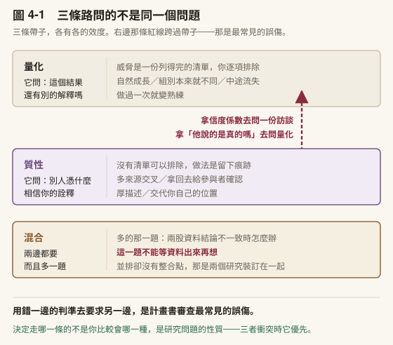
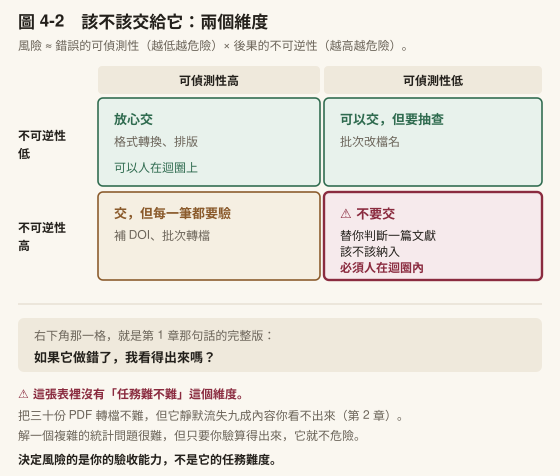
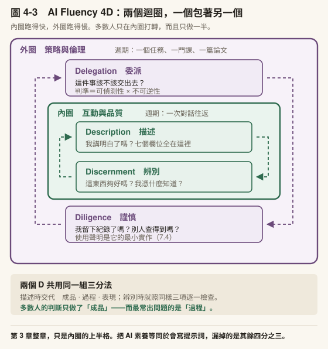
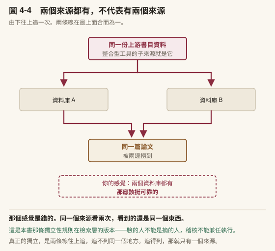
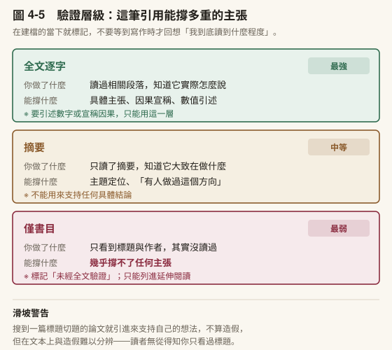
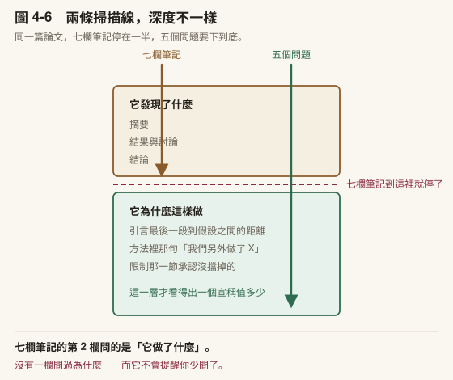
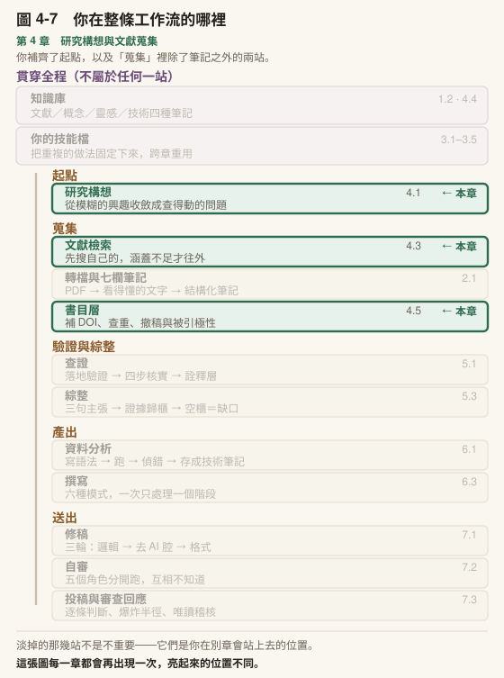

# 第 4 章　研究構想與文獻蒐集

## 本章導覽

**這一章回答七個問題**

1. 一個模糊的研究興趣，怎麼變成一個查得動的問題？
2. 量化、質性、混合方法怎麼選？為什麼三條路上的「效度」不是同一件事？
3. 你塞進對話的那些東西，關掉視窗之後去了哪裡？
4. 文獻工作真正的瓶頸在哪裡？哪些 AI 能解，哪些不能？
5. 怎麼把一篇 PDF 變成三年後的你還找得到、用得上的筆記？
6. 一篇論文可能觸發四種不同的筆記，怎麼分？
7. 跟我設計最像的那幾篇論文，除了它們發現什麼，我還該讀出什麼？

**讀完你能夠**

- **收斂**一個模糊的研究興趣成為可檢索、可判斷納入排除的研究問題
- **判斷**自己的研究問題落在哪一種取向，並說出該取向的效度要回答什麼
- **評估**一個研究構想的五個維度，並依分數帶決定下一步該推進、對抗還是補強
- **區分**專案記憶與知識記憶的分工，並說出各自壞掉會怎樣
- **重修**文獻筆記第 5 欄，讓它對準你剛收斂出來的研究問題（流程本身在 [2.1](../chapters/02-first-note.md#21-把一篇-pdf-變成一份筆記) 已教過）
- **區分**四種筆記的功能與時機
- **標定**一筆文獻的驗證層級，並據以判斷它能撐多重的主張
- **拆解**一篇論文的研究設計：說出它的假設從哪裡推出來、它擋掉了哪一個替代解釋、以及它自己承認做不到什麼

**需要多久**

自學閱讀約 90 分鐘｜課堂 3 小時（概念 95 分、實作 85 分）

**進來之前，你要能**

- 說出你那個技能檔在解決哪一個摩擦，而且**它已經有至少一條你事後加上去的規則**（[3.5](../chapters/03-skills.md#35-讓它長大)）。只建好、沒改過，等於還沒開始
- 描述對話變鈍的症狀，並說出三個應對分別什麼時候用（[3.3](../chapters/03-skills.md#33-為什麼你的對話會愈用愈鈍)）

**開始前請準備**：一篇你近期在讀的論文 PDF；一個你正在想或已經在做的研究題目。 4.6 另外會用到**一篇跟你的研究設計最像的論文**，可以跟前一篇是同一篇。[第 1 章](../chapters/01-setup.md)建好的 vault 與[第 2 章](../chapters/02-first-note.md)建好的筆記，本章後半會直接用。

---

## 章前導言

[第 3 章](../chapters/03-skills.md)你建了一個技能。但它現在還沒有真正的任務。

這一章給它第一個：**文獻**。

不過在讀任何一篇文獻之前，有一件更前面的事得先處理，而多數人會跳過它。你到底要查什麼。

跳過的後果不會馬上出現。你會開始讀，讀得很勤，每一篇都覺得有點相關。三週之後你有四十篇筆記，然後你發現一個尷尬的事實：**你說不出這四十篇裡哪幾篇是必要的**，因為你從一開始就沒有一個標準可以判斷。

一個模糊的興趣沒辦法變成搜尋詞，也沒辦法讓你決定一篇論文該不該讀。它讓你讀得多，不讓你讀得準。

所以本章的順序是：先把問題磨到查得動（4.1），再決定哪些事該交出去（4.2），然後才開始蒐集（4.3 到 4.5）。

**先講清楚本章的邊界。** 4.1 會教研究設計的取向（量化、質性、混合方法，以及它們各自的效度長什麼樣），因為那決定你接下來讀什麼；但它不教研究設計的執行。抽樣程序、倫理審查、量表編製、檢定力估算，那些是方法論課程與專門教科書的事，一本講工作流的書不該假裝能取代它們。而且 4.1 的材料是你的：工具負責把你已經有的東西問清楚，不是替你生一個研究題目出來。這個分別在那一節會再講一次，因為它正是這一節最容易被誤用的地方。

> **〔課堂〕開場 8 分鐘** 問全班一個問題，讓他們寫在紙上，不要說出來：**「用一句話寫下你的研究問題。」** 給九十秒。時間到之後不要收，也不要評論，只說一句：「等一下 4.1 結束我們再回來看這張紙。」多數人寫出來的是**題目**不是**問題**（例如「AI 與寫作教學」）。那個落差就是這一節的教學起點，但要讓他們自己發現，不要先講破。

---

## 4.1 從模糊的興趣到一個查得動的問題

### 興趣、題目、研究問題是三件事

多數人以為自己有研究問題，其實手上只有題目。

| | 長什麼樣 | 能拿它做什麼 |
|---|---|---|
| **興趣** | 「我對 AI 在教學上的應用有興趣」 | 幾乎什麼都做不了 |
| **題目** | 「生成式 AI 與大學寫作教學」 | 可以聊天，不能檢索、不能判斷該讀什麼 |
| **研究問題** | 「同儕回饋的結構化程度，如何影響大學生後續寫作表現？」 | 有變項、有對象、有可查的關鍵詞、可判斷一篇論文該不該讀 |

差別不在寫得長不長，在它有沒有把你可能會錯的地方講出來。

「AI 與寫作教學」這種說法沒有辦法錯，所以它也沒有辦法對。而一個研究問題必須要有可能是錯的。這正是它能指引你讀什麼的原因：任何一篇論文，你都可以問它「這篇有沒有回答我這個問題」，然後得到一個明確的是或否。

### 為什麼不能跳過這一步

跳過的代價會延後出現，而且會偽裝成別的問題：

- **你會讀得很多但收不了尾。** 沒有問題就沒有納入排除的判準，於是每一篇都「有點相關」。四十篇筆記全部有點相關，等於沒有一篇特別相關
- **你的搜尋詞會一直不對。** 你打「AI 寫作教學」，得到的是一片汪洋。可查的關鍵詞來自變項，而變項來自問題
- **AI 會順著你的模糊講下去。** 這是最麻煩的一項。你給它一個模糊的題目，它會產出一段讀起來很專業的文字。**那段文字的專業感是文體上的，不是內容上的**——它把模糊潤飾得更好看了，而不是變清楚了

第三項值得停一下。它是[第 1 章](../chapters/01-setup.md)那件事在這裡的具體版本：**它做的是接話，接得像不像跟對不對是兩回事**。你把一個沒有邊界的問題丟給它，它不會告訴你這個問題沒有邊界，它會給你一段有邊界感的文字。

### AI 在這一步幫得上什麼

分清楚兩件事：

| 幫得上 | 幫不上 |
|---|---|
| 當**反方**：指出你的問題預設了什麼、哪個詞沒有定義 | 告訴你這個領域現在缺什麼（那要讀文獻，本章後半才開始） |
| 產出**多個版本**讓你挑，比你自己在腦裡繞快 | 替你決定你在乎什麼 |
| 逼你把「結構化」「有效」這類詞說出操作定義 | 判斷這個問題值不值得做 |

**它最有用的用法是當反方，不是當顧問。** 顧問會給你答案，而你現在需要的不是答案，是有人指著你的句子問「這個詞你指的是什麼」。

[第 2 章](../chapters/02-first-note.md)的執行前追問（[2.4](../chapters/02-first-note.md#24-教育研究最常遇到的四種型態)）就是這個動作的通用版。這一節是它落在研究問題上的專用版。

它還有第三次出場，在你真的動筆寫論文的時候——那次問的不是「這件事要怎麼做」，是「這一段你要主張什麼」。做法在[第 6 章](../chapters/06-analysis-writing.md) [6.3](../chapters/06-analysis-writing.md#63-寫作模式鏈)。

### 一段可以直接貼的提示詞

```text
我要把一個研究興趣收斂成可以查、可以做的研究問題。
請當反方，不要順著我講。

我的興趣：〔一句話寫下來，模糊沒關係〕
我的處境：〔學位階段／可取得的對象／可用的時間〕

請依序做四件事：

1. 指出我這句話裡**沒有定義的詞**，逐一列出並問我指的是什麼
2. 指出我這句話**預設了什麼**而我可能沒意識到
3. 給我三個不同方向的具體版本，每個都要含：
   對象、變項、關係、可檢索的英文關鍵詞 3–5 個
4. 針對每一個版本，直接說出它**最可能做不下去的地方**
   （取樣困難？變項難測？時間不夠？）

規則：
- 不要幫我美化措辭。我要的是問題變清楚，不是句子變好看
- 如果我的興趣根本還不足以收斂，就直接說，並告訴我還缺什麼
- 不要引用任何文獻。這一步不需要，而且你給的我還沒能力查證
```

最後兩條規則各自防一件事。

**「不要美化措辭」**防的就是上面說的：把模糊潤飾成好看的模糊。

**「不要引用任何文獻」**防的是一個很常見的順序錯誤。在你還沒有能力判斷真假的時候就收下一批書目。那些書目會跟著你進到下一步，而你會忘記它們是在你沒有判斷力的時候進來的。文獻要等到本章後半，用你自己驗證得了的方式進來。

〔動手一下〕**5 分鐘**。把上面那段貼進去跑一次，然後只做一件事：把它問你的「沒有定義的詞」抄下來。多數人會發現自己的問題裡有兩到三個詞，講了半年但從來沒定義過。

### 四個檢查：你的問題磨好了嗎

不是問句就算研究問題。四個檢查，缺一個就退回去改：

1. **查得動嗎？** 你能不能從它直接寫出三到五個英文檢索詞。寫不出來，代表變項還沒浮現
2. **判得斷嗎？** 隨手拿一篇論文，你能不能一分鐘內判斷它該不該進你的文獻回顧。判不斷，代表範圍還沒收
3. **測得到嗎？** 句子裡每一個關鍵詞，你說得出它怎麼被觀察或測量嗎（先不管你做不做得到，先問測不測得到）
4. **有人在乎嗎？** 假設你得到了明確的答案，那個答案會改變誰的什麼決定

第 4 個檢查最常被略過，也最痛。一個查得動、判得斷、測得到但沒有人在乎的問題，是可以順利完成的研究，而那是最糟的一種結果。你會做完，然後發現沒有人需要它。

⚠️ **這四個檢查你自己做，不要交給 AI。** 前三個它可以幫你檢查，第四個它幫不上：它不知道你的領域現在在爭論什麼，它只知道過去的文字裡有什麼。第 4 個檢查的答案要等你讀完文獻才會真正清楚。所以這一節你會在本章後半跑完之後回來再做一次。

〔補充〕**變項定義是整個研究裡最貴的一個決策。** 兩個來自實際研究的教訓。第一個：某個專案裡有一個構念，AI 把它誤判為名字相近但理論根基完全不同的另一個變項。研究者順著那個誤判選了配套理論、跑完整套檢定，等到發現的時候，整條推導鏈全數作廢。第二個：資料裡有一個類別變項，AI 把它的標籤當成學術概念來詮釋——但那個標籤只是編碼時取的名字，跟它被解讀成的那個社會科學概念完全不是同一件事。等到結論寫出來才回頭核對，發現那個概念從來不存在於原始資料裡。兩個案例的共同教訓：**上游定義錯了，下游所有分析都是廢品，而且跑的時候不會報錯。** 這就是為什麼上面四個檢查的第 3 題（測得到嗎）不能跳過——它逼你說出每個詞怎麼被觀察，而說不出來的時候就是定義還沒定下來。

### 第一個岔路：你要走哪一種研究

問題磨清楚之後，馬上會撞到一個岔路，而且**它決定你接下來讀什麼、怎麼讀**。走錯這一步，後面的文獻工作全部要重來，所以它屬於動筆之前，不屬於方法課。

研究設計的標準分法是三條路：

| 取向 | 你想做的事 | 產出長什麼樣 |
|---|---|---|
| **量化** | 檢驗理論、比較組別、找變項之間的關係 | 「這個關係存不存在、有多強」 |
| **質性** | 探索意義、理解經驗、**建立**而不是檢驗理論 | 「這件事是怎麼發生的、對當事人是什麼」 |
| **混合方法** | 兩者都要，而且說得出為什麼兩者都要 | 一股資料解釋另一股，或兩股互相對照 |

決定走哪一條的**不是你比較會哪一種**。標準的判準有三個：研究問題的性質、你自己的訓練與經驗、你想說服的讀者。三者衝突時，第一個優先。你的問題問的是「有沒有影響」，那它就是量化的問題，不會因為你比較擅長訪談而改變。

〔補充〕混合方法有三種核心設計，別混著講。（一）**先量後質**：量化跑完，挑特定的人去訪談，用質性解釋量化為什麼長那樣。（二）先質後量：質性先探索，據此開發工具或假設，再用量化檢驗。量表開發常走這條。（三）同時並行：兩股同時蒐集，最後對照整合。這三種寫進計畫書時要附一張程序圖，圖上要標清楚兩股資料誰主誰次（慣例是主要的那股寫大寫 QUAN／QUAL，次要的寫小寫）以及整合點在哪裡。兩條線並排畫著卻沒有整合點，那不是混合方法，那是兩個研究裝訂在一起。

再往下一層，是你相信什麼算證據。

同一個教育現象，有人覺得要先有可測量的變項才談得上研究，有人覺得意義是參與者建構出來的、測量會把它壓扁。這一層通常叫世界觀，常見的分法有四種：

| 世界觀 | 大致主張 | 典型走向 |
|---|---|---|
| **後實證主義** | 有客觀規律，但我們只能逼近、不能確證 | 量化 |
| **建構主義** | 意義由參與者在情境中建構，研究者要去理解 | 質性 |
| **轉化型** | 研究要處理權力與不平等，帶行動議程 | 質性或混合，含弱勢群體 |
| **實用主義** | 什麼方法能回答問題就用什麼 | 混合方法 |

上面的三取向與這四種世界觀，出自 Creswell 與 Creswell《Research Design》第五版（2018）。那本書的核心命題是一條乘式：**研究取向＝世界觀 × 研究設計 × 研究方法**。你選的方法不是憑空來的，它掛在你對「什麼算證據」的假設上。

這裡要照本書自己的規矩交代一件事：我引用的是這個框架的**結構**，不是書裡的任何一段文字，而且我沒有逐頁讀過那本書。所以這一段撐得住的主張只到「這個分類是這麼分的」，撐不住「Creswell 在第幾頁怎麼論證」。要用到後者，請自己去讀那一章。這正是本章 4.5 要講的驗證層級，作者自己也一樣受它管。

你不必挑一個標籤貼在自己身上。這一層真正的用處是：當你的指導教授或審查者說「你這個研究不夠嚴謹」，他講的嚴謹，跟你想的可能不是同一件事。

最容易出事的是效度。三條路上的「效度」不是同一個東西。



〔圖 4-1〕三條帶子各有各的效度。**要看的是右邊那條跨過帶子的紅線**—— 它兩端都有箭頭，因為兩個方向的誤傷一樣常見。

- **量化端**問的是「這個結果還有沒有別的解釋」。威脅有名字：受試者在期間自然成長、組別本來就不同、中途流失的人剛好不是隨機的、測驗做過一次就變熟練。這些威脅是**列得完的清單**，你逐項排除
- **質性端**問的不是這個。它問「別人憑什麼相信你的詮釋」，做法是**留下痕跡**：多來源交叉比對、把詮釋拿回去給參與者確認、寫出足夠厚的描述讓讀者自己判斷、主動交代研究者自己的位置
- **混合方法兩邊都要**，而且要多回答一題：兩股資料結論不一致時你怎麼辦。**這一題不能等資料出來再想**

圖上那條紅線就是這件事：**用錯一邊的判準去要求另一邊**，兩個方向都會發生。

### 這個構想值不值得做：五個維度與三個對手

上一段決定你走哪條路，這一段決定你要不要走。

我自己在用的構想評估工具有五個維度，每個 1 到 5 分，滿分 25：

| 維度 | 它在問什麼 |
|---|---|
| **理論缺口清晰度** | 你說得出「現有研究到哪裡、你補哪一塊」，還是只說得出「這個題目很重要」 |
| **方法設計嚴謹度** | 你的設計真的回答得了你的問題嗎 |
| **樣本可行性** | 你拿得到那些人嗎、拿得到幾個、要多久 |
| **測量嚴謹度** | 你的關鍵構念用什麼測、那個工具的證據在哪 |
| **實務貢獻清晰度** | 答案出來會改變誰的什麼決定 |

分數本身沒那麼重要，**分數帶對應的動作才重要**：

| 總分 | 該做什麼 |
|---|---|
| 21–25 | 直接推進，沒有辯論的必要 |
| **15–20** | **這是模糊帶，評分在這一段沒有鑑別力**。要換一種方式重看 |
| 12–14 | 弱點明確而且有救，走補強 |
| 12 以下 | 補強救不了定位錯誤，回到缺口重新定位 |

15 到 20 分那一格是重點。分數落在這裡，代表**再打一次分數不會得到新資訊**。這時要換成對抗：

1. **樂觀方**：假設一切順利，這個構想最好可以走到哪裡。**先跑這個是刻意的**，否則你會在還沒看見上限之前就把它否決掉
2. **懷疑方**：專找致命傷，五類逐一過——構念站不住、設計答非所問、樣本拿不到、測量撐不起、貢獻說不清
3. **審查者**：扮演你目標期刊最難搞的那一位，寫出他會寫的意見

三個角色要**分開跑**，理由跟[第 2 章](../chapters/02-first-note.md)講的一樣：同一次對話裡，它記得自己剛才誇過這個構想，於是質疑會客氣。

兩條硬規則，缺一個這件事就會走偏：

**第一，這個工具不得宣告任何構想「不值得做」。** 低分只能說成「以這個框架衡量偏弱，弱在哪一項」。差別不是措辭客氣。框架本身有適用範圍，一個紮實的質性研究拿去套「測量嚴謹度」，分數必然難看，而那是框架的問題，不是研究的問題。

**第二，懷疑方與審查者的輸出是模擬意見，不是判決。** 它模擬的是「一個審查者可能會說什麼」，它沒有讀過你的領域今年吵什麼。

還有一件事比上面兩條都重要：**評估跑完，要停下來讓你自己決定。** 我的版本在兩個位置強制停：評分出來之後停一次（要不要進對抗），對抗跑完再停一次（放棄、改進、還是照原樣推進）。停下來的時候它給推薦與理由，但要拿到你一句明確的回覆才往下走。

這兩個停點的位置不是隨便設的，判準就是[第 1 章](../chapters/01-setup.md)那一條：**做下去很難回頭的那一步之前**。放棄一個構想很難回頭，所以那裡要有一個關卡。

〔動手一下〕**10 分鐘**。拿你手上那個構想，只跑五維度評分，跑完先不要做任何事，只看最低的那一項。多數人會發現最低的是「實務貢獻清晰度」或「測量嚴謹度」，而這兩項恰好是四個檢查裡第 3、第 4 個檢查的延伸。

### 這一節的邊界

**這一節教研究設計的取向，不教研究設計的執行。** 取向、世界觀、效度的三種問法、構想評估。這些決定你接下來讀什麼、怎麼判斷該不該讀，所以它們在這本書裡。抽樣程序、倫理審查送件、量表選用與編製、統計檢定力估算，是方法論課程與專門教科書的內容，本書不取代它們。

**而且這一節的材料是你的。** 工具負責指出你哪裡含糊、幫你看見沒選的那幾條路，不負責替你決定你在乎什麼。如果你把它當成生成器，它會給你一個聽起來很像研究問題的東西，而你會拿著它走很遠，直到某一天有人問你「所以你的依變項是什麼」。

> **〔課堂〕4.1 講述 20 分鐘＋現場演練 20 分鐘** 建議節奏：三件事的區分（5 分）→ 為什麼不能跳過（5 分）→ 反方提示詞現場示範（10 分） → 學生自己跑一次（15 分）→ 取向岔路與三種效度（10 分）→ 五維度與對抗（5 分） → 學生跑一次五維度評分（5 分）。 **講述已由 35 分壓到 20 分**，讓出的 15 分給 4.6。壓法就是原本建議的那一條：取向那一段改為指定閱讀，課堂只講「三種效度不是同一件事」那一塊—— 修過方法課的學生本來就會。 **反方演練與五維度評分兩個動手段落不要砍**，它們是這一節唯一會留下產出的部分。 **現場示範務必用一個真的很模糊的興趣**，最好是當場跟學生要一個。用你自己準備好的漂亮例子，示範不出這一節最重要的東西。**模糊被潤飾的那一刻長什麼樣**。演練結束後，讓學生拿出開場寫的那張紙，比對前後。**那個對比就是這一節的驗收。** 會有學生說「它給的版本我都不喜歡」。那通常是好事，代表他心裡其實有方向，只是還沒說出來。請他說出「為什麼不喜歡」，那句話往往就是他真正的研究問題。

### 帶走這一節

- **興趣、題目、研究問題是三件事**，多數人手上的是題目
- 一個研究問題必須**有可能是錯的**，那正是它能指引你讀什麼的原因
- AI 在這一步最有用的角色是**反方**，不是顧問
- 最該防的失敗是**模糊被潤飾成好看的模糊**，它讀起來會像進步
- 四個檢查：查得動、判得斷、測得到、有人在乎。**第四個要等讀完文獻再回來做一次**
- 取向（量化／質性／混合）由**問題的性質**決定，不由你比較會哪一種決定
- **三條路上的「效度」不是同一個東西**：量化排除別的解釋，質性留下痕跡，混合要多回答「兩股不一致怎麼辦」
- 構想評估的五維度分數不重要，**分數帶對應的動作才重要**；15–20 分代表評分沒有鑑別力，要換成對抗
- 對抗的三個角色要**分開跑**，而且它產出的是模擬意見，不是判決
- 這一節教研究設計的**取向**，不教研究設計的**執行**

---

## 4.2 該不該交給它

上一節你磨出了一個問題、判斷了取向、評估了構想。接下來每一步都會遇到同一件事： **這一段，我自己做還是交出去？**

這一節給你三樣東西：一個判準、一個框架、一個習慣。

### 判準：兩個維度，跟難度無關

> **風險 ≈ 錯誤的可偵測性（越低越危險）× 後果的不可逆性（越高越危險）**

⚠️ **注意這個判準裡沒有「任務難不難」。** 難的任務不見得危險，簡單的任務也可能很危險。

| | 可偵測性高 | 可偵測性低 |
|---|---|---|
| **不可逆性低** | 放心交（格式轉換、排版） | 可以交，但要抽查（批次改檔名） |
| **不可逆性高** | 交，但每一筆都要驗（補 DOI） | ⚠️ **不要交**（替你判斷一篇文獻該不該納入） |



〔圖 4-2〕兩條軸，四格，而它們的處置方式完全不同。圖上多標了一個東西：左上角那格可以**人在迴圈上**（它自己跑，你監看），右下角那格必須**人在迴圈內**（每一步你都要在場）。這兩個術語在本節後面會再出現。

右下角那一格就是[第 1 章](../chapters/01-setup.md)那句話的完整版：

> **如果它做錯了，我看得出來嗎？**

〔補充〕**為什麼難度不在判準裡。** 「幫我把三十份 PDF 轉檔」很難嗎？不難，但它出錯（靜默流失 98% 的內容）你看不出來。[第 2 章](../chapters/02-first-note.md)講過那個實例。反過來，「幫我解一個複雜的統計問題」很難，但如果你有能力驗算，它就不危險。決定風險的是你的驗收能力，不是它的任務難度。

### 框架：四個 D

判準管單次決定。你還需要一個更上位的東西，因為**「會用 AI」不等於「會寫提示詞」**。

AI Fluency 框架把這件事拆成四個能力（Dakan 與 Feller 提出，與 Anthropic 合作發展）：

| 能力 | 一句話 | 在問什麼 |
|---|---|---|
| **Delegation**（委派） | 判斷什麼該交給 AI、什麼該自己做 | 這件事該不該交出去？ |
| **Description**（描述） | 把任務說清楚 | 我講明白了嗎？ |
| **Discernment**（辨別） | 用學科標準評估它的產出 | 這東西夠好嗎？我怎麼知道？ |
| **Diligence**（謹慎） | 揭露、查證、保護、承擔責任 | 我留下紀錄了嗎？該說的說了嗎？ |

**這四個中文詞是說明，不是定譯。** 該框架目前只有英文版，沒有官方中文翻譯；本書用的四個詞取自中文圈已在流通的說法，正式場合引述時寫英文原詞比較安全。

**[第 3 章](../chapters/03-skills.md)整章，只是 Description 這一個 D。**

### 一個對稱，它比四個名詞有用得多

四個 D 各有子成分，而其中兩個 D **用的是同一組三分法**：

| | 三個子成分 |
|---|---|
| **Description** | 成品（Product）／過程（Process）／表現（Performance） |
| **Discernment** | 成品／過程／表現 |

[第 3 章](../chapters/03-skills.md)的七元素，後三個正是 Description 的這三個子成分。

而這個對稱給了你一個很實用的操作：

> **你描述時交代了成品、過程、表現，判斷時就照同樣三項逐一檢查。**

- **成品**：它給的東西，形狀對不對？（欄位齊嗎、長度對嗎、格式合規嗎）
- **過程**：它走的路對不對？（有沒有跳步驟、有沒有在該問我的時候沒問）
- **表現**：它的姿態對不對？（我要的是挑毛病，它卻在稱讚）

多數人的判斷只做了第一項。**而最常出問題的是第二項**—— 產出看起來沒問題，但它是用一條你不會接受的路徑得到的。



〔圖 4-3〕四個 D 分成兩個迴圈，各自的節奏不同。

**策略與倫理迴圈（Delegation ↔ Diligence）** 跑得慢，週期是一個任務、一門課、一篇論文。它在問「這件事該不該做、做了要不要說」。

**互動與品質迴圈（Description ↔ Discernment）** 跑得快，週期是一次對話往返。你描述、它產出、你辨別、你重新描述。

多數人只在裡面那一圈打轉，而且只做一半（只描述，不辨別）。外面那一圈根本沒有啟動。

### 這件事在文獻裡的位置

委派判斷不只是本書的提法，它有人在做系統性的研究。不過取向不同，值得知道差在哪。

有一支研究從系統理論切入，關心的是**人怎麼保持對 AI 系統的控制** （Te'eni et al., 2025）。它用了兩個既有的術語，本書直接沿用：

| 術語 | 意思 |
|---|---|
| **人在迴圈內**（human-in-the-loop） | 每一步都要你參與或確認 |
| **人在迴圈上**（human-on-the-loop） | 它自己跑，你監看，必要時介入 |

**它們不是誰比較好，是對應不同的情況。** 對照上面那張判準表：右下角那一格要人在迴圈內，左上角那一格可以人在迴圈上。

而該研究有一個提醒值得帶走，它跟本書的判準是不同的角度：

> **你可以讓它自己跑，但如果你不能決定「什麼時候該停下來重新設定」，你就已經失去控制了。**

換句話說，除了「這一步該不該交」，還要問**「我還握著喊停的權力嗎」**。

〔補充〕**該研究的場景與本書不同，轉用時要節制。** 它處理的是關鍵決策系統與大量資料，談的是多層次的控制迴路怎麼設計。那一層不轉移到單一研究者身上，本書只取上面兩個術語與那一句提醒。（出處與驗證層級見〈延伸資源〉。）

### 習慣：開跑之前先追問

判準與框架都是拿來想的。這一個是拿來做的，而且它只有一句話。

在任何比較費工的任務開始之前，加一句：

> 開始之前，先列出你需要我確認的關鍵決策，每一項附上你的建議答案。

「附上你的建議答案」這半句很重要。少了它，你會收到一串開放式問題，還得自己一題題想。有了它，你多數時候只要回「二、三照你說的，第一項改成⋯⋯」就結束了。

這句話問出來的東西通常分三類：

1. **你以為已經講清楚的**（實際上沒有）
2. **你根本沒想過的**（這一類最有價值）
3. **你不在意的**（回一句「你決定」就好）

**判準**：這個任務做錯了，我要重做多久？超過十分鐘就值得先問。

同一個動作，在動筆的時候還要再用一次，但問的東西換了：那裡問的不是「你要我怎麼做」，是「你要主張什麼」。連上限也一樣適用——六到八輪就停（[第 6 章](../chapters/06-analysis-writing.md) [6.3](../chapters/06-analysis-writing.md#63-寫作模式鏈)）。

⚠️ 短任務不要用。問一個定義、改一句話、查一個格式，多問三題只是浪費。

〔補充〕**這個動作長大之後的樣子。** 它可以再多做三件事：（一）**分清楚是哪一種「不知道」**。你已經講過的不要再問；風格類的問不出來，要改成先做一個小樣本讓你看；**你不知道自己不知道的**，要換成「盲點掃描」，先讓它列出這個領域的關鍵概念、品質標準、新手常犯的錯，**以及你接下來該問什麼**。（二）**架構優先**：先問會改變整個做法的題，再問參數。（三）**追問要有上限**，六到八輪就停。關卡太密會被習慣性略過，那比沒有關卡更糟。

〔教你的 Claude 建這個〕**把追問變成預設。** 貼這段：「請把下面這條加進你的預設行為：**任何我交代的任務，若你估計做錯要重做超過十分鐘，就先列出你需要我確認的關鍵決策，每一項附上你的建議答案，等我回覆再開始。** 規則：（一）**不要問我已經在指令裡講過的事**；（二）最多問六題；（三）**如果我的前提本身有問題（樣本數不夠、方法配不上問題），在追問時就講，不要等做完才講。**」 ⚠️ 第三條最容易被略過，而它擋掉的是最貴的那一種浪費。

### 自評清單

一次協作結束後，四個問題。每一題都要求具體答案，答不出具體內容就等於沒做。

| D | 問自己 | 不合格的答案長這樣 |
|---|---|---|
| Delegation | 我交出去的是哪一段？我保留的判斷是什麼？為什麼是這樣切？ | 「就一起做啊」 |
| Description | 我提供了哪些它猜不到的條件？漏掉哪些？ | 「我講得很清楚了」 |
| Discernment | 我用什麼標準檢查？**成品、過程、表現各檢查了嗎？** | 「看起來沒問題」 |
| Diligence | 我留下什麼紀錄？該揭露的揭露了嗎？ | 「應該不用寫吧」 |

這張表**本書自行設計，未沿用官方版本**。它跟勾選式清單的差別在於：每一格都要你寫出具體內容，寫不出來就代表那一項沒做。

### 帶走這一節

- 判準只有兩個維度：**可偵測性 × 不可逆性**，**跟任務難度無關**
- 決定風險的是**你的驗收能力**，不是它的任務難度
- 4D 裡，**Description 與 Discernment 共用同一組三分法**（成品／過程／表現）
- **多數人的判斷只做了「成品」那一項**，而最常出問題的是「過程」
- **人在迴圈內／人在迴圈上**不是誰好，是對應不同格子
- 除了「這一步該不該交」，還要問**「我還握著喊停的權力嗎」**
- 開跑前追問的關鍵句：**每一項附上你的建議答案**

---
---

## 4.3 文獻工作的三個瓶頸

在給任何工具之前，先把問題拆開。不然這一章會變成工具介紹，而工具介紹是全世界最容易過期的東西。

文獻工作卡住的地方其實有三個，它們常常被混為一談：

| 瓶頸 | 症狀 | AI 幫得上嗎 |
|---|---|---|
| **量**：讀不完 | 該讀的永遠比讀得完的多 | **幫得上**：篩選、轉檔、摘要 |
| **存取**：記不住、找不到 | 三個月前讀過的論文，要用時得整篇重讀 | **幫得上**，但前提是筆記結構化（承 4.2 的知識記憶） |
| **收斂**：寫不出論點 | 筆記四十篇，論證零句 | **幫不上** |

多數人把這三件事當成同一個問題，於是期待一個工具解決全部，然後失望。

**本章解前兩個。**

第三個要講清楚：它不是勤奮問題，也不是工具問題。你讀得再多、筆記再整齊，都不會自動長出一個論點，因為筆記的組織單位是「一篇論文」，而論證的組織單位是「一個主張」。這是兩種不同的切分方式。[第 5 章](../chapters/05-verification.md) [5.3](../chapters/05-verification.md#53-從二十篇筆記到一個論點) 就處理它。

先把這件事說在前面，是為了避免一種常見的挫折：學會了本章的所有東西，文獻管理變得很順，然後發現自己還是寫不出來，於是以為是自己的問題。**不是。那是[第 5 章](../chapters/05-verification.md)的問題。**

### 先搜自己的，再往外搜

檢索有一個順序問題，而多數人直接跳過它：你手上已經有的東西，先搜過了嗎？

順序是這樣：

1. **你自己的筆記，以及已經下載下來的全文**
2. **你的書目庫**
3. ——以上兩層涵蓋不足，才往外部資料庫走——

「涵蓋不足」不是感覺，它有判準。下面任何一條成立就可以往外：

- 本機命中 0 筆
- 命中了，但那幾筆**全部標著「未經全文驗證」**（4.5 的驗證層級）
- 命中了，但年份、樣本脈絡或子主題**明顯不覆蓋**你現在這個問題

這個順序不是為了省時間。真正的理由是：本機那些你讀過，外部那些你沒有。一份把兩者混在一起、又沒有分開標記的清單，你三天後會分不出哪幾筆是自己確認過的，於是只好整份重查一遍。那才是真的浪費時間。

〔補充〕**如果你讓它代跑這一段，加一條規則：往外搜之前先跟我講，並且把檢索式寫出來。** 這一條的價值不在管住它，在於檢索式寫出來，你才看得到它把你的問題翻譯成了什麼。那句翻譯常常跟你想的不一樣，而你不看就永遠不會知道。

**三種工具，性質完全不同，不要混用**

| 性質 | 它能做什麼 | 它不能做什麼 |
|---|---|---|
| **檢索** | 用關鍵字找出有哪些文獻 | — |
| **取件** | 把**已知的**識別碼換成全文檔案 | **不能拿來找文獻**，它根本沒有檢索能力 |
| **加值** | 對**已經在手上的**文獻補判斷資訊（被引情況、有沒有被撤稿） | 同上，它只處理你給它的那一批 |

⚠️ 最常見的誤用是**把取件工具當搜尋工具**。你丟一個主題進去，它回你空白—— 那不是「沒有這個主題的文獻」，那是**你用錯工具了**。這是下面第五條的一個特例，而且是最容易發生的那一種。

### 檢索是一個工序，它有自己的規矩

「量」這個瓶頸的第一步是**找得到**。這一步看起來很單純——打關鍵詞、看結果—— 但它有幾條規矩，不知道的話你會得到一份看起來很豐富、實際上撐不住的清單。

第一，取用有硬界線，而且是誠信層的界線。

三條，沒有例外：

1. **只取合法免費的全文**：完全開放取用的期刊、作者放在機構典藏的版本、預印本，或你自己透過學校訂閱與圖書館合法取得的檔案
2. **不繞過付費牆、不用侵權的下載管道**。付費牆的文章**只記書目**供你人工查證，不建檔案
3. **不大量自動抓取受著作權保護的全文**

⚠️ 這三條是界線不是偏好。它們跟[第 7 章](../chapters/07-revision-integrity.md)的誠信框架是同一件事：你的參考文獻清單怎麼來的，也是研究誠信的一部分。

第二，「拿不到」有兩種，意思完全不同。

這是本節最容易搞錯的一件事。

| 標記 | 它真正的意思 | 它**不**是什麼意思 |
|---|---|---|
| **付費牆** | **一般大眾**無法免費取得 | 不代表**你**拿不到——你有機構訂閱 |
| **工具抓不到** | 這次沒抓成 | **不代表這篇沒有全文** |

第二列尤其要小心。取件工具失敗最常見的原因是**你不在學校的網路裡**（要連 VPN），那跟「這篇沒有全文」是完全不同的兩件事。**把工具失敗回報成「沒有全文」，會讓你錯過一篇其實讀得到的論文。**

這是[第 1 章](../chapters/01-setup.md)那條線索的又一個版本：工具的限制，很容易偽裝成資料不存在。

第三，一份合格的檢索結果清單，每一筆都要標三件事。

| 欄位 | 為什麼要有 |
|---|---|
| **來源** | 這一筆是從哪個資料庫來的。沒有這一欄，你三天後就分不出哪些是你原本就有的 |
| **DOI** | 沒有 DOI 的要標出來並降權——**沒有持久識別碼的東西，不該進正式的參考文獻** |
| **本機狀態** | 新的？你的書目庫已經有了？⚠️ 已經有的**仍然要列出來並標記**，不要靜默剔除 |

最後那一條的理由不明顯：**你可能想知道外部有沒有更新的版本**—— 你庫裡那筆是預印本，而它已經正式出版了。靜默剔除會讓你永遠不知道。

第四，也是最重要的一條：重複命中不是獨立佐證。

跨多個資料庫搜尋的時候，同一篇被兩邊撈到是常態。



〔圖 4-4〕**由下往上追一次。** 兩條看起來獨立的線，在最上面合而為一。

機制很具體：多數整合型檢索工具的子來源**本來就包含**那幾個大型書目資料庫，而其中一個的書目**又源自**另一個。（這條獨立性規則前面已經出現三次：[第 5 章](../chapters/05-verification.md)的驗的人不能是摘的人、[第 7 章](../chapters/07-revision-integrity.md)的五角色分開跑、[第 7 章](../chapters/07-revision-integrity.md)的稽核不能兼任執行。）

〔補充〕**被引數不能跨資料庫比。** 不同資料庫的被引數計算基礎不同—— 收錄哪些期刊、算不算會議論文、算不算預印本，各家規則不一樣。所以同一份清單只用同一個來源的被引數；真的要混用，**每一筆都要標出處**。還有一種常見狀況：某些資料庫**根本不提供被引數**，那一欄要寫「不適用」，不可以從別的地方猜一個填進去。

第五條：「查了沒找到」跟「查不到」是兩件事。

這一條要用在你自己身上，也要用在工具給你的回報上。

| 說法 | 意思 |
|---|---|
| **查了沒找到** | 工具正常運作，這個東西**確實不在那個資料庫裡** |
| **查不到** | 工具壞了、金鑰過期、額度用完、你不在校網 —— **這個東西在不在，你根本還不知道** |

這兩句對你的下一步影響完全相反。前者代表你可以往下走（也許改個關鍵詞、也許這就是個研究缺口）；後者代表**你什麼都還沒查**。

而它們最麻煩的地方是：壞掉的工具通常回傳空白，而空白看起來就像「沒有」。

所以有一條規矩值得寫在你的流程裡：**任何一次搜尋結果為空，先懷疑工具，再懷疑資料不存在。** 換一個工具、換一種查法複驗過，才可以下「文獻庫裡沒有這個主題」這種**負向斷言**。

負向斷言在研究裡的份量比你以為的重。「這個領域沒有人做過」是很多論文的立論起點。如果它其實是一次失敗的搜尋，你整篇的缺口論證就是空的。

〔補充〕**一個真實案例，說明「空白」多會騙人。** 有一類書目工具在查不到東西的時候，會自動改用別的方式再查一次。而這種退回有兩種，意思剛好相反，開頭的訊息卻一模一樣：一種是退回全文檢索，回給你的是**真實的題名**。工具正常，你要找的那筆確實不在庫裡；另一種是退回語意檢索，回給你的是**一批沒有標題、沒有作者的空項目**—— 那代表索引壞了，**你其實什麼都還沒查到**。

有人沒分辨這兩種，把一批「早就在庫裡」的文獻整批標成「尚未收錄」，照著清單逐筆匯入，結果造出一整批重複條目。教訓不是「那個工具不好」，而是： **當一個工具用同一句話講兩件相反的事，你就不能只看它的結論，必須看它回傳的內容。**

〔動手一下〕**5 分鐘**。拿你最近一次做的文獻檢索結果，只問一件事： **你分得出哪幾筆是同一篇被不同來源重複撈到的嗎？** 分不出來的話，你那份清單的「數量」是虛的。

### 帶走這一節

- 文獻工作有三個瓶頸：**量、存取、收斂**
- AI 幫得上前兩個，**第三個幫不上**
- 收斂不是勤奮問題，是筆記與論證的組織單位根本不同（[第 5 章](../chapters/05-verification.md) [5.3](../chapters/05-verification.md#53-從二十篇筆記到一個論點)）
- **順序：先搜自己的筆記與書目庫，涵蓋不足才往外**——理由是本機那些你讀過，外部那些你沒有
- **檢索、取件、加值是三種不同性質的工具**；⚠️ 把取件工具當搜尋工具，回你的空白會被誤讀成「沒有這個主題」
- 取用有三條硬界線：**只取合法免費全文、不繞過付費牆、不大量自動抓取**
- **「付費牆」不等於你拿不到；「工具抓不到」不等於這篇沒有全文**
- **重複命中不是獨立佐證**——多數整合型工具的子來源本來就重疊
- **「查了沒找到」≠「查不到」**。搜尋結果為空，先懷疑工具，再懷疑資料不存在——尤其在你要寫「這個領域沒有人做過」之前

〔補充〕還有兩種情境不走這一節的流程。（一）**系統性回顧或範疇回顧**：它的要求不是「讀得快」，是檢索過程可重現。你得留下檢索式、資料庫、日期、去重規則與納入排除的每一筆判定。工具能幫的是跨庫檢索、去重與整理成可篩選的清單，幫不了的是納入排除判準，那必須你自己訂並且事先寫死。（二）要啃一整本英文專書：逐段中英對照比全文翻譯可靠得多，因為你隨時看得到原文那一句長什麼樣；全文翻譯會讓你在不知不覺中接受譯者的詮釋。兩種情境都不是「更進階的版本」，它們是不同的工作，用這一節的流程去做只會做壞。

---
---

## 4.4 四種筆記：一篇論文可能觸發什麼

讀一篇論文不只會產生一種需求。同一篇東西，可能讓你想記下它說了什麼、想通一個概念、冒出一個研究點子，或學到一個以後想重現的做法。這四件事應該存成四種不同的筆記。

| 筆記類型 | 核心問題 | 什麼時候寫 |
|---|---|---|
| **文獻筆記** | 這篇論文說了什麼？ | 讀完每一篇之後 |
| **概念筆記** | 這個概念，**我**的理解是什麼？ | 想通一件事之後 |
| **靈感筆記** | 這觸發了什麼研究想法？ | 讀到一半冒出念頭時 |
| **技術筆記** | 這個方法我以後怎麼重現？ | 學到新做法之後 |

**判準一句話：問題不同，筆記就不同。** 這四種不是四個資料夾，是四個問題。

### 為什麼一定要分

最常見的失敗是全部寫成文獻筆記。

那樣做的結果是：知識庫變成一堆摘要。而摘要是**別人的話**。三年後你翻出四十篇摘要，還是得重新想一次「所以這些東西合起來說明了什麼」，因為當初你從來沒有想過那一步，你只是把論文濃縮了。

**概念筆記之所以關鍵，是因為它逼你用自己的話講一次。** 而「用自己的話講一次」正好是判斷自己懂不懂的唯一可靠測試。你能複製貼上一句話，不代表你懂它；你能不看原文把它重講一遍，才代表你懂。

這也是它跟 AI 的分工線。AI 可以幫你產出很好的文獻筆記，因為那是**濃縮**；它產不出你的概念筆記，因為那是你的理解。它可以陪你把想法問清楚，但那句話必須由你寫下來。

回頭看圖 4-2 那兩條軸：**文獻筆記做錯了你看得出來**（對照原文就知道），而概念筆記做錯了沒有人看得出來——因為只有你知道你原本想講什麼。四種筆記裡只有這一種落在那張圖的右上格。

一個有名字的失敗模式：把想法寫進來源筆記裡

四種筆記最常見的崩壞方式，不是少寫哪一種，是**把它們寫成同一種**：你讀到一篇論文，冒出一個很好的想法，於是順手寫在那篇的文獻筆記底下。

**那個想法從此只屬於那一篇。** 它不會出現在別的地方，因為你的想法通常橫跨好幾篇—— 但你把它綁在其中一篇的檔案裡，日後你只有在重讀那一篇的時候才會遇到它。

判準很簡單：

> **這句話是「那篇論文說的」，還是「我想到的」？**

前者留在文獻筆記，後者**另開一則概念筆記，再連回來**。多花的成本是三十秒；省下的是「一個想法被埋在某篇筆記的第四段」。

### 概念筆記為什麼最難外包

四種筆記裡，文獻筆記可以大量委派（流程就是在做這件事），概念筆記幾乎不行。差別在一句話：

> **概念筆記的價值，在於它是用你自己的話寫的。**

一份抄錄原文的概念筆記，功能上等於文獻筆記的副本。你三個月後回去看，看到的還是作者的措辭，而不是**你當時想通了什麼**。

所以我自己那個產概念筆記的工具，模板第一欄的指示不是「摘要這個概念」，是「用自己的話解釋，三到五句，體現個人理解而非抄錄原文」。而且欄位順序是刻意的：先寫定義，再寫「為什麼重要、跟哪些概念有關」，最後才寫來源。**來源放最後**，因為一旦先貼原文，後面那兩欄就會被原文的語言帶著走。

判斷一則概念筆記合不合格，有一個很快的測法：**把來源那一欄遮起來，這則筆記還讀得懂嗎？** 讀不懂，代表你寫的是摘要不是理解。


**靈感筆記**處理的是一種特定的損失：讀到一半冒出來的念頭，如果沒有當場記，十分鐘後就沒了，而且你不會知道自己失去過它。它的重點不是寫得完整，是寫下觸發情境（我當時在讀什麼、想到什麼）加上第一步行動。沒有第一步行動的靈感筆記，日後翻到只會困惑。

**技術筆記**處理的是重現問題。你花三小時搞懂一個分析步驟，三個月後要再做一次，如果沒記，三小時要再花一次。它的重點是可執行：照著做能跑出來，而不是「大概是這樣做」。

這兩種在課堂上比較不容易練，因為它們依賴真實情境的觸發。但書要寫完整，因為你日後一定會遇到。

### 有一件事可以交出去：找回關聯

上一節說概念筆記不能外包。這一節講它的**例外邊界**，因為有一種做法值得知道。

做法是這樣：**把你的全文檔案放進一個資料夾當原料**，配一份說明你要什麼結構的指示檔，然後讓它把整批讀過一遍，自動生出一批概念頁，並且在文件之間拉出連結。

它真的解決了一個問題，而且是你自己解決不了的那種：

> **你讀過的東西之間有什麼關聯，你記不住。**

三十篇之後，某兩篇其實在講同一件事，而你當初讀的時候隔了四個月。你不會想起來。機械比對在這件事上勝過你，沒有懸念。

**但分界要畫清楚：**

| 當成什麼用 | 可以嗎 |
|---|---|
| **檢索層**：幫你找回「哪幾篇談過同一件事」 | ✅ 可以。那是機械比對，而且它做得比你好 |
| **理解層**：那些概念頁就當成你的概念筆記 | ❌ 不行。你沒有經過「用自己的話講一次」那一步 |

差別不在品質。它產出的概念頁可能寫得比你順。差別在**那份理解沒有發生在你身上**。三個月後你用得到的是你腦子裡的那一版，不是檔案裡的那一版。

所以最實際的用法是把它當入口，不當結論：

> 讓它拉出來的連結當**線索**。你順著線索回去讀那幾篇，然後**自己寫**那則概念筆記。

判準還是同一句：如果它把兩篇錯誤地連在一起，我看得出來嗎？你讀過那兩篇，就看得出來；沒讀過，你會把一個假的關聯當成發現，而且找不出它是哪裡來的。

### 跟第 1 章兩種記憶的關係

這四種筆記全部屬於[第 1 章](../chapters/01-setup.md) [1.2](../chapters/01-setup.md#12-你剛才那段對話明天就不見了) 講的**知識記憶**：它們跨專案、長期累積，寫給未來的你。

與之相對的是**專案記憶**（專案說明檔與決策日誌），那些綁在單一研究上，做完就凍結。兩者不要混在一起：把研究決策寫進概念筆記，日後會找不到；把概念理解寫進專案日誌，換個專案就用不到了。

> **〔動手一下〕10 分鐘** 挑一篇你讀過的論文，寫一則概念筆記。 **規則只有一條：不准複製論文裡的任何句子。** 寫不下去的地方，就是你其實還沒懂的地方。這個練習的價值全在那些卡住的位置。

> **〔課堂〕四種都講，但只實作兩種** 三小時的課要跑完流程、核實與概念筆記已經很滿。建議：文獻筆記與概念筆記**動手做**，靈感筆記與技術筆記**投影示範各一則**（各 3 分鐘）。示範時強調它們各自防的損失：靈感筆記防「想過但忘了」，技術筆記防「做過但要重做」。課本四種都有完整說明，可請學生課後自行補做。

### 帶走這一節

- 四種筆記不是四個資料夾，是**四個問題**
- 只寫文獻筆記的知識庫是死的，因為摘要是**別人的話**
- **概念筆記是唯一 AI 產不出來的一種**，因為它要的是你的理解
- 靈感筆記防「想過但忘了」，技術筆記防「做過但要重做」
- 四種都屬知識記憶，別跟專案記憶混在一起（4.2）

---
---

## 4.5 書目管理層：讓機械工作歸機械

### 它是什麼，不是什麼

書目管理工具（Zotero 這一類）在整條工作流裡的定位很明確：**它是書目的唯一真相來源**。DOI、卷期、作者名單、格式匯出，這些機械工作歸它。

它**不是**主題探索工具。

> 找文獻的第一站永遠是自己的筆記庫，不是書目庫。

這是原則，不是工具偏好。筆記庫裡存的是**你理解過的東西**，書目庫裡存的是你收過的東西。這兩件事的差距，任何有下載癖的研究者都懂。從自己理解過的東西出發，你才知道新找到的文獻擺在哪裡；從收藏清單出發，你只會得到一堆待讀。

### 讓兩邊同構

一個很小但省很多事的做法：讓書目庫的收藏夾與知識庫的資料夾結構對齊。

好處是歸類時不必重做判斷。一篇文獻該放哪個收藏夾？答案是「跟它的筆記放同一個地方」。不同構的話，你等於要維護兩套分類邏輯，而兩套邏輯一定會慢慢漂移，最後你會有兩個都不太準的分類系統。

### 引用作業七步

這是一套可以直接照做的順序：

1. **補 DOI 與新增條目**：用工具批次補，不要手動查。手動查幾十筆 DOI 不只慢，而且會抄錯
2. **撤稿查證**：投稿前掃一次整份清單。撤稿是紅線，不是比例問題
3. **查重三步**：先用 DOI 自動找出重複組 → 人工決定保留哪一筆（判準：有 PDF ＞ 詮釋資料完整 ＞ 建檔最早）→ 逐組合併
4. **匯出書目**：按目標期刊的格式匯
5. **收尾驗證**：確認重複歸零，並對照內文找**孤兒引用**（清單裡有、內文沒引到的）
6. **進庫即歸夾**：新增條目的同一個動作裡就指定收藏夾，不留未分類
7. **定期對齊健檢**：比對書目庫與知識庫的差異，趁漂移還小的時候處理

第 6 步值得單獨講。「之後再整理」是一個不會發生的未來。未分類的條目會累積，而累積到一定數量之後，就再也沒有人會回頭處理它了，因為那時候整理的成本已經高到不值得。唯一有效的時機是進庫的那一刻。

### 被引數之外：它是被拿來支持，還是被拿來反駁

七步的第 2 步是撤稿查證，那是紅線。這裡要講一個比紅線更常用、也更常被略過的東西。

**「被引 200 次」這句話本身沒有方向。** 有些加值工具會把「引用了這篇的文獻」再分成三類：支持它的結論、與它的結論相反的、只是順帶提到的。

這個分類的價值在於：一篇被引 200 次的論文，如果其中相當一部分落在「相反」那一類，它就不是領域共識，它是一個被拿來當靶子的論點。你把它當共識引用，懂這個領域的審查者一眼就看得出來。

而這件事**看被引總數是看不出來的**。總數把支持與反駁加在同一個數字裡。

⚠️ **但這裡有一個陷阱，它跟 4.3 講過的是同一型。** 這類自動查核（撤稿、更正啟事、被引極性）幾乎都是靠持久識別碼去解析的。 **你清單裡沒有識別碼的那幾筆，會被靜默略過**。不報錯，也不會出現在結果裡。

於是「掃完了，沒有問題」這句話有兩種意思，而它們在畫面上長得一模一樣：

| 它可能的意思 | 你要做的事 |
|---|---|
| 全部查過了，都沒問題 | 可以往下走 |
| 有幾筆**根本沒被查**（因為沒有識別碼） | 那幾筆要你自己查 |

所以掃完之後要多做一個動作：**對數字。** 清單幾筆、回報幾筆、差幾筆。差的那幾筆就是你要動手的那幾筆。

⚠️ 這也是 4.5 第一段那條「沒有持久識別碼的東西不該進正式參考文獻」的實際後果—— 它不只是格式問題，**它決定了這一筆能不能被自動查核保護到。**

### 批次補筆記：先建索引，再開跑

累積到某個程度，你會想「一次把沒筆記的都補齊」。這件事可以自動化，但有一個前置動作不能省。

我自己的批次工具第一步不是去書目庫抓條目，是**先掃一遍知識庫、建一份索引**，並且列出「檔名不符命名規則」的那幾份。

為什麼要這樣？因為批次的核心動作是**比對**。哪些文獻已經有筆記、哪些沒有。而比對是靠檔名解析的。一份檔名壞掉的筆記，解析不出來，就會被判定成「沒有筆記」，於是同一篇被重建一次。

⚠️ 這個錯誤的討厭之處在於它**只在批次時才發作**。你手動一篇一篇建的時候，永遠不會遇到；等你累積了四百篇、決定一次補齊，它才一口氣出現。

這裡有一個可以帶走的通則，[第 3 章](../chapters/03-skills.md)的〈延伸資源〉也會再遇到：

> **凡是要批次處理的事，先花五分鐘盤點你手上到底有什麼，再開跑。**

盤點的成本是固定的，而跳過盤點的成本會隨著你的資料量成正比放大。


當你從外部找到一篇庫裡沒有的文獻，別只把連結貼在對話紀錄裡。對話會消失，而三個月後你只記得「好像有找到一篇很適合的」。

每一筆記五欄：

1. 完整 DOI 網址
2. APA 書目
3. 卷期頁
4. 取得管道（有沒有免費全文？付費牆？）
5. **驗證層級**

第五欄是本節的重點。

### 驗證層級：這筆引用能撐多重的主張



| 層級 | 你實際做了什麼 | 這筆引用能撐什麼 |
|---|---|---|
| **全文逐字** | 讀過相關段落 | 具體主張、因果宣稱、數值引述 |
| **摘要** | 只讀了摘要 | 主題定位、「有人做過這個方向」 |
| **僅書目** | 只看到標題與作者 | **幾乎撐不了任何主張**，只能列延伸閱讀 |

配套的規矩只有一條：**只有書目的條目，明確標記「未經全文驗證」，不得用來撐因果主張。**

這條紀律解決的是一個很普遍的滑坡。你搜到一篇標題很切題的論文，順手引進來支持一句話。那句話你其實是自己想的，你只是找了一個看起來會同意你的來源。這不算造假，但它是一個沒有依據的宣稱，而且**它跟造假在文本上長得一模一樣**，讀者分不出來。

標記驗證層級，等於逼自己在引用的當下就回答：**我到底讀到什麼程度？**

> **〔補充〕批次處理的三條紀律** 當你要一次處理幾十筆條目時，有三條經驗值得先知道： **不要並行送**（同時發多個請求容易整批失敗）、**一批做小**（八筆左右）、 **設計成可續跑**（重跑不會重複處理已完成的）。理由是同一個：大批次中途斷掉時，前面做完的不該白做。這條原則在[第 6 章](../chapters/06-analysis-writing.md)的統計工作流會再出現一次，它其實是同一件事。

> **〔補充〕三種容易出事的情況** 建檔時主動標示這三種，日後省很多麻煩： **同作者同年多篇**（APA 需要分 a／b，而且你得記得自己引的是哪一篇）、 **同一工具的長短版或原版與修訂版**（引用時要對應正確的那一個）、 **有更正啟事或撤稿**（這是紅線，一併記錄）。

> **〔課堂〕4.5 講述約 15 分鐘** 這一節內容偏操作，講太細會悶。建議只深講兩個點： **「第一站是筆記庫不是書目庫」**（觀念）與**驗證層級三層**（紀律），七步流程留給學生課後照做，課堂只點出第 6 步「進庫即歸夾」為什麼重要。 **可以問全班一個問題**：「你的書目軟體裡現在有幾筆未分類？」通常會有人報出一個難堪的數字，那比任何說明都有效。

### 帶走這一節

- 書目工具是**書目的真相來源**，不是主題探索工具
- **找文獻的第一站永遠是自己的筆記庫**
- 兩邊分類同構，可以免掉維護兩套邏輯的漂移
- **進庫即歸夾**：「之後再整理」是不會發生的未來
- **驗證層級**決定一筆引用能撐多重的主張；只有書目的條目撐不了因果宣稱
- 被引總數沒有方向；**支持與反駁被加在同一個數字裡**，被大量反駁的論文不是共識
- ⚠️ 自動查核靠識別碼解析，**沒有識別碼的會被靜默略過**——掃完要對數字，差的那幾筆自己查

---
---

## 4.6 這篇論文為什麼這樣做

### 摘要告訴你結論，方法告訴你這個結論值多少

到這裡為止，這一章教的每一件事都在處理同一個目標：**把文獻變成你用得上的證據**。七欄筆記的欄位是照這個目標設計的，書目管理層的七步是，驗證層級要回答的也是「這一筆能撐多重的主張」。

那個目標沒有錯，但它只是文獻的一半用途。

另一半是這樣的：一篇通過審查的期刊論文，除了告訴你它發現了什麼，還告訴你**這個領域認為一個問題該怎麼問、一個宣稱該用什麼撐、一個明顯的反駁該在設計階段怎麼擋掉**。這些東西不在摘要裡，不在結論裡，也不在你的七欄筆記裡。它們在方法那一節，而且多半是以「我們另外做了 X」這種不起眼的句子出現。

⚠️ **這是七欄筆記結構性的盲點，而且它不會提醒你。** 第 2 欄要的是「設計、樣本、分析方法」，那是**它做了什麼**。這一節要問的是**它為什麼這樣做**，而那一欄從來沒有問過這個問題。



〔圖 4-6〕看兩條探針停在哪裡。淺的那條停在虛線上，而**虛線底下才是「這個宣稱值多少」**。

一份完整的文獻筆記，配上一個還不知道研究該怎麼做的腦袋，是可以同時存在的。

> **〔補充〕為什麼這一節放在這裡。** 4.1 講過本書「教研究設計的取向，不教研究設計的執行」，那條邊界現在還在。這一節不教你怎麼設計研究，那是方法論課程與專門教科書的事。它教的是**怎麼從別人已經做完的設計裡讀出理由**。讀得出理由，你在修方法課的時候會知道那些規則在防什麼；讀不出來，方法課會變成一串要背的步驟。

### 哪些論文該這樣讀

不是每一篇。[2.1](../chapters/02-first-note.md#21-把一篇-pdf-變成一份筆記) 第 0 步把論文分成精讀、只記書目、不留三類，這一節處理的是精讀那一類裡面更小的一撮：

> **跟你的研究設計最像的那三到五篇。**

不是主題最像，是**設計最像**。同樣要處理介入前後的變化、同樣要面對自己選擇要不要參加的受試者、同樣要用問卷測一個看不見的構念。你的方法章遲早要回答的那些問題，它們已經回答過一次，而且是在審查者面前回答的。

三到五篇是下限不是上限。找不到三篇，通常代表兩件事之一：你的設計在這個領域確實少見，或者你還沒找到正確的檢索詞（4.3 講過這兩者分不出來的處境）。

### 五個問題

拆解一篇論文的設計，問這五個。順序不要換，後面的問題要用前面的答案。

**一、這個假設是從哪裡推出來的？**

翻到引言最後一段與假設之間。那個距離就是這篇論文的推導。距離短到看不見（「因此，本研究假設 A 與 B 有關」），代表假設沒有推導，只有宣告。距離長而且每一步都掛著文獻，你就拿到一個可以直接學的樣板：**別人用了幾步、掛哪些文獻、從哪一個既有發現走到自己的假設**。

答不出來的時候，代表這篇的假設可能是資料跑完之後才補上去的。那不必然是壞論文，但你不該拿它當推導的範本。

**二、如果結論反過來也說得通，它靠什麼擋住？**

每一個宣稱都有一個聽起來同樣合理的替代解釋。它說「給回饋提升了寫作表現」，替代解釋是「本來就寫得好的人比較願意給回饋」。找出這篇論文擋掉那個替代解釋的**那一個動作**：可能是隨機分派、可能是把前測成績放進模型、可能是只在同一批人身上比前後，也可能是它在限制那一節承認自己沒擋掉。

這是五題裡最有價值的一題。它就是研究設計本身，而且它會在你自己的稿子送審時，以幾乎一樣的形式回來找你。

**三、為什麼是這個樣本、這個時間點？**

樣本數怎麼來的、為什麼是這個學制這個年級、為什麼測兩次不是三次。多數論文不會直說理由，你要從限制那一節反推。你會反覆看到同一件事：**設計是在理想與可行之間妥協出來的**，而好論文的做法是把妥協寫出來，不是藏起來。

**四、這個分析回答的是「有沒有關係」還是「誰造成誰」？**

先看它用的分析方法，再看它在討論那一節用的動詞。兩者對不上的時候，問題幾乎都出在動詞。相關分析配上「導致」「促進」「提升」，是這個領域最常見的過度宣稱，而它經常出現在摘要裡。摘要要寫得好看，而好看的句子通常比資料強。

你不需要現在就懂那個分析方法怎麼跑。你需要的是知道去哪裡查它能回答什麼問題，以及記得回頭核對動詞。

**五、它自己說了哪些做不到？**

限制那一節多數人跳過，而那是全篇最誠實的地方。讀完它，你會拿到兩樣東西：這個領域承認的共同弱點（於是你知道自己那篇也會被問到），以及**別人留下來還沒做的事**（於是你可能找到自己的題目）。

有一種限制節要特別留意：每一條都寫得很滿、每一條都接「未來研究可以⋯⋯」，但沒有一條說明這個限制**對本研究的結論有什麼影響**。那種寫法是在防守，不是在交代。

> **〔動手一下〕15 分鐘** 拿一篇你已經讀過、而且跟你的設計最像的論文，**只做第二題**。找出它擋住替代解釋的那一個動作，用一句話寫下來。找不到也要寫下來——「這篇沒有處理 X」同樣是發現，而那個 X 剛好是你在自己的研究裡要處理的東西。

### 這件事不能交出去

前面幾節，AI 幫得上的地方都很明確：轉檔、填欄位、補 DOI、查重複條目。到這一節，分工線要移動。

它可以做的：

- 告訴你方法段落在第幾節，樣本與分析寫在哪幾段
- 針對第二題，列出它想得到的替代解釋，**讓你拿去對照論文有沒有處理**
- 你寫完拆解之後，當反方問你「你確定它擋掉的是這一個嗎」

它不能做的：**替你回答那五個問題。**

理由跟 4.4 概念筆記那條線一樣。它給你的拆解會很流暢、看起來也完整，而你拿到的是**一份你沒有經歷過的理解**。下次你自己的稿子被問到「你怎麼排除這個替代解釋」，你手上沒有可以調用的東西，因為那個判斷從來沒有發生在你身上。

判準還是[第 1 章](../chapters/01-setup.md)那一句：如果它做錯了，我看得出來嗎？在這一節，答案幾乎必然是不行。你正在拆的這篇論文，之所以要拆，就是因為你還不知道這種設計該長什麼樣子。⚠️ **在你不知道正確答案的地方要它給你答案，是全書風險最高的一種用法**——它的錯誤在這裡沒有任何對照組。

〔教你的 Claude 建這個〕**把「定位」跟「反方」固定成一個檔案，把「回答」擋在外面。** 貼這段：

> 「我要建一個〈論文設計拆解助手〉技能檔。我會貼給你一篇論文。你的工作只有兩件：（一）指出方法、樣本、分析、限制各寫在第幾節；（二）針對這篇的主要宣稱，列出三個可能的替代解釋。 ⛔ 不要替我判斷這篇論文有沒有處理那些替代解釋，也不要總結它的研究設計。我會自己讀完之後把我的判斷貼給你，那時候你再挑毛病。每次回答的最後固定加一句：上面哪些是你從文本讀到的，哪些是你推測的。」

那個 ⛔ 行是這個檔案的全部價值。拿掉它，你會得到一份完整的設計分析，然後你會照抄它，而這一節從頭到尾都在防這件事。

完整的拆解清單、以及三種常見設計各該問什麼，見**[附錄 L](../appendix/L-reading-design.md)**。

### 技術筆記，長大之後

4.4 給過你四種筆記，其中技術筆記的核心問題是「這個方法我以後怎麼重現」。那一欄當時只有一行，現在可以填滿了。

一則長大的技術筆記，記的不是步驟，是**決定**：

| 記什麼 | 例子 |
|---|---|
| 這個設計要擋的是哪一個替代解釋 | 加前測是為了擋掉「本來就比較強」 |
| 它付出的代價 | 多一次施測，流失率上升 |
| 什麼情況下不適用 | 前測本身會影響後測時，這一招會反過來製造問題 |
| 我在哪一篇看到的 | 連回那則文獻筆記 |

第三列最重要，也最少人寫。**一個做法什麼時候不能用，通常比它怎麼用更難學到**，而它多半藏在別人的限制那一節裡。

> **〔課堂〕4.6 講述約 15 分鐘，重點只放第二題** 其餘四題請學生課後自行對照課本操作。現場示範務必用一篇**學生也讀過**的論文，最好是上週的指定閱讀—— 示範的價值在於讓全班看到同一篇論文可以被問出他們沒想過的問題。最容易失控的地方是學生會開始討論那篇論文的**主題**。開場先講死：今天不談它發現了什麼，只談它為什麼這樣做。

### 帶走這一節

- 文獻有兩種用途：**當證據**（前面幾節）與**當設計範本**（這一節）。七欄筆記只處理前者
- 該這樣讀的是**跟你設計最像的三到五篇**，不是主題最像的
- 五個問題：假設從哪推出來／怎麼擋替代解釋／為什麼是這個樣本／回答的是關聯還是因果／它承認做不到什麼
- **第二題就是研究設計本身**，也是你日後送審時會被問到的同一題
- 這一節**不能委派**：在你還不知道正確答案的地方要它給答案，錯誤沒有對照組
- AI 的位置是**定位與反方**，不是拆解者
- 技術筆記真正該記的是**決定與代價**，不是步驟

---
---

## 4.7 教育研究實例

### 實例一：三個月後的那則日誌

一位研究生在分析中途決定排除一批樣本。當下的理由很清楚：那批受試者的作答時間短到不可能認真讀題。他排除了，繼續往下做。

三個月後投稿，審查者問：為什麼排除這批？

他記得排除過，但想不起來當初的判準是「短於幾秒」，也想不起來排除之後樣本數變成多少。他花了兩天重建那個決定，過程中還發現自己當初用的門檻其實有兩個版本。

**如果他當時寫了一行：**

> `2026-03-14｜排除作答時間 < 180 秒者（n=47）｜該時長不足以讀完題本，另 12 人全選同一選項一併排除`

兩天變成兩分鐘。

那一行的**理由欄**才是關鍵。日期和決定他其實記得住，忘掉的永遠是理由。而審查者問的、未來的你要推翻的，也永遠是理由。
### 實例二：從一個你不熟的領域開始

一位研究生要寫一個他只上過一門課的次領域的文獻回顧。

[第 1 章](../chapters/01-setup.md)講過這裡有個惡性循環：你越不熟的領域，越想找 AI 幫忙，也越沒有能力查出它的錯。

錯誤的做法是打開對話框說「給我這個主題的二十篇重要文獻」。你會得到二十筆，其中若干是拼裝的，而你沒有能力分辨，因為分辨的前提是你認得那個領域的人與期刊，而你正是因為不認得才來問的。

可行的做法是**用錨點外擴**：

1. 先找到三篇你**確定是真的、而且讀過**的論文（從課程指定閱讀、從指導教授給的、從一篇你信任的回顧文章的參考文獻）
2. 把這三篇餵給 AI，請它說明這三篇在該領域的位置與彼此的關係
3. 請它指出**這三篇共同引用**的更早文獻，以及**引用這三篇**的後續發展
4. 每一筆都走四步核實才收進來
5. 收進來的成為新的錨點，重複

差別在哪：第一種做法要 AI **生成**一份清單，第二種做法要它解釋你已經驗證過的東西之間的關係。後者的錯誤可偵測性高得多，因為你手上有真的材料可以對照。

> 一個可以帶著走的原則：**讓 AI 從你的已知往外推，不要讓它從零替你生成。**
### 實例三：讀一本方法論專書

有些東西不是一篇論文，是一整本書。你要學一個新的分析方法，手上是一本四百頁的專書。

讀完它需要兩週，而你下週就要決定用不用這個方法。

這裡的做法跟前兩個實例不同：**不是把它讀完存起來，而是把它變成一個可以反覆提問的顧問。** 你把書的內容整理成一個結構化的知識來源，之後每次遇到這個方法的問題，就去問它，而它的回答錨定在那本書上，不是錨定在機率接龍上。

這件事[第 6 章](../chapters/06-analysis-writing.md)會完整教。這裡先埋一個伏筆：**本書不供應所有領域的方法細節，而是教你怎麼替自己建立細節的來源。** 你的領域跟我的不一樣，該由你來建。
---

## 4.8 動手實作

### 實作一：建立專案說明檔與決策日誌（20 分鐘）

這是 4.1 的延伸。用你自己的研究題目。

兩份產出：
1. 一份專案說明檔骨架（研究問題、方法、進度）
2. 至少一則決策日誌

20 分鐘不多，但起步比完美重要。你之後每做一個決定都可以加一則。
### 實作二：回頭修第 5 欄（15 分鐘）

**這一項不是重跑流程。** 那條流程在[第 2 章](../chapters/02-first-note.md) [2.1](../chapters/02-first-note.md#21-把一篇-pdf-變成一份筆記) 教過，你也在[第 2 章](../chapters/02-first-note.md)的實作一跑過一次了。

這一次要修的是那次跑出來的東西。

[第 2 章](../chapters/02-first-note.md)你跑那一篇的時候，手上還沒有一個明確的研究問題，所以第 5 欄「與我研究的關聯」只能寫得很泛——多半是「本研究與該主題相關」這一類。**今天 4.1 把問題收斂完了**，那一欄現在可以重寫。

1. 打開你在[第 2 章](../chapters/02-first-note.md)建的那則文獻筆記
2. 用 4.1 收斂後的研究問題當標準，重寫第 5 欄
3. 做一次糾正迴圈：告訴它你的研究重點，要它明確指出這篇的哪一個發現支持或不支持你的切入點， **並給它一條說「沒有」的退路**

**驗收不是那一欄變長，是它變得具體到可以直接用在你的論文裡。** 如果重寫之後你發現這篇其實跟你的問題關係不大，那不是失敗——那是 4.1 那個問題真的收斂了。
### 實作三：寫一則概念筆記（30 分鐘）

從今天讀的論文裡挑一個概念，寫成概念筆記。

**唯一規則：不准複製論文裡的任何句子。**

寫不下去的地方，標起來。那些卡住的位置就是你還沒懂的地方，而這正是這個練習的全部價值。
### 實作四：找出它擋掉的那個替代解釋（20 分鐘）

用你課前帶來那篇**設計最像**的論文（不是主題最像），只做 4.6 的第二題。

1. 把它的主要宣稱寫成一句話，用你自己的話（3 分）
2. **先不要翻論文**，自己想出至少兩個替代解釋（5 分）
3. 回論文裡找：它擋掉哪一個、用什麼動作擋的（7 分）
4. 寫下**還剩哪一個沒擋**（5 分）

第 2 步的順序不能顛倒。先翻論文，你只會找到它已經處理過的那些。

**課後補完**：第一題（假設從哪裡推出來）與一則技術筆記，格式見[附錄 L](../appendix/L-reading-design.md) 的 L-4。完整的五題與三種設計各自的追加問題也在[附錄 L](../appendix/L-reading-design.md)。**產出併入期末的文獻工作包**，不另計分。

> **〔課堂〕這一項不示範完整答案，但要收集答案** 開場只用 3 分鐘講清楚「設計最像」跟「主題最像」的差別，那是學生唯一會選錯的地方。真的示範了完整拆解，收回來的會是同一篇論文的十五份雷同答案。 **第 2 步結束後請幾個人念出自己想到的替代解釋**—— 全班會聽到同一篇論文可以有很不一樣的攻擊角度，那是課後自己做拿不到的東西。這也是為什麼這一項留在課堂，而第一題與技術筆記放課後。

### 技能要點

| 實作 | 關鍵動作 | 做對了長什麼樣 | 常見卡點 |
|---|---|---|---|
| 一 · 說明檔 | 決策日誌一定要寫**理由**欄 | 三個月後的你看得懂為什麼那樣決定 | 只寫「決定用 X 方法」。沒寫理由的日誌等於沒寫，因為未來的你要推翻的正是理由 |
| 二 · 修第 5 欄 | 拿 4.1 收斂後的問題當標準重寫，再下一句修正 | 第 5 欄具體到可以直接用在你的論文裡，不是「本研究與該主題相關」 | 以為要重跑一次流程。**流程在[第 2 章](../chapters/02-first-note.md)跑過了**，這裡只修一欄；真正在練的是糾正迴圈 |
| 三 · 概念筆記 | 不准複製論文裡的任何句子 | 你寫得出來，而且寫的是**你的理解**不是它的摘要 | 卡住就回去抄。**卡住的位置正是這個練習的全部價值**，標記起來比抄過去有用得多 |
| 四 · 拆解設計 | 先自己想出替代解釋，**再**回論文裡找它擋掉哪一個 | 你說得出這篇還剩哪一個替代解釋沒擋 | 順序顛倒：先看論文怎麼說，於是只找得到它已經處理的那些。**先想再看，這一步不能交給工具** |

**四個實作是一條線**：先蓋好放東西的地方（實作一），再讓已經放進去的東西對準你的問題（實作二），接著確認你留下的是**你的理解**而不只是別人的摘要（實作三），最後從一篇論文身上讀出**它為什麼那樣設計**（實作四）。

實作二與實作三的差別值得點出來：文獻筆記是**濃縮**，AI 做得很好；概念筆記是**你的理解**，AI 產不出來。

實作四又是另一種東西：它產出的既不是濃縮也不是理解，是**你對別人怎麼做研究的判斷**。 ⚠️ 這一項是四個裡唯一一個**連定位輔助之外都不能交出去**的（4.6 講了理由）。

### 當週小task

繳交四樣：

1. 你收斂後的研究問題一句話，附四個檢查的自評（哪一項還沒過）
2. 一份專案說明檔骨架與至少一則決策日誌（含理由欄）
3. 一份文獻筆記（含修正過的第 5 欄）
4. 一則概念筆記（不含任何複製自論文的句子）
5. 一則技術筆記：一篇設計最像的論文，它擋掉哪個替代解釋、還剩哪一個沒擋

第 1 項若四個檢查有沒過的，**照實寫哪一項沒過**，不要硬湊。沒過的那一項就是你這學期真正要處理的東西。

---

## 4.9 常見迷思

迷思一：「我記得住，不需要寫決策日誌。」

*為什麼錯*：三個月前你為什麼排除那批資料，你現在真的還記得嗎？如果記得，記得的是決定還是理由？多數人記得決定，記不清理由。而你之所以可能推翻一個決定，正是因為理由不成立了。

*正確版本*：決策日誌要記的是理由。理由比決定重要，也比決定更容易忘。

迷思二：「等我的工作流穩定下來，再來建這些。」

*為什麼錯*：工作流不會自己穩定下來。它之所以一直很亂，有一部分正是因為你每次都在重做同樣的決定。而且「穩定之後再建」意味著你要在建的時候一次補回過去三個月的所有理由，那時你已經忘了大半。

*正確版本*：**現在就開始，而且開得很小。** 一段〈使用者背景〉、一則決策日誌，就夠了。它們的價值是累積出來的，不是設計出來的。

**迷思三：「筆記做越多越好。」**

*為什麼錯*：只有文獻筆記的知識庫是一堆摘要，而摘要是別人的話。四十篇摘要不會自動長出理解，三年後你還是得重想一次。

*正確版本*：**概念筆記的數量比文獻筆記的數量更能反映你的進展。** 前者是你的理解，後者只是你的閱讀紀錄。

---

> ### 〈責任落點〉 - 研究問題長什麼樣：**你**。它可以指出你哪裡含糊，不能替你決定你在乎什麼 - 決定哪些東西該離開對話、存成檔案：**你**。它不會主動替你存檔 - 決策日誌的**理由**欄：**只有你**。決定本身它幫得上，理由是你的判斷 - 文獻筆記第 5 欄「與我研究的關聯」：**它給草稿，你給定稿** - 概念筆記：**只有你**。那是你的理解，AI 產不出來 - 標定驗證層級並據此節制主張強度：**你** - 工具負責的是機械工作：轉檔、比對、查重、格式、批次補資料

---

## 4.10 章末整理

### 三句話帶走

1. **先有問題，才知道要讀什麼。** 沒有問題的閱讀讓你讀得多，不讓你讀得準。
2. 兩種記憶都是為你自己建的，AI 只是順便受益。**沒寫理由的決策日誌等於沒寫。**
3. 筆記的價值在未來找得到、用得上，所以**結構比篇幅重要**。

### 回到開場

開場要你在紙上寫一句研究問題。

如果你在 4.1 之後把那句話改過了，這一章最重要的動作你已經完成了。剩下的四節都是在替那句話服務。你蒐集什麼、存成什麼結構、標成什麼驗證層級，判準全部來自它。

而如果你發現自己改不動那句話，那多半不是你不會改，是**你還沒讀夠**。四個檢查裡的第四項本來就要等讀完文獻才答得出來。所以 4.1 這一節你這學期會回來好幾次，不必想著一次做完。

那位碩士生在這一章補上了他一直缺的那一格。他當初查文獻的時候，判斷只做了成品那一欄——六筆書目看起來都對。4.2 要他多問過程與表現兩欄，而過程那一欄一問就破：**他說不出那兩筆是怎麼被找出來的。** 那個說不出來，就是訊號本身。



〔圖 4-7〕亮起來的是這一章教的位置，淡掉的是你在別章會站上去的地方。四章走完，起點與「蒐集」整段都亮了。但注意「查證」還是暗的。你手上這批文獻，還沒有一筆通過驗證。

### 拿去跟人討論

下面幾題沒有標準答案，而且一個人想不出來——它們要的是別人的處境跟你的不一樣。找一個同學、同事或指導教授，挑一題聊十分鐘。

1. 各自念出你現在那句研究問題，讓對方問「這句話要蒐集什麼才答得動」。答不出來的地方在哪？
2. 拿同一件事（例如「讓它幫忙初篩文獻」）套 4.2 那兩個軸，你們判在同一格嗎？不一樣的話，是領域差異還是經驗差異？
3. 「這個題目沒有人做過」這句話，你們各自要查到什麼程度才敢寫進論文？兩邊的門檻一樣嗎？

### 下章預告

你現在有一批筆記了。但有一件事還沒處理：**它們是真的嗎？**

[第 5 章](../chapters/05-verification.md)處理兩件事，而且它們是同一條線的兩端。前半是**查證**：引用幻覺怎麼抓、四步核實怎麼跑、以及一個你必須知道的事實。引用幻覺的危險不在於全假，在於真假混在一起的時候最難抓。

後半是整條路上最難的一步：**你手上有二十篇筆記，而你要寫的是一段有立場的論證。** 這兩件事之間沒有自動的橋，因為筆記按「一篇論文」組織，論證按「一個主張」組織。

---

## 延伸資源

**外部資源**

- **4.1 三取向與四世界觀的出處**：Creswell, J. W., & Creswell, J. D. (2018). *Research design: Qualitative, quantitative, and mixed methods approaches* (5th ed.). SAGE. 本書只引用其框架結構（世界觀 × 設計 × 方法），未引用任何文字。驗證層級：僅框架，未讀全文。我沒有逐頁讀過那本書；上面那個分類經多個獨立的大學研究指引交叉確認，但**任何涉及「Creswell 怎麼論證」的主張都不能靠本書這一段**，請直接讀原書[第 1 章](../chapters/01-setup.md)。這一頁本身就是 4.5 驗證層級的示範。
- **記憶機制官方文件**：[https://code.claude.com/docs/en/memory](https://code.claude.com/docs/en/memory) [第 1 章](../chapters/01-setup.md) [1.2](../chapters/01-setup.md#12-你剛才那段對話明天就不見了) 兩種記憶的技術對應。它區分**你寫的說明檔**與它自己累積的筆記。這一頁講的是「AI 那一端的記憶」，本章 4.2 講的是「**你自己的**兩種記憶」。兩者不是同一件事，但接得起來：你的專案記憶正是要寫進它讀得到的地方。
- **Obsidian 官方入門文件**：[https://help.obsidian.md/](https://help.obsidian.md/) 雙向連結、標籤、搜尋的基本操作。本章不教使用細節，第一次用建議花十五分鐘讀完官方入門。
- **University of Illinois Urbana-Champaign — Introduction to Generative AI**：[https://guides.library.illinois.edu/generativeAI](https://guides.library.illinois.edu/generativeAI) 含「如何引用 AI 的使用」與「用 AI 做摘要」兩節，可搭配[附錄 D](../appendix/B-E-toolkit-policy.md) 一起看。
- **University of Southern California — Using Generative AI in Research**：[https://libguides.usc.edu/generative-AI](https://libguides.usc.edu/generative-AI) 偏重學術情境下的倫理使用。
- **Purdue University Libraries — Artificial Intelligence**：[https://guides.lib.purdue.edu/ai](https://guides.lib.purdue.edu/ai)

這幾份都以英文學術環境為預設。資料庫的涵蓋範圍、引用格式的細節，在中文學術圈與你的學科裡可能不同。它們是參照，不是規範；**你所屬機構的規定優先**。

**本書其他章節**

- **[第 3 章](../chapters/03-skills.md)**：技能檔。4.2 的追問習慣值得寫進去。4.1 的反方提示詞是它落在研究問題上的專用版
- **[第 3 章](../chapters/03-skills.md)**：把重複的做法固定下來。[第 2 章](../chapters/02-first-note.md) [2.1](../chapters/02-first-note.md#21-把一篇-pdf-變成一份筆記) 的七欄流程正是把它固定成技能的最好題材
- **[第 5 章](../chapters/05-verification.md)**：查證與綜整。本章蒐集回來的東西，下一章要驗它、然後把它變成論點
- **[附錄 A](../appendix/A-setup.md)**：工具安裝與設定
- **[附錄 B](../appendix/B-E-toolkit-policy.md)**：技能索引（哪件事寫在哪一章）

---
