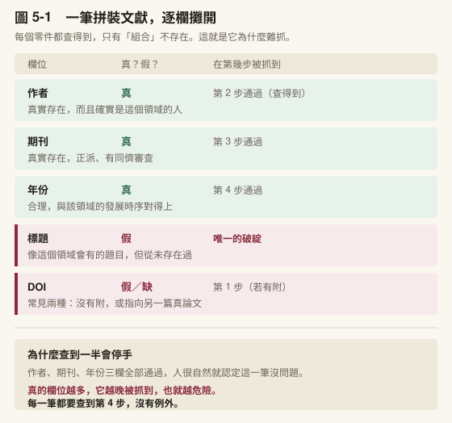
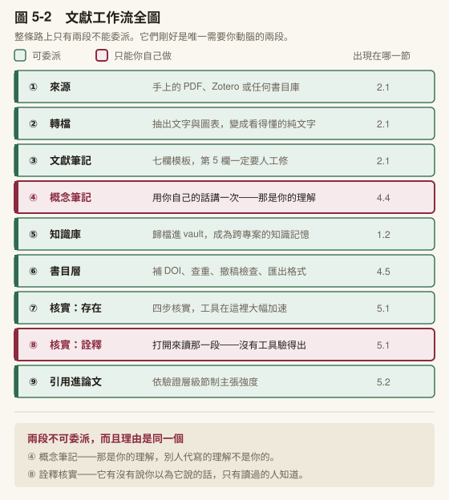
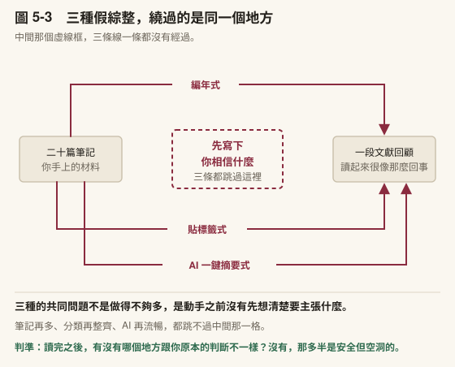
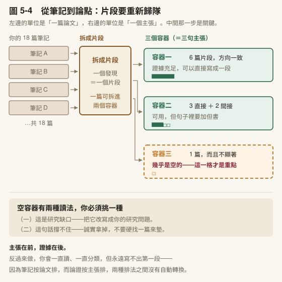
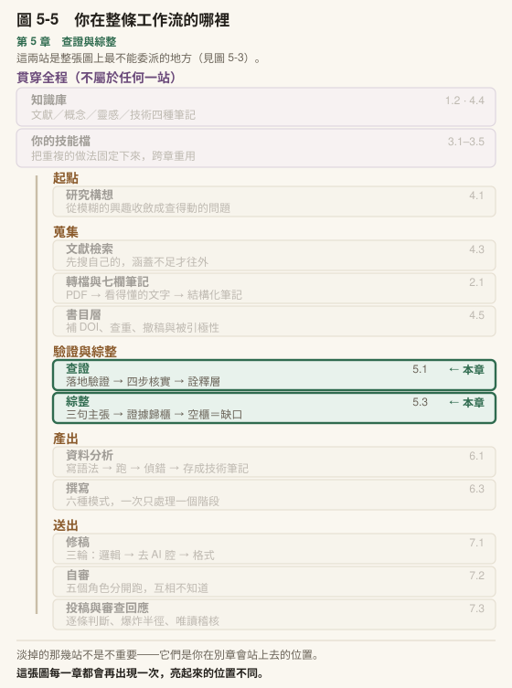

# 第 5 章　查證與綜整

## 本章導覽

**這一章回答四個問題**

1. 引用幻覺怎麼抓？[第 1 章](../chapters/01-setup.md)的三步為什麼不夠？
2. 一整條流程從 PDF 跑到一句可引用的話，實際上是怎麼跑的？
3. 什麼樣的引用，能撐什麼強度的主張？
4. 二十篇筆記怎麼變成一段有立場的論證？

**讀完你能夠**

- **執行**四步核實流程，辨識拼裝文獻
- **操作**從 PDF 到一句可引用之陳述的完整流程，並說出每一步最常壞在哪裡
- **標定**一筆引用的驗證層級，並據以節制主張強度
- **重組**文獻筆記為論證：先立主張，再讓證據歸隊，並認出空容器代表什麼

**需要多久**

自學閱讀約 70 分鐘｜課堂 3 小時（概念 80 分、實作 100 分）

**進來之前，你要能**

- 標出一筆文獻的驗證層級，並說出它**撐得住什麼、撐不住什麼**（[4.5](../chapters/04-research-question.md#45-書目管理層讓機械工作歸機械)）
- 拿出一批**你自己蒐集來的**文獻，不是書上的範例（[4.3](../chapters/04-research-question.md#43-文獻工作的三個瓶頸)、[4.4](../chapters/04-research-question.md#44-四種筆記一篇論文可能觸發什麼)）

**開始前請準備**：[第 4 章](../chapters/04-research-question.md)建立的文獻筆記，至少五篇；一篇你近期在讀的論文 PDF。

---

## 章前導言

還是[第 1 章](../chapters/01-setup.md)那位碩士生。這次是口試前一週，指導教授要求：六十八筆參考文獻，逐條核對過再送。

他心裡是抗拒的。那些論文他每一篇都讀過，何況口試就在眼前。他還是開始查了，想著半小時應該就能收工。

查到第十九筆的時候他停下來。

那一筆的作者是真的，他認得那個名字；期刊是真的，他自己也投過；年份合理，跟該領域的發展時序對得上。但那個標題，他怎麼查都查不到。他把作者的著作清單整個拉出來看，沒有這一篇。

然後他發現一件更不舒服的事：他想不起來這一筆是什麼時候、怎麼進到清單裡的。

[第 2 章](../chapters/02-first-note.md)你已經親手抓過一筆假引用。但那是在可控的實驗裡，你**預期**它會出錯，而且只有五筆。真實情境不是那樣。真實情境是：你不預期、清單很長、時間不夠，而且你對每一筆都有一種模糊的熟悉感，因為你確實讀過那個領域的很多東西。

那種熟悉感正是問題所在。它讓你在查證時不斷產生「這筆應該沒問題」的直覺，而那個直覺的來源，跟 AI 產生那筆引用的機制其實很像：都是因為它看起來像這個領域會有的東西。

本章要做的事，是把「小心一點」換成**一條跑得動的流程**。小心是一種狀態，狀態會累；流程不會。

本章分兩段，而它們是同一條線的兩端。

**前半是查證**：把「小心一點」換成一條跑得動的流程。

**後半是綜整**：你手上有一批驗過的筆記了，但筆記不會自動變成論證。那一步是整條路上最難的地方，而且它的做法可能違反你的直覺。不是讀完再想，是先寫下你相信什麼，再回頭找誰支持。

兩段之間有一個轉折點值得先說：查證管的是「這一筆能不能用」，綜整管的是「這一批合起來能說什麼」。前者一次看一筆，後者一次看全部。多數人卡住的地方在從前者跨到後者的那一步。

> **〔課堂〕開場 10 分鐘** 講完開場故事後，先問一個問題：**「如果是你，你會從第幾筆開始覺得不耐煩？」** 這個問題的目的不是道德勸說，是讓學生自己說出「查證會累」這件事。承認疲勞是本章的前提，因為本章給的是流程，而流程存在的理由就是人會累。若班上有正在寫論文的學生，請他說目前參考文獻有幾筆。數字講出來，動機就建立了。
---

## 5.1 引用幻覺與四步核實

### 從三步升級到四步

[第 1 章](../chapters/01-setup.md)給過你最小查證三步：DOI 開得開嗎、作者真的寫過這主題嗎、卷期年份對得起來嗎。那三步是為了讓你在還沒學任何工具的時候，就能親手抓到一筆假引用。

現在升級。四步核實補了兩件三步沒做的事：

| | [第 1 章](../chapters/01-setup.md)三步 | 本章四步 |
|---|---|---|
| 1 | DOI 解析得開 | DOI 確實指向那篇論文 |
| 2 | 作者寫過這主題嗎 | 用標題在學術搜尋引擎交叉比對 |
| 3 | 卷期年份對得上嗎 | **期刊是否真實存在、是否為掠奪性期刊**（新增） |
| 4 | — | **作者名單與出版年份逐欄核對**（新增） |

第 3 步是新的，而且它抓的是另一種問題。前兩步抓的是「這篇不存在」，第 3 步抓的是「這篇存在，但它發表的地方不算數」。掠奪性期刊會收錢就登，引用它不會被判定為造假，但會被判定為**沒有品質把關**，在審查階段一樣是傷。

第 4 步看似瑣碎，卻是抓拼裝文獻的關鍵。因為拼裝文獻最常出問題的地方，正是作者名單：把同領域另一位學者塞進共同作者，或把第三作者挪到第一。

### 四步之外還有一層

這是本節最該記住的一句：

> **「文獻存在」不等於「你引用的說法正確」。**

四步驗的是**存在**，不是詮釋。

一筆引用可以完全通過四步：論文是真的、DOI 對、期刊正派、作者名單無誤。然後你在論文裡寫的那句「Smith（2019）發現 A 導致 B」，其實那篇論文說的是 A 與 B 相關但方向未定。

這種錯誤沒有任何自動化工具抓得到。**要驗詮釋，只能打開來讀。** 這也是[第 2 章](../chapters/02-first-note.md) [2.1](../chapters/02-first-note.md#21-把一篇-pdf-變成一份筆記) 第 7 欄「原始摘錄」存在的理由：它讓你在寫作時看得到原文，不必憑三個月前的印象。

> **〔補充〕注意這一整節本來就不靠 AI。** 解析 DOI、在資料庫交叉比對、逐欄核對作者與年份、打開 PDF 找那一句話—— 這四步從頭到尾是你在做，工具在這裡的角色只有一個：**它是那些錯誤的來源，不是解法。** 所以「今天它不能用」對這一節沒有影響。⚠️ **真正會影響這一節的是相反的情況**：你請它「幫我檢查引用」，然後把它的回答當成查過了。那是本章迷思二。

### 拼裝文獻長什麼樣子



〔圖 5-1〕把一筆拼裝引用逐欄攤開，標出哪些欄位是真的、哪一欄是假的，以及每一欄會在第幾步被抓到。

那張圖要看的是：真的欄位越多，它越晚被抓到，也就越危險。

一筆五個欄位全錯的假引用，你第一眼就會起疑。真正會進到論文裡的，是那種作者真、期刊真、年份合理，只有標題是拼出來的，因為你查前三項都通過，很自然就在那裡停手了。

這正是[第 1 章](../chapters/01-setup.md)講過的型態一。[第 1 章](../chapters/01-setup.md)教你認出它，本章教你逮住它：逮住它的唯一辦法，是每一筆都查到第 4 步，不因為前三步通過就提早收手。

### 一句要點名的話

> 用 AI 驗證 AI 產出的引用，等於讓考生改自己的考卷。

這句話值得停一下。它不是說 AI 檢查一定沒用，而是說：**產出錯誤的機制，跟檢查錯誤的機制是同一個**。你要它檢查一筆它自己編出來的引用，它會用同樣的機率接龍判斷「這看起來合不合理」，而那筆引用本來就是照著「合理」生出來的。

它當然會說沒問題。

一個工具開發者在自己的開發日誌裡記錄過一次壓力測試：他拿一篇 AI 輔助撰寫的展示論文，把裡面六十八筆引用手動逐一驗證，發現**約三成有問題**，而且那些問題全部通過了三輪 AI 誠信審查。問題型態包括完全捏造的文獻、作者名單混淆，以及 DOI 指向另一篇論文。

這是**單一案例的自陳紀錄，不是同儕審查研究**，樣本是一篇論文。所以它不能拿來說「AI 引用的錯誤率是三成」。它能說明的是另一件事，而那件事同樣重要：這種錯誤可以在多輪 AI 審查下毫髮無傷地存活。

那是一個人的一篇論文。規模化的證據長這樣：AI 偵測公司 GPTZero 掃過 **NeurIPS 2025 的已錄取論文**，找出逾 100 筆捏造引用，分布在 53 篇論文，約佔所掃論文的 1%（GPTZero, 2026）。

這個數字真正的重量不在 1% 這個比例，在**它們是怎麼進去的**：NeurIPS 每篇論文都經過三到五位該領域專家審查，這些引用全部通過了。

換句話說，前面那位開發者發現「AI 審查擋不住」，這份掃描發現**人類專家審查也擋不住**。兩件事指向同一個結論，而那個結論就是本節存在的理由：沒有任何一道別人的關卡會替你擋下這件事。

〔補充〕**為什麼專家審查擋不住？** 因為審查者讀的是論證，不是書目。一位審稿人會花兩小時判斷你的方法對不對，但幾乎沒有人會把參考文獻逐筆拿去解析 DOI。那既無聊又不是他被邀請來做的事。這正好說明查證責任為什麼在作者身上：這跟別人負不負責任無關，是流程裡根本沒有人站在那個位置。

### 中文文獻要更小心，而且有本地的證據

上面兩筆證據都是英文場域。**對中文文獻，情況更差。**

臺灣大學圖書館的學科館員在 2023 年 3 月做過一次公開的測試，測試紀錄後來收進他們的課程簡報（范蔚敏、陳芷洛，2025）。他們要 AI 回答一個心率相關的研究問題，拿到一串看起來很像樣的**中文期刊書目**，然後逐筆去查三個資料庫。臺大館藏目錄、國家圖書館期刊文獻資訊網、華藝線上圖書館。

**四本期刊，三個資料庫，全部 0 筆。**

同一次測試裡，AI 給的英文書目三筆，一筆屬實、兩筆錯誤。

這不是一份控制良好的研究，是一次教學示範，樣本很小，也已經是三年前的模型。 **但方向值得記住，而且理由講得通**：中文學術文獻在訓練資料裡的量遠少於英文，它接龍時能倚靠的真實樣本更少，於是更容易生出「形狀對、東西不存在」的書目。

〔補充〕**那份簡報還示範了一個很實用的動作。** 查一筆英文書目查不到時，他們**把篇名切成兩半分開搜**。前半段查到了另一篇真論文，後半段是別篇的副標。這正是本章要教的「逐欄比對」在標題那一欄的做法：整串查不到只告訴你「有問題」，切開來查才告訴你「問題出在哪裡」。

### 還有第零步：先確認那句話真的在那裡

四步核實驗的是**書目**。但你寫進論文的通常不是書目，是一句話—— 「Smith 等人（2023）發現……」。

那句話從哪來的？多半是某個工具幫你摘出來的。而**摘的過程就是生成的過程**，它可能把 β = .31 摘成 β = .34，可能把「相關」摘成「導致」。

⚠️ **四步核實抓不到這個。** 那篇論文真的存在、DOI 真的對、作者真的沒錯—— 錯的是你手上那一句。

所以在四步之前還有一步，我自己叫它**存在查核**：**回到原始檔案，把那句話逐字比對一次。**

**做法只有三個動作：**

1. **記下位置。** 不是記「這篇論文說」，是記**哪個檔案、第幾行或第幾頁、哪一個小節標題**
2. **獨立打開那個位置**，讀出來
3. **跟你手上那句話逐字比**

第 3 步的結果只有四種：

| 結果 | 意思 | 怎麼辦 |
|---|---|---|
| **逐字吻合** | 空白與換行不同不算 | 過，進四步核實 |
| **實質相同但有小差異** | 引號、連字號、破折號的形式差異 | 把你手上那句改成**原文的版本**，再繼續 |
| **內容不吻合** | 意思不同、數值不同、根本是另一段 | **退回去重新定位一次；再失敗就整筆不用** |
| **檔案開不了** | 來源不在了、路徑錯了 | 標「無法存在查核」，這一筆**降級為只有書目**，不能撐數值或因果 |

第二種最容易被當成沒事而放過。**它不是沒事**。它代表你手上那句話在轉手過程中被動過，只是這次動到的剛好是標點。**下一次動到的可能是數字。**

這一步有一條關鍵的設計，值得單獨講。

去驗的那個人（或那個工具），不可以是當初摘出那句話的同一個。

理由跟 [7.2](../chapters/07-revision-integrity.md#72-投稿前自己審一遍) 的五角色、跟 [7.3](../chapters/07-revision-integrity.md#73-回應審查意見) 的唯讀稽核完全一樣：**它記得自己剛才摘了什麼，於是它會看到自己記得的版本，而不是紙上的版本。** 我自己的做法是把這一步交給一支獨立的腳本去比對。腳本沒有記憶可以污染。

你沒有腳本也做得到，只要換一個動作：**不要問「這句話對不對」，要自己去打開檔案、找到那一行、用眼睛看。**

〔動手一下〕**5 分鐘**。從你的筆記裡挑一句你打算引用、而且含數字的話，回去打開原文，逐字比對那個數字與它前後那一句。多數人第一次做就會抓到一筆「意思對、但數字或範圍被放寬了」的。

這一步跟四步核實的分工要記清楚：

> **存在查核問「這句話在不在」，四步核實問「這篇文獻在不在」，第五層（自己讀）問「這句話是不是那個意思」。**

三層都過，才叫查證完成。

> **〔補充〕接上檢索之後呢？** [第 1 章](../chapters/01-setup.md)預告過這件事。當模型接上真正的檢索之後，「完全捏造的文獻」會大幅減少，因為它引用的是實際抓到的頁面。但錯誤沒有消失，只是**換了型態**：從「編造來源」變成「引用了真來源但讀錯它」。而讀錯是四步核實驗不出來的，四步全過，因為那篇論文確實存在。只有第五層（打開來讀）驗得出來。換句話說，**檢索功能讓前四步變簡單，讓第五層變得更重要。**

〔補充〕這件事有同儕審查的證據，不是只有經驗談。一份 2025 年發表於自然語言處理領域主要會議的研究，專門評估語言模型產生書目引用的表現，建立了衡量「引用幻覺率」的指標。它的結論很直接：即使是最先進的模型，仍然會產生幻覺引用，儘管已有進展。

這句話值得停一下。它出自針對這個問題設計的實證研究，不是使用者的抱怨，也不是廠商的免責聲明。換句話說，**本節教的四步核實不是過渡措施**，不會因為模型換代就不必做。

那份研究測的是特定時間點的特定模型版本，**具體數字會過期**，所以本書不引用它的分數。不會過期的是那個結論的方向：進步是真的，歸零不會發生。（出處見本章〈延伸資源〉。）

〔補充〕**四步全過、第五層才爆的真實案例。** 以下兩個都來自實際投稿經驗。第一個：稿件引用了一篇論文，說它「發現 X 會提升 Y」。四步核實全過——論文存在、DOI 正確、作者無誤。但打開原文，那篇測量的**對象**跟稿件寫的不是同一群人。變項指涉的對象從一開始就搞錯了。第二個更陰險：稿件裡寫某個效果「成立」，引用看起來完美。但原文的結論句裡有一個 not——主張方向與來源**完全相反**。這兩筆都是在回溯查驗時才被抓到的。它們的共同點是：書目正確，錯的是你以為自己讀到了什麼。

> **〔動手一下〕5 分鐘** 找一筆你手上現成的引用，**從第 4 步開始查**，逐欄核對作者名單與年份。多數人從沒做過這一步，因為前三步通過就停了。如果你查的第一筆就有出入，那不是巧合，是第 4 步本來就抓得到前三步抓不到的東西。

> **〔課堂〕5.1 講述約 25 分鐘** 這一節是全章重點，建議留最多時間。建議節奏：三步升四步的對照（5 分）→ 「存在 ≠ 詮釋」與第五層（8 分）→ 拼裝文獻圖，逐欄開（7 分）→ 考生改考卷與開發者日誌案例（5 分）。 **要點名的地方**：講開發者日誌那個案例時，**務必說明它是單一案例的自陳**。這一節在教引用誠信，如果自己在這裡用了一個誇大的數字，整節的說服力會塌掉。這件事本身就是很好的示範，可以直接向學生點破。

〔教你的 Claude 建這個〕**把查證做成一張逐項判準表。** 四步核實是最小版；真正在用的版本會長成一份**每一筆都要逐項回答、不可跳過**的清單。貼這段：

「請幫我建一個〈引用查核〉技能檔。核心規則只有一條：每一筆引用都要逐項回答下列問題，不可以整批說「都沒問題」。先給我四項——存在、作者名單逐欄、期刊與卷期頁、那句話在不在原文—— 然後**問我三個問題**：（一）我過去被指導教授或審查者抓過哪一類引用問題？（二）我這個領域有沒有特別容易出錯的來源型態（研討會論文？學位論文？政府報告？）？（三）我要不要加一項『必要性』。這筆引用該不該在這裡？ **不要幫我把清單補滿**，我要它從我自己的錯誤長出來。」

**第一版就四項，不要更多。** 清單一長就會被整批打勾略過，那比沒有清單更糟。它會讓你以為查過了。我自己那份用了三年才長到七項，其中最有價值的一項是最後才加的**必要性**：前面幾項問「這筆引用對不對」，它問「**它該不該在這裡**」，擋掉的是論文裡最常見的一種問題。正確但不必要的引用。

### 把查過的東西留下來：核實紀錄

上面那三個動作是**一次性的**。你做完、覺得沒問題、往下寫。三個月後審查意見回來問「第 12 筆那個數值的出處是什麼」，你要從頭再查一次。

所以查證還有一個產出物：**一份清單，記下你查過什麼、查到什麼**。

它不是給別人看的表格，是給**未來的你**用的。用得到它的時刻有三個，每一個都在很久以後：審查者質疑某一筆、你自己改到第七稿記不清哪些查過、以及最壞的那一種——有人問你這篇論文的某個說法是哪裡來的，而你答不出來。

**六個欄位，一筆一列：**

| 欄位 | 記什麼 | 為什麼需要它 |
|---|---|---|
| 1 我寫的那句 | 你稿子裡的句子，**逐字** | 稿子會改。沒有這一欄，日後你不知道當初驗的是哪個版本 |
| 2 出處位置 | 檔案名＋頁碼或節次，**具體到打得開** | 「那篇論文說」不算位置。這一欄的標準是別人照著也找得到 |
| 3 原文 | 原文的那一句，**逐字、不翻譯** | 翻譯過就不再是證據。這一欄與[第 2 章](../chapters/02-first-note.md)第 7 欄同一條規矩 |
| 4 比對結果 | 逐字吻合／小差異／不吻合／開不了 | 就是上一小節那四種 |
| 5 驗證層級 | 全文逐字／摘要／僅書目 | 決定這一筆撐得住多重的主張（[4.5](../chapters/04-research-question.md#45-書目管理層讓機械工作歸機械)） |
| 6 查核日期 | 年月日 | 網頁會改、預印本會更新。**沒有日期的查核，等於沒有查核** |

前三欄是骨架，後三欄是判斷。**時間不夠的時候先寫 1、2、3**——那三欄之後補得回來，第 4 到 6 欄如果當下沒記，日後要重查一次才寫得出來。

第 6 欄最常被略過，也最容易在事後咬你一口。你引用的那個政府網頁、那份指引、那筆預印本，**在你查過之後仍然會繼續變**。日期是你唯一能證明「我查的時候它是那樣」的東西。

〔補充〕**這一份紀錄跟[第 2 章](../chapters/02-first-note.md)的七欄筆記不一樣，不要合併。** 七欄筆記的單位是**一篇論文**，它回答「這篇說了什麼」；核實紀錄的單位是**你稿子裡的一句話**，它回答「我這句話站不站得住」。同一篇論文可能在核實紀錄裡出現三次，因為你引用了它三個不同的地方，而那三筆的比對結果可能不一樣。

〔教你的 Claude 建這個〕**把核實紀錄的格式固定下來，但把判斷留給自己。** 貼這段：

> 「我要建一個〈核實紀錄〉說明檔。我每次會貼給你**我稿子裡的一句話**和**我找到的原文**。你的工作只有兩件：（一）把它整理成六欄一列的格式（我寫的那句／出處位置／原文／比對結果／驗證層級／查核日期）；（二）如果我漏了哪一欄，直接指出來，不要替我填。 ⛔ 特別是**不要替我判斷比對結果**，也不要替我推測出處位置——那兩欄我沒給你，就是我還沒做完，不是要你補。」

那個 ⛔ 是這個檔案唯一重要的地方。⚠️ **它替你填的比對結果，會看起來跟你自己填的一模一樣**，而你三個月後分不出哪幾筆是真的查過的。

> **〔動手一下〕10 分鐘** 拿你手上任何一份稿子（或一段有引用的文字），挑**三筆**引用建這張表。只做前三欄就好。**你會有一筆卡在第 2 欄**——那一筆就是你現在最該回頭查的。

### 帶走這一節

- 四步核實比[第 1 章](../chapters/01-setup.md)三步多了**期刊品質**與**作者名單逐欄核對**
- ⚠️ **中文書目要更小心**：一次本地測試裡四本中文期刊在三個資料庫全部 0 筆
- **四步驗存在，第五層驗詮釋**，而第五層只能自己讀
- 拼裝文獻的危險程度與「真欄位的數量」成正比，**越真越晚被抓到**
- 用 AI 檢查 AI 的引用，是同一個機制在檢查自己
- 接上檢索會讓前四步變簡單，但讓第五層變得更重要
- **存在查核問「這句話在不在」，四步核實問「這篇文獻在不在」，第五層問「這句話是不是那個意思」**
- 去驗的人**不能是當初摘出那句話的人**——它會看到自己記得的版本，不是紙上的版本
- 查證要留下**核實紀錄**：六欄一列，單位是**你稿子裡的一句話**，不是一篇論文
- ⚠️ **沒有查核日期的紀錄等於沒有查核**——你引用的東西在你查過之後還會繼續變

---
---

## 5.2 照著做一次：從一篇 PDF 到一句你敢寫進論文的引用

[第 4 章](../chapters/04-research-question.md)把零件都給了，上一節把查證的原理拆開講過了。這一節把它們裝回去，從頭跑一次。

跑的人是[第 1 章](../chapters/01-setup.md)開場那位碩士生。[第 2 章](../chapters/02-first-note.md)收到指導教授兩行回信、被指出「你引的那兩篇我找不到」的那一位。他的題目是**同儕回饋對大學生寫作品質的影響**。這次他重做一遍，這次照流程走。

**這一節的每一步都給你三樣東西**：你實際要打什麼字、做對了會看到什麼、這一步最常在哪裡壞掉。你可以邊讀邊做，也可以先讀完再做。

〔補充〕下面的提示詞是**起點不是咒語**。它們寫得比較長，是因為[第 3 章](../chapters/03-skills.md)那七個元素都塞進去了。你跑過兩三次之後一定會改它。那就對了，那是[第 3 章](../chapters/03-skills.md) [3.5](../chapters/03-skills.md#35-讓它長大) 講的「被絆到就補一條」。



〔圖 5-2〕**先看整條路，再開始走。** 圖上以不同底色標出哪幾段可以委派、哪幾段不能—— 不能委派的只有兩段：**概念筆記**（那是你的理解），以及詮釋層的核實（它有沒有說你以為它說的話）。這兩段剛好是整條路上唯一需要你動腦的地方。

這張圖畫的是[第 4 章](../chapters/04-research-question.md)與本章合起來的完整路徑：前半（來源 → 轉檔 → 筆記 → 知識庫）在[第 4 章](../chapters/04-research-question.md)，後半（書目層 → 核實 → 引用）就是下面這八步。**綜整那一步在圖外**，因為它不屬於這條輸送帶——它是你在輸送帶末端做的判斷（5.3）。

### 第 0 步　準備兩樣東西

一篇 PDF（挑你**已經讀過**的，這樣你才判斷得出它有沒有胡說），以及一個放筆記的資料夾。就這樣。

第一次跑請務必挑讀過的論文。拿沒讀過的來跑，你會失去唯一的對照組。

### 第 1 步　把 PDF 變成看得懂的文字

論文 PDF 是排版檔不是文字檔，兩欄排版、頁首頁尾、圖表標號都會混進內文。先轉成 Markdown，後面每一步才穩。

**做對了會看到**：標題階層還在、表格沒散掉、圖片被抽成獨立檔案並留下連結。

**最常壞在這裡**：掃描檔（沒有文字層）轉出來是亂碼，或整份只有幾百字。轉完先看字數。一篇期刊論文轉出來少於三千字，八成是掃描檔，要走 OCR。

### 第 2 步　產生七欄筆記

把[第 2 章](../chapters/02-first-note.md) [2.1](../chapters/02-first-note.md#21-把一篇-pdf-變成一份筆記) 那七欄直接寫進提示詞。這一段可以整段複製：

```text
請閱讀我附上的這篇論文，產出一份結構化文獻筆記。

我的研究背景：教育研究所碩士生，論文題目是同儕回饋對大學生
寫作品質的影響，關心的是「什麼條件下同儕回饋才有效」。

請用以下七欄，欄名照抄，不要增刪：

1. 核心論點——這篇在主張什麼（3 句以內）
2. 研究方法——設計、樣本、分析方法，並註明它出現在第幾節
3. 主要發現——實際找到什麼，有數據就寫數據
4. 理論貢獻——它在這個領域的位置
5. 與我研究的關聯——對我的題目有什麼用（這一欄我會自己改，
   請標成「草稿」）
6. 引用格式——APA 7th，完整可貼
7. 原始摘錄——3 到 5 段值得引用的原文，逐字保留，各附頁碼

規則：
- 第 7 欄一律逐字，不要改寫、不要翻譯
- 任何你在原文找不到依據的內容，寫「原文未提及」，不要補
- 不確定的地方標 [待查]，不要用推測填滿
```

**做對了會看到**：第 2 欄真的指得出節次（「見 [3.2](../chapters/03-skills.md#32-那個檔案裡該寫什麼) 節」），第 7 欄是英文原文而不是中文轉述，而且會出現一兩個 `[待查]`。

**最常壞在這裡**：第 7 欄被「順手翻譯」了。一翻譯就不再是原始摘錄，等於這一欄白做。你日後要查自己有沒有失真時，手上剩的還是別人的轉述。看到中文就退回去要一次。

### 第 3 步　修第 5 欄

第 5 欄幾乎不會一次到位，因為它推的是**你的**問題意識，而它手上那份對你的理解是片面的。

```text
第 5 欄推的方向不對。我關心的不是「同儕回饋有沒有效」，
而是「什麼條件下才有效」——例如回饋者的訓練、回饋的結構化程度。
請照這個重寫第 5 欄，並明確指出這篇的哪一個發現支持或不支持
我這個切入點。如果它其實沒處理這個問題，就直接說沒有。
```

最後那一句是關鍵。**你要給它一條說「沒有」的退路**，否則它會硬找一段來湊。

**做對了會看到**：它可能回你「這篇沒有處理回饋者訓練這個變項」。那不是失敗，那是你剛剛得到一個研究缺口。5.3 的空櫃就是這樣長出來的。

〔動手一下〕**3 分鐘**。把上面那句「如果它其實沒處理這個問題，就直接說沒有」刪掉，重跑一次第 3 步。比較兩次的第 5 欄。多數人第一次看到差別就不會再忘記這句話了。

### 第 4 步　存檔

檔名用你三年後找得到的寫法，不要用 `note1`。存進你的知識庫資料夾，讓它跟其他筆記在同一層。[第 1 章](../chapters/01-setup.md) [1.2](../chapters/01-setup.md#12-你剛才那段對話明天就不見了) 講的知識記憶，就是這樣一篇一篇長出來的。

### 第 5 步　書目層：補 DOI 與查重

這一步全部是機械工作，交出去。它要做的是補 DOI、抓正確卷期頁、確認你的書目庫裡沒有同一篇的兩筆。

**做對了會看到**：DOI 補上、卷期頁齊全。

**最常壞在這裡**：同一篇被建了兩筆（一筆線上先行版、一筆正式出版），卷期不同。投稿前的參考文獻對不起來，多半是這裡種下的。

〔教你的 Claude 建這個〕**把書目層的機械工作固定成一個檔案。** 貼這段：「請幫我建一個〈書目整理〉技能檔，處理**純機械**的書目工作：補 DOI、抓正確卷期頁、找出同一篇的重複條目。三條規則要寫進去：（一）**DOI 一律寫成完整網址** `https://doi.org/…`，不要只寫 `10.xxxx/…`；（二）**查不到 DOI 就標『查無』，不要生一個**；（三）**回報時要分開講「我查到的」與「我推測的」**，不要混在同一張表裡。最後問我：我的書目庫裡目前有幾種來源型態（期刊、專書章節、學位論文、研討會、政府報告），各自需要哪些欄位？」第三條是這個檔案最重要的一條。**沒有它，這個技能會安靜地把推測當成查到的東西交給你**，而書目正是你最不會逐筆複查的地方。

### 第 6 步　四步核實：跑一筆真的，再跑一筆錯的

現在做這一章最要緊的一件事。用兩筆來練，一筆真的、一筆錯的。

**第一筆（真的）**

> Huisman, B., Saab, N., van Driel, J., & van den Broek, P. (2018). Peer feedback on academic writing: undergraduate students' peer feedback role, peer feedback perceptions and essay performance. *Assessment & Evaluation in Higher Education, 43*(6), 955–968.

四步逐一過：

| 步驟 | 查什麼 | 這一筆的結果 |
|---|---|---|
| 1 | DOI 開得開嗎 | [https://doi.org/10.1080/02602938.2018.1424318](https://doi.org/10.1080/02602938.2018.1424318) 開得開 ✓ |
| 2 | 作者真的寫過這篇嗎 | 四位作者可查，領域相符 ✓ |
| 3 | 期刊存在且正派嗎 | *Assessment & Evaluation in Higher Education*，同儕審查 ✓ |
| 4 | 卷期年份對得上嗎 | 2018，43(6)，955–968 ✓ |

四步全過。這一筆可以用。

**第二筆（錯的）**

> Huisman, B., Saab, N., van Driel, J., & van den Broek, P. (2018). Peer feedback on academic writing: undergraduate students' peer feedback role, peer feedback perceptions and essay performance. *Higher Education Research & Development, 36*(7), 1433–1447.

看得出哪裡不對嗎？作者是真的、標題是真的、期刊是真的、卷期頁也是真的，但它們不屬於同一篇。

標題與年份取自 2018 那篇，期刊與卷期頁取自**同一組作者 2017 年的另一篇**。這不是我編的陷阱，這是真實世界最常見的引用錯誤之一：同一組作者在相近時間發表主題相近的多篇論文，資料在傳遞過程中被串到一起。

它會在第幾步死掉？**第 1 步就死**。因為這個組合根本沒有對應的 DOI，你查不到。但如果你手上這筆沒附 DOI，前三步它全部過關，要到第 4 步比對卷期年份才會露餡。

〔補充〕這正是 5.1 說「每一筆都要查到第 4 步」的原因。**真的欄位越多，它越晚被抓到，也就越危險。** 圖 5-1 那張逐欄拆解圖畫的就是這件事。

**最常壞在這裡**：查到第 2 步、看到作者是真的，就停手了。

### 第 7 步　寫進草稿，並節制主張強度

最後一步要依你的驗證層級決定這句話能講多重，不是貼上去就算完成。

假設你只讀了摘要，那你能寫的是：

> 已有研究檢視同儕回饋角色與寫作表現的關聯（Huisman et al., 2018）。

假設你讀了全文、確認了它的設計與限制，你才能寫：

> Huisman 等人（2018）發現，擔任回饋**給予者**的角色與後續寫作表現的關聯，強於僅擔任接收者。

兩句話的差別不在文筆，在**你手上有沒有撐得住它的證據**。第二句如果你只讀過摘要就寫了，你不會被抓到，但它是錯的機率不低，而且錯了你不知道。

〈責任落點〉那一句在這裡第三次出現：**如果它做錯了，我看得出來嗎？**

> **〔課堂〕5.2 現場走一次，約 35 分鐘** 建議節奏：第 1–4 步老師示範（15 分）→ 第 6 步全班一起做（15 分）→ 第 7 步兩句話對照（5 分）。 **一定要現場跑第 6 步的第二筆。** 讓學生先自己判斷「這筆有沒有問題」，多數人會說沒問題。那個「多數人說沒問題」的瞬間，比你講十分鐘都有效。課前自己先跑一次第 2 步，確認你用的模型會不會擅自翻譯第 7 欄。會的話要在提示詞裡多加一句。兩筆書目請課前重新查一次。**期刊卷期可能因為改版而異動，本書的查證時間是 2026 年 8 月。**

### 帶走這一節

- 整條流程只有兩個地方需要你動腦：**第 5 欄怎麼改**、**第 6 步查不查到底**
- 提示詞裡一定要給它一條說「沒有」的退路，否則它會湊
- 第 7 欄一旦被翻譯就等於作廢
- 同一組作者的多篇論文被串成一筆，是最難抓的錯——**沒有 DOI 的引用一律查到第 4 步**
---

## 5.3 從二十篇筆記到一個論點

### 筆記的單位 ≠ 論證的單位

[第 4 章](../chapters/04-research-question.md)教你建的文獻筆記，每一張的組織單位是**一篇論文**。核心論點、研究方法、主要發現、與我研究的關聯，全部圍繞著「這篇說了什麼」。

但你的文獻回顧不是按論文寫的。一段好的文獻回顧的組織單位是**一個主張**：先亮出你要說什麼，然後調度不同論文的片段來支持它。同一篇論文可能貢獻給你的第一個主張和第三個主張各一段；也可能整篇下來只用上一個數字。

這意味著文獻筆記跟文獻回顧之間，存在一個**重組**的步驟。你不能把筆記按時間排起來就算寫完，也不能把筆記按主題分堆就算分析完了。你需要做的是：先有主張，再把筆記拆碎，讓碎片各自歸位。

聽起來像在說一件理所當然的事，但多數初稿卡住的原因就在這裡。

### 三種假綜整

在學怎麼做之前，先認出三種做起來像綜整、實際上不是的東西。

**第一種：編年式。** 「A（2015）發現 X，B（2018）延伸至 Y，C（2021）進一步確認 Z。」這是一份按年份排列的摘要清單。讀者看完知道了這個領域的歷史，但不知道你的立場。寫的人覺得自己寫了很多，其實只是翻譯了每篇的 abstract。

**第二種：貼標籤式。** 把文獻分成三派，「支持派」「反對派」「中間派」，或者按方法分成「量化」「質性」「混合」，然後每一派各給一段摘要，最後寫一句「由此可知，此議題仍具爭議」。問題是：分完之後你沒有說你自己站哪裡，也沒有說三派之間的分歧到底在什麼條件下出現。分類不等於分析。

**第三種：AI 一鍵摘要式。** 把二十篇筆記貼進對話視窗，說「幫我綜整這些文獻」。AI 會回你一段讀起來很像文獻回顧的文字，有連接詞、有轉折、有「綜合以上研究可知…」的收尾。但回想[第 1 章](../chapters/01-setup.md)講的：它做的是接龍，產出的是形狀。它給你的是二十篇的平均值，不是你的立場。 如果你讀完之後沒有覺得任何地方跟你原本的判斷不一樣，那段文字多半是安全但空洞的。



〔圖 5-3〕**中間那個虛線框，三條線一條都沒有經過。** 三種的共同問題不是做得不夠多，是繞過了同一格。

〔動手一下〕打開你手邊正在寫（或正想寫）的文獻回顧段落。它比較像上面哪一種？不用改，先認出來就好。

### 四步驟：先有主張，再讓證據歸隊

下面的做法可能違反你的直覺。多數人的流程是「讀完再想」，先把所有論文讀完，然後看能說什麼。問題是「讀完」是一個不存在的狀態。你永遠可以再找五篇，而多讀五篇不會自動讓你的立場更清楚，反而可能讓你更難收斂。

所以做法要反過來。

步驟一：不看筆記，寫下你目前相信什麼。

在一張空白的紙上（或一個空白的文件裡），用三句話寫下你目前對這個主題的判斷。不用完美，不用有引用，甚至可以錯。重點是先把你的立場具體化。

如果你寫不出來，那不是因為你讀得不夠，是因為你還沒決定。而做決定的方式是先表態，再讓證據修正你，不是繼續讀下去。

舉一個例子。假設你的研究主題是「同儕回饋對大學生學術寫作的影響」。你讀了十幾篇論文之後，寫下三句話：

> *（一）有結構的同儕回饋（附評量準則）比開放式的有效。* *（二）回饋的效果主要來自「給回饋」的過程，而非「收到回饋」。* *（三）匿名回饋會比具名回饋產生更多批判性意見。*

這三句不需要完美。它們的功能是給你三個容器，讓你知道接下來要把證據往哪裡裝。

步驟二：把筆記拆成證據片段，放進容器。

回到你的文獻筆記。但這次你不是逐篇讀，而是帶著三句主張去掃。每一篇筆記裡，找出跟你的三句話相關的片段（可能是一個數據、一個發現、一個限制），把它歸到對應的容器裡。

同一篇論文的不同片段可能分別歸到不同的容器。一篇論文可能沒有任何片段跟你的三句話有關。這都是正常的。

沿用上面的例子：

| 容器 | 收到什麼 |
|---|---|
| 主張一（結構化 > 開放式）| 六篇提供了實驗或準實驗證據，其中四篇效果量中等以上。有一篇發現沒有顯著差異，但樣本數偏小 |
| 主張二（給回饋 > 收回饋）| 三篇有直接證據，實驗設計各不相同。還有兩篇間接支持：它們發現高品質回饋者的後續寫作進步幅度大於被回饋者 |
| 主張三（匿名 > 具名）| 只有一篇直接做過這個比較，結論是沒有顯著差異。另外兩篇在討論區提過匿名的可能效果，但沒有當作研究變項 |

**步驟三：看哪個容器是空的。**

這一步是整個做法最有價值的地方。

在上面的例子裡，容器三幾乎是空的。你原本相信匿名回饋會比較好，但實際上你手上的證據撐不起這個主張。這時候你有兩個選擇：承認這是一個**研究缺口**，你的研究可以嘗試填它；或者承認你的直覺不對，放棄這句主張。

兩個選擇都是好的。壞的選擇是假裝沒看到、繼續把它當成已經確立的結論來寫。

**空的容器不是失敗，是發現。** 很多好的研究問題就是這樣找到的。

步驟四：看哪些片段放不進任何容器。

你會發現有些筆記的片段跟三句主張都不太相關，但它們彼此之間有某種關聯。

在上面的例子裡，有三篇論文不約而同提到「教師如何引導同儕回饋流程」會影響回饋品質，但你原本的三句主張沒有觸及教師的角色。這些流浪的片段可能在暗示你：也許你需要一句第四句主張，關於教師鷹架對同儕回饋的調節作用。

不是每一組流浪片段都值得追，但它們值得你看一眼。



〔圖 5-4〕**從筆記到論點的四步驟**。起點不是筆記，是主張。箭頭方向是「先表態，再讓證據修正你」，不是「先讀完，再看能說什麼」。

> **〔課堂〕5.3 綜整四步驟，30 分鐘** 學生用自己手上的文獻筆記跑步驟一到三（20 分）。步驟一最容易卡住。提醒學生：寫得不好沒關係，重點是寫出來。寫不出三句就寫兩句，一句也比零句有用。跑完之後全班分享：你的哪個容器是空的？（5 分）接下來 10 分鐘跑 AI 反方對話（見下段）。

### AI 在這一步的正確位置

你可能很想在步驟一就請 AI 幫忙：「讀完這些筆記，幫我列出三個主要發現」。不要做。

理由跟第三種假綜整一樣：AI 列出來的會是二十篇的平均值。它不知道你看重什麼、你的研究脈絡是什麼、你打算挑戰什麼。主張必須從你開始。

但步驟二之後，AI 可以做一件它擅長的事：**當反方。**

把你的三句主張和你歸類好的證據貼給它，要求它做三件事：

1. 找出哪一句主張的證據最弱
2. 找出是否有證據片段被你選擇性忽略了
3. 質疑你的歸類方式：你放在容器一的某段證據，真的支持主張一嗎？

這正是前言講的副駕駛定位：它擅長查表與挑毛病，不擅長替你決定要主張什麼。先讓你做完主張，再讓它來找漏洞。

〔教你的 Claude 建這個〕把「當反方」固定成一個檔案，因為臨時想的反方會太客氣。貼這段：「請幫我建一個〈綜整反方〉技能檔。使用時我會貼給你**我的主張**與我歸好的證據。你的工作**只有挑毛病，不准替我改寫主張**。固定回答四件事：（一）哪一句主張的證據最弱，弱在哪裡；（二）有沒有證據片段被我選擇性忽略；（三）我放在同一個容器裡的證據，是不是真的支持同一句主張；（四）有沒有哪一句主張，其實只有一篇文獻在撐。最後列出你有把握的與你在猜的，分開列。」

**第四項是我後來才加的，也是最常命中的一項。** 一句主張底下擺了五段證據，看起來很厚實，攤開來發現五段出自同一個研究團隊的三篇論文—— 那不是五個獨立佐證，是一個。這跟[第 4 章](../chapters/04-research-question.md) [4.3](../chapters/04-research-question.md#43-文獻工作的三個瓶頸) 講的「重複命中不是獨立佐證」是同一件事——**回頭看圖 4-4 那個倒 Y**，五段證據往上追會合併成一個團隊、一份資料。只是這一次，那張圖畫的是你自己的稿子。

〔補充〕**這個檔案長大之後會變成什麼。** 我自己那份用了三年，現在它會在挑完毛病之後**逼我回答一個問題**：這一句被你打掉之後，我的整個論證還站得住嗎？。如果站得住，那句主張本來就是可有可無的；如果站不住，我就知道整篇論文真正的支點在哪裡。判準清單模板見[附錄 F](../appendix/F-skill-library.md) 的模式⑤。

〔動手一下〕把你剛才寫的三句主張（即使只有兩句）連同歸類結果貼進 Claude，輸入：「哪一句的證據最弱？有沒有我忽略的反面證據？」讀它的回應時，注意區分「有道理的質疑」和「為了質疑而質疑」。判斷權在你。

### 帶走這一節

- 筆記按**一篇論文**組織，論證按**一個主張**組織，中間那個重組動作不會自動發生
- 三種假綜整：編年式、貼標籤式、AI 一鍵摘要式。**共同問題是動手前沒先決定要主張什麼**
- 做法是反過來的：**先寫下你相信什麼，再回頭找誰支持**
- **空的容器不是失敗，是發現**：不是研究缺口，就是該放棄的主張
- AI 在這一步的位置是**反方**，不是綜整者
- 反方要問到第四項：**有沒有哪一句主張其實只有一篇文獻在撐**

---
---

## 5.4 教育研究實例

### 實例一：投稿前的引用總驗

開場那位碩士生的完整版。六十八筆，一週。

做法是分成三輪，不要一筆一筆從頭查到尾：

- **第一輪（機械層）**：批次補 DOI，跑一次撤稿查核，跑一次查重。這一輪工具做，你只看結果
- **第二輪（存在層）**：對所有 AI 曾經參與過的引用走四步核實。**判準不是「我記不記得讀過」，是「這一筆有沒有經過我的手進來」**。開場故事的教訓正是「記不得它怎麼進來的」
- **第三輪（詮釋層）**：挑出所有**撐關鍵主張**的引用，打開原文核對你的說法。這一輪最花時間，所以只做關鍵的那些

第三輪怎麼挑？回去看驗證層級。標記為「僅書目」而你卻用它撐了一個具體主張的，全部進第三輪。

還有一個容易漏的動作：**孤兒引用的雙向比對**。參考文獻清單裡有、但內文從沒引到的，要刪。這種通常是改稿過程中段落被刪掉留下的殘骸，審查者一抓一個準。
### 實例二：一個空容器改變了一篇論文的定位

一位碩士生手上有十五篇文獻筆記，每一篇都標了驗證層級。她跑 5.3 的四步驟，寫下三句主張，把片段歸進三個容器。

第三個容器幾乎是空的。

她原本以為那句主張有很多證據支持，實際上只有一篇直接研究，而且那篇的樣本數偏小。

她做的決定是：把那句主張從「文獻回顧裡的已確立結論」改成「本研究要處理的研究問題」。

這個改動看起來很小，實際上改變了整篇論文的定位。原本她要寫的是「已知 A、B、C，本研究驗證 C 在臺灣情境的適用性」；改完之後變成「已知 A、B，但 C 的證據薄弱，本研究處理 C」。後者的貢獻宣稱更誠實，也更站得住。

她接著把三句主張與歸類結果丟給 AI 當反方，被指出容器二的六篇裡有兩篇的研究設計跟她的情境差距很大，引用時要加但書。

注意這個實例裡 AI 出現的**位置**：它沒有參與「主張是什麼」的決定，只在主張定下來之後進來挑毛病。順序顛倒的話，她得到的會是十五篇的平均值，而不是她自己的立場。

---

## 5.5 動手實作

### 實作一：四步核實（40 分鐘）

請 AI 針對你的研究主題產出五筆文獻，逐筆走四步核實。

記錄兩件事：

1. 每一筆在**第幾步**被抓到（或全數通過）
2. 每一筆的**驗證層級**

**如果五筆全過，再要五筆更冷門的。** 全過不代表沒問題，可能只代表你的主題夠熱門，或你停手停得太早。特別檢查第 4 步的作者名單，那是最常出問題也最常被跳過的一步。
### 實作二：換你的材料再走一次（30 分鐘）

5.2 那七步是用書上那一筆走的。你看完了，但你沒有做過。

1. 從你的書目庫挑**一篇你真的讀過、而且打算引用**的論文。⚠️ 不要挑沒讀過的—— 你會分不出它填錯了什麼
2. 照 5.2 的七步走完，每一步都自己動手，不要回頭看書上的示範
3. 卡住超過三分鐘再翻回去對照

**產出是一句話**：一句你敢寫進論文的引用，加上它的驗證層級標記。

**驗收**：那句話你說得出它撐得住什麼、撐不住什麼。說不出來就代表第七步跳過了。

⚠️ **第七步（節制主張強度）是最常被跳過的一步**，因為前六步都有明確的動作，第七步只是「想一下」。而它是唯一決定你會不會寫出過度宣稱的一步。

〔課堂〕**這一項不要示範。** 5.2 已經是示範了，再示範一次學生就只會照抄。巡場時只回答「卡在哪一步」，不要直接給答案。

### 實作三：綜整四步驟（20 分鐘）

用你自己手上的文獻筆記（[第 4 章](../chapters/04-research-question.md)建的），跑 5.3 的四步驟。

1. 不看筆記，寫下你目前相信什麼（三句話，5 分鐘）
2. 回到筆記，把相關片段歸進容器（10 分鐘）
3. 看哪個容器空了、哪些片段流浪了（5 分鐘）
4. 記錄你的發現，特別是「跟我原本想的不一樣」的地方

### 實作四：AI 反方對話（10 分鐘）

把實作三的結果貼進 Claude，輸入：

「這是我的三句主張和歸類後的證據。請做三件事：(1) 指出哪一句主張的證據最弱，(2) 有沒有我忽略的反面證據，(3) 我的歸類有沒有牽強的地方。」

讀它的回應。注意區分兩類意見：有具體依據的質疑（你應該認真考慮），和泛泛而談的「可能有其他因素」（可以忽略）。 **四步核實的實戰要點**

- **第 1 步最有效但最不夠**。DOI 打不開就結案了，但打得開只代表這篇存在。
- **第 3 步最常被跳過**（期刊真實性與掠奪性判別），因為前兩步過了就會鬆懈。
- **第 4 步最常出問題**（作者名單與年份逐欄核對），而拼裝文獻最愛動的正是作者名單。
- **四步都過，驗的仍然只是「存在」。** 它有沒有說你以為它說的話，只能自己打開來讀。這一層沒有任何工具幫得上。

⚠️ 一個實作中一定會遇到的狀況：某一筆「查得到這篇，但年份或卷期對不上」。這叫**半真**，是最危險的一類，因為查到一半就對上了，多數人會在那裡停手。遇到就記下來，它比全假的那幾筆更有教學價值。
### 技能要點

| 實作 | 關鍵動作 | 做對了長什麼樣 | 常見卡點 |
|---|---|---|---|
| 一 · 四步核實 | 記錄每筆**在第幾步**被抓到 | 你抓到至少一筆有問題的，而且說得出它是在哪一步露餡的 | 五筆全過就以為沒問題。那多半代表主題太熱門，或你在第 1 步通過後就停手了 |
| 二 · 換你的材料 | 每一步**先自己做**，卡住三分鐘才翻回去 | 你產出一句話，而且說得出它撐不住什麼 | 一開始就對著 5.2 照抄。⚠️ 那樣你練到的是抄寫，不是判斷 |
| 三 · 綜整四步 | 步驟一**不看筆記**就寫下你相信什麼 | 你寫得出三句話，而且其中至少一句在步驟三被證據修正了 | 寫不出主張就回去讀更多。**讀更多不會讓立場變清楚**，只會更難收斂 |
| 四 · 反方對話 | 讀回應時區分兩類意見 | 你能指出哪一條質疑有具體依據、哪一條只是泛泛而談 | 全盤接受它的質疑。它的工作是挑毛病，不是判斷哪個毛病重要 |

**四個實作是一條線**：先確認每一筆能不能用（實作一），再拿自己的材料把整條流程走通（實作二），接著把能用的重組成主張（實作三），最後讓它來挑你重組得對不對（實作四）。

順序不能顛倒。沒查過的筆記拿去綜整，你會很認真地為一批假東西建立論證。

### 當週小task

繳交四樣：

1. 一份核實紀錄（五筆，照 5.1 的六欄格式；至少三筆要填滿第 4 到 6 欄）
2. 你的三句主張，以及歸類後的容器內容
3. 一段 150 字：**哪一個容器最空？你決定把它當研究缺口，還是放棄那句主張？為什麼？**
4. 三行使用聲明（格式見[第 1 章](../chapters/01-setup.md)）

第 3 項是本章真正的評分重點。空容器怎麼處理，反映的是你有沒有真的讓證據修正你，還是只是把原本相信的東西寫得更好看。

---

## 5.6 常見迷思

迷思一：「我讀過的論文，引用不會錯。」

*為什麼錯*：開場那位碩士生每一篇都「讀過」。錯的往往不是你精讀的那幾筆，是改稿過程中補進來、你以為讀過的那些。而且熟悉感本身會誤導你：一筆引用看起來像這個領域會有的東西，正是它被生成出來的原因。

*正確版本*：判準不是「我記不記得讀過」，是「這一筆有沒有經過我的手進來」。

**迷思二：「請 AI 幫我檢查引用就好。」**

*為什麼錯*：產出錯誤與檢查錯誤是同一個機制。它照著「合理」生成，再照著「合理」判斷，當然會說沒問題。開發者日誌那個案例裡，有問題的引用全數通過了三輪 AI 審查。

*正確版本*：AI 可以幫你**整理待查清單**，查證動作本身要落在能連到外部真相的工具上：DOI 解析、學術搜尋、期刊資料庫。

迷思三：「查到這篇存在，就可以引了。」

*為什麼錯*：四步驗的是存在，不是詮釋。一篇真實存在的論文，完全可能沒有說你以為它說的話。

*正確版本*：先問自己讀到什麼程度（驗證層級），再決定這一筆能撐多重的主張。只有書目的，撐不了因果宣稱。

**迷思四：「文獻讀完再開始想。」**

*為什麼錯*：「讀完」是一個不存在的狀態。任何一個研究主題，你永遠可以再找到五篇相關的論文。如果你等讀完才開始想，你永遠不會開始。而且讀的過程中不帶著問題讀，你只是在累積摘要，不是在累積理解。

*正確版本*：讀到第五篇就可以先寫三句話。寫下來之後再繼續讀，用新的閱讀修正你的主張。5.3 的做法不是「讀完再想」的替代品，是「一邊讀一邊想」的具體操作。

---

> ### 〈責任落點〉 - 決定哪些文獻該進你的論證：**你** - 查證每一筆引用的**存在**：工具能大幅加速，但收不收手是你決定的 - 查證每一筆引用的**詮釋**：**只有你**。沒有任何工具驗得出「它有沒有說你以為它說的話」 - 標定驗證層級並據此節制主張強度：**你** - **三句主張是什麼：只有你。** AI 給的是這批文獻的平均值，不是你的立場 - 空容器怎麼處理（當缺口，還是放棄主張）：**你**。這是研究判斷，不是整理工作 - 工具負責的是：機械查證、比對、格式，以及在主張定下來之後當反方

---

## 5.7 章末整理

回頭看圖 5-2 那條輸送帶：這一章走完的是它的後半段。

### 三句話帶走

1. **四步驗存在，第五層驗詮釋**，而第五層只能自己讀。
2. 驗證層級決定一筆引用能撐多重的主張。
3. 筆記按一篇論文組織，論證按一個主張組織。**先寫下你相信什麼，再回頭找誰支持。**

### 回到開場

開場那位碩士生查到第十九筆才停下來，而讓他不舒服的是他想不起來那一筆是怎麼進來的，錯誤本身反而其次。

本章前半給了他缺的東西：一條不依賴記性的流程。

但本章後半講的是另一件事，而它其實更難。查證的難處在於累，綜整的難處在於**你得先承認自己還沒有立場**。多數人不願意在步驟一寫下那三句話，因為寫下來就會發現自己其實沒那麼確定。

**那個不確定不是問題，是起點。** 空著的容器同樣有用，它指出哪一格還沒有材料。



〔圖 5-5〕亮起來的是這一章教的位置，淡掉的是你在別章會站上去的地方。這兩站是整張圖上最不能委派的地方。而它們也是唯一兩站，做錯了不會有任何工具告訴你。

### 拿去跟人討論

下面幾題沒有標準答案，而且一個人想不出來——它們要的是別人的處境跟你的不一樣。找一個同學、同事或指導教授，挑一題聊十分鐘。

1. 各自挑一筆自己稿子裡最沒把握的引用，交給對方跑第一步。對方查得到嗎？
2. 一筆只讀過摘要的文獻能撐多重的主張？各自舉一句你正在寫的話當例子，讓對方判斷有沒有超過。
3. 先各自寫三句主張，再交換。看到對方那三句，你想反駁哪一句？那一句就是他還缺證據的地方。

### 下章預告

主張定了，證據歸隊了，空容器也處理了。接下來要把它變成字。

[第 6 章](../chapters/06-analysis-writing.md)處理兩件事，而它們的順序跟多數人想的相反：**先有結果，才寫得出 Results 和 Discussion。** 所以[第 6 章](../chapters/06-analysis-writing.md)從資料分析開始，然後才進到撰寫。

那一章也會處理一個本章刻意留著的問題：**你不會的方法怎麼辦。** 你已經知道怎麼查一篇論文的真假，但當那篇論文用了一個你沒學過的分析方法，判斷它對不對是另一回事。

---

## 延伸資源

**外部資源：這件事的實證研究**

- **Tang, X., Duan, X., & Cai, Z. (2025). Large Language Models for Automated Literature Review: An Evaluation of Reference Generation, Abstract Writing, and Review Composition.** *Proceedings of EMNLP 2025.* [https://aclanthology.org/2025.emnlp-main.83/](https://aclanthology.org/2025.emnlp-main.83/) 建立了評估「引用幻覺率」的多維度指標，結論是**最先進的模型仍會產生幻覺引用**。本節 5.3 的實證依據。
- **Human researchers are superior to large language models in writing a medical systematic review**（2026）。*Scientific Reports.* [https://www.nature.com/articles/s41598-025-28993-5](https://www.nature.com/articles/s41598-025-28993-5) 多任務比較研究。本書僅據標題與摘要描述，**未讀全文**，引用時請自行確認其比較設計是否適用你的情境。

- **GPTZero (2026). NeurIPS 2025 掃描報告.** [https://gptzero.me/news/neurips/](https://gptzero.me/news/neurips/) 逾 100 筆捏造引用、53 篇論文、約 1%。本節用它證明的不是比例，是這些引用通過了三到五位專家的同儕審查。與上兩筆不同，這是**業者自家的調查報告**，不是同儕審查研究；其認定標準（無法經網路搜尋、學術資料庫與 DOI 驗證者即列為幻覺）由該公司自訂。引用時要說明這一點。

**上面前兩筆都以醫學與自然語言處理領域為場域**，教育研究常用的文獻類型不完全相同：區域性期刊、中文文獻、專書章節在主流索引裡的涵蓋率都較低。它們支持的是「查證不可省」這個方向，不是特定的數字。

**外部資源：臺灣本地的**

- **范蔚敏、陳芷洛（2025 年 2 月 26 日）。生成式 AI：資料蒐集與學術寫作小幫手〔簡報〕。國立臺灣大學圖書館學科服務組。** [https://www.lib.ntu.edu.tw/img/tulblog/HELP/HELP_20250226_GenAI.pdf](https://www.lib.ntu.edu.tw/img/tulblog/HELP/HELP_20250226_GenAI.pdf) 114 頁，本節 5.1「中文文獻要更小心」那組數字的出處（2023 年 3 月的測試紀錄）。 **本書逐頁讀過。** 它另有一份改寫自馬里蘭大學圖書館的五步查核法（拆解／搜尋／分析／決定／重查），與本章四步核實方向一致但切分不同，值得對照著看。簡報自己在第 2 頁就聲明「內容可能因科技進步而不再適用」。照它說的做，先看日期。

外部資源：大學圖書館的 AI 文獻指引

- **Duke University Libraries — Literature Reviews: AI tools**：[https://guides.library.duke.edu/litreviews/AI](https://guides.library.duke.edu/litreviews/AI) 跟本章 5.1 最直接對應的一份。它明白寫著要小心「看起來非常真實的捏造引用」，也指出 AI 工具**不能取代學術資料庫檢索**（涵蓋率偏誤）。逐個工具評述，適合拿來對照你手上在用的那些。
- **Georgetown University — Generative AI Resources**：[https://guides.library.georgetown.edu/ai](https://guides.library.georgetown.edu/ai)

這幾份都以英文學術環境為預設。掠奪性期刊的判別、資料庫的涵蓋範圍、引用格式的細節，在中文學術圈與你的學科裡可能不同。它們是參照，不是規範；**你所屬機構的規定優先**。

**本書其他章節**

- **[第 1 章](../chapters/01-setup.md) [1.2](../chapters/01-setup.md#12-你剛才那段對話明天就不見了)**：幻覺的機制。本章 5.1 是它在文獻場景的具體版本
- **[第 4 章](../chapters/04-research-question.md)**：研究構想與文獻蒐集。本章驗的、綜整的，都是那一章蒐集回來的東西
- **[第 6 章](../chapters/06-analysis-writing.md)**：分析與撰寫。綜整完的主張，下一章開始變成字
- **[附錄 B](../appendix/B-E-toolkit-policy.md)**：技能索引（哪件事寫在哪一章）
- **[附錄 C](../appendix/B-E-toolkit-policy.md)**：Prompt 範本（含本章 5.2 的提示詞骨架）

---
