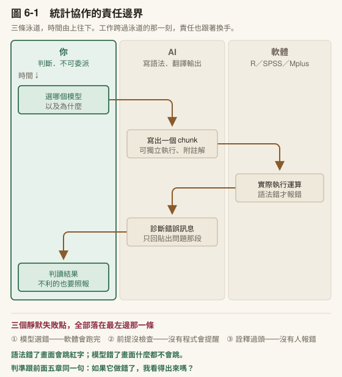
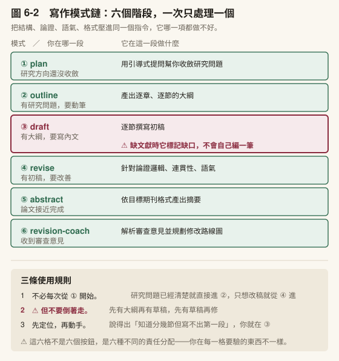
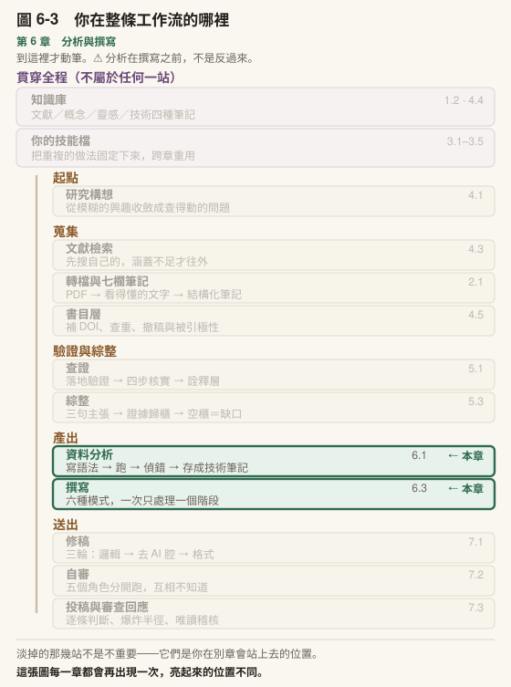

# 第 6 章　分析與撰寫

## 本章導覽

**這一章回答四個問題**

1. 統計工作裡，哪些可以交出去，哪些交出去就會出事？
2. 遇到一個你只知道名字的分析方法，怎麼辦？
3. 三句主張怎麼變成論文段落？
4. AI 寫出來的初稿，該用什麼標準驗收？

**讀完你能夠**

- **畫出**統計輔助的責任界線，並說明為什麼這是全書風險最高的委派區
- **建立**一個錨定在特定專書上的方法顧問，並驗證它的回答
- **操作**寫作模式鏈，主動餵素材而不是等它自己找
- **驗收**一段 AI 產出的初稿，逐句指出每句主張的證據來源

**需要多久**

自學閱讀約 60 分鐘｜課堂 3 小時（概念 90 分、實作 90 分）

**進來之前，你要能**

- 拿出一組查證過、而且標了驗證層級的筆記（5.1、5.2）
- 說出四步核實**抓不到**什麼（5.1）

第二題答不出來的話，本章你會過度信任自己手上的材料，而這一章正好是全書出錯代價最高的地方。

**開始前請準備**：一份你自己的統計輸出（任何軟體、任何分析都行）；你常翻的一本方法論專書或其中一章；第 5 章歸好的容器內容。

---

## 章前導言

第 5 章結束的時候，你手上有三句主張和歸好隊的證據。

接下來有兩件事要做，而**它們的順序不能顛倒**：先讓資料說話，再把它寫成字。

這句話聽起來像廢話，但實際上很多人是反過來做的。不是因為不懂，是因為寫作有一種假的進度感—— 你在文件裡打了兩千字，看得見、算得出來；而分析跑不出來的時候，螢幕上什麼都沒有。於是人會傾向先去寫那個看得見進度的部分，包括**在分析還沒收斂的時候就開始寫討論**。

那樣寫出來的討論，寫的是「文獻預期會發生什麼」，不是「我的資料說了什麼」。等分析真的跑完，那一節往往要整段重寫。而更麻煩的是另一件事： **先寫好討論再回頭看結果，你會傾向找到支持你已經寫下的那段話的東西。**

所以本章的順序就是流程本身的順序：6.1 與 6.2 處理分析，6.3 處理撰寫。

**先講清楚本章的邊界。** 本章不教統計方法。哪個方法適合你的資料、前提假設成不成立、效果量怎麼解讀，那是方法論課程與你的指導教授的事。本章教的是**當你已經知道要用什麼方法時，工具能替你做到哪裡，以及界線畫在哪**。而 6.2 處理的是另一種處境：**你連方法都還不熟的時候，怎麼建一個問得下去的對象。**

> **〔課堂〕開場 8 分鐘** 問全班：**「你上一次跑統計，有沒有哪一步是你照著做但說不出為什麼？」** 這個問題不是要抓人，是要建立本章的前提：說不出為什麼的那一步，就是你不能委派的那一步——因為**它做錯了你看不出來**。 ⚠️ 本章是全書風險最高的一章，這一點值得在開場就講明。引用錯了會被抓到，統計錯了往往不會。

---

## 6.1 統計輔助的責任邊界

### 它算不動你的資料

先講一件容易誤解的事：AI 通常沒有在幫你「跑統計」。

當你在對話中請它做一個 t 檢定，它做的不是計算。它讀不到你的原始資料檔，它產出的是**語法**：一段你貼回自己的統計軟體裡才會執行的程式碼。真正跑統計的是 R、SPSS、Mplus，是你電腦上那個軟體，不是對話視窗。

（有些入口確實可以讀取你電腦上的檔案並執行程式碼。就算如此，執行的仍然是它寫的語法，判斷語法對不對的責任沒有轉移。差別只在於複製貼上這一步省掉了。）

這個區分之所以重要，是因為它決定了哪裡會出錯。語法錯了，軟體會報錯，你立刻知道。**模型選錯了，軟體會安靜地跑完，給你一組漂亮的數字。**

〔動手一下〕想一個你做過的分析。如果當初模型選錯了，你會從哪裡發現？如果答案是「我不確定」，那就是這一節要處理的地方。

### R 路線：一個 chunk 一個問題

如果你用 R，最順的協作方式是 R Markdown 的分區塊執行。

R Markdown 的檔案由多個 code chunk 組成，每個 chunk 可以獨立執行。這個結構剛好對應了一個好的協作節奏：

```
前置設定 chunk（載入套件）
資料載入 chunk
資料清理 chunk          ← 出錯只重跑這裡
模型建立 chunk          ← 出錯只重跑這裡
結果輸出 chunk          ← 出錯只重跑這裡
```

協作的迴圈長這樣：

1. 你描述要做什麼分析，AI 產出一個可以獨立執行的 chunk
2. 你貼進 .Rmd，跑
3. 出錯 → 複製錯誤訊息和那一個 chunk（**不是整份檔案**）貼回去，讓它診斷
4. 修好 → 繼續下一個 chunk

第 3 步那個括號是重點。偵錯的時候只貼出問題的 chunk，理由有兩個：省脈絡（第 3 章講過的），以及讓它聚焦在真正的問題上。整份 .Rmd 貼進去，它會開始評論你其他部分的程式碼風格，那不是你現在需要的。

**三種最常用的請求，各有固定的形狀：**

**寫一個 chunk：** 說明你要做什麼分析、資料的欄位結構、要求 chunk 可以獨立執行並附註解。

**偵錯：** 貼錯誤訊息、貼出問題的 chunk、簡述資料長什麼樣子。三樣缺一不可，只貼錯誤訊息它只能猜。

**把輸出翻成論文語言：** 貼上 console 輸出，要求轉成 APA 格式的段落。這是整個統計協作裡最安全、CP 值最高的一項，因為它處理的是表述，不是判斷。

〔教你的 Claude 建這個〕**把你的程式慣例寫成一份規格檔，這樣你就不必每次重講。** 統計協作最惱人的不是它寫不出來，是**它每次寫出來的風格都不一樣**—— 這次用一種寫法，下次用另一種，同一份分析檔看起來像三個人寫的。貼這段：

「請幫我建一個〈分析程式風格〉技能檔。先問我五件事，**一次問完**：（一）我用哪個語言與哪些套件？（二）**變數命名**要什麼形式？（三）數值報告的格式——小數幾位、p 值怎麼寫、要不要去前導零？（四）**顯著性標記**用哪一套？有沒有我明確不用的（例如邊際顯著）？（五）產出要交到哪裡去——螢幕看、貼進論文、還是輸出成表？問完之後把答案整理成一份規格，**每一條都要寫成可以檢查的形式**，不要寫『程式碼要清楚易讀』這種沒辦法判斷對錯的句子。」

⚠️ **最後那句是這個檔案能不能用的關鍵。**「清楚易讀」它做不到也看不出來；「p 值三位小數、去前導零、下限寫 p < .001」它每次都做得到，你也每次都驗得出來。

**判準跟第 3 章 3.2 一樣**：**缺哪一條，會讓它必須用猜的？** 數值格式它一定會猜——而那正是投稿時被要求全篇改一遍的地方。

### SPSS 路線：先學會按 Paste

如果你的主力是 SPSS，運作邏輯不同但原則一樣：**軟體負責算，AI 負責寫語法和翻譯結果。**

有一個前提。多數 SPSS 使用者習慣點選單，這在協作上有兩個問題：分析過程無法重現，而且沒有任何東西可以貼給 AI 看。

解法很小：**選單操作到最後不要按 OK，改按 Paste。** SPSS 會把對應的語法貼進 Syntax 視窗。你不需要從零學語法，但你從此有了一份可重跑、可存檔、可貼給 AI 診斷的紀錄。

之後的協作跟 R 一樣：讓它寫語法（RECODE、COMPUTE、VARIABLE LABELS 之類），你貼回去跑；出錯貼錯誤訊息回來；跑出報表貼回去要 APA 段落。

〔補充〕**貼報表給 AI 的時候，貼的是統計結果，不是原始資料。** 平均數、係數、p 值、配適指標，這些沒有個資問題。含個案資料的原始資料列不要貼。如果你需要它看資料結構，貼變項清單，或去識別化的前三列就夠了。這一條在第 7 章 7.4 會再展開。

### 專業統計軟體：同一個模式

如果你的分析用的是 Mplus、HLM 這類專門軟體，協作模式跟上面兩條路線一樣，只是名稱換了：

**AI 寫語法 → 你執行 → 輸出回流 → AI 幫你翻譯成論文語言。**

這些軟體有自己的語法規則和輸出格式，而 AI 對它們的熟悉度通常不如 R。這帶出一條在專業軟體上特別要守的規則：

> **它對語法的任何宣稱，都要有證據。**

具體來說，當它告訴你「這個指令在這個版本會這樣運作」「這個選項可以這樣設定」，不要直接採信。跑一次看看，或者去查官方手冊。這不是不信任它，是因為冷門語法本來就是它最容易接龍出錯的地方，而錯誤的語法選項未必會報錯，可能只是安靜地做了另一件事。

〔補充〕**軟體越專門，你自己要懂得越多。** R 有龐大的社群討論可以支撐 AI 的訓練資料，專業軟體的資料量小得多。這不代表不能用它協作，而是代表你的驗收要更嚴。6.2 的做法在這裡特別有用。

### 界線畫在哪裡



〔圖 6-1〕把這一節講的協作攤成三條泳道：**你判斷、AI 寫、軟體算**。

看這張圖時請注意兩件事。

第一，**你那一條在最上面，不是最下面。** 這不是排版順序，是時間順序—— 你的四個動作全部發生在別人動手**之前**：選模型在它寫語法之前，檢查前提在軟體跑之前。**判斷留到最後才做就來不及了**，那時候你手上已經有一整套看起來很像回事的數字，而人很難推翻自己已經拿到的東西。

第二，圖下方那三個**靜默失敗點**全部落在你這條泳道上。「靜默」的意思很具體：**沒有任何一支程式會為它們報錯**。語法錯了畫面會跳紅字，模型選錯了畫面什麼都不會跳——它會跑完，然後給你結果。

把可以與不可以並排放，界線的位置就清楚了。

| AI 可以幫你 | AI 不能替你 |
|---|---|
| 寫出語法正確的程式碼 | 判斷哪個模型適合你的研究問題 |
| 偵錯並解釋錯誤原因 | 驗證資料品質與測量工具的效度 |
| 建議分析策略（你判斷適切性） | 解讀「為什麼」結果是這樣 |
| 把輸出轉成論文語言 | 保證分析邏輯與論文論點一致 |
| 提醒某方法的前提假設 | 決定違反假設時該怎麼辦 |

左欄跟右欄的差別不是難度，是**責任的性質**。左欄全部是形式層：語法對不對、格式對不對、表述通不通順。右欄全部是判斷層：這個模型能不能回答我的問題、這批資料撐不撐得住這個結論。

而這裡有一個第 1 章就出現過、到這一章變得最危險的性質：**它不會拒答。**

你問它「我的樣本 N=80，可以做結構方程模型嗎」，它不會說「這超出我能判斷的範圍」。它會給你一段有條件的、聽起來很專業的回答，可能還會引用某個經驗法則。那段回答可能是對的，也可能是把三個不同來源的建議混在一起接龍出來的。你無法從語氣分辨。

〔動手一下〕拿一個你自己的分析情境去問它一個方法選擇的問題，看它怎麼回答。特別注意它有沒有標明「這個建議的依據是什麼」。多數時候不會，而這正是 6.2 要解的問題。

> **〔課堂〕6.1 界線畫在哪裡，15 分鐘** 統計輸出轉 APA 段落現場演練。講師貼一份輸出（任何軟體），示範一次轉換，然後把 AI 產出的段落逐句檢查：哪些數字對？哪些詮釋是它自己加的？ **重點在最後那個檢查**，不在轉換有多方便。常見的自動加料：把相關講成影響、把顯著講成重要、把未檢定的差異寫成有差異。

### 帶走這一節

- 它產出的是**語法**，不是計算。真正跑統計的是你電腦上那個軟體
- 語法錯了會報錯，你立刻知道；**模型選錯會安靜跑完，給你一組漂亮的數字**
- 偵錯只貼出問題的那一段，不貼整份檔案
- SPSS 使用者最小的改變：選單操作到最後**按 Paste 不按 OK**
- 界線不是難度，是責任性質：左欄形式層可委派，右欄判斷層不可
- **它不會拒答。** 語氣分辨不出它的建議是整合來的還是接龍來的

---
---

## 6.2 當你遇到不會的方法

### 一個真實的處境

你的研究問題需要一個你沒學過的方法。可能是你的資料有巢狀結構、可能是你要處理縱貫追蹤、可能是審查者要求你補一個你只在論文裡讀過名字的分析。

傳統上你有三條路：找懂的人問、去修一門課、把那本厚厚的方法論專書搬出來自己啃。三條路都對，但都很慢。而現在多了一條看起來很快的路：問 AI。

6.1 已經說了這條路的問題：它會回答，但你無法分辨那個回答的依據是什麼。它可能整合了教科書的正確說法，也可能把不同學派的建議混成一段。

有一個做法可以解決這件事，而且它同時是這本書從第 3 章開始鋪的那條暗線的收束點。

### 把一本書變成一個顧問

第 3 章教你建立自己的技能。第 4 章你用它跑文獻管線。本章 6.3 你會用它寫作。這些都是別人設計好的工具。

現在做一件不同的事：**把你領域的權威教科書轉成你自己的技能。**

原理不複雜。一本方法論專書拆解之後，包含幾類東西：核心框架、判斷規則（樣本數要多少、配適指標的門檻在哪）、術語定義、以及各章的具體方法。把這些結構化地萃取出來，存成一個技能，你就得到一個**會引用書中規則回答問題的顧問**，而不是一個憑接龍生成建議的對話。

實際的操作流程大致是：

1. 給它書的檔案，說明你要把它轉成技能
2. 它會問這是哪種內容（含公式表格的技術型 vs 以敘述為主的文字型），這決定萃取策略
3. **它會先給你一份成本估算**：這本書多少頁、大約要花多久。厚的書可以先要求它「只分析不生成」，看一份萃取報告（偵測到哪些框架、哪些章節、建議的技能名稱），確認方向對了再正式轉換
4. 它會問這個技能要幫你做什麼（套用作者框架？用作者的思考方式？純查閱？），這決定產出的深度
5. 生成。產物通常是一個主檔（核心框架與索引，永遠載入）加上分章檔案（用到才載入）

第 5 點的結構呼應第 3 章講的脈絡管理：不是把整本書塞進對話，而是切塊，需要哪一章才載入哪一章。

然後你就可以直接問：

> 用這本書的框架，判斷我這個分析的樣本數夠不夠。

> 這本書建議的配適度指標門檻是多少？在什麼條件下可以放寬？

差別在哪裡？**它回答的時候是在查一本你選定的書，而不是在接龍。** 你知道它的依據是什麼，你可以翻回去核對，你也知道當這本書的立場跟另一個學派不同時，它給你的是哪一邊。

〔教你的 Claude 建這個〕**萃取結構，不要摘要。** 這是整個轉換成敗的分水嶺，所以要寫進指令裡。貼這段：

「我要把〔書名〕轉成一份我自己的方法顧問技能。 **請萃取結構，不要寫摘要。** 我要的是五類東西：（一）**有名字的框架**——作者替它取的名字要原樣保留，**不要換成你覺得比較好懂的同義詞**；（二）**可行動的判斷規則**——門檻值、樣本量建議、什麼情況下可以放寬；（三）**步驟方法**；（四）**反面樣式**：作者說不要做什麼，以及為什麼；（五）作者的**判斷傾向**——他在兩派說法之間站哪一邊。先**只做分析不要生成檔案**：給我一份清單，列出你偵測到哪些框架、分佈在哪幾章、建議切成幾個檔案。我確認之後再生成。」

**「不要換同義詞」那一句不是龜毛。** 框架的名字是你回頭查書的索引：名字被改掉，你就查不回原文，這份技能也就失去它唯一勝過一般對話的地方——**可核對**。

**「先只做分析不要生成」那一句省下的是整個下午。** 厚的書轉一次要很久，而你多半到看見萃取清單才會發現方向不對——例如它把整本書的重點放在你不需要的那三章。

〔補充〕**這不會取代你讀書。** 你仍然需要理解那個方法在做什麼，否則你連問對問題都做不到。它取代的是「每次都要翻回去查**那本書**第 8 章第 3 節的那張表」這件事。判斷是你的，查表是它的。這正是本書從第 1 章講到現在的同一條界線。

### 這就是「工具會成長」的意思

回頭看你走過的路。

第 3 章你從一個摩擦點出發，寫了一個只有〈使用者背景〉的技能。第 4 章你把文獻筆記的七欄規格加了進去，並發現有個欄位老是抓錯方向，你又改了一次。本章 6.3 你在寫作的時候發現某個格式要求每次都要重講，你也把它寫進去。

現在你把一本書變成了一個技能。

這四步是同一件事的四個階段：**你的工具正在往你的方向長。** 而它從第一天起就是**你的**，因為它的每一段都源自你自己遇到的摩擦，不是從別人那裡繼承來的。

這一點值得停一下。如果第 3 章你抄了一個現成的技能來改，你現在擁有的會是一個「大致堪用但你說不清楚為什麼那樣設計」的東西。而你自己長出來的這個，每一行你都知道當初為什麼加。**能不能說出為什麼，決定你未來能不能判斷它該不該改。**

這個過程沒有終點，而且它的價值會隨時間複利累積。你今天花一小時把一本書轉成技能，未來三年每次遇到相關問題都省下翻書的時間。你今天花十分鐘把一個修改寫進技能，未來每一次呼叫都不用重講。

**目標不是做出完美的工具，是讓每次產出只需要你調整兩成，而不是八成。**

### 一套長大的工具長什麼樣

你可能會想問：長到最後是什麼樣子？

我自己那一套已經改過十幾輪。它處理引用查核、論文撰寫、審查回應、統計分析這幾件事。把它們攤開來看，有十二個反覆出現的設計，而**這本書前面已經教過每一個的種子**。

舉三個最有代表性的。

**第一個是角色分工。** 第 3 章教你指定 AI 的表現（Performance），成熟版是三個利害衝突的角色接力：一個負責找出可用的來源，一個負責逐筆質疑並在打掉之後給替代方案，第三個只看跨筆的一致性（同一個主張有沒有前後用了兩種強度）。三者的動機是衝突的，正因為衝突才互相抓得到。 ⚠️ 最小可用版只要兩個角色，但**不要在同一次對話裡**：同一次對話裡它記得自己剛寫了什麼，於是質疑會客氣。

**第二個是人的關卡。** 第 4 章 4.2 那張風險表（可偵測性 × 不可逆性）在成熟工作流裡變成流程中途的強制停點。我的審稿回應工具有三個關卡，全部落在同一種位置：這一步做下去就難回頭。其中一個關卡帶著一條硬規則——補跑的統計若結果不利於原結論，不得靜默不報。那條規則不是禮貌，是把誠信寫成機制。

**第三個是迴圈上限。** 本書第 7 章的修稿三輪，其實就是這個模式：迴圈沒有上限就會一直改，而每一輪的邊際收益遞減、風險遞增。改久了你會把原本對的地方改壞。

其餘九個（模式路由、階段編號、逐項判準清單、前置存在查核、覆蓋範圍聲明、反面規則、技能間分工、規格化交接、版本與變更紀錄）連同**十二個模式的長出順序**與三份可以直接貼的範本，全部收在**附錄 F**。

那份附錄裡最重要的一節不是模式清單，是那張長出順序表。它的第一列只有一件事：第一週只寫一段〈使用者背景〉。原因不是那樣比較容易，是**其餘十一個模式都需要「你已經知道自己的摩擦在哪」這個前提**，而那個前提只能靠實際用出來。反過來做的後果很具體：你花一個下午設計了三種模式、七項判準、兩個關卡，然後發現你猜的摩擦點不是真的摩擦點，整套沒有一項用得上。

〔補充〕**為什麼這一段講的是「我的」工具而不是「正確的」工具。** 你長不出跟我一樣的十二個模式，你會長出你自己的那幾個。每一個模式都對應一次被自己的工具坑到的經驗：模式路由來自「它太慢我不想用」，反面規則來自「它又做了那件事」，覆蓋範圍聲明來自「我以為它檢查過了」。**抄來的模式解決的是我的摩擦，不是你的。**

> **〔課堂〕6.2 建技術顧問，30 分鐘實作** 學生現場把一本方法書（或一個章節）轉成技能，並實際提問。 **課前必做**：確認學生手上有電子檔，並先自己跑過一次確認流程與耗時。厚書可能要跑十分鐘以上，課堂時間不夠的話改用單一章節。提問環節比生成環節重要，留至少 10 分鐘讓學生問自己領域的真問題。

### 帶走這一節

- 把書轉成技能，差別在於**它回答時是在查一本你選定的書，不是在接龍**
- 你知道依據是什麼、可以翻回去核對、也知道學派分歧時它站哪一邊
- 產物切塊：主檔常駐、分章按需載入，這是第 3 章脈絡管理的應用
- **它不取代你讀書。** 取代的是每次翻回去查那張表
- 裝技能 → 改技能 → 寫進品質標準 → 把書變顧問，這四步是同一件事的四個階段
- 目標不是完美的工具，是**每次產出只需要你調整兩成**
- 一套長大的工具有十二個反覆出現的設計，**本書前面教過每一個的種子**（完整版見附錄 F）
- 那十二個有依賴順序，**第一週只寫一段〈使用者背景〉**；其餘都需要你先知道自己的摩擦在哪

---
---

## 6.3 寫作模式鏈

### 六種模式，一條管線

第 5 章 5.3 處理的是寫作之前的事。現在你有了三句主張（或兩句，或被 AI 修正過的四句），下一步是把它們寫成論文段落。

一般人使用 AI 寫作的方式是這樣的：把所有要求寫在一個對話視窗裡，收到一段文字，改一改，再請它改另一段。這個做法的問題不在效率，在於你把論文的所有需求壓進同一個指令：結構、論證、語氣、格式全部一次要到位。AI 在接龍的時候要同時顧太多維度，哪個都做不好。

寫作工具把這件事拆開了。它定義了六種模式，每一種只處理論文生命週期的一個階段：

| 模式 | 什麼時候用 | 做什麼 |
|---|---|---|
| plan | 研究方向還沒收斂 | 透過引導式提問幫你收斂研究問題 |
| outline | 有研究問題，要動筆 | 產出逐章、逐節的大綱 |
| draft | 有大綱，要寫內文 | 逐節撰寫初稿 |
| revise | 有初稿，要改善 | 針對論證邏輯、連貫性、語氣 |
| abstract | 論文接近完成 | 依目標期刊格式產出摘要 |
| revision-coach | 收到審查意見 | 解析意見並規劃修改路線圖 |



〔圖 6-2〕六個階段攤成一條管線，右下角三條是使用規則。 **draft 那一格用紅框標出來**，因為它是唯一一個「它可能替你生出東西」的階段—— 下一小節整節在講那件事。

從上到下是一條管線。你不需要每次都從 plan 開始。如果你的研究問題已經清楚，直接從 outline 進入；如果你有初稿只是想改好，從 revise 開始。但順序不要倒著來：先有大綱再有草稿，先有草稿再修。

〔動手一下〕想一下你現在手上的寫作任務，你在管線的哪一段？如果你說得出「我知道要分哪幾節，但就是寫不出第一段」，你在 draft 階段。如果你已經寫完初稿但覺得論證不夠有力，你在 revise 階段。先定位再動手。

### 主動餵文獻，不是等它自己找

寫作模式鏈裡有一個設計，如果你不理解它的原因，你就不會照做。

當 AI 在 draft 模式寫到一段需要引用文獻的地方，如果你沒有在對話中提供那篇文獻的筆記或內容，它不會自己去找一個「看起來合理」的引用（那正是第 5 章講的引用幻覺的產生方式）。正常設計的寫作工具會標記 `[MATERIAL GAP]`，告訴你「這裡需要文獻支持，但你沒給我素材」。

這不是工具的缺陷，是刻意的設計。它的邏輯是第 1 章就講過的：AI 擅長的是把你給它的東西重新組合，不擅長的是從零生成事實。所以正確的做法是**你主動餵文獻**，而不是期待它自己找。

但這個標記有一個限制，而且它直接來自第 1 章的結論：**它無法可靠地區分自己知道與不知道。** 所以標記抓得到的，是它意識到「這裡需要引用而我沒有素材」的地方；抓不到的，是它以為手上的素材夠、實際上那段素材撐不起那個主張的地方。

判準因此是不對稱的：**標記出現，你一定要處理；標記沒出現，不代表沒問題。** 這跟第 2 章的結論是同一件事，驗證那一步不會因為工具設計得好而省掉。

而你能餵它什麼？正是第 4 章建的那個知識庫。

流程是這樣的：你在 draft 模式寫到一段關於「同儕回饋的效果」的論述，你知道 5.3 步驟二的容器裡有哪些證據片段可以支持這段。你把那些片段（連同來源論文的筆記）貼進對話中，然後讓 AI 在這些素材的基礎上幫你組織段落。它能做的是調整表述、連接段落、處理引用格式；你做的是決定哪些證據用、用在哪裡、支持多強的主張。

這是第 3 章講的「把狀態寫進檔案」的實際應用。你的知識庫不是裝飾品，它是你餵給 AI 的原料。知識庫的品質直接決定了寫作輸出的品質。

〔補充〕**如果你用的是 Projects 或 Cowork 入口**，你的知識庫（Obsidian vault）可以直接作為 AI 可讀取的來源，不需要每次手動複製貼上筆記。具體設定方式見附錄 A。但即使技術上做得到自動讀取，你仍然要告訴它讀哪些筆記，而不是讓它自己挑。**選材是你的工作。**

### 六種模式不是六個按鈕

一個容易產生的誤解是：有了六種模式，寫論文就變成了按六次按鈕。plan 按一下、outline 按一下、draft 按一下，最後把結果貼在一起。

這不是它的運作方式。

每一種模式都是一次**對話**。你跟 AI 來回好幾輪，逐步收斂出一個成果。plan 模式會問你問題（你的研究問題是什麼？為什麼值得研究？有沒有類似的研究？），你的回答決定了它下一步問什麼。draft 模式寫一段出來，你看了覺得某個論證不對，回頭要它改，這些往返才是真正的工作。

模式定義的是每一次對話的**焦點**，不是自動化的步驟。它的價值在於幫你一次只想一件事：想結構的時候不擔心措辭，想措辭的時候不擔心格式。

〔教你的 Claude 建這個〕**把模式做成一個路由表，而不是六個檔案。** 六種模式各建一個檔案是很自然的想法，**但那會讓你每次都要先決定開哪一個**—— 而你多半是寫到一半才發現自己需要換模式。貼這段：

「請幫我建一個〈寫作模式〉技能檔，用**一個檔案裝六種模式**。開頭放一張路由表：**我說什麼、你就切到哪一種模式**，每種模式一行說明它的焦點。六種是：規劃、大綱、草稿、修訂、格式、審查回應。兩條硬規則要寫進去：（一）**切換模式之前先告訴我你要切了，並說一句為什麼**——不要安靜地換做法；（二）**草稿模式只能用我提供的材料**。需要引用但我沒給素材的地方，標記 `[材料缺口]`，**不要自己補一個看起來合理的**。最後問我：這六種裡，我最常在哪一種卡住？那一種要寫得比其他五種細。」

⚠️ **第一條防的是一個很難察覺的失敗**：你以為它還在幫你想結構，它其實已經在幫你潤詞了——於是你放過了一個結構問題，卻收到一段讀起來很順的文字。 **讀起來越順，你越不會回頭檢查結構。**

〔補充〕**為什麼要它「說一句為什麼」。** 這一句的價值不在讓它解釋，在於**你會看到它對你當下處境的判讀**。它說「我切到修訂模式，因為你的大綱已經定了」，而你其實還沒定——這時候你就知道，你們兩個對進度的認知從剛才某一刻起就分岔了。

> **〔課堂〕6.3 draft 模式現場示範，10 分鐘** 全班看一次完整的 draft 模式示範。講師挑一段已經有大綱的內容，示範： 1. 先貼大綱和相關的文獻筆記 2. 收到初稿後逐段閱讀，標出「這句不對」的地方 3. 來回兩輪修正重點不在看產出有多好，而是看「人的判斷介入了幾次」。

### 帶走這一節

- 模式鏈的價值是**一次只想一件事**：想結構時不擔心措辭，想措辭時不擔心格式
- 順序可以從中間進入，但不要倒著走：先大綱、再草稿、再修
- **材料缺口標記不是缺陷，是設計**。它寧可告訴你少了素材，也不自己補一個看起來合理的引用
- 所以要**主動餵文獻**。你的知識庫不是裝飾品，它是餵給 AI 的原料
- 六種模式不是六個按鈕，每一種都是一次來回收斂的對話

---
---

## 6.4 教育研究實例：一份研究計畫的六週

一位博士生要在六週內完成研究計畫初稿。她的題目涉及一個她只在課堂上聽過的分析方法。

**第一週**，她把手邊二十幾篇論文跑完文獻筆記管線。過程中她發現有五篇其實跟她的題目關係不大，這件事在只看標題和摘要的時候看不出來。她刪掉那五篇，剩下的十八篇進了知識庫。

**第二週**，她跑綜整四步驟。三句主張寫出來之後，第三個容器只有一篇論文。她把那個假設改寫成研究問題，這後來成為她計畫書裡最有價值的一段。

**第三週**，她卡在方法。她需要的分析方法，她只知道名字。她把該領域的方法論教科書轉成技能，花了一個下午。然後她開始問問題：這個方法的前提假設是什麼？我的資料結構符合嗎？樣本數的建議是多少？

她問到第四個問題的時候，發現一件事：**她的資料結構不符合那個方法的前提。** 這件事如果她沒有問，會在資料收集完之後才發現。

**第四週**，她改用另一個方法，並且請 AI 幫她寫了模擬資料的分析語法，先跑一次確認流程會通。她把跑通的流程存成技術筆記。

**第五週**，她用寫作模式鏈寫初稿，把綜整階段歸好的證據片段一個容器一個容器地餵進去。文獻回顧那一節，她看到三處材料缺口標記，其中兩處她補了文獻，一處她發現是自己的表述讓論證顯得比實際更強，她把主張改弱了。

**第六週**，她跑修稿三輪（第 7 章），然後把計畫書交給指導教授。她在附件裡放了一份 AI 使用聲明，四類資訊都寫齊了。教授回信問的第一個問題是關於第三週那個方法轉換，因為那是計畫書裡最關鍵的判斷。

她答得出來。因為那個判斷是她做的。
---

## 6.5 動手實作

### 實作一：統計輸出轉 APA 段落（20 分鐘）

拿出你準備的統計輸出（任何軟體、任何分析都可以）。

1. 貼進 Claude，要求轉成 APA 格式的中文論文段落（5 分鐘）
2. **逐句檢查它產出的段落**（10 分鐘）：
- 每個數字都對嗎？
- 有沒有它自己加上去的詮釋？（常見：把相關寫成影響、把顯著寫成重要）
- 有沒有你的輸出裡沒有的資訊出現在段落裡？
3. 記下你抓到的問題（5 分鐘）

### 實作二：建立你的技術顧問（30 分鐘）

拿出你常翻的那本方法論教科書（或其中一章）。

1. 轉成技能。厚書先要求「只分析不生成」，看萃取報告確認方向（15 分鐘）
2. 生成完成後，問它三個你自己領域的真問題（15 分鐘）
3. **挑一個回答，翻回書裡核對。** 它引的規則對嗎？有沒有漏掉條件？
### 跑通之後，把它寫下來

一個分析跑通的當下，你腦子裡有全部的脈絡：為什麼用這個參數、那個錯誤訊息是什麼意思、哪一步順序不能換。**三個月後這些全部會消失**，而你下次遇到同一個問題時，會從頭再debug 一次。

技術筆記處理的就是這件事。它跟概念筆記不同：概念筆記記你想通了什麼，技術筆記記**怎麼做**。

我自己那個產技術筆記的工具，模板有兩條硬規則值得抄：

**第一，程式碼要能直接複製貼上執行，說明文字放在程式碼外面，不要塞進註解裡。** 理由很實際——你未來是**貼**它，不是**讀**它。註解裡的說明會跟著被貼進去，還要手動刪。

**第二，每個步驟的程式碼區塊控制在十到二十五行，超過就拆成子步驟。** 這個限制不是排版潔癖：一個超過二十五行的區塊，代表那一步其實包含好幾件事，而**你未來出錯時會不知道是哪一行壞了**。

還有一條容易漏的：**判斷標準要寫進去**。「跑出來 fit 不好就調整」是沒有用的筆記，未來的你不知道多少算不好。要寫的是具體門檻，以及**那個門檻是誰訂的**——因為門檻會隨領域慣例變動，寫了出處你才知道要不要跟著改。

---

### 實作三：用 draft 模式寫一段（40 分鐘）

前兩個實作處理的是分析，這一個處理撰寫。用你在第 5 章歸好的容器，實際寫出一段。

**第一步：準備素材（5 分鐘）**

挑一句主張，把它的容器內容整理出來：三到五則證據片段，每一則附上來源筆記與驗證層級。

沒有做過第 5 章綜整的人，這一步會卡住。**卡住本身就是這個實作的第一個發現**—— 你會發現自己手上有的是「讀過的論文」，不是「歸好隊的證據」。

**第二步：餵素材、要初稿（10 分鐘）**

```text
我要寫一段文獻回顧。

我的主張：〔一句話〕

我的素材（只用這些，不要引入任何我沒給的文獻）：
1. 〔證據片段〕｜來源：〔作者年份〕｜驗證層級：〔全文／摘要／僅書目〕
2. ...
3. ...

請寫成一段中文學術段落。規則：
- 只用上面的素材。**需要引用但我沒給素材的地方，標記 [材料缺口]，不要自己補**
- 驗證層級為「摘要」或「僅書目」的來源，措辭要相應保守
  （可以說「已有研究探討」，不能說「研究發現 X 導致 Y」）
- 不要用「綜上所述」「值得深入探討」這類過渡語
- 每一句主張後面標出它用的是第幾則素材
```

最後那一條是這個實作的關鍵。**要它標出每句話用了第幾則素材**，你才驗得動。

**第三步：逐句驗收（15 分鐘）**

拿它標的編號，逐句回頭對：

- 這句話說的，第 N 則素材真的支持嗎？還是它推遠了一步？
- 有沒有哪一句**沒有標號**？那就是它自己長出來的
- `[材料缺口]` 出現在哪裡？那是你真的缺文獻，還是你的表述方式讓它以為需要引用？

**第四步：記錄（10 分鐘）**

寫 200 字：它推遠了幾句、你補了幾處材料缺口、以及**有沒有哪一處是你原本沒發現自己缺依據的**。

〔補充〕第三步如果你發現「每一句都有標號、每一則素材都對得上」，先別急著高興。再問自己一次：**那段話有沒有說出任何一句只有你會說的話？** 沒有的話，你得到的是一份正確的摘要，不是一段有立場的文獻回顧。那是迷思四講的事。

**轉 APA 最常見的三種加料**，逐句檢查時盯這三個：

1. 把**相關**寫成**影響**（你的輸出裡沒有因果，它自己補上去的）
2. 把**顯著**寫成**重要**（統計顯著不等於實質重要，這是兩件事）
3. 把**未檢定的差異**寫成**有差異**（描述統計看起來有落差，它就替你下結論）

三種都有一個共同形狀：**它把你的輸出往「更有話可說」的方向推了一格。** 這正是它擅長的接龍在做的事，不是它想騙你。

**建技術顧問的成本控制**：厚書先要求「只分析不生成」，看一份萃取報告確認方向對了再正式轉。跑錯方向再重跑，成本是雙倍的。
### 技能要點

| 實作 | 關鍵動作 | 做對了長什麼樣 | 常見卡點 |
|---|---|---|---|
| 一 · 轉 APA | **逐句比對**它加了什麼 | 你抓到至少一處它自己加上去的詮釋 | 讀起來很順就收下。順是它最擅長的事，**順不是你要檢查的維度** |
| 二 · 技術顧問 | 挑一個回答**翻回書裡核對** | 你確認它引的規則對，或抓到它漏了條件 | 只驗生成不驗回答。生成成功很有成就感，但這個實作的價值全在核對那一步 |
| 三 · draft | 要它**標出每句話用了第幾則素材** | 每一句都指得出證據，指不出來的你自己抓得到 | 讀起來順就收下。**形狀正確會讓人低估要改的幅度** |

**三個實作是同一個動作的三種場景**：都是「它給了東西，你逐項回頭對」。差別只在對的東西不同——實作一對數字，實作二對書，實作三對你自己的筆記。

三個實作的常見卡點也是同一個：**順**。它產出的東西一定是順的，那是它的本業。順不是驗收標準，**對得上才是**。

### 當週小task

繳交四樣：

1. 統計輸出轉 APA 的比對紀錄（含你抓到的加料，至少一處）
2. 你建的技術顧問，以及一則「翻回書裡核對」的紀錄
3. 一段 draft 產出的文獻回顧，**逐句標註證據來源**
4. 三行使用聲明（格式見第 1 章）

第 3 項若有任何一句標不出來源，**照實留著並標記**，不要刪掉湊完整。標不出來的那幾句才是這份作業要看的東西。

---

## 6.6 常見迷思

**迷思一：「AI 給的統計建議可以直接用，反正它讀過所有方法論教科書。」**

*為什麼錯*：它讀過的是文字，不是理解。而且方法論本身存在學派分歧，同一個問題不同教科書給的門檻不一樣。它會給你一個平均值，而那個平均值在你的具體情境裡可能兩邊都不對。更麻煩的是它不會標明依據，你分辨不出這個建議來自哪裡。

*正確版本*：把判斷依據固定下來（6.2 的做法），或者去問一個真的懂的人。方法選擇是這整條工作流裡最不該省的一步。

**迷思二：「AI 改過的稿子比我自己寫的好。」**

*為什麼錯*：AI 改出來的稿子通常是「正確但無味」。語法正確、邏輯完整、術語到位，但讀起來像一段沒有立場的百科全書條目。這種文字在審查者眼中不是好的學術寫作。好的學術寫作有觀點、有判斷、有「為什麼這樣想而不是那樣想」的痕跡。

*正確版本*：AI 改過的版本是素材，不是成品。你要做的是在它處理完邏輯和格式之後，把你的聲音放回去。

**迷思三：「先把文獻回顧寫完，再開始跑分析。」**

*為什麼錯*：文獻回顧確實可以先動筆，但**你的結果與討論寫不出來，除非分析先跑過**。多數人卡住的不是文獻回顧，是在分析還沒收斂的時候就開始寫討論——於是寫出來的討論是「文獻預期會發生什麼」，而不是「我的資料說了什麼」。等分析真的跑完，那一整節往往要重寫。

更麻煩的是一種順序造成的偏誤：**先寫好討論，再回頭看結果，你會傾向找到支持你已經寫下的那段話的東西。**

*正確版本*：本章的順序不是排版方便，是流程本身的順序。**先讓資料說話（6.1、6.2），再把它寫成字（6.3）。** 文獻回顧可以平行進行，結果與討論不行。

**迷思四：「draft 模式寫出來的初稿，改一改就能用。」**

*為什麼錯*：draft 產出的是**形狀正確的段落**——有起承轉合、有連接詞、有學術語域。形狀正確會讓人低估要改的幅度，因為它讀起來不像草稿，讀起來像成品。真正要改的往往不在句子層，在**哪些證據被放進來、放在哪個位置、撐了多強的主張**，而那一層看起來完全沒問題。

*正確版本*：初稿的驗收標準不是「讀起來順不順」，是「**每一句主張，我指得出它的證據在哪一則筆記的第幾欄嗎**」。指不出來的，不是改寫的問題，是那句話本來就沒有依據。

---

> ### 〈責任落點〉 - 選擇統計模型、判斷資料品質、解讀結果：**你**。這是全書風險最高的委派區 - 決定哪些資料可以進入對話：**你**，並以機構規範為準 - 判斷一個方法顧問的回答對不對：**你**。它錨定在那本書上，但引對條文是另一回事 - 決定哪些證據進哪一段、撐多強的主張：**你**。這是選材，不是排版 - 初稿裡每一句主張的依據：**你**。它標不出來的地方，你要標得出來 - 工具負責的是：語法、偵錯、翻譯輸出、查它被餵過的書、把你給的素材組織成段落

---

## 6.7 章末整理

### 三句話帶走

1. **先讓資料說話，再把它寫成字。** 反過來做，你會找到支持你已經寫下那段話的東西。
2. 統計是全書風險最高的委派區，因為**它的錯誤最不容易浮出水面**。
3. 初稿的驗收標準不是「讀起來順不順」，是「**每一句主張，我指得出它的證據在哪裡嗎**」。

### 回到開場

開場問你：上一次跑統計，有沒有哪一步是照著做但說不出為什麼。

如果有，那一步就是你這一章真正要處理的。6.2 給的做法不是替你學會它，是給你一個**問得下去的對象**—— 一個錨定在你選的那本書上、而不是錨定在機率接龍上的顧問。

但注意 6.2 那句但書：**這不會取代你讀書。** 你仍然要理解那個方法在做什麼，否則你連問對問題都做不到，也分辨不出它的回答有沒有漏掉條件。



〔圖 6-3〕**亮起來的是這一章教的位置，淡掉的是你在別章會站上去的地方。** 到這裡才動筆。圖上的順序就是本書的主張：**分析在撰寫之前**——先知道資料說了什麼，才有東西可寫。

### 下章預告

初稿寫出來了。第 7 章處理它離開你的手之前的最後幾件事：**修稿、投稿、回應審查**。

那一章也會把整本書收攏。全書七章的〈責任落點〉會合成一張表，而你會發現它們其實是同一個判準的七次應用：**如果它做錯了，我看得出來嗎？**

---

## 延伸資源

**外部資源**

- **統計方法論教科書**：6.2 把書轉成方法顧問，需要你自己選一本。挑你這個領域引用率高、而且你已經有電子檔的那一本。**這一本選錯不會壞掉，會更麻煩：它照樣答得頭頭是道，只是用你的審查者不使用的那一套術語與判準在答。** 挑「有名的」不如挑「你領域的人會拿來吵架的」那一本
- **Skills 官方文件**：[https://code.claude.com/docs/en/skills](https://code.claude.com/docs/en/skills) 6.2 把書轉成技能之後，你遲早會想自己改它。這一頁是改的依據。特別注意它講的一個判準：**當你發現說明檔裡的某一段已經從「事實」長成「程序」，那就該把它抽出來變成技能。**
- **Anthropic — Best practices for Claude Code**：[https://www.anthropic.com/engineering/claude-code-best-practices](https://www.anthropic.com/engineering/claude-code-best-practices) 雖然是寫給工程師的，但其中兩點跟本書完全重疊：**先研究再規劃、不要讓它直接動手**，以及**多數最佳實務都源自同一個限制：脈絡會很快填滿，填滿之後品質下降**。後者就是第 3 章 3.2。

**本書其他章節**

- **第 3 章 3.2**：脈絡管理。6.2 的「產物切塊、按需載入」是它的直接應用
- **第 3 章 3.4**：建你自己的技能。6.2 的方法顧問是它的最完整形式
- **第 4 章**：文獻蒐集與知識庫。6.3 主動餵的素材全部來自那裡
- **第 5 章 5.3**：綜整四步驟。6.3 餵進去的容器就是那一節歸好的
- **第 7 章**：修稿、投稿與審查。本章產出的初稿，下一章送它出門
- **附錄 C**：Prompt 範本（含本章 6.5 實作三的骨架）

---
