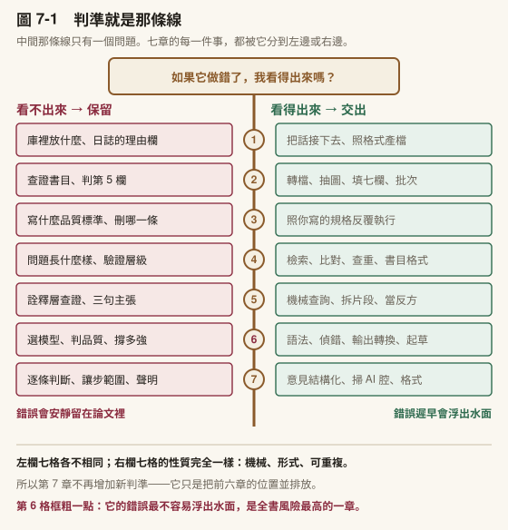
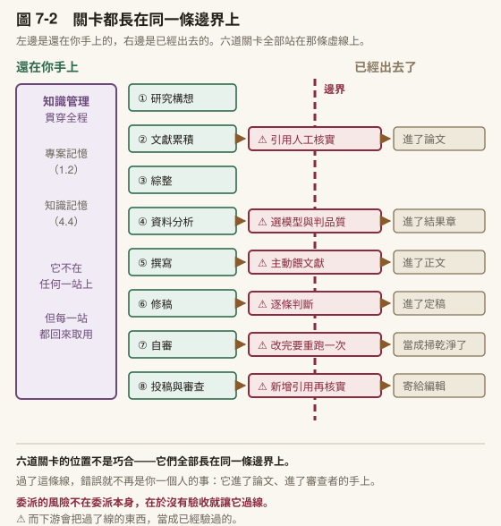
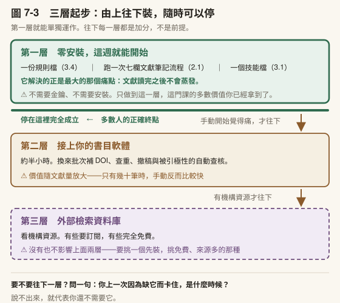
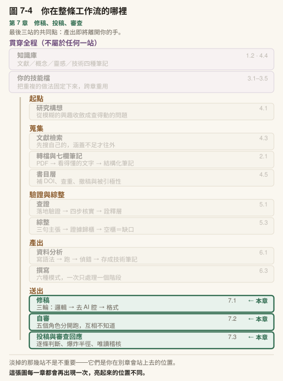

# 第 7 章　修稿、投稿、審查與誠信收束

## 本章導覽

**這一章回答五個問題**

1. 一份初稿要怎麼改，才不會把自己的聲音改掉？
2. 投稿之前怎麼看見自己看不見的問題？
3. 審查意見進來了，逐條照做為什麼是錯的？
4. 七章講的誠信，合起來到底是幾件事？
5. 課程結束之後，你該帶走什麼？

**讀完你能夠**

- **執行**修稿三輪（邏輯 → 去 AI 腔 → 格式），並逐條判斷而非全盤接受
- **執行**投稿前的自我審查，含逆向大綱與主張證據對照兩項徒手檢查
- **拆解**審查意見並決定接受／部分接受／拒絕的策略與理由
- **寫出**一份可被查證的 AI 使用聲明，含四類必要資訊
- **設計**一份課堂 AI 使用政策，每條界線都說得出理由
- **說明**全書七章的〈責任落點〉如何收束為同一個判準

**需要多久**

自學閱讀約 75 分鐘｜課堂 3 小時（概念 75 分、實作 105 分）

**進來之前，你要能**

- 拿出一份**你自己寫的**草稿，哪怕只有一節（6.3）
- 說出統計協作那條責任邊界上，哪幾個判斷不能交出去（6.1）

**開始前請準備**：一段你自己寫的、覺得「講不清楚」的段落；一份你收過的審查意見或指導教授回饋（沒有的話講師會提供模擬版）。

---

## 章前導言

第 6 章結束的時候，你有一份初稿。

這一章處理它離開你的手之前的最後幾件事——而「離開你的手」正是這一章所有內容的共同軸線。

回想第 6 章講的：AI 產出的初稿讀起來像成品，不像草稿。那個「像成品」的錯覺，在稿件即將寄出去的時候最危險，因為那是最後一個能攔住錯誤的位置。過了這個點，發現問題的就不是你了，是審查者、是讀者、是引用你的人。

所以本章的前四節其實在做同一件事：**在產出離開你之前，再看一次。**

7.1 是你自己看（修稿），7.2 是投稿之前換一副眼睛（自審）， 7.3 是別人看完之後你怎麼回應（審查），7.4 則把全書七章的〈責任落點〉合起來，講清楚**你到底在對什麼負責**。

最後 7.5 處理一個很實際的問題：課程結束之後，這一整套東西怎麼不變成一疊沒人用的筆記。

> **〔課堂〕開場 6 分鐘** 問全班：**「你上一次收到修改意見，有沒有哪一條你其實不同意，但還是照改了？」** 多數人有，而且說得出是哪一條。那個「不同意但照改」的瞬間，就是 7.1 與 7.3 要處理的東西。 ⚠️ 不要把這個問題導向「要勇於反駁」。重點不是反駁，是**你有沒有做判斷**。全盤接受跟全盤拒絕一樣，都是把判斷讓出去。

---

## 7.1 修稿三輪

草稿寫出來了。接下來是改。

改稿也可以一次到位，把初稿貼進去，說「幫我改好」。結果跟把所有需求壓進一個指令一樣：什麼都改了一點，什麼都沒改到位。

實務上比較有效的做法是分成三輪，每一輪只盯一件事。三輪在同一個對話裡完成，讓 AI 能看到前一輪改過的版本。

### 第一輪：邏輯

第一輪的唯一焦點是**論證結構**。不管措辭漂不漂亮、格式對不對，只看：

- 每一段的主題句有沒有在支持這一節的主張
- 段落之間的邏輯順序對不對（是否倒果為因、跳躍推理）
- 引用是在支持你的論點，還是在裝飾

你貼入你的段落，要求只針對邏輯做修改，不動語氣和格式。它回來的修改會逐條列出，每一條說明改了什麼、為什麼。

**重要：你不需要全部接受。** 逐條看，有道理的收，沒道理的駁回。AI 修改你的論文，不代表它的修改是對的。這在修稿的每一輪都成立，但第一輪最容易被忽略，因為邏輯層的修改看起來總是很有道理。

### 第二輪：去 AI 腔

第一輪改完邏輯之後，你的段落可能讀起來很流暢但缺少人味。這不只是風格問題。學術審查者和讀者對 AI 生成的文字越來越敏感，不是因為他們在抓你用 AI，而是因為那種文字確實比較空洞。

第二輪針對的是語氣和寫作品質。你要求它檢查：

- AI 慣用的空泛修飾詞（「具有重要意義」「提供了寶貴的啟示」「值得深入探討」）
- 句子長度完全一致、缺乏節奏變化
- 每一段都是「先講背景、再講發現、最後講意義」的三段式結構
- 學術空話：寫了很長一句但拿掉之後段落完全不受影響的句子

〔補充〕**中文學術稿的 AI 痕跡有一套專屬的清單**，跟英文不完全重疊。常見的包括：「里程碑式的進展」「不僅…更…」的排比套路、「綜上所述」收尾、以及把補充說明不斷用插入語塞進句子。如果你的稿件是中文，這一輪可以特別要求針對中文 AI 腔做掃描。本節下一段〈第二輪的三條硬規則〉會把這件事做對的方法拆開講，**完整的清單（含台灣用語與標點校正）收在附錄 H**。

去 AI 腔的目的不是為了「騙過偵測器」。目的是讓你的文字讀起來像一個有觀點的人寫的，而不是一段沒有立場的接龍。

〔動手一下〕找一段你最近寫的學術段落（不管有沒有用 AI），數一下：六句話裡有沒有三句以上長度幾乎相同？有沒有任何一句拿掉之後段落毫無影響？如果有，那就是第二輪要處理的對象。

### 第二輪的三條硬規則

〔補充〕**第二輪的篇幅比另外兩輪多很多，先講為什麼。** 邏輯與格式那兩輪，你大致知道自己在找什麼；去 AI 腔不是——**它做壞的方式比做對的方式多**，而且做壞的那幾種都長得像做對了。所以接下來三個小節都還在第二輪裡：先講三條硬規則，再區分它跟一般潤稿的差別，最後講怎麼量出你自己的基線。**看到〈第三輪：格式〉才算離開第二輪。**

去 AI 腔這件事，做壞的方式比做對的方式多。三條規則，每一條都對應一種常見的失敗。

**第一條：先劃保護片段，再動手。**

改寫之前，先把不能動的東西鎖起來：**數字與統計、構念與術語、引用與歸屬、引號內的原文、版本識別**。改完回頭逐類核對一次。

⚠️ 這一條看起來多餘，實際上它擋的是最貴的錯誤。潤稿的職掌正好是「換用字、刪冗詞、統一術語」——這三件事**每一件都直接對著保護清單開火**。把某個構念做了同義詞替換、把引用的年份順手改掉、把「某某的理論」重寫成「已被證實的理論」，每一個都是**編輯得很合理，但改壞了內容**。

**第二條：不換湯。**

刪掉一個空洞的詞，不可以補上另一個同族的空洞的詞。刪掉「標誌著」換成「象徵著」，你什麼也沒改善。改完要**回頭再掃一次**，因為換湯這件事幾乎都是在改寫的當下發生的。

**第三條：分清楚「措辭問題」與「內容缺口」。**

有些句子刪掉之後段落會塌，但它本身確實什麼也沒說。這種句子不是措辭爛，是**那個位置的內容你根本還沒寫**。正確處置是留著原句、標記起來，回頭補內容——洗它或刪它都解決不了。

〔補充〕**注入人味有一個陷阱。** 為了讓文字不那麼機械，很容易滑進另一種套路：說教式的深度腔（「說到底」「本質上」）、金句公式（「X 是 Y 的 Z」）、假坦白的鉤子（「老實說」）、硬造的立場轉折。⚠️ 這些**同樣是可辨識的模式**，只是換了一種。真正的人味只能來自你實際的經驗與立場——你沒有的東西，它生不出來，硬要它生，出來的是第二種 AI 腔。

⚠️ **還有一件事比上面三條都容易出事：誤殺。** 學術寫作有一批**看起來像 AI 腔、實際上是規範寫法**的東西——Methods 的步驟編號、Results 走向 Discussion 的「此結果顯示」、「本研究將 X 定義為」。掃的時候一律放行。⚠️ **最嚴重的一種誤殺是動到已獲授權的量表中文版題目**：為了讓用語更「台灣」而改了題幹一個詞，**該量表既有的效度證據就全部失效了**。四條誤殺防護收在附錄 H-7。

〔動手一下〕**5 分鐘**。拿你上一輪改完的段落，只做第二條規則的檢查：把所有被改掉的詞列出來，逐個問「改完之後這句話多說了什麼」。答不出來的，就是換湯。

〔教你的 Claude 建這個〕**讓它診斷，不要讓它改寫。** 這是第二輪唯一真正重要的設計決定。貼這段：

「請幫我建一個〈中文稿診斷〉技能檔。**它只做診斷，不准直接改寫我的文字。** 輸出固定三欄：**位置｜這是哪一類問題｜為什麼這一句有問題**。第一件事一定要做：**先列出保護片段**——數字與統計、構念與術語、引用與歸屬、引號內原文、量表題目——**列完之後這些一律不碰**。接著問我三個問題：（一）我的目標讀者是誰？（二）**這份稿子有沒有已獲授權的量表題目？** （三）我的領域有哪些看起來像 AI 腔、實際上是規範寫法的句型？」

**「只診斷不改寫」為什麼是硬規則。** 讓它改，你會收到一段順的文字，然後**你不會知道它動了哪裡**——換湯、誤殺、被順手改掉的年份，全部藏在那段順裡面。讓它只標問題，判斷與下筆都留在你手上，你才看得見它認為哪裡有問題、以及**它判斷錯的地方**。

**第二個問題是為那位量表使用者問的。** 你不問，它不會知道那幾行不能碰。可貼的完整清單與四條誤殺防護在附錄 H。

### 潤稿與去 AI 腔不是同一件事

這兩件事常被混在一起，但它們問的問題不同：

| | 在問什麼 | 標準的性質 |
|---|---|---|
| **掃 AI 腔** | 有沒有出現那些詞、那些句式 | **查表**，絕對標準 |
| **風格一致** | 讀起來像不像同一個人寫的 | **比對基線**，相對標準 |

一段文字可以**一個禁用詞都沒有，卻仍然明顯不是你寫的**。乾淨不等於一致。

這個區分對學位論文特別重要：你的口試委員不會拿禁用詞清單掃你，但他讀到第三章的時候會覺得「這一節怎麼跟前面不太一樣」。那個感覺來自基線比對，而基線就是你自己前面幾章。

### 基線可以真的量出來，而且量出來的東西會嚇你一跳

「像不像同一個人寫的」聽起來很主觀，其實可以量。這件事有一個既有的領域叫**文體計量學**，用可測量的語言特徵——句長、功能詞、標點習慣、緩和語密度——去辨識一份文本的作者。它原本用於作者歸屬爭議，現在多了一個每個研究者都會碰到的用途： **你的稿子裡開始混進不是你寫的句子，而你自己看不出來。**

方法本身不難，難的是**選對維度**。這一點值得在正文講，因為它會推翻你的直覺。

我自己用六篇論文做過一份英文基線，量了十五個維度，其中**能用來判定的不到一半**。最刺眼的一個例子是「我們」（we／our）：

> 直覺上，一個人用不用「我們」應該很穩定。實測是**三篇之間差了四倍**。

理由不難想——那取決於那篇有幾位作者、期刊偏好什麼人稱、那一段在講方法還是講詮釋。它看起來很個人，實際上跟著情境跑。

所以真正的技術動作是：**先算每個維度在你自己稿子之間的變異，變異大的一律刪掉。** 剩下的才是你的常數。我那份基線篩完之後留下四個，其中最穩的一個（「本研究／the present study」的密度）跨了九年、連合著篇都收斂。

**還有一類維度比上面那些都好用：你根本不寫的東西。**

我幾乎不用強調副詞（clearly／明顯地／無疑），密度約 0.19/千字，有一篇整篇是零。這種「近乎為零」的特徵不能算變異係數（分母趨近零），但它給出一條非常實用的判準：

> **一段文字突然出現三個強調副詞，那段就值得重讀。**

這一條的實用價值高於整套量測——**因為 AI 起草的文字最愛加強調副詞。** 你不需要建任何基線就用得上它。

**兩條界線要記住。**

第一，**這是量測基線，不是寫作目標**。拿它當目標，你的文字會朝著你三年前的樣子收斂—— 那不是保持聲音，是拒絕成長。它只能標記位置，判斷是你的。

第二，**中文目前只做得到偵測，做不到矯正**。我自己那份中文基線標著 beta，因為它缺一個東西：外部效標。英文那邊我手上有別人在稿子上的修訂紀錄，那是一份獨立的「什麼該改」的來源；中文只有自己的成稿—— 量到的同質性只能說「這幾篇像同一個人」，**不能說「這樣寫是對的」**。這個區別很容易滑掉：**基線量到的是你的習慣，而你的習慣不等於好的寫法。**

〔補充〕**這件事跟主張強度是同一件事的兩面。** 一份比對 2021 年人類書寫與 2025 年 AI 輔助書寫的研究指出（McKinley, 2026），學術寫作的立場標記會系統性偏移：第一人稱減少、緩和語減少、非人稱的斷言增加 ——「我認為」變成「研究證明」。緩和語減少、斷言增加，意思是 **你的主張強度被悄悄推高了**，而那正是第 5 章 5.2 第七步在防的事。所以「讀起來不像我」與「我講得比證據支撐的更滿」可能是同一個症狀。（出處與驗證層級見〈延伸資源〉。）

**完整的做法**——語料怎麼挑、三項合格性檢查、變異係數怎麼算、一段可以直接貼的提示詞——**收在附錄 G**。

如果你現在不想做這整套，最土的辦法仍然有效：**把全章連著讀一遍**，讀到哪裡卡一下，那裡就是離群段落。基線做的事跟這個一樣，只是它不會累。

### 第三輪：格式

回到三輪的主線。前兩輪不碰格式，第三輪才處理。針對的是你的目標期刊或學位論文的格式要求：

- 引用格式（APA 7、APA 6、Chicago，或依期刊規定）
- 標題層級、表格格式
- 數字呈現方式（小數位數、顯著性標記）

格式放最後是因為前兩輪可能會大幅改動內容。如果你先修格式再改邏輯，改完邏輯格式又亂了。

### 誰負責什麼

三輪改完之後，回頭看一件事：哪些是你決定的，哪些是 AI 做的。

| 你負責 | AI 輔助 |
|---|---|
| 研究問題 | 段落表述 |
| 方法論選擇 | 語氣統一 |
| 結果詮釋 | 引用格式 |
| 論點判斷 | 初稿起草 |
| 證據選材 | AI 腔掃描 |
| 決定接受或駁回修改 | 提出修改建議 |

右邊那一欄全部是可以委派的，但你注意到一件事：**右邊全是形式層的工作，左邊全是內容層的決定。** 研究問題不是它幫你定的；方法論不是它幫你選的；結論也不是它幫你下的。它做的是那些你原本會花三個下午做的排版、潤稿、格式工作。

這就是副駕駛。**它省下你的時間，但你省下的時間應該拿去想更重要的事，而不是拿去讓它幫你想更多。**

### 帶走這一節

- 三輪各盯一件事：**邏輯 → 去 AI 腔 → 格式**，順序不能顛倒
- 格式放最後，因為前兩輪會大幅改動內容
- **逐條判斷，不要全盤接受。** 第一輪最容易失守，因為邏輯層的修改看起來總是很有道理
- 去 AI 腔是寫作品質的工作，不是為了規避偵測
- 可委派的全在形式層，不可委派的全在內容層。這條界線在 7.4 會收成一句話

---
---

## 7.2 投稿前自己審一遍

三輪修稿改的是**你看得見的問題**。這一節處理另一種：**你看不見、但審查者一眼就會看見的問題**。

### 自審不是潤稿，也不是外部審查

這三件事常被合稱為「改稿」。它們查的東西不同、失敗的方式也不同，混在一起做最典型的結果是**句子越改越漂亮，但被退稿的理由一個都沒解決**。

| | 處理哪一層 | 做完了長什麼樣 | 沒做好的徵狀 |
|---|---|---|---|
| **潤稿**（7.1 第二輪） | 字句：文法、用詞、腔調、標點。單位是句子 | 讀起來像人寫的 | 句句通順，整節不知道在講什麼 |
| **自審**（本節） | 結構與證據：主張撐不撐得住、章節有沒有對上。單位是段落與章節 | **必改項歸零** | 以為改完了，審查者第一輪就抓到 |
| **外部審查**（7.3） | 貢獻與適配：值不值得刊、放這本期刊對不對。單位是整篇 | 編輯的決定 | 你控制不了，只能降低被抓到的面積 |

**自審不能取代外部審查。** 它沒有「這個貢獻值不值得」的判斷力，那需要一個真的站在這個領域裡的人。它能做的是另一件事：**把所有不需要外人也看得出來的問題，在送出去之前清掉**——這樣審查者的第一輪意見才會落在值得討論的地方，而不是花在你自己就能發現的東西上。

### 為什麼自己看不出來

你把一份稿子讀到第七遍的時候，你已經不是在讀它，你是在回憶它。句子還沒讀完，腦子就補完了——**補進去的是你想寫的東西，不是紙上真正寫的東西**。

所以投稿前這一關要換一副眼睛。找同事幫忙讀是最好的辦法，但同事不是隨時有空，而且多數人不好意思在同一份稿子上麻煩別人第二次。

模擬審查填的是這個空缺。它不取代真人，它負責在你麻煩真人**之前**，把那些一眼就看得出來的問題先清掉。

### 這一站有輸入、有產出，也有驗收

自審在工作流上是獨立的一站（本章末的圖 7-4，「送出」那一區亮起來的第二格），不是修稿順手做完的收尾動作。一站要成立，得說得出三件事。

**輸入：三輪修稿改完、而且你已經看不出問題的那一版。**

這個條件不是門檻，是時機。你還看得出問題的時候，該做的是繼續改；而**「看不出問題了」正好是需要換一副眼睛的訊號，不是可以送出去的訊號**。多數人把它讀成後者，於是自審這一步經常整個被跳過。

**產出：不是「感覺還行」，是兩份東西。**

一份**分級清單**：每一條標上位置、原句、修改方向，並且分成必改／該改／可改。一份**修訂清單**：你決定要動的那些、你決定不動的那些，以及不動的理由。

**「看過了，決定不改」跟「根本沒看到」，在稿子上長得一模一樣**，只有清單分得出來。三個月後你自己也分不出來。

**驗收：五個角色各跑完，而且每個角色至少提出一條你原本沒想到的。**

五個都說沒問題，代表**角色設定失敗**，不代表稿子沒問題。一份初稿第一次跑就全數過關，這件事幾乎不存在；真的發生時，回頭看你給的指令是不是寫成了「幫我確認這篇沒問題」。

### 五個角色，而且必須互相不知道

我自己在用的審查工具會同時跑五個角色：

| 角色 | 只看什麼 |
|---|---|
| **主編** | 這篇適不適合這本期刊、夠不夠原創、整體重要性 |
| **方法論審查** | 研究設計、取樣、統計、格式合規、能不能被重做一次 |
| **領域審查** | 文獻回顧完不完整、理論框架站不站得住、增量貢獻在哪 |
| **視角審查** | 跨領域的連結、實務應用、倫理蘊涵 |
| **魔鬼代言人** | 專門寫出最強的反論，以及你漏掉的替代解釋 |

**一條鐵則：五個角色彼此完全獨立，不互相參考。**

這一條看起來像技術細節，其實是整件事成不成立的關鍵。真實的同儕審查之所以有用，正是因為三位審查者互相不知道對方寫了什麼——**兩份獨立寫出的意見同時指向同一段，那一段幾乎確定有問題**；而如果他們看得到彼此，第二位會被第一位的框架帶著走，你得到的是同一個意見的三個版本。

你自己動手做的時候，最容易失守的就是這一條。開一個對話跑完主編視角，接著在同一個對話裡說「現在換方法論視角」——**它記得自己剛才說過什麼，於是它會維持一致**。要分開跑。

**具體怎麼做到：分五次對話，一次只給一個角色的指令。**

每一次都從乾淨的對話開始，只貼稿子與那一個角色的指令；跑完存下結果、關掉，再開下一個。⚠️ 不要在第二個對話裡提到第一個說了什麼，連「上一位審查者說 X，你覺得呢」都不行——**那一句話就把獨立性用掉了**，而且用掉之後看不出來，你拿到的還是五份看起來很專業的意見。

〔教你的 Claude 建這個〕**五個角色，五段指令。** 這五段是分開貼的，一次一段、一個新對話。

```
【主編】
你是這本期刊的主編，收到這份投稿。你的工作不是挑錯字，是決定送不送外審。
只回答三件事：
1. 這篇適合本刊嗎？不適合的話，是主題不合還是層次不夠？
2. 它的貢獻用一句話講是什麼？講不出來就直說講不出來。
3. 如果要退，退稿理由的第一句會怎麼寫？
不要給修改建議。你這一關只決定去留。

【方法論審查】
你只看方法。研究設計答得了研究問題嗎？取樣寫清楚了嗎？統計方法配得上資料型態嗎？
逐項檢查並標出頁碼或段落：樣本數與依據、測量工具的效度來源、
跨組比較有沒有先驗恆等性、統計假設有沒有交代。
⛔ 不要評論寫作品質、文獻回顧或理論貢獻，那不是你的工作。
每一項只有三種結論：充分／不足／完全沒寫。

【領域審查】
你熟悉這個領域的近五年文獻。只看兩件事：
1. 文獻回顧漏了哪些必須引的？直接列出你認為缺席的研究方向（不必給書目）。
2. 這篇相對於現有研究的增量是什麼？如果只是換一個場域重做一次，直說。
⛔ 不要看方法細節，不要看格式。

【視角審查】
你不在這個領域。用一個相鄰領域研究者的眼光讀這份稿子，回答：
1. 哪幾段我看不懂？（具體指出，不要客氣）
2. 這個結果對我的領域有什麼用？沒有的話說沒有。
3. 有沒有倫理或實務上的蘊涵，作者沒提到？

【魔鬼代言人】
你的唯一任務是讓這篇被拒。找出最強的反論，不是最多的反論。
1. 這份資料最有可能的替代解釋是什麼？
2. 作者最想避開不談的那個弱點是哪一個？
3. 如果我是審查者要寫一段話讓編輯拒掉它，那段話怎麼寫？
⛔ 不要平衡報導，不要先講優點。這一輪不需要公正。
```

**第一版該長什麼樣**：先只跑「方法論審查」和「魔鬼代言人」兩個。這兩個提出的東西最具體，也最容易讓你當場發現自己漏了什麼。另外三個等你確定自己會固定跑這一關再加。

⚠️ **五段裡的 ⛔ 那幾行不是裝飾。** 拿掉之後每一個角色都會滑回「全面評估」，於是你得到五份大同小異的意見，而那正是分五個角色要避免的事。**限制才是角色，不是頭銜。**

五份都跑完之後才並排看。這時候你要找的不是哪一份寫得最兇，是**哪一段被兩個以上的角色分別指到**。那種重疊很難用巧合解釋。

⚠️ 這是同一條規則的第三次出現。第 4 章 4.3 說**兩個資料庫都撈到，不算兩個獨立佐證**；第 5 章 5.1 說**去驗的人不能是當初摘出那句話的人**；這裡說**五個角色不能看見彼此**。7.3 還會出現第四次。理由每一次都一樣：**同一個角度看第二次，看到的還是同一個東西。**

### 魔鬼代言人為什麼要另外訂規則

五個角色裡，最容易失效的是魔鬼代言人。原因是它天生要唱反調，而你天生會反駁它，只要你回一句「不是這樣，因為……」，它多半就讓步了。

讓步之後，這個角色就報廢了。

所以它需要一條額外的規則。我的版本是：**你的反駁要先被評分**，一到五分，**只有拿到四分以上才允許它讓步**；而且**不允許連續讓步**。

這條規則的用意不是讓它嘴硬，是讓「讓步」變成一件需要理由的事。⚠️ 你會發現自己有些反駁其實只是「我不想改」換一種說法——**那種反駁在真正的審查裡不會過關，在這裡也不該過關。**

### 兩種用法，別搞混

| 用法 | 什麼時候跑 | 你會拿到什麼 |
|---|---|---|
| **模擬同儕審查** | 稿子邏輯剛定、還來得及動結構 | 五份獨立意見＋一個編輯決定＋修訂路線圖 |
| **投稿前掃描** | 結構已定、只差最後一遍 | 逐項的問題清單，分成**必改／該改／可改** |

順序不能反。結構還會動的時候跑掃描，掃出來的一半會在你改結構時消失；而結構已經定稿還在跑同儕模擬，它會建議你重寫第三節，那時候你已經不想聽了。

〔教你的 Claude 建這個〕**一個角色一個檔案，不要一個檔案裝五個角色。** 這跟上一章的寫作模式剛好相反，**理由就是這一節的鐵則**：模式要路由所以合在一起，角色要獨立所以必須拆開。從**最有用的那一個**開始建，不要五個一起：

「請幫我建一個〈魔鬼代言人〉技能檔。它的工作只有一件：**針對我的稿子寫出最強的反論，以及我漏掉的替代解釋。** 三條規則要寫進去：（一）**我的反駁要先被你評分**，一到五分，**只有四分以上你才可以讓步**；（二）**不准連續讓步**；（三）**每次至少提出一個「替代解釋」**——不是說我錯，是說同一份資料還可以怎麼解讀。最後問我：我這篇最怕被問的是哪一個問題？**那個問題你要第一個問。**」

**最後那一句是這個檔案唯一的祕密。** 你心裡已經有一個最怕被問的問題，而你八成正在繞過它——**先寫下來，就繞不掉了**。

**五個角色不要合在一份檔案裡跑。** 合起來它會記得自己上一段講什麼，於是五份意見會收斂成同一份意見的五個說法——而你要的正好相反。五個角色的完整分工與投稿前掃描的八個面向在附錄 I。

### 兩個你自己也做得到的檢查

模擬審查裡最有價值的兩項，其實不需要任何工具，這裡單獨拆出來講。

**第一，逆向大綱。** 讀完你的稿子，**只讀每一段的第一句**，把它們抄成一份清單。然後問：這份清單自己讀起來是不是一篇通順的摘要？

如果不是，問題不在你的句子，在你的段落安排——**有段落的首句沒有承擔它該承擔的工作**。這個檢查抓結構問題比通讀有效得多，因為通讀的時候你會被好句子安撫。

**第二，主張與證據對照。** 把稿子裡每一個實質主張抄下來，逐條標上它的證據在哪一段、哪一張表。

標不出來的，就是空的。

**摘要與引言裡出現標不出來的主張，是最嚴重的一種。** 因為那兩處是審查者最先讀的地方，而人會在那裡形成整份稿子的第一印象。一個在引言裡找不到證據的主張，會讓審查者用懷疑的眼光讀完剩下的三十頁。

**這兩項的完整做法收在附錄 I。** 那裡多了兩件正文放不下的東西：逆向大綱的**雙向對照**（主題句對得回主張嗎、支撐點對得回主題句嗎），以及一張**測量稿件最常見的「宣稱—證據」落差對照表**—— 「良好效度」「高信度」「顯著提升」各自該有什麼證據、沒有的時候該弱化成什麼。

附錄 I 還有一件事值得先看：**教育研究期刊的五條拒稿標準**。其中一條在中文學術圈特別常見——**把「首次在台灣進行此研究」當成主要貢獻**。判準只有一句：**把地名拿掉，你的貢獻句還說得出東西嗎？**

〔動手一下〕**8 分鐘**。拿你手邊任何一份寫完的稿子（課堂報告也行），只做逆向大綱：抄下每段第一句，讀一遍。多數人會在這裡找到至少一段「首句其實是第三句」的段落。

### 改完再跑一次，以及跑第二次最容易出的事

拿到清單、改完，很自然會想再跑一次看看。**應該再跑**——這正是自審這一站的關卡：**改過的那幾條要重跑，不是改完就算數。** 修訂本身會帶進新問題：你為了補一個缺口而新寫的那兩段，是這份稿子裡唯一沒有被任何人看過的東西。

但第二輪有一個失效模式幾乎每次都會發生，而且它會讓清單看起來一輪比一輪乾淨。

它長這樣：

1. 掃描說「這個主張缺文獻支持」
2. 你補上一筆**真的存在、但你沒讀過全文**的來源
3. 下一輪掃描看到位置上有引用了，判定已解決
4. **問題消失了，缺陷留著**

這在引言與文獻回顧特別容易發生，因為那兩節的問題本來就大多是「缺支持」。而且它每一步看起來都很合理，所以你不會在任何一步停下來。

處置只有一條，值得寫進你的技能檔：**需要新增引用的項目，一律標成「待查證」，在走完第 5 章那三層查證之前維持未解決。** 不要因為那個位置上已經有一個引用了就把它劃掉——**劃掉的是問題，不是缺陷。**

**刪引用也要過同一關。** 為了精簡而刪掉的那一筆，往往正是某個主張唯一的支撐；刪完之後那個主張就變成沒有證據的宣稱，而你不會收到任何警告，因為稿子上少了一個括號從來不會有人提醒你。

迴圈也要有上限。附錄 I 的 I-8 給了三個收斂門檻，以及一個更快的判準：**上一輪抓到的，是同一類問題的另一個實例，還是新的一類？** 同一類就停——你已經知道那個毛病了，剩下的自己改比較快。

### 還有一項掃描，是這本書自己的規矩

我的工具裡有一項掃描，找的是這種句子：

> 「本研究得到四種類型，而非原先預期的三種。」

這句話看起來很誠實，實際上有問題：**那三種只存在於你的規劃文件裡，讀者手上沒有那份文件。** 他無從判斷你原本預期得多具體、落差算大算小。你以為自己在坦承預期落空，其實是引入了一個**讀者無法查證的參照點**。

正確的寫法是回到稿子本身：你的稿子裡印出來的假設說了什麼，就照那個判定。

⚠️ 這一條跟「不可以事後假裝早就預期到」是同一件事的兩面。後者把事後發現偽裝成事前預期，前者把事前的私下猜測搬進來當評判標準。**兩種都讓讀者沒辦法只憑手上這份稿子判斷證據強度。**

**但真正做過的分析不在此列。** 敏感度分析、被拒絕的模型、未獲支持的假設，這些有做過、有數字，全部要寫。分界是**這件事有沒有真的做過**，不是它好不好看。

> **〔課堂〕7.2 講述 20 分鐘＋演練 15 分鐘** 建議節奏：潤稿／自審／外部審查三者的差別（3 分）→ 這一站的輸入產出與驗收（4 分） → 五角色與獨立性，含怎麼分五次跑（6 分）→ 逆向大綱現場示範（7 分） → 學生對自己的作業做逆向大綱（15 分）。 **示範用你自己一篇早期的稿子**，效果遠好於用學生的——你講得出當初為什麼那樣排。五角色那一段學生最常提的問題是「為什麼不能一次跑完，比較省事」。那個問題值得花兩分鐘正面回答，因為省事正是這個機制失效的唯一路徑。 **時間不夠時砍「補引用消問題」那一段，不要砍驗收條件那一段。** 前者學生日後自己會撞到，後者是他們判斷「跑完了沒」的唯一依據—— 沒有驗收條件，這一節在他們手上就會退回成「再讀一遍看看」。

### 帶走這一節

- 潤稿改句子、自審查主張、外部審查判貢獻。**三件事混著做，最後是句子變漂亮而退稿理由一條沒解決**
- 讀到第七遍的時候你是在**回憶稿子**，不是在讀它。投稿前需要換一副眼睛
- 自審是一站，它有輸入（你已經看不出問題的那一版）、產出（分級清單＋修訂清單）與驗收
- **「看不出問題了」是換眼睛的訊號，不是可以送出去的訊號**
- 驗收條件：**每個角色至少提出一條你原本沒想到的**。五個都說沒問題代表角色設定失敗
- 五個角色**必須互相不知道**，做法是**分五次對話**；兩份獨立意見指向同一段，那一段幾乎確定有問題
- 魔鬼代言人需要一條**讓步門檻**，否則你一反駁它就報廢
- 模擬同儕審查在結構還能動的時候跑，投稿前掃描在結構定稿之後跑，**順序不能反**
- 兩個不需要工具的檢查：**逆向大綱**（只讀每段第一句）與**主張與證據對照**
- 逆向大綱有一個好用的訊號：**寫不出來、卡住，本身就是結果**——代表那一節結構有問題
- 摘要與引言裡**標不出證據的主張是最高等級的問題**；完整檢查表見附錄 I
- 改完要重跑，但**補一筆沒讀過全文的引用會讓問題消失、缺陷留著**。新增引用一律標「待查證」
- 不要拿稿子外的規劃文件當評判基準；**做過的分析要寫，猜過的預期不要寫**

---
---

## 7.3 回應審查意見

### 你是作者：收到審查意見之後

如果你投過稿，你知道收到審查意見的感覺。信打開、讀第一句，要是寫著 major revision 你就鬆一口氣（至少不是 reject），然後開始看那一長串意見，越看越不知道從哪裡下手。

審查意見處理困難的原因不是意見太多，通常也就十幾條。困難的是你必須同時處理三件事：

1. 理解每條意見的**實際訴求**（審查者寫的和他們要的常常不是同一件事）
2. 決定**接受、部分接受、或有理由拒絕**每一條
3. 修改稿件的同時確保**改了 A 沒有破壞 B**

第一件和第二件，AI 可以幫很大的忙。第三件，AI 能幫你檢查但不能幫你保證。

**四步流程：**

**第一步：結構化整理。** 把審查意見整段貼進來，要求它把每條意見拆成三欄：「原始意見」、「核心訴求」、「需要你回答的問題」。很多時候審查者一條意見裡其實包含兩三個不同的要求，混在一起你容易漏。

**第二步：決定你的回應策略。** 這一步是你做的，不是 AI 做的。對每一條意見，你標記：全部接受、部分接受（接受哪部分？）、有理由不接受（理由是什麼？）。如果你拿不定主意，AI 可以用引導式提問幫你想清楚：「這條意見的核心訴求是什麼？你同意嗎？為什麼？」最終的判斷是你的。

**第三步：執行修改並撰寫回應信。** 你逐條修改稿件，AI 幫你起草 Response to Reviewers 的每一條回應。格式是學術界通用的：先引述原始意見，再寫你的回應，最後標註修改位置（「見修訂稿第 X 頁第 Y 段」）。

**第四步：自我驗收。** 改完之後，讓 AI 以審查者的角度重新檢查一次：「Reviewer 2 說要補文獻支持，你真的補了嗎？補的那篇是不是在說你以為它說的話？」這不能取代你自己的檢查，但它能抓到你忙了一下午之後漏掉的東西。

〔補充〕**新增引用的驗證**。在第三步修改稿件時，你可能會新增一些審查者要求的引用。這些新引用同樣要經過第 5 章的四步核實。AI 能幫你整理一份「本次修改中新增的所有引用」清單，讓你知道哪些需要去查。修稿的壓力和截止日期不是跳過核實的理由，恰好相反，趕時間的時候犯錯的機率更高。

〔補充〕**這四步在成熟工作流裡會多三個關卡。** 我自己的審稿回應工具在流程中途設了三個強制停點：意見分類之後問每條要怎麼處置、補跑統計**之前**問這個分析要不要跑、動筆**之前**問讓步範圍到哪裡。三個關卡落在同一種位置：這一步做下去就難回頭。其中第二個帶著一條硬規則——**補跑的統計若結果不利於原結論，不得靜默不報**。那條規則不是禮貌，是把誠信寫成機制。你的版本只需要一個關卡：找出流程裡「做錯了很難回頭」的那一步，在它前面插一個問句。關卡太多會被習慣性略過，那比沒有關卡更危險。決策卡的四欄格式見附錄 F 的模式④。

### 修改後的文字，要像它本來就是這樣寫的

第三步有一條容易忽略的規矩：**修訂稿是給未來的讀者看的，不是給審查者看的。**

審查者會拿到你的回應信，那裡面才是對話。稿件本身不該留下這場對話的痕跡—— 因為一年後引用你這篇的人，手上只有稿件。

**四種語言不該出現在正文：**

| 不該寫 | 為什麼 |
|---|---|
| 比較版本：「原本」「先前的分析」「仍然顯著」 | 讀者不知道「原本」是什麼，這是一個他拿不到的參照點 |
| 提到審查者：「為回應審查者的意見，我們……」 | 對話屬於回應信 |
| 方法術語跑進結果與討論：校正方法的名稱、估計法的縮寫 | 那些屬於方法章。出現在結果裡，讀起來像在解釋自己 |
| 單獨挑一個變項說它「不顯著」 | 點名它，等於告訴讀者你去找過它（見下） |

**最後一條不是叫你藏。** 所有結果都留在表裡，一個都不刪。它防的是另一件事： **在正文裡單獨點名某一個不顯著的結果，等於告訴讀者你去找過它。** 不顯著的東西讓表格說話，正文只講你原本就要講的那條線。

**因果語言的替換表**——這是審查意見裡最常出現、也最容易在改稿時又寫回去的一類。觀察性或相關性設計，以下一律換掉：

| 你寫的 | 改成 |
|---|---|
| X 造成／導致 Y | X 與 Y 有關聯 |
| X 提升／促進 Y | 與 Y 呈正向關聯 |
| X 限制／阻礙 Y | 與 Y 呈負向關聯 |
| 讓學生得以做 X | 反映了做 X 的機會 |
| 在提升成效上 | 在預測成效上 |

同時要在限制那一節寫明你的設計無法支持因果推論，**並且列出具體的可能混淆變項**。只寫「本研究無法推論因果」而不說是哪些東西可能混在裡面，等於沒說—— **那句話已經被寫過太多次，讀者會直接跳過。**

### 四步之外還有三步，而且它們是最容易被跳過的

上面那四步是**逐條意見驅動**的：一條意見對應一處改動。這個結構很好用，但它有三個**結構性的盲點**——不是做得不夠仔細會漏，是**流程本身不會問**。

#### 盲點一：你的改動牽動了哪些「沒有人點名」的地方

假設審查者要求你把某個構念的定義改窄。你改了，改得很漂亮，回應信對得起來。

然後呢？

改窄定義會連帶動到：**方法章的操作型定義、對應的題目、假設的推導、結果某張表的詮釋、討論回扣那一段、摘要。**

⚠️ **這些地方沒有審查意見編號。** 逐條驅動的流程一個都不會叫你去看。

於是下一輪換另一位審查者說：「你方法章的定義跟前言不一致。」 **同一個修改，製造出一個新的內部矛盾。**

我自己那個審稿回應工具因此多了一個步驟，叫**爆炸半徑檢查**：每一處改動都沿四個方向追一次。

| 方向 | 問自己 | 通常會命中哪裡 |
|---|---|---|
| **① 上游前提** | 這個被改的東西，在別的地方被當成已成立的前提引用嗎？ | 後續假設的推導、理論框架、其他構念的對比定義 |
| **② 下游實作** | 它有沒有一條操作化鏈？**定義 → 操作型定義 → 題目 → 編碼 → 分析 → 結果** | 方法章、測量題目、分析設定、結果的數字與表格 |
| **③ 詮釋回扣** | 有沒有段落回頭詮釋或引用這個結果？ | 討論對應段、結論、對研究問題的回答 |
| **④ 摘要鏡像** | 這個東西在「濃縮層」有沒有分身？ | 摘要、貢獻聲明、圖表說明、關鍵詞 |

**數字型的改動幾乎必然命中②③④**。你補跑了一次統計、換了一個數字，那個數字同時活在正文、表格、討論引用處、摘要裡——**四處任一沒同步，下一輪必被抓。**

**兩條規矩讓這一步不會走偏：**

**第一，只定位，不自動改。** 產出的是一份「連帶待改清單」，每一項由你確認過才動。**不能擅自改掉審查者沒要求的段落**—— 那會讓你的修改幅度超出回應信宣稱的範圍，變成另一種問題。

**第二，也是最重要的一條：如果改動涉及定義、構念、假設或統計，而檢查回報「零連帶」，那代表沒有真的追。** 論文是高度互聯的文本，改一個核心元素幾乎不可能只影響它自己。 **唯一合理的零連帶，是純粹的局部措辭潤飾**——改錯字、修單句文法，不碰任何主張、數字或構念。

#### 盲點二：你讀的是自己腦中的那個版本

如果你**已經寫好回應信**才想到要檢查，那要跑的是另一個東西：**唯讀稽核**。

自己寫的回應信，最容易犯的錯不是寫得不好，而是這三種：

1. **漏掉某一條意見**
2. **誤讀審查者真正在問什麼**
3. **語氣上把審查者惹毛**

⚠️ **這三種錯，自己讀十遍也看不出來——因為你讀的是自己腦中的意見版本。** （7.2 講過同一件事的另一個版本：讀到第七遍的時候，你是在回憶稿子，不是在讀它。）

**做法一：拆到最小可回應單位。**

一條意見裡包了三個要求，就要拆成**三列**，不是一列。

> **這是最常抓到問題的地方**：你回應了那條意見裡最顯眼的要求，漏掉夾在句子後半的第二個。

每一列標三級：**完整／部分／遺漏**。「部分」跟「遺漏」都要處理，而「部分」比「遺漏」危險——因為它看起來已經回應了。

**做法二：五個風險旗標。**

| 旗標 | 在偵測什麼 | 長什麼樣 |
|---|---|---|
| **語氣** | 防衛、居高臨下、暗示審查者沒讀懂 | 「如同我們在原稿中已經清楚說明的……」 |
| **證據** | 宣稱改了但沒指出位置；宣稱資料支持但沒給數字 | 「我們已加強論述」——加在哪？ |
| **誤讀** | 回應的問題不是審查者問的那個 | 他問構念效度，你談信度 |
| **過度承諾** | 回應信宣稱的幅度大於稿件實際改動 | 說「全面重寫討論」，實際只改兩段 |
| **不同意姿態** | 禮貌地不採納，卻沒給理由或替代方案 | 「我們認為原本的做法較合適」——為什麼？ |

⚠️ **誤讀是最貴的一種。** 它讓你在下一輪收到同一條意見，而且審查者這次會不耐煩。

它也有一個很機械的偵測方法：**把審查者原句的動詞與受詞抽出來** （「請說明**估計方法的選擇**」），比對你的回應實際談的是不是同一個對象。這個動作五分鐘做得完，而它抓到的東西是你重讀十遍都看不到的。

**這一步是唯讀的。** 它只告訴你缺口在哪，不替你改——理由跟 7.2 的五角色一樣： **稽核的人不能同時是動手的人**，否則它會傾向認為自己寫的沒問題。

〔動手一下〕**10 分鐘**。找一份你寫過的回應信（或指導教授回饋的回覆），只做一件事：**把審查意見拆成最小單位，逐條標完整／部分／遺漏。** 多數人會在這裡發現至少一條「部分」。

#### 盲點三：哪裡讓太多

前兩個盲點問的都是「哪裡還不夠」。這一個問相反的問題：**哪裡讓過頭了。**

這是整條線上最少被檢查、卻最傷論文的一面。原因不難理解—— **作者在修改壓力下的預設反應是「全部照做」**，而全部照做感覺起來像是負責任。

但審查者不是永遠對的，而且他手上沒有你的資料。

我那個工具把這一步叫**讓步稽核**。它查五種讓步：

| 類型 | 徵狀 | 該怎麼辦 |
|---|---|---|
| **貢獻稀釋** | 主張弱化到引言那句貢獻聲明已經不成立了 | 守住主張，改為補證據或加限制條件 |
| **過度刪除** | 刪掉被質疑的分析或段落，而不是說明它為什麼站得住 | 先問一句：這個分析是**錯的**，還是**只是沒解釋清楚**？ |
| **方法投降** | 換成審查者建議的方法，但那個方法其實更不適合這批資料 | 用資料條件說明原方法的正當性：組數、樣本數、分布 |
| **限制通膨** | 限制那一節越寫越長，把真實的方法論優勢也寫成了缺陷 | 限制章節寫的是真限制，不是自我貶低 |
| **文獻塞入** | 審查者要求引用（有時是自引），照單全收但跟你的論證無關 | 不相關就禮貌說明；相關才引 |

**限制通膨跟附錄 I 的 I-5 是同一個病的兩個階段。** I-5 講的是你自己寫稿時就先把結果打了折；這裡講的是被審查意見推著再打一次。**同一件事不必道歉兩次。**

**反向檢查兩問**（這兩問才是這個角色真正的產出）：

1. 有哪一條意見，你其實**有充分理由不採納**，卻因為怕得罪審查者而照做了？
2. 有哪一條意見是**基於審查者的誤讀**，你卻直接照改、沒有澄清？

⚠️ **第二種最危險。** 照著誤讀改，等於**承認了一個不存在的錯誤**，而那個「承認」會留在紀錄裡：下一輪的審查者、以後引用你的人，看到的是你認了。

這個檢查**只診斷，不改稿**。守或不守是你的決定—— **但你必須是在知道自己正在讓步的情況下讓步。**

#### 最後一步：稿件就緒不等於作者就緒

前面所有步驟確認的都是**稿件**。還有一件事沒被確認：**你**。

這一步叫**答辯測驗**。改完之後找個人問你四題，或者自己寫下答案：

```text
1. 統計上那個選擇為什麼是這一個而不是另一個？
2. 你刪掉的那一段，判準是什麼——為什麼刪這段不刪那段？
3. 限制那一節的邏輯是什麼？
4. 回應信的每一條，對應到稿件的哪一處改動？
```

答不出來就還沒好。這四題**不是為了考你**，是因為 **跑過統計校正、或三個以上章節有實質改動之後，你自己也記不清每個決定的理由了**—— 而編輯會問，口試委員也會問。

這一步跟第 1 章的決策日誌是同一件事：**當下記下理由，比事後重建可靠。** 事後重建出來的理由永遠比較整齊，而**整齊往往代表你已經忘了真正的原因**。

### 你是審查者：幫期刊審稿

如果你被期刊邀請審稿（這在研究生涯越來越早發生），AI 可以幫你做初步的結構化評估。

用的就是 7.2 那五個角色，只是對象換成別人的稿子。不是要你真的打分數，而是確保你沒有漏看哪個面向。方法論上沒有問題不代表文獻上沒有缺口，你需要一種結構來提醒自己翻面檢查。

但有一件事跟 7.2 不同：**審別人的稿子時，獨立性那條鐵則要用在你自己身上。** 先自己讀完、先寫下你的判斷，再去跑那五個角色。順序反過來，你寫的就不是你的審查意見了。

但有一個前提要講清楚：**AI 的審稿報告是起點，不是結果。** 你對這個領域的熟悉度、你對方法論的判斷、你對這篇研究的直覺，這些是機器做不到的。AI 幫你的是把閱讀結構化、確保你沒有漏看哪個面向。最後送出去的審稿報告，每一句話都要經過你的判斷。

⚠️ **還有一件事，而且它是規範不是建議：有些期刊明文禁止審查者把稿件交給 AI。** 《Science》的編輯政策就寫著，基於稿件的機密性，審查者不得使用 AI 工具撰寫審稿意見。這條規則跟前面幾條的性質不同——**前面講的是品質，這一條講的是別人託付給你的未發表稿件**。一份還沒公開的手稿貼進對話，你就把它送出了你自己的電腦。

**所以接受審稿邀請的時候，順序是：先讀那本期刊的審查者政策，再決定怎麼用工具。** 沒有明文的期刊也不代表可以——**不確定就當作不行**，這一項的下檔風險太大。

你可能會注意到，「幫期刊審稿」和「自我驗收」用的是同一種多角度評估。這不是巧合。好的自我檢查跟好的同儕審查是同一件事，只是主體不同。

〔教你的 Claude 建這個〕**回應審查意見這件事，關卡要設在流程中間，不是最後。** 貼這段：

「請幫我建一個〈審查回應〉技能檔，分三個階段，**每個階段結束都要停下來等我確認**： **階段一**：把每一條意見拆成最小單位，逐條標「這一條實際上要求了幾件事」。 **階段二**：我逐條決定接受／部分接受／拒絕。**這一步你不准替我決定**，只能列出各選項的代價。 **階段三**：我改完之後，你**只讀**我的回應信與修訂稿，逐條標**完整／部分／遺漏**。三條硬規則：（一）**若因為回應意見而補跑了統計，結果不利於原結論時，不得靜默不報**；（二）階段三你**不准修改任何東西**，只能標記；（三）**改到定義、構念、假設或統計時，要追四個方向的連帶**：上游前提、下游實作、詮釋回扣、摘要鏡像。」

⚠️ **第一條是把誠信寫成機制**，不是寫成期許。補跑的統計不利於原結論，是修稿階段最想略過的一件事——**而略過它的方式通常不是說謊，是「忘了提」**。寫進檔案，它每次都會提。

**第二條的理由跟 7.2 的獨立性是同一條**：稽核的人不能兼任執行的人。它剛才幫你改完，再讓它檢查，**它看到的是它記得的版本，不是紙上的版本**。

> **〔課堂〕15 分鐘** 審查意見回應演練。講師提供一段模擬的審查意見（三條，其中一條包含不合理的要求），學生跑第一步和第二步。重點觀察：有沒有人直覺性地全部接受？討論「拒絕一條意見」需要什麼樣的理由才站得住腳。 **這一節現在有三個盲點與一張因果語言替換表，講不完。** 建議只講盲點三（哪裡讓太多），因為那是唯一一個學生**直覺方向相反**的東西—— 前兩個他們聽完會點頭，這一個他們會反問「照做不是比較安全嗎」。那個反問就是這一節的入口。因果語言替換表與四種不該出現的語言請學生自己讀，但**在演練的講評裡點名一次**：多數人寫的回應會出現「為回應審查者的建議，我們……」，而那句話不該進稿件。

### 帶走這一節

- 困難不在意見多，在於要同時處理理解訴求、決定策略、確保改 A 沒破壞 B
- 第二步（決定接受／部分接受／拒絕）**是你做的**，AI 只能幫你想清楚
- 一條意見裡常包含兩三個要求，**拆開來才不會漏**
- 修稿新增的引用同樣要走四步核實。趕時間的時候犯錯機率更高
- 幫人審稿與自我驗收是同一件事，只是主體不同
- **逐條驅動的流程不會問「這處改動牽動了誰」**。改到定義、構念、假設或統計時，四個方向逐一追：上游前提、下游實作、詮釋回扣、摘要鏡像
- 這類改動若追出「零連帶」，**代表沒有真的追**
- 已寫好的回應信要跑**唯讀稽核**：拆到最小單位標完整／部分／遺漏，再掃五個風險旗標。**誤讀是最貴的一種**——下一輪你會收到同一條意見，而審查者這次會不耐煩
- 修訂稿不留這場對話的痕跡：**不比較版本、不提審查者、方法術語留在方法章**
- 觀察性設計的因果動詞要逐個換掉，⚠️ **並且列出具體的可能混淆變項**——只寫「無法推論因果」等於沒說
- 第三個盲點問的是相反的問題：**哪裡讓太多**。五種讓步（貢獻稀釋／過度刪除／方法投降／限制通膨／文獻塞入）
- ⚠️ **照著審查者的誤讀改，等於承認一個不存在的錯誤**，而那個承認會留在紀錄裡
- 稿件就緒不等於作者就緒。四題答不出來就還沒好——**編輯會問，口試委員也會問**

---
---

## 7.4 誠信的完整框架

### 七章講的是同一件事

每一章結尾都有一個〈責任落點〉小框。分開看是七個提醒，並排看是一張表。

| 章 | 場景 | 不能委派的核心 |
|---|---|---|
| 1 | 理解工具本身 | 判斷它能做什麼、查證它產出的每一筆事實、決定它進不進你的研究 |
| 2 | 單次協作 | 決定什麼該交出去、提供它猜不到的條件、用學科標準辨別產出、留下紀錄 |
| 3 | 工作環境與建造 | 選哪個入口與權限、決定一次對話裝多少、**技能裡寫什麼品質標準** |
| 4 | 研究構想與文獻蒐集 | **研究問題長什麼樣**、決策日誌的理由欄、概念筆記、標定驗證層級 |
| 5 | 查證與綜整 | 查證引用的**詮釋**、**三句主張是什麼**、空容器要當缺口還是放棄 |
| 6 | 分析與撰寫 | 選模型、判資料品質、解讀為什麼、決定哪些證據撐多強的主張 |
| 7 | 修稿、投稿與審查 | 判斷每一條修改建議、決定回應策略、寫出可查驗的使用聲明 |



〔圖 7-1〕**判準就是中間那條線。** 七章的每一件事，都被同一個問題分到左邊或右邊。左欄七格各不相同；**右欄七格的性質完全一樣：機械、形式、可重複。** 所以第 7 章不再增加新的判準——它只是把前六章的位置並排放，讓你看見它們是同一條線。這不是七個獨立的提醒，是**同一個判準的七次應用**。

把不能委派的那一欄讀一遍，你會發現它們可以收成一句話：

> **凡是需要你的學科判斷的，都不能委派；凡是機械的、形式的、重複的，都可以。**

而這句話的操作意義在於：當你不確定某件事該不該交出去，問自己一個問題：**如果它做錯了，我看得出來嗎？**

看得出來的（語法錯誤、格式不符、錯字），交出去很安全，因為錯誤會浮出水面。看不出來的（模型選錯、引用的詮釋偏了、論證的隱含前提），不能交，因為錯誤會安靜地留在你的論文裡，直到有人發現。

這也解釋了為什麼統計（第 6 章）是全書風險最高的一節：**它的錯誤最不容易浮出水面。**

### 資料保護：三條實用的線

誠信不只是引用和揭露。你手上如果有學生資料、訪談逐字稿、田野筆記，還有一層資料保護的責任。

**第一條：給的資料只到任務需要的程度。** 分析學生作文的結構，不需要學生的姓名和學號。要 AI 幫你寫語法，不需要給它整份資料檔，變項清單就夠了。

**第二條：先去識別化再上傳。** 姓名、學號、班級、可辨識的個人細節，在資料進入任何對話之前處理掉。這件事本身可以請 AI 幫你寫語法批次處理（在你自己的電腦上跑），但不要為了讓它幫你去識別化而先把含個資的原始檔給它。

**第三條：公開之前逐項檢查。** 專案分享連結、產出的成品頁面、外部工具連接，這些都有資料外洩的可能。公開前檢查兩件事：裡面有沒有學生或受訪者的資料，以及有沒有未授權的教材內容。

**還有第四條，而且它跟前三條的形狀不一樣。**

前三條防的是**你主動貼進去的東西**。這一條防的是**你沒注意到自己貼出去的東西**：

> **錯誤訊息裡可能夾著你的憑證。**

這件事我自己踩過。當時在命令列呼叫一個需要授權碼的服務，指令被系統換成了另一個不吃那種寫法的工具，於是它報錯——**而報錯的方式是把它看不懂的參數原樣印出來**，授權碼就整條夾在錯誤訊息中間。

如果我當時把那整段錯誤貼給別人問「這是什麼意思」，那個授權碼就跟著出去了。

⚠️ 這一類外洩的討厭之處在於**它不長得像個人資料**。你會很自然地把一整段紅字複製貼上，因為你只想知道哪裡錯了。研究情境裡最常見的三種：

- 呼叫**資料庫或期刊 API** 時的授權碼
- 連**遠端伺服器或雲端硬碟**時的路徑與帳號
- 錯誤訊息裡的**完整檔案路徑**——它常常包含你的姓名、機構、專案代號

**規矩很簡單：貼任何錯誤訊息或執行紀錄之前，先自己掃一遍。** 而且這一條對**貼給同事**跟對**貼給 AI** 一樣成立。

〔補充〕**機構規範優先於本書的任何建議。** 各校的研究倫理審查、資料管理規定、以及個人資料保護法規的適用範圍各不相同，而且會更新。涉及人類受試者的研究，先問你的 IRB，不要先問 AI。

**而在臺灣，規範是三層的。** 由遠而近：政府層（國科會的生成式 AI 參考指引）、主管機關層（教育部的學術倫理教育資源中心）、以及**你的學校**。第三層才是真正管到你的那一層，各校規定不一致而且仍在修訂。

這三層跟本節前面講的國際規範**不是替代關係，是疊加的**。國際規範管的是你投稿之後，在地規範管的是你的學位、你的計畫、你的職位。**兩邊都要看，而且衝突時以在地為準**，因為那一層有實際的處分權。連結見附錄 D-5。

**中間那一層有兩份文件值得你自己開一次。**

第一份是教育部臺灣學術倫理教育資源中心的《AI 世代的學術寫作指南：給研究生的參考手冊》（2026）。它把運用生成式 AI 於研究活動的注意事項整理成六項： **開放與包容、資訊驗證能力、學術研究的課責性、學術研究的創新性、學術研究的透明性、以及可能衍生的法律問題**。六項裡跟本書最直接對上的是**課責性**—— 它明白寫著研究者要對自己的研究行為與產出負**全部**責任。

第二份是同一份手冊引述的一個判準，而**這一條本書前面沒有給過**：

> **文字雷同的容忍度，隨章節不同。** 前言、文獻探討、理論基礎、方法這幾章，容忍度比較大； **研究問題、假設、結果，以及對結果的討論，不應與他人有大段文字雷同。**

這一條很值得記住，因為它給了你一個比「不要抄襲」更可操作的東西。方法章寫得像別人的方法章，那是領域慣例；**討論章寫得像別人的討論章，那是你沒有自己的論點。** 但各領域的容忍度仍有差異，這是原則不是刻度。

〔補充〕**還有兩個區分，同一份手冊講得比本書前面清楚。** 第一，**學術倫理的抄襲，範圍比《著作權法》的侵權更廣**——著作權法保護的是「表達」，不保護抽象的觀念與構想；但別人的研究構想即使經你重新表達而不違反著作權法， **未適當引註仍有違反學術倫理之虞**。兩者構成要件不同，不是同一件事。第二，**自我抄襲的問題核心有三個**：低原創性、低透明度、以及故意性。中間那一個最常被忽略——**沒有告訴別人這是重複發表，本身就是問題**，不必等到有人證明你想騙誰。

〔補充〕**臺灣的期刊已經有明文政策了，不是只有國外。** 三個實例：台灣內科醫學會的醫學倫理委員會訂有使用生成式 AI 產生科學性著作的規範及共識（2023）；台灣護理學會《護理雜誌》明訂 AI 書寫工具不得列為作者，若有使用應**於致謝欄、研究方法或其他合適處主動披露軟體名稱與使用方式**；中華民國體育學會亦有相關規定。**投稿前直接去看你那本期刊的作者須知**，不要用別本的政策推測——這一層變動很快，而且各刊寬嚴不一。

### 使用聲明：空泛與具體的差別

第 1 章給了你一個三行版的最小聲明。現在講完整的。

一份聲明的價值在於**能不能被查證**。看兩個對照：

❌ 「本研究使用 AI 輔助撰寫。」

✅ 「AI（Claude）協助本文之文獻摘要整理與初步分類（步驟：上傳 18 篇論文之全文 PDF，請 AI 逐篇產出結構化筆記；主題分類由作者完成）、論文段落之語句修飾與 APA 格式檢查。研究問題、理論框架、資料分析方法之選擇、結果詮釋與結論均由作者完成。所有引用文獻經作者逐筆核實（DOI 解析與全文比對）。」

第二個之所以有價值，不是因為它比較長，是因為**每一句都指向一個可以被檢查的動作**。讀的人知道要往哪裡查，你自己也知道當初做了什麼。

一份可查驗的聲明包含四類資訊：

1. **用了什麼工具**（名稱，必要時含版本或時間）
2. **在哪些環節用了**（具體到步驟，不是「輔助撰寫」這種籠統說法）
3. **哪些是你做的**（尤其是判斷層的工作）
4. **怎麼查證的**（引用怎麼核實、產出怎麼檢查）

### 一個時間問題：你要證明的東西會消失

上面那份聲明有一個前提沒有講出來——**你得證明得出來**。

而這裡有個麻煩：**AI 生成的內容無法回溯**。同一段提示詞，你今天問和三個月後問，拿到的東西不一樣；模型會改版，對話紀錄會被清掉，工具本身可能停止服務。等到有人問起「你當初是怎麼用的」，你手上通常什麼都沒有。

昆士蘭大學圖書館對這件事的建議只有三個動作，而且都很便宜：

1. **標示使用日期**
2. **截圖備份**
3. **另存新檔**

**這三件事要在當下做，不能事後補。** 這正是第 1 章那本決策日誌的用途之一—— 它本來就是「當下寫一行，未來的你才知道為什麼」。**把 AI 的使用歷程當成研究決策來記，就對了。**

而且這一層目前是**你自己的責任，不是出版社的**。出版社說要揭露，但多半沒說清楚要揭露到什麼程度、什麼算「大幅使用」，也不會告訴你他們用哪個工具檢測。 **在規則模糊的時候，能保護你的只有紀錄。**

〔補充〕**投稿的話，還有兩件事要知道。** 第一，**揭露與引用是兩件事**。揭露是說明你怎麼用；引用是把某次對話當成來源寫進參考文獻。前者幾乎一定要做，後者只在「那段對話本身是你的證據」時才需要。你只是用它潤稿的話，在方法段揭露即可，不必逐次引用。第二，國際規範要求揭露寫在**投稿信與稿件兩個地方**，而且**未揭露在某些情況下可能被認定為不當行為**。這不是建議事項。兩件事的完整對照與格式骨架見附錄 D-3.5，規範原文連結見本章〈延伸資源〉。

〔動手一下〕翻出你最近一份交出去的作業或稿件（如果有寫 AI 使用聲明的話）。它符合上面四點嗎？如果那份聲明拿掉之後，別人完全看不出你做了什麼，那它就是裝飾品。

### 你會需要設計一份政策

如果你是教師，或未來會是，你遲早要面對這個問題：你的課堂允許學生用 AI 做什麼？

有兩種常見但都不太行的做法。**全面禁止**：執行不了，而且教出的學生離開學校之後照樣要用，只是沒學過怎麼用。**完全放任**：學生無從判斷界線在哪，最容易出事的反而是最認真的那幾個（他們會用得最多）。

第三條路是把界線寫清楚。一份可用的政策至少要回答四個問題：

1. **允許什麼**（例：查文獻、改語句、產生練習題）
2. **禁止什麼**（例：代寫論證、生成未經核實的引用、上傳含個資的資料）
3. **需要揭露什麼**（用什麼格式、附在哪裡）
4. **界線的理由是什麼**（這一條最重要）

第 4 點決定了政策是不是活的。如果你禁止某件事只因為「怕學生作弊」，學生會找漏洞。如果你能說清楚「這一題禁止用 AI，是因為這門課的目標就是練這個能力，用了 AI 你就沒練到」，那是一個學生可以理解、也可以自己延伸應用的判準。

而你會發現，這個判準跟前面那句「如果它做錯了我看得出來嗎」是同一個邏輯的教學版：**在還沒有能力判斷輸出對不對之前，你需要自己先做過一次。**

> **〔課堂〕7.4 使用聲明與政策，30 分鐘實作** 使用聲明設計工作坊。每人為一個自己設計的學生任務草擬 AI 使用政策，包含允許事項、禁止事項、學生需提交的紀錄格式、以及每條界線的理由。小組交換檢查：**專挑理由那一欄**。理由寫「避免抄襲」的一律退回重寫，因為那不是理由，是結果。

### 帶走這一節

- 七章的〈責任落點〉是**同一條線的七個位置**，不是七個獨立提醒
- 單一判準：**如果它做錯了，我看得出來嗎？** 看不出來的不能交
- 統計（第 6 章）是全書風險最高的一節，因為它的錯誤最不容易浮出水面
- 資料保護三條：只給任務需要的、先去識別化、公開前逐項檢查
- **第四條：錯誤訊息裡可能夾著憑證或含個資的檔案路徑。**貼任何紅字之前先自己掃一遍——貼給同事跟貼給 AI 一樣成立
- 聲明的價值在**可查證**，不在長度。寫不出細節代表過程沒留痕跡
- **AI 生成的內容無法回溯**：標日期、截圖、另存新檔，**當下做，不能事後補**
- 在地規範層的一條實用判準：**文字雷同的容忍度隨章節不同**——方法章寬，討論章不寬
- **學術倫理的抄襲範圍比著作權法更廣**；自我抄襲的核心是低原創性、**低透明度**、故意性
- 政策的理由欄決定它是不是活的。**寫「避免作弊」不是理由，是結果**

---
---

## 7.5 帶著什麼離開

### 完整工作流

七章走完，這是全貌：

```
研究構想
    └── 引導式規劃，收斂研究問題

文獻累積
    └── 讀 → 結構化筆記 → 知識庫
    └── ⚠️ 所有引用人工核實

綜整
    └── 三句主張 → 證據歸櫃 → 空櫃 = 缺口
    └── AI 當反方，不當綜整者

資料分析
    └── R 路線：分區塊寫 → 跑 → 偵錯 → 回流
    └── SPSS 路線：Paste 出語法 → 跑 → 報表轉 APA
    └── 跑通後 → 存成技術筆記
    └── ⚠️ 選模型與判品質是研究者的責任

撰寫
    └── plan → outline → draft → revise → abstract
    └── ⚠️ 主動餵文獻，不期待它自己找

修稿
    └── 三輪：邏輯 → 去 AI 腔 → 格式
    └── ⚠️ 逐條判斷，不全盤接受

自審
    └── 五個角色分開跑 → 分級清單 → 修訂清單
    └── ⚠️ 改完的那幾條要重跑一次

投稿與審查
    └── 意見結構化 → 決定策略 → 修改與回應 → 自我驗收
    └── ⚠️ 新增引用再次核實

知識管理（貫穿全程）
    └── 專案記憶：說明檔＋決策日誌
    └── 知識記憶：文獻／概念／靈感／技術四種筆記
```



〔圖 7-2〕**六道關卡全部長在同一條線上**——那條線就是「還在你手上」與「已經出去了」的分界。左邊那一欄從頭貫穿到尾：它不在任何一站上，但每一站都回來取用它。這張圖跟圖 7-1 是同一條線的兩個切面：**7-1 說判準是一條線，7-2 說那條線的實體位置在哪裡。**

注意到那些關卡的位置。它們全部落在**產出離開你的手、進入外部世界**的前一步：引用進論文、模型進分析、修改進稿件、回應寄給編輯。這不是巧合。委派的風險不在委派本身，在於沒有驗收就往下游送。

自審那一道關卡（**改完的那幾條要重跑一次**）看起來跟其他五道不太一樣，因為它右邊那格不是「進了論文」而是「當成掃乾淨了」。它防的東西也確實不同：**其他五道防的是壞東西過線，這一道防的是「我以為我已經檢查過了」過線。** 後者更難察覺，因為它不留痕跡——稿子上看不出你少跑了哪一輪。

### 第一週：一個習慣

課程結束之後最常見的結局是什麼都沒發生。不是因為學到的東西沒用，是因為要改的事情太多，於是一件都沒改。

所以下週只做一件事。挑一個你**這一週本來就要做**的任務，用這門課的方式做一次：

- 有論文要改 → 跑修稿三輪
- 有文獻要讀 → 跑一次文獻筆記流程
- 有分析卡住 → 用 chunk 迴圈偵錯一次
- 有審稿要交 → 用多角度檢查跑一次

一件。做完之後，如果它省下了時間，你自然會做第二件。如果它沒省下時間，你會知道原因，而那個原因通常比「我應該更常用 AI」有價值得多。

### 裝到什麼程度就夠了

還有一個問題會擋住很多人：**這一整套，我到底要裝多少東西？**

答案是三層，而且**每一層都單獨成立**——沒有上面那層，下面這層照樣運作。



**第一層：零安裝，這週就能開始**

- 在專案資料夾放一份**規則檔**（3.4）：研究問題、變項定義、不可違反的規矩
- 把手上的 PDF 轉成純文字，跑一次**七欄文獻筆記流程**（2.1）
- 把你重複講第三次的那段話，存成**一個技能檔**（3.1）

這一層沒有任何安裝步驟，也不需要任何金鑰。**而它解決的正是最大的那個痛點：文獻讀完之後不會蒸發。** 如果你只做到這一層，這門課的多數價值你已經拿到了。

**第二層：接上你的書目軟體（約半小時）**

裝一個接頭（3.4），讓它直接讀寫你的書目庫。換來的是 4.5 那七步從手動變成批次，以及撤稿與被引極性的自動查核。

這一層的價值隨你的文獻量放大。**只有幾十筆的時候，手動反而比較快**—— 先累積到「手動已經明顯痛」再裝，不要為了裝而裝。

**第三層：外部檢索資料庫（看你的機構資源）**

有些要機構訂閱，有些完全免費。**沒有也不影響前兩層。** 真的要挑一個先裝，挑免費、來源多的那種——投入最低，覆蓋面最大。

> **一個判準，決定你現在該不該往上一層：** **你上一次因為缺這一層而卡住，是什麼時候？** 說不出來，就代表你還不需要它。（這句話你在附錄 F 的模式增減判準見過，它是同一句。）

### 讓工具跟著研究長

第 6 章 6.2 講的那條「工具會成長」的線，落實下來是一個很小的習慣：

**每次你發現自己在重複解釋同一件事，就把它寫進工具裡。**

第三次跟它說「我的研究對象是某某族群」的時候，把這句話寫進你的技能。第二次修正同一種格式錯誤的時候，把規則寫進去。解決了一個花你兩小時的技術問題之後，存成技術筆記。

這些動作單次都只花五分鐘，而且單次都感覺不出價值。它們的回報在半年後：那時候你的工具已經知道你的領域、你的格式、你的品質標準，而你早就忘記自己教過它這些。

### 帶走這一節

- 驗收關卡全部落在**產出離開你的手**的前一步，這不是巧合
- 委派的風險不在委派本身，在於沒有驗收就往下游送
- 下週**只做一件事**。要改的太多，結果會是一件都沒改
- 沒省下時間的那次比省下時間的那次更有價值，因為你會知道原因
- 工具**三層起步，每層單獨成立**；第一層零安裝，而它就解決了最大的痛點
- 要不要往上一層，判準是：**你上一次因為缺它而卡住，是什麼時候**
- 迭代的最小習慣：**發現自己在重複解釋同一件事，就把它寫進工具裡**
---

## 7.6 教育研究實例：一篇碩士論文的寫作週

讓我們看一個完整的場景。

一位碩士生正在寫她的論文。她的題目關於某種教學策略對學習表現的影響。她手上有十五篇文獻筆記，每一篇都附上驗證層級。

**週一**，她跑了第 5 章 5.3 的四步驟。她寫下三句主張，把筆記片段歸進三個容器。其中一個容器幾乎是空的。她原本以為有很多證據支持的一個假設，實際上只有一篇直接研究。她決定把這個假設改成研究問題，而不是文獻回顧中的已確立結論。她還請 AI 當反方挑了一遍，被指出容器二的六篇論文裡有兩篇的研究設計跟她的情境差很大，引用的時候要加上但書。

**週二**，她用 draft 模式寫文獻回顧。她不是把十五篇的筆記全部貼進去，而是根據 5.3 歸類的結果，一次只餵一個容器的證據片段。第一個容器寫完，她看到兩處 `[MATERIAL GAP]` 標記：有兩段論證需要引用支持，但她沒有提供素材。她回到 Obsidian 翻閱，發現其中一處確實需要再找一篇論文，另一處其實不需要引用，只是她的表述方式讓 AI 以為需要。

**週三**，她對整個文獻回顧跑修稿三輪。第一輪（邏輯）發現有一段的推理順序倒了，先講了結論再講證據。第二輪（去 AI 腔）標出了四處問題：兩處是「值得深入探討」之類的空話，一處是全段六句話長度完全一樣，一處是「綜上所述」開頭的結論段。她接受了前三個修改，第四個她保留了，她覺得那段確實是在綜合，但她把那段改短了。第三輪（格式）修正了三處引用格式。

**週四**，她把修改完的稿件交給指導教授。教授回了五條意見。她跑了 7.3 的四步流程。在第二步，她決定四條接受、一條部分接受（教授要她擴充理論基礎，但她認為其中一個理論跟她的主題不直接相關，加進來反而模糊焦點）。她在回應信裡解釋了部分接受的理由。

**週五**，她把修改後的版本、回應信、以及新增引用的驗證紀錄一起交給教授。

整個過程中，AI 幫她做了什麼？起草段落、整理審查意見、標記格式錯誤、掃描 AI 腔。她做了什麼？決定主張、選材、判斷修改建議、回應指導教授。時間分配大約是：她花了 70% 的時間在判斷和決定，30% 的時間在操作和格式。以前這個比例是反過來的。
---

## 7.7 動手實作

### 實作一：修稿三輪（30 分鐘）

拿出你準備好的那段「講不清楚」的段落，跑三輪。

**第一輪（邏輯，15 分鐘）**

在 Claude 中輸入：

```
只做診斷，不要改寫。我要自己決定改哪幾條。

先做逆向大綱：逐段抽出「這一段在主張什麼」，一段一句話。
抽不出來的段落直接標「無主張」——那通常代表那一段在鋪陳而不是在論證。

然後對每一個主張回答三件事：
1. 支撐它的證據在同一段裡嗎？還是在別段、或根本沒有？
2. 這個主張的強度，跟證據撐得住的強度差多少？（過度／相符／保守）
3. 拿掉這一段，後面還讀得通嗎？

輸出一張表：段落編號｜主張一句話｜證據位置｜強度落差｜可否刪除。
⛔ 不要建議措辭，不要重寫任何句子。

[貼上段落]
```

逐條判斷，接受或駁回每一條修改。

**第二輪（去 AI 腔，15 分鐘）**

在同一個對話中，對修改後的版本：

```
只診斷，不要動我的文字。逐項列出，附行號或原句。

掃四層：
1. 詞彙層——空洞強調（里程碑、深遠影響）、空洞商業術語、學術空話
2. 句式層——三段式排比、「不僅⋯⋯更⋯⋯」、金句公式（X 是 Y 的 Z）、
   說教深度腔（說到底、本質上）、假坦白鉤子（老實說、說真的）
3. 開場收尾——時代大帽子、預告式導言、勸誡反問收尾
4. 密度層——破折號超過每 300 字一個、連續三句同長

每一筆給我：原句 → 問題屬於哪一層 → 為什麼是問題（一句）。

⛔ 兩條不要碰：
- 學術規範寫法（Methods 的步驟編號、「本研究將 X 定義為」、signposting）
- 引號內的原文、量表題幹、統計數值

⛔ 也不要幫我換一個同族的空話（把「標誌著」換成「象徵著」不算改）。

[貼上段落]
```

**第三輪（格式，10 分鐘）**

```
檢查 APA 7 格式，只列問題不改稿。分四類回報：

1. 內文引用——作者數與 et al. 的使用時機、同作者同年的 a/b、
   括號式與敘述式的標點
2. 數值與統計——小數位數是否一致、p 值寫法、效果量有沒有附
3. 參考文獻——與內文是否一一對應（列出只出現在一邊的）、
   期刊名與卷期的斜體、DOI 寫成完整網址
4. 表格與圖——標題位置、註記格式

⚠️ 最後回報「我沒查到的」：哪幾筆你無法確認（例如缺 DOI、期刊名不熟），
不要猜。那幾筆我自己開來源核對。

[貼上段落與參考文獻清單]
```

三輪在同一個對話中完成。這是第 3 章講的上下文視窗的正確使用方式：一件事在一個對話裡做完，讓它看到完整的修改脈絡。

### 實作二：逆向大綱演練（15 分鐘）

> **〔課堂〕這一項不需要任何工具，學生用自己帶來的稿子做。** 時間短是刻意的——它的價值在「做過一次」，不在做得完整。

1. 拿你自己的一段稿子（至少五段），**只抄下每段的第一句**（5 分鐘）
2. 把抄下來的清單連著讀一遍，問一句話：**這串句子自己讀起來像不像一篇通順的摘要？**（3 分鐘）
3. 標出「首句沒有承擔它該承擔的工作」的段落（4 分鐘）
4. 挑其中一段，把真正的主題句找出來——它通常藏在第二或第三句（3 分鐘）

⚠️ **不要在這一項裡動手改**。這 15 分鐘只做定位。改是回家的事。

〔補充〕**卡住也是結果。** 如果你抄到一半發現「這一節的主張到底是什麼」自己也講不出來，那不是練習失敗，那正是這個練習要告訴你的事——**那一節的結構有問題**。

完整做法（含雙向對照與宣稱—證據對照表）見**附錄 I**。

### 實作三：審查意見回應演練（30 分鐘）

> **〔課堂〕講師提供一段模擬審查意見（三到五條），其中至少包含一條不太合理的意見。**

1. 把審查意見貼進來，讓 AI 做結構化整理，**拆到最小可回應單位**（8 分鐘）
2. 對每條意見標記你的回應策略：接受 / 部分接受 / 拒絕（8 分鐘）
3. 針對最難的一條，起草回應（8 分鐘）
4. 逐條標「完整／部分／遺漏」，並掃一次五個風險旗標（6 分鐘）
### 實作四：AI 使用政策設計（30 分鐘）

為一個你設計的（或你正在修的）課程任務草擬 AI 使用政策。

四欄：允許什麼｜禁止什麼｜需要揭露什麼｜**每條界線的理由**

1. 個人草擬（20 分鐘）
2. 小組交換檢查（15 分鐘），專挑理由欄
3. 全班分享最難決定的一條界線（5 分鐘）
### 技能要點

| 實作 | 關鍵動作 | 做對了長什麼樣 | 常見卡點 |
|---|---|---|---|
| 一 · 修稿三輪 | 一輪只處理一件事，**逐條接受或駁回** | 你駁回了至少一條，而且說得出理由 | 三輪併成一輪。併了之後它會同時改邏輯與措辭，**你分不出哪個改動造成哪個結果** |
| 二 · 審查回應 | 對每條意見**先標策略再動筆** | 你有一條標「部分接受」，並寫得出為什麼只接受一半 | 逐條照做。那不是回應，是服從，而且審查者不見得是對的 |
| 三 · 政策 | 理由欄寫得出「為什麼這門課劃這條線」 | 學生看得懂，而且能自己延伸到你沒規定到的情況 | 理由寫「避免抄襲」。**那不是理由，是結果** |

**三個實作的共同動作是判斷，不是操作。** 修稿要判斷哪條改動該收，審查要判斷哪條意見該接，政策要判斷界線劃在哪。這三件事沒有一件是工具能替你做的，而它們合起來就是這一章的全部。

實作一最容易失守的是**第一輪**。邏輯輪如果放過去了，後面兩輪修的都是表面。一段邏輯有問題但措辭漂亮的文字，比一段邏輯正確但措辭粗糙的文字危險得多。

### 期末task

**課堂 AI 使用政策設計（小組）**，繳交：

1. 完整政策文件（四欄，每條界線附理由）
2. 配套的學生 AI 使用聲明範本
3. 一段說明：這份政策在什麼情況下需要修訂？

第 3 點是重點。**一份寫死的政策活不過一個學期。**

---

## 7.8 常見迷思

**迷思一：「回應審查意見就是逐條照做。」**

*為什麼錯*：審查者不一定是對的。他們的意見基於他們的專業判斷，但他們可能不熟悉你的特定方法、你的研究脈絡、或你選擇某個做法的理由。全盤接受意味著你放棄了作者的判斷權。

*正確版本*：每條意見你都要認真考慮，但最終決定是你的。拒絕一條意見不需要對方是錯的，只需要你有充分的理由，而且你把理由寫出來。好的回應信裡，最有價值的往往是那幾條「感謝審查者指出這一點，但基於以下理由，我們決定維持原做法…」。

**迷思二：「去 AI 腔是為了騙過偵測器。」**

*為什麼錯*：AI 偵測器的準確率本身就不可靠，而且不是你改稿的理由。你改掉 AI 腔，不是因為怕被抓，是因為那些空洞的修辭、千篇一律的句式、沒有立場的轉折，**本身就讓你的文章變差了**。

*正確版本*：去 AI 腔是寫作品質的工作，跟有沒有用 AI 無關。一個好的人類作者也不應該寫出「綜上所述，本研究具有重要的理論與實務意義」這種句子。

**迷思三：「只要不是成績資料，就沒有個資風險。」**

*為什麼錯*：可辨識性不等於敏感性。一份訪談逐字稿裡沒有姓名，但如果受訪者提到自己的職位、學校規模、任教年資，在小樣本的教育場域裡這些組合起來足以指認出一個人。田野筆記的問題更大，因為它本來就是為了保留脈絡細節而寫的。

*正確版本*：判準是「這段內容能不能反推到特定的人」，不是「這算不算敏感資料」。

**迷思四：「交了 AI 使用聲明就盡到責任了。」**

*為什麼錯*：一份寫著「本研究使用 AI 輔助」的聲明沒有傳遞任何資訊。讀的人不知道你用在哪、不知道哪些是你的判斷、不知道你查證了沒有。它滿足了形式要求，沒有滿足揭露的目的。

*正確版本*：聲明的功能是讓別人（和未來的你）知道要往哪裡查。寫不出可查驗的細節，通常代表當初的協作過程本身沒有留下痕跡，那才是真正要修的地方。

**迷思五：「工作流建好就固定了。」**

*為什麼錯*：你的研究會變，方法會變，工具本身也會變。一套六個月不修改的工作流通常不是完美，是沒在用。

*正確版本*：把「發現摩擦點就改一次」變成習慣。每次改動很小，累積起來就是一套只屬於你的工具。
---

> ### 〈責任落點〉 - 每一條修改建議收或不收：**你**。全盤接受跟全盤拒絕一樣，都是放棄判斷 - 回應審查的策略（接受／部分接受／拒絕）與理由：**你** - 決定哪些資料可以進入對話：**你**，並以機構規範為準 - 寫出可查驗的使用聲明：**你**。寫不出細節，代表過程本來就沒留痕跡 - 設計課堂政策的每一條界線與**理由**：**你** - 工具負責的是：整理意見結構、標記格式問題、掃描 AI 腔、把你的判斷寫成通順的回應

---

## 7.9 章末整理

### 三句話帶走

1. 修改建議要逐條判斷。**全盤接受跟全盤拒絕一樣，都是把判斷讓出去。**
2. 「如果它做錯了我看得出來嗎」是全書所有委派決定的同一個判準。
3. 工具跟著研究長，靠的是每次五分鐘的小修改，不是一次到位的大設計。



〔圖 7-4〕**亮起來的是這一章教的位置，淡掉的是你在別章會站上去的地方。** 最後三站的共同點只有一個：**產出即將離開你的手。** 那正是所有驗收關卡的位置（圖 7-2）。

### 回到副駕駛

這本書的書名說 AI 是副駕駛。走到這裡，這句話可以說得更精確一點。

副駕駛的價值不在於他能飛。他能飛，但機長也能飛，多一個會飛的人不會讓航班更安全。**副駕駛的價值在於他讓機長騰出注意力去處理只有機長能處理的事。**

所以真正的問題從來不是「AI 幫你寫了多少字」。是**你省下的時間拿去想了什麼**。

如果你用這套工作流省下了每週五小時的格式、排版、查表、重複解釋，然後那五小時你拿去多跑三個模型、多讀十篇論文、把主張想得更透，那這門課有價值。如果那五小時你拿去讓它幫你生成更多沒有經過你判斷的內容，那你只是把同樣的工作量換了一種形式，而且風險更高。

### 回到那位碩士生

第 1 章開場那位碩士生，交出去的文獻回顧裡有兩筆假引用。

如果他走完這七章，他會在哪一步被攔下來？

答案是：**七步都會攔。**

- **第 1 章**：他不會把「四篇是真的」推論成「這份清單是真的」。心智模型校準之後，這個推論不成立。
- **第 2 章**：他會用 Discernment 檢查產出，而「六篇裡有四篇我查得到」這件事本身就是一個訊號。
- **第 3 章**：他會發現自己從來沒把那兩篇的**內容**放進脈絡。第 3 章講過它只看得到你給的東西，而他給的只有 AI 自己產出的那一行書目。
- **第 4 章**：那六篇不會留在對話裡，重要的東西要落成檔案。而落檔的時候他會發現，其中兩篇除了那一行書目之外，他手上什麼都沒有。
- **第 5 章**：四步核實，第一步 DOI 就解析不開。而且就算它僥倖通過，綜整的時候那兩筆沒有筆記可拆，根本進不了任何容器。
- **第 6 章**：draft 模式要他主動餵素材。那兩筆沒有素材可餵，段落會標出材料缺口——**它寧可告訴他少了東西，也不會自己補一個看起來合理的引用**。
- **第 7 章**：他的使用聲明要寫「引用如何核實」，寫的時候他會發現有兩筆他沒有核實過。

七道關卡，每一道都能單獨攔下同一個錯誤。這不是設計得多精巧，是因為**一個可靠的工作流本來就會有冗餘**。你不需要每一步都做對，你只需要不要每一步都跳過。

而他當初缺的不是謹慎。第 1 章就說了，那是知識問題不是態度問題。他缺的是一個正確的心智模型，加上一套會替他把關的流程。

現在你兩樣都有了。

### 最後

這七章教的每一個工具都會過期。介面會改、功能會變、模型會換代，你手上這本書的截圖三年後大概全部不能看。

不會過期的是那條界線：**哪些事需要你的判斷，哪些事不需要。** 這條線不隨工具版本移動，因為它不是關於工具的，是關於你的研究要不要站得住腳。

工具換了，你重新學一次操作，一個下午。界線沒學會，換多少工具都一樣。

---

## 延伸資源

**外部資源**

- **立場標記會怎麼偏移**：McKinley, J. (2026). Voice recovery in AI-mediated writing: Rethinking writer identity in the GenAI era. *Digital Studies in Language and Literature, 3*(2), 167–183. [https://doi.org/10.1515/dsll-2026-3014](https://doi.org/10.1515/dsll-2026-3014) 7.1〔補充〕框的出處：AI 輔助後第一人稱與緩和語減少、非人稱斷言增加。 **驗證層級：書目經 Crossref 核實，發現層僅檢索摘要**，本書未讀全文，故只寫方向不寫數值。
- **AI 對作者聲音的威脅（文獻回顧）**：Al Hosni, J. (2025). Preserving authorial voice in academic texts in the age of generative AI: A thematic literature review. *Arab World English Journal, 16*(3), 244–258. [https://doi.org/10.24093/awej/vol16no3.14](https://doi.org/10.24093/awej/vol16no3.14) 綜整 2023–2025 年十八篇研究。**驗證層級：摘要層已核實，未讀全文**；場域為 **ESL 大學寫作教學**。完整討論與量測方法見**附錄 G**。
- **Academic Research Skills**（Cheng-I Wu）：[https://github.com/Imbad0202/academic-research-skills](https://github.com/Imbad0202/academic-research-skills) 7.1 的修稿模式、7.2 的多角色審查、7.3 的回應審查流程，往上追都到這裡。本書用的是改寫版，判準與範例改為教育研究取向。**授權 CC BY-NC 4.0。** **驗證層級：讀過 README 與授權宣告。**
- **COPE — Authorship and AI tools**：[https://publicationethics.org/guidance/cope-position/authorship-and-ai-tools](https://publicationethics.org/guidance/cope-position/authorship-and-ai-tools) 7.4 使用聲明的國際依據。核心三條：AI 不能列為作者、用了必須揭露、**作者對全文負完全責任（包含 AI 產出的部分）**。
- **ICMJE — Use of AI by Authors**：[https://www.icmje.org/recommendations/browse/artificial-intelligence/ai-use-by-authors.html](https://www.icmje.org/recommendations/browse/artificial-intelligence/ai-use-by-authors.html) 比 COPE 更具操作性的五條要求。其中兩條值得記住：揭露要寫在**投稿信與稿件兩處**；**AI 引用到的材料，確認出處是你的責任**（它可能在未標明的情況下納入他人內容）。它另外寫明：**未揭露 AI 的使用，在某些情況下可能被認定為不當行為。**
- **APA Style — Citing generative AI**：[https://apastyle.apa.org/blog/cite-generative-ai-references](https://apastyle.apa.org/blog/cite-generative-ai-references) 教育研究最直接用得上的一份，區分「引用某一次對話」與「揭露工具使用」兩種情況。附錄 D-3.5 有完整對照。
- **Wiley — AI guidelines for researchers**：[https://www.wiley.com/en-us/publish/article/ai-guidelines/](https://www.wiley.com/en-us/publish/article/ai-guidelines/) 出版社層級的實作規定，比 COPE 的原則更具體。
- **臺灣在地規範三層**（附錄 D-5 有完整連結）：國科會〈行政院及所屬機關使用生成式 AI 參考指引〉／教育部臺灣學術倫理教育資源中心〈生成式 AI 應用於教學與研究〉／**你的學校自訂指引**。與國際規範**疊加而非替代**，衝突時以在地為準（那一層有處分權）
- **你的機構研究倫理規範與 IRB 送審流程**：7.4 資料保護的實際依據，**優先於本書與上列任何一份外部資源**
- **目標期刊的 AI 使用政策**：差異很大且更新頻繁，投稿前逐一確認

**揭露與引用是兩件事，規則不同、後果也不同。** 引用格式錯了是編輯層的問題，改得回來；揭露不足是誠信層的問題，不一定。附錄 D-3.5 把兩者攤開對照。

**各期刊的規定不同且更新頻繁**，有的要求聲明、有的另有格式、有的對「用於資料分析」另設條款。 **投稿前一定要去看你那本期刊的作者須知**，不要照抄別篇論文的寫法，也不要照抄本書。

**本書其他章節**

- **第 6 章**：分析與撰寫。本章 7.1 修的就是那一章產出的初稿
- **第 6 章 6.2**：讓工具跟著研究長。7.5 的迭代習慣是它的日常版本
- **附錄 A**：安裝與設定（含技能的取得方式）
- **附錄 B**：技能索引（哪件事寫在哪一章）
- **附錄 D**：AI 使用聲明範本（三行版與完整版）
- **附錄 E**：課堂 AI 政策範本
- **原始教材出處註記**：本章修稿流程、審稿流程與誠信框架的概念參考自公開教材，內容全部重寫。詳細出處見書末

---
