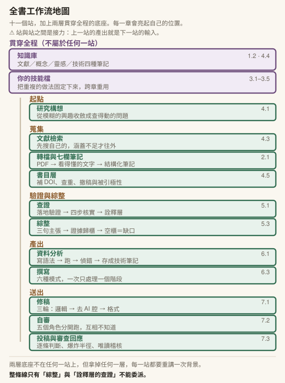

# 前言　為什麼教育研究者需要這本書

## 五件事，你大概都遇過

**第一件：文獻是個無底洞。**

你決定好題目，開始找文獻。第一天搜到四十篇，你很興奮。第三天你搜到一百二十篇，開始焦慮。第五天你發現有一整條你完全沒注意到的研究脈絡，而那條脈絡下面又有八十篇。你不知道什麼時候可以停，也不知道停下來的判準是什麼。最後停下來的理由通常不是「讀夠了」，是「沒時間了」。

**第二件：寫到一半失去方向。**

筆記做了三十份，每一份都很紮實。然後你打開空白文件，游標閃爍，腦中同時浮現十幾篇論文的發現，你卻寫不出第一句。你可能會怪自己讀得不夠，於是回頭再讀五篇。再讀五篇之後，情況一模一樣。

**第三件：引用焦慮。**

改到第七稿的時候，你已經記不清楚第三頁那筆引用是哪來的。是你精讀過的那篇？還是改稿過程中補進來、你以為讀過的那篇？你想回頭查，但要查的有六十幾筆，而截止日在後天。

**第四件：沒有人幫你審。**

你寫完了。在送出去之前，你希望有人幫你看一眼：邏輯通不通、有沒有明顯的漏洞、審查者會攻擊哪裡。但指導教授很忙，同儕也在趕自己的稿，而你已經看這份稿子看到眼睛麻掉，什麼問題都看不出來。

**第五件：格式地獄。**

投稿前一晚，你在改參考文獻的標點符號。期刊要求 APA 7，你的稿子混著 APA 6 和你研究所時養成的習慣。這件事跟你的研究品質毫無關係，但它會花掉你三個小時，而且你知道下一份稿子還要再來一次。

---

這五件事看起來是五個不同的問題，其實有同一個根源：

> **學術工作的流程太長、太碎、太孤獨。**

太長，所以你在第八步的時候已經忘記第二步做過什麼決定。太碎，所以每一段之間都有摩擦成本，而摩擦成本不會出現在任何一份研究計畫的時程表裡。太孤獨，所以沒有人在你需要的那個時刻幫你看一眼。

這本書處理的就是這三件事。

---

## 市面上有兩種書，它們解決的是別的問題

第一種是 prompt 範本書。「一百個學術寫作提示詞」「研究者必備 AI 指令大全」。這類書的問題不是內容錯，是它教的東西壽命很短。工具版本改一次，一半的範本就要重寫。更根本的問題是：範本教你怎麼問，不教你**什麼時候該問、問完之後怎麼判斷答案能不能用**。而後面那兩件事，才是決定你的論文會不會出事的地方。

第二種是宏觀論述書。談 AI 對教育的衝擊、對知識生產的影響、對學術評鑑制度的挑戰。這類書值得讀，而且很多寫得非常好。但你讀完之後，明天早上坐在電腦前面，還是不知道第一步該做什麼。

這本書在中間。它比範本書抽象一點（因為它教的是判斷，不是指令），比論述書具體很多（因為每一章都要你動手做一次）。

**我不會宣稱這是市面上唯一一本這樣的書。** 已經有面向學術工作者的 AI 應用專書，寫得很扎實，涵蓋的讀者從研究生到資深教授。這本書跟它們的差別在三個地方：

**對象更窄。** 這本書只寫給教育研究者。這代表所有的例子都在你的場域裡：文獻是教育研究的文獻，資料是教育研究的資料，倫理問題是你真的會遇到的那些（學生資料、課堂觀察、去識別化的難處）。窄有窄的代價，但窄也代表不用替你翻譯。

**工具更深。** 這本書從頭到尾只用一個工具，把它用透。市面上多數書的做法是廣度優先：這個工具做這個、那個工具做那個。廣度的問題是你學完之後有八個工具、八套介面、八個沒建立起來的習慣。這本書賭的是另一邊：一套完整的工作流，比八個零散的技巧有用。

**在地化。** 中文學術寫作有自己的 AI 腔問題，跟英文不重疊。台灣的研究倫理規範、期刊慣例、學位論文格式要求，也不是英文書會處理的東西。

---

## 這本書的立場：副駕駛不是駕駛

書名叫《把苦工交給副駕駛》。這個比喻要說清楚，因為它決定了整本書的每一個判斷。

副駕駛可以幫你查表、可以幫你唸檢查清單、可以在你分心的時候提醒儀表異常。但飛機出事的時候，接受調查的是機長。

這句話有一個常見的誤讀，就是把它理解成「不要太相信 AI」。那個結論太廉價了。任何人都做得到不信任，代價是這個副駕駛對你毫無用處。你把它當成打字機用，然後每一句都自己重寫一遍，那你不如不要用。

真正要做的事更難：知道它在哪些事上可靠、在哪些事上會出錯，以及它出錯的時候長什麼樣子。

這本書從第一章到最後一章都在回答這個問題。而它的答案可以收成一句話，你會在第七章看到完整的版本：

> **凡是需要你的學科判斷的，都不能委派；凡是機械的、形式的、重複的，都可以。**

而判斷一件事屬於哪一邊，有一個很實用的問法：**如果它做錯了，我看得出來嗎？**

看得出來的，交出去很安全，因為錯誤會浮出水面。看不出來的，不能交，因為錯誤會安靜地留在你的論文裡，直到有人發現。

還有一件事要先講明白。這本書不是在教你怎麼寫得更快。

省下時間本身沒有價值。如果你用這套工作流每週省下五小時，然後那五小時你拿去讓它幫你生成更多沒有經過你判斷的內容，那你只是把同樣的工作量換了一種形式，而且風險更高。

重點不是它幫你寫了多少字，是你省下的時間拿去想了什麼。

（這個說法的源頭不是我。它來自一位學術研究工具的開發者，我在這裡以自己的語言重述，出處見書末。我引用它是因為它精確地指出了一件容易被忽略的事：效率提升如果沒有改變你把腦力放在哪裡，它就沒有改變任何東西。）

還有一種讀者，這本書要另外講一句：**如果你手上有正在寫論文的學生**，書末〈帶學生的時候〉是為那個處境寫的。它給你五個十分鐘內看得出來的徵象，用來判斷一份稿子背後有沒有發生學習——而要診斷的是「有沒有經過判斷」，不是「有沒有用 AI」。那一頁不必等你讀完七章才看得懂。

---

## 這本書假設你

**會用電腦，但沒寫過程式。** 你會裝軟體、會管理資料夾、大概用過一兩個雲端服務。你不需要懂任何程式語言。書裡出現的少數程式碼都是可以直接複製使用的，而且每一段都會告訴你它在做什麼。

**有一個正在進行或即將進行的研究。** 這一條比較重要。這本書的每一章都要求你拿自己的東西來做：你的文獻、你的筆記、你的稿子、你的資料。沒有真實的材料，這些練習會變成走過場，而走過場的練習學不到判斷。

如果你手上暫時沒有研究，可以拿一份你讀過的論文、一段你以前寫的文字來替代。效果會打折，但流程走得起來。

還有一個前提要先說明：這本書綁定 Obsidian。

從第四章開始，書裡講的知識庫都是指 Obsidian 的 vault，操作也照它的方式寫。這不是因為它是唯一的選擇，也不是因為它最好，而是因為**工具中立的寫法會讓這本書變得沒辦法用**。如果我每次都寫「在你的筆記系統中建立一則筆記」，你會知道要做什麼，但不會知道怎麼做。

如果你已經在用別的筆記工具，書裡的原理全部適用（兩種記憶的分工、四種筆記的功能、雙向連結解決什麼問題），你需要自己翻譯操作細節。安裝與設定的步驟集中在[附錄 A](appendix/A-setup.md)，不在正文裡。

---

## 怎麼讀這本書

七章是一條工作流，不是七個主題。

它們有先後順序，而且後面的章會直接用前面章建好的東西。第四章的文獻流程建立在第三章建的技能上；第五章的查證與綜整處理的是第四章蒐集回來的東西；第六章的分析與撰寫要用第五章歸好的證據；第七章的修稿與誠信框架收攏前六章的每一個〈責任落點〉。

跳著讀當然可以，但如果你跳過第四章直接讀第五章，你會在第一頁就遇到沒聽過的名詞。

**每章的〔課堂〕框是給教師的。**

這本書同時是一門課的教材。標著〔課堂〕的方框裡是授課節奏、時間配比、學生常卡的地方。如果你是自學讀者，這些框可以直接略過，不影響閱讀。如果你打算拿這本書去開課，那些框就是你的教案。

另外兩種方框都是給所有讀者的：〔補充〕是可以略過的延伸，〔動手一下〕是三到五分鐘的小練習，散在正文裡。

**〔動手一下〕請真的動手。**

這是全書唯一一個我會拜託你的地方。這些小練習之所以散在正文中而不是集中在章末，是因為如果你讀完八千字才動到第一次手，前面那八千字你只是看過，不是學會。

**介面步驟全部在[附錄 A](appendix/A-setup.md)。**

正文裡幾乎不寫「點左上角那個按鈕」這種東西。理由在下一段。

---

**全書工作流地圖。** 十一個站，加上兩層貫穿全程的底座。你不必現在讀懂它。這張圖會在每一章的章末再出現一次，亮起那一章教的位置，淡掉的是你在別章會站上去的地方。七章讀完，整張圖就會全部亮起來。

兩層底座（知識庫、你自己的技能檔）不在任何一站上。 **技能檔**是這本書會反覆講的東西，現在只要知道它是一個純文字檔，裡面寫著你希望某一類任務每次都照著做的那幾件事。[第 3 章](chapters/03-skills.md)整章在教它。但拿掉任何一層，下面每一站都要重講一次背景。那正是多數人覺得「用 AI 很累」的原因。

## 兩種讀法，以及卡住的時候

這兩節抽成獨立一頁：**[怎麼用這本書](docs/HOW_TO_USE.md)**。

⚠️ 它不是客套話——書裡三十六段可以直接複製的東西，
**長得像範本、其實是完整解答**。讀法錯了，整本書的效果會少一大半。

## 一個誠實的但書

這本書裡關於介面的每一句話都會過期。

按鈕會換位置、功能會改名字、方案會調整、模型會換代。你手上這本書如果三年後還在書架上，那時候翻開來看操作步驟，大概有一半對不上。

我沒有辦法解決這件事。任何一本寫具體工具的書都有同樣的命運。

我能做的是把兩種東西分開：**什麼是原理，什麼是版本細節。**

原理不會過期。生成式 AI 為什麼會產生幻覺、為什麼流暢不等於正確、為什麼上下文有限制、為什麼引用必須人工核實、為什麼統計模型的選擇不能委派。這些是關於這類工具本質的事，換一個牌子、換一個世代，它們依然成立。

版本細節會過期，而它們被我盡量集中在[附錄 A](appendix/A-setup.md)，因為那樣改版最容易。

所以讀這本書的時候，如果你發現某個操作步驟跟你螢幕上看到的不一樣，先不要卡住。回頭找那一節在講什麼原理，然後在新的介面上找到對應的位置。那個尋找的過程本身，就是這本書最想教會你的能力。

工具換了，你重新學一次操作，一個下午。原理沒學會，換多少工具都一樣。

---

## 從一位碩士生開始

第一章的開頭有一個故事。一位碩士生把文獻回顧交出去，指導教授回信說：你引的那兩篇，我找不到。

他沒有作弊，沒有讓 AI 代寫，他自己讀了文獻、自己下判斷、自己組織段落。他做錯的只有一件很小的事，小到幾乎每個人都會犯。

這本書的七章，每一章都能在某個環節攔下他那個錯誤。你會在最後一章看到完整的對照。

現在翻到第一章。

---
